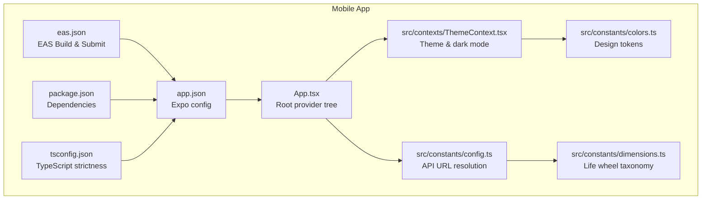
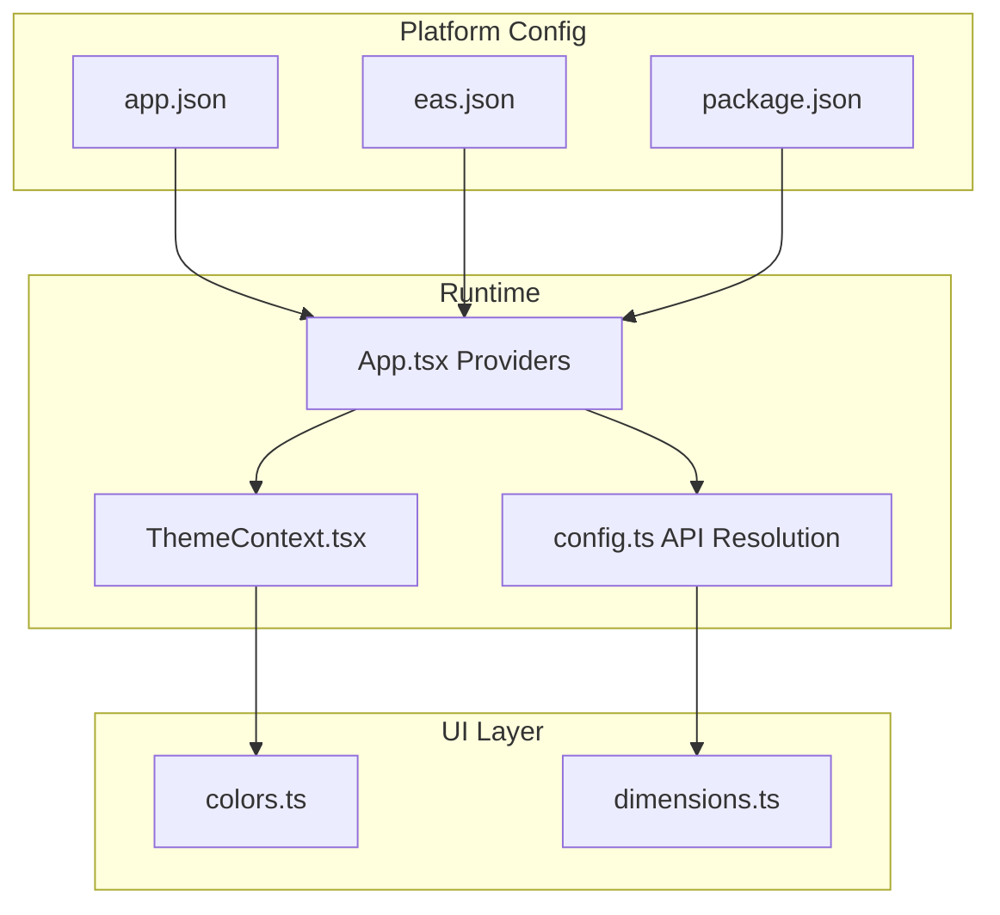
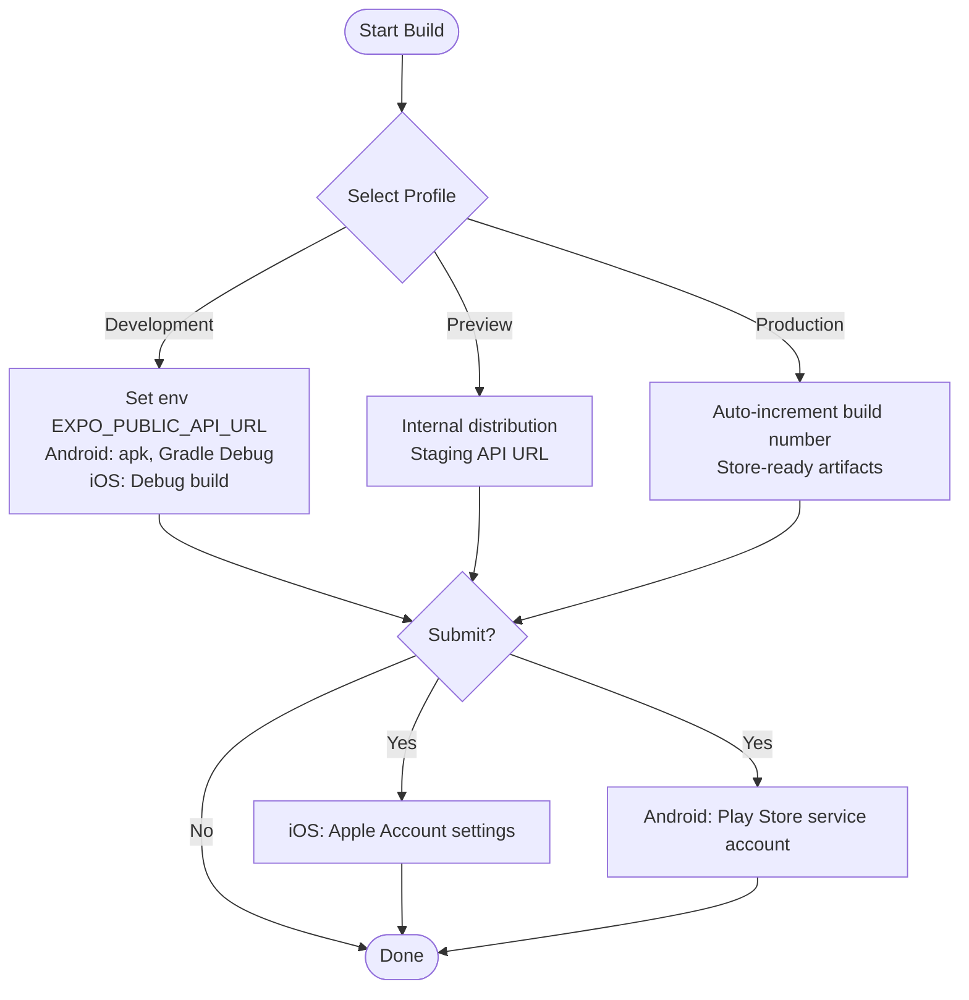
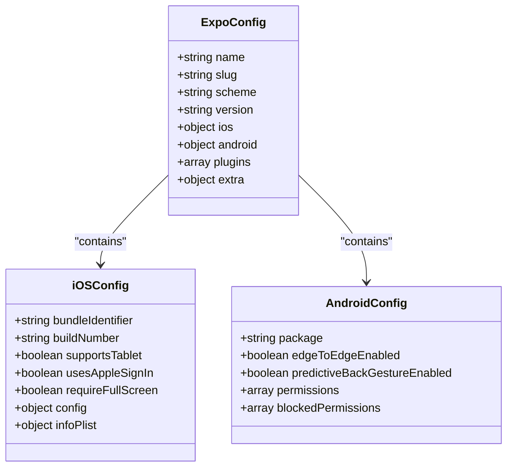
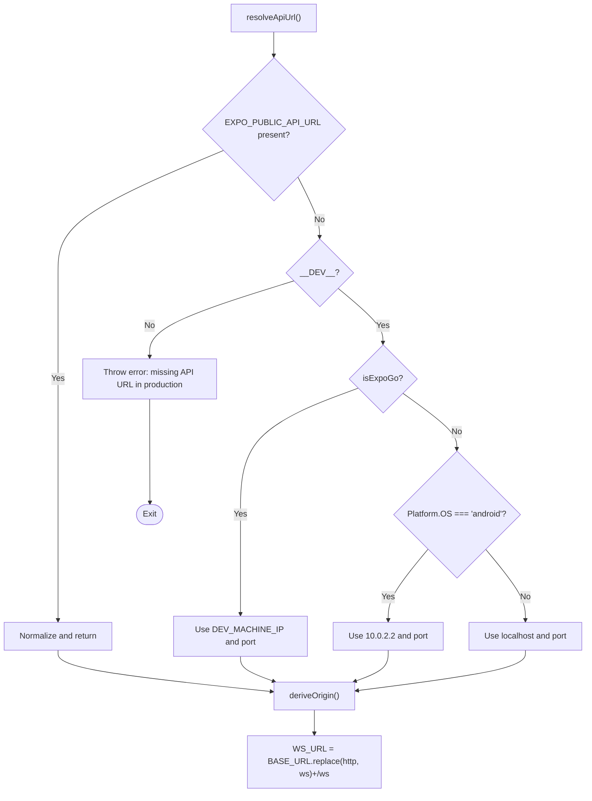
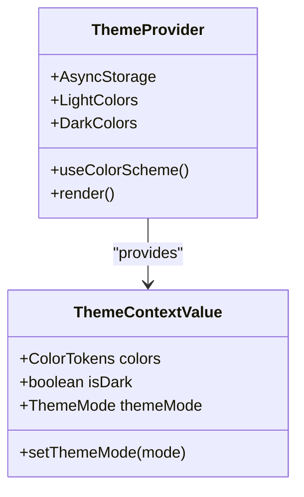
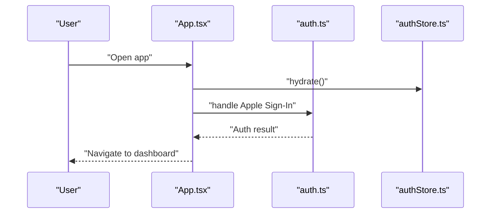
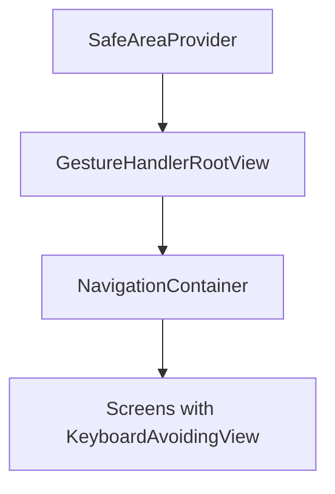
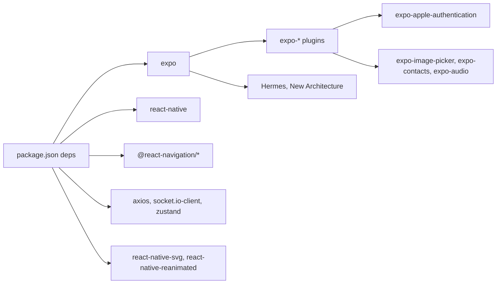

# Platform Optimizations

<cite>
**Referenced Files in This Document**
- [eas.json](file://mobile/eas.json)
- [app.json](file://mobile/app.json)
- [package.json](file://mobile/package.json)
- [tsconfig.json](file://mobile/tsconfig.json)
- [App.tsx](file://mobile/App.tsx)
- [config.ts](file://mobile/src/constants/config.ts)
- [colors.ts](file://mobile/src/constants/colors.ts)
- [dimensions.ts](file://mobile/src/constants/dimensions.ts)
- [ThemeContext.tsx](file://mobile/src/contexts/ThemeContext.tsx)
- [auth.ts](file://mobile/src/api/auth.ts)
- [authStore.ts](file://mobile/src/store/authStore.ts)
- [voiceStore.ts](file://mobile/src/store/voiceStore.ts)
- [LAUNCH_PLAYBOOK.md](file://docs/LAUNCH_PLAYBOOK.md)
- [STORE_LISTINGS.md](file://docs/STORE_LISTINGS.md)
</cite>

## Table of Contents
1. [Introduction](#introduction)
2. [Project Structure](#project-structure)
3. [Core Components](#core-components)
4. [Architecture Overview](#architecture-overview)
5. [Detailed Component Analysis](#detailed-component-analysis)
6. [Dependency Analysis](#dependency-analysis)
7. [Performance Considerations](#performance-considerations)
8. [Troubleshooting Guide](#troubleshooting-guide)
9. [Conclusion](#conclusion)
10. [Appendices](#appendices)

## Introduction
This document provides comprehensive guidance for mobile platform-specific optimizations and configurations for the 4Ever application. It covers EAS Build configuration, app submission settings, continuous deployment workflows, platform-specific adaptations for iOS and Android (including permissions, native modules, and platform APIs), performance optimizations (image loading, memory management, battery usage), push notifications and deep linking setup, universal links configuration, platform-specific UI guidelines, keyboard handling, and device-specific features. It also addresses app store submission requirements, testing strategies, and release management processes.

## Project Structure
The mobile application is built with Expo and React Native. Key configuration files define platform capabilities, permissions, native module plugins, and build/release workflows. The project uses EAS Build for continuous deployment and EAS Submit for automated app store submissions.

**Diagram sources**
- [app.json:1-96](file://mobile/app.json#L1-L96)
- [eas.json:1-73](file://mobile/eas.json#L1-L73)
- [package.json:1-52](file://mobile/package.json#L1-L52)
- [tsconfig.json:1-7](file://mobile/tsconfig.json#L1-L7)
- [App.tsx:1-38](file://mobile/App.tsx#L1-L38)
- [config.ts:1-85](file://mobile/src/constants/config.ts#L1-L85)
- [ThemeContext.tsx:1-61](file://mobile/src/contexts/ThemeContext.tsx#L1-L61)
- [colors.ts:1-142](file://mobile/src/constants/colors.ts#L1-L142)
- [dimensions.ts:1-51](file://mobile/src/constants/dimensions.ts#L1-L51)

**Section sources**
- [app.json:1-96](file://mobile/app.json#L1-L96)
- [eas.json:1-73](file://mobile/eas.json#L1-L73)
- [package.json:1-52](file://mobile/package.json#L1-L52)
- [tsconfig.json:1-7](file://mobile/tsconfig.json#L1-L7)
- [App.tsx:1-38](file://mobile/App.tsx#L1-L38)

## Core Components
- EAS Build configuration defines three build profiles: development (on-device debug), preview (staging/QA), and production (store-ready). It sets environment variables, build types, distribution channels, and resource classes.
- EAS Submit configuration automates app store submissions for iOS (Apple Account settings) and Android (Google Play service account).
- Expo app.json centralizes platform capabilities, permissions, plugins, icons, splash screen, runtime version policy, and platform-specific infoPlist entries.
- TypeScript strict mode improves reliability and maintainability.
- Root providers configure gesture handling, safe areas, theme management, and toast notifications.

**Section sources**
- [eas.json:1-73](file://mobile/eas.json#L1-L73)
- [app.json:1-96](file://mobile/app.json#L1-L96)
- [package.json:1-52](file://mobile/package.json#L1-L52)
- [tsconfig.json:1-7](file://mobile/tsconfig.json#L1-L7)
- [App.tsx:1-38](file://mobile/App.tsx#L1-L38)

## Architecture Overview
The mobile app integrates platform-specific configurations with runtime behavior. API endpoints are resolved dynamically based on environment variables and platform specifics. Theme and color systems adapt to system preferences while persisting user choices. Navigation and UI components leverage platform-safe areas and gestures.

**Diagram sources**
- [App.tsx:1-38](file://mobile/App.tsx#L1-L38)
- [ThemeContext.tsx:1-61](file://mobile/src/contexts/ThemeContext.tsx#L1-L61)
- [config.ts:1-85](file://mobile/src/constants/config.ts#L1-L85)
- [app.json:1-96](file://mobile/app.json#L1-L96)
- [eas.json:1-73](file://mobile/eas.json#L1-L73)
- [package.json:1-52](file://mobile/package.json#L1-L52)
- [colors.ts:1-142](file://mobile/src/constants/colors.ts#L1-L142)
- [dimensions.ts:1-51](file://mobile/src/constants/dimensions.ts#L1-L51)

## Detailed Component Analysis

### EAS Build and Submit Configuration
- Build profiles:
  - Development: debug client, internal distribution, channel "development", platform-specific Gradle command for Android and Debug build configuration for iOS.
  - Preview: internal distribution, channel "preview", staging API URL, platform-specific build types.
  - Production: auto-incremented build numbers, channel "production", store-ready artifacts (Android app-bundle, iOS IPA), remote versioning.
- Submit configuration:
  - iOS: Apple ID, ASC App ID, Apple Team ID for automated submission.
  - Android: Google Play service account key path, track selection, release status.

**Diagram sources**
- [eas.json:1-73](file://mobile/eas.json#L1-L73)

**Section sources**
- [eas.json:1-73](file://mobile/eas.json#L1-L73)

### Expo Application Configuration (app.json)
- Platform capabilities:
  - iOS: bundle identifier, build number, Apple Sign-In enabled, full-screen requirement disabled, encryption flag set to false, permission descriptions, tablet support.
  - Android: package name, adaptive icon, edge-to-edge enabled, predictive back gesture disabled, declared permissions, blocked background location permissions.
- Plugins and permissions:
  - Plugins include font loader, secure storage, Apple authentication, image picker (with custom permission text), contacts, and audio (with microphone permission).
- Runtime and engine:
  - New architecture enabled, Hermes engine, runtime version policy aligned with app version.

**Diagram sources**
- [app.json:1-96](file://mobile/app.json#L1-L96)

**Section sources**
- [app.json:1-96](file://mobile/app.json#L1-L96)

### API URL Resolution and WebSocket Origin
- Priority-driven resolution:
  - Environment variable EXPO_PUBLIC_API_URL (embedded at build time).
  - Dev auto-detection for Expo Go, Android emulator, and iOS simulator.
  - Failure in production builds without environment variable to prevent misconfiguration.
- Derived WebSocket URL uses the same origin with protocol switched to ws/wss.

**Diagram sources**
- [config.ts:1-85](file://mobile/src/constants/config.ts#L1-L85)

**Section sources**
- [config.ts:1-85](file://mobile/src/constants/config.ts#L1-L85)

### Theme Management and Dark Mode
- ThemeContext manages theme mode persistence, system preference detection, and color token selection.
- Colors are exported as light/dark palettes with semantic tokens for backgrounds, cards, borders, and text.
- Dimensions define life wheel taxonomy and associated metadata.

**Diagram sources**
- [ThemeContext.tsx:1-61](file://mobile/src/contexts/ThemeContext.tsx#L1-L61)
- [colors.ts:1-142](file://mobile/src/constants/colors.ts#L1-L142)

**Section sources**
- [ThemeContext.tsx:1-61](file://mobile/src/contexts/ThemeContext.tsx#L1-L61)
- [colors.ts:1-142](file://mobile/src/constants/colors.ts#L1-L142)
- [dimensions.ts:1-51](file://mobile/src/constants/dimensions.ts#L1-L51)

### Authentication and Platform-Specific Features
- Apple Sign-In integration is enabled in app.json and used in authentication flows.
- Voice-related permissions and audio plugin are configured for microphone access.
- Contacts and image picker permissions are declared for avatar and profile management.

**Diagram sources**
- [App.tsx:1-38](file://mobile/App.tsx#L1-L38)
- [auth.ts:1-200](file://mobile/src/api/auth.ts#L1-L200)
- [authStore.ts:1-120](file://mobile/src/store/authStore.ts#L1-L120)

**Section sources**
- [app.json:65-88](file://mobile/app.json#L65-L88)
- [auth.ts:1-200](file://mobile/src/api/auth.ts#L1-L200)
- [authStore.ts:1-120](file://mobile/src/store/authStore.ts#L1-L120)

### Push Notifications, Deep Linking, and Universal Links
- Deep linking scheme is defined in app.json and used across navigation.
- Universal links and push notifications are not explicitly configured in the provided files. To implement:
  - Configure associated domains and entitlements for iOS.
  - Add Firebase Cloud Messaging or platform-specific push SDKs.
  - Define linking prefixes and handle incoming deep links in navigation.

[No sources needed since this section provides general guidance]

### Platform-Specific UI Guidelines and Keyboard Handling
- Edge-to-edge rendering and safe area providers ensure proper layout on modern devices.
- Gesture handler root view enables smooth interactions.
- Keyboard handling is integrated in screens using platform-aware views and avoiding content overlap.

**Diagram sources**
- [App.tsx:1-38](file://mobile/App.tsx#L1-L38)

**Section sources**
- [App.tsx:1-38](file://mobile/App.tsx#L1-L38)
- [app.json:46-47](file://mobile/app.json#L46-L47)

### Permissions and Native Modules
- iOS permission descriptions are defined in infoPlist.
- Android declares required permissions and blocks background location.
- Plugins enable secure storage, Apple authentication, image picking, contacts, and audio.

**Section sources**
- [app.json:29-59](file://mobile/app.json#L29-L59)
- [app.json:65-88](file://mobile/app.json#L65-L88)

## Dependency Analysis
The mobile app relies on Expo-managed dependencies and platform plugins. TypeScript strict mode enforces type safety. Theme and color systems decouple UI presentation from business logic.

**Diagram sources**
- [package.json:1-52](file://mobile/package.json#L1-L52)
- [app.json:65-88](file://mobile/app.json#L65-L88)

**Section sources**
- [package.json:1-52](file://mobile/package.json#L1-L52)
- [app.json:65-88](file://mobile/app.json#L65-L88)

## Performance Considerations
- Image loading:
  - Use expo-image-manipulator for resizing and caching to reduce memory footprint.
  - Prefer vector graphics (SVG) for scalable UI elements.
- Memory management:
  - Persist theme mode and auth state using expo-secure-store and async-storage to avoid redundant loads.
  - Use lightweight stores (Zustand) and avoid heavy computations on the UI thread.
- Battery usage:
  - Limit background network requests; batch WebSocket updates.
  - Disable unnecessary sensors and location permissions per blockedPermissions.
- Network:
  - Centralize API URL resolution to avoid runtime fetches; rely on environment variables injected at build time.

**Section sources**
- [config.ts:1-85](file://mobile/src/constants/config.ts#L1-L85)
- [ThemeContext.tsx:1-61](file://mobile/src/contexts/ThemeContext.tsx#L1-L61)
- [authStore.ts:1-120](file://mobile/src/store/authStore.ts#L1-L120)
- [voiceStore.ts:1-120](file://mobile/src/store/voiceStore.ts#L1-L120)

## Troubleshooting Guide
- Production build fails to start:
  - Ensure EXPO_PUBLIC_API_URL is set during EAS build; otherwise, the app throws an error to prevent misconfiguration.
- iOS simulator vs Android emulator connectivity:
  - Verify dev machine IP and port; confirm LAN access and firewall settings.
- Theme not persisting:
  - Check AsyncStorage availability and key correctness; confirm ThemeProvider wraps the app root.
- Apple Sign-In issues:
  - Confirm bundle identifier matches Apple configuration and client ID alignment.

**Section sources**
- [config.ts:43-52](file://mobile/src/constants/config.ts#L43-L52)
- [ThemeContext.tsx:22-41](file://mobile/src/contexts/ThemeContext.tsx#L22-L41)
- [app.json:22-24](file://mobile/app.json#L22-L24)

## Conclusion
The 4Ever mobile application leverages Expo and EAS for robust, platform-specific optimizations. Configuration files define permissions, plugins, runtime behavior, and CI/CD workflows. By adhering to the outlined practices—environment-driven API resolution, persistent theme management, cautious permission usage, and performance-conscious image/network strategies—the app achieves reliable cross-platform behavior and streamlined release processes.

## Appendices
- App store submission requirements:
  - iOS: Complete Apple Developer account setup, provisioning profiles, and app icons.
  - Android: Create Google Play Console account, upload signing keys, and configure store listings.
- Testing strategies:
  - Use EAS Build internal distributions for QA, simulate real-world networks, and test theme switching across devices.
- Release management:
  - Automate submissions via EAS Submit; maintain distinct channels for development, preview, and production.

**Section sources**
- [eas.json:58-71](file://mobile/eas.json#L58-L71)
- [LAUNCH_PLAYBOOK.md:1-200](file://docs/LAUNCH_PLAYBOOK.md#L1-L200)
- [STORE_LISTINGS.md:1-200](file://docs/STORE_LISTINGS.md#L1-L200)