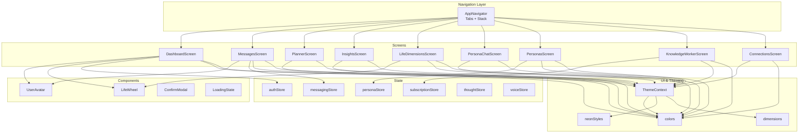
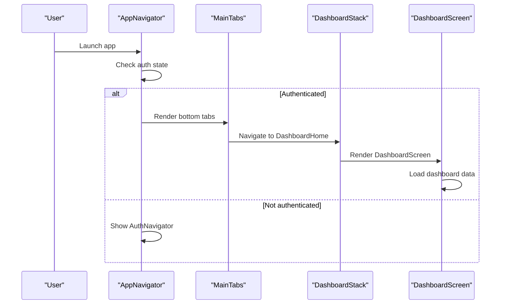
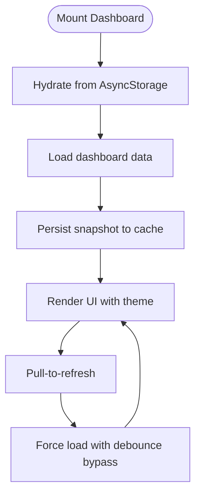
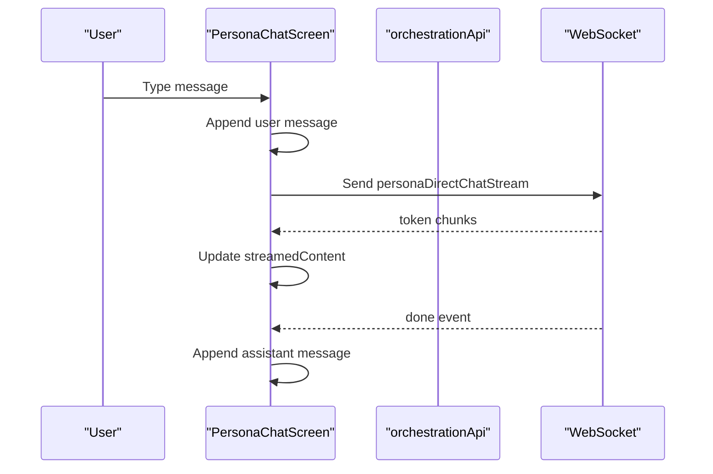
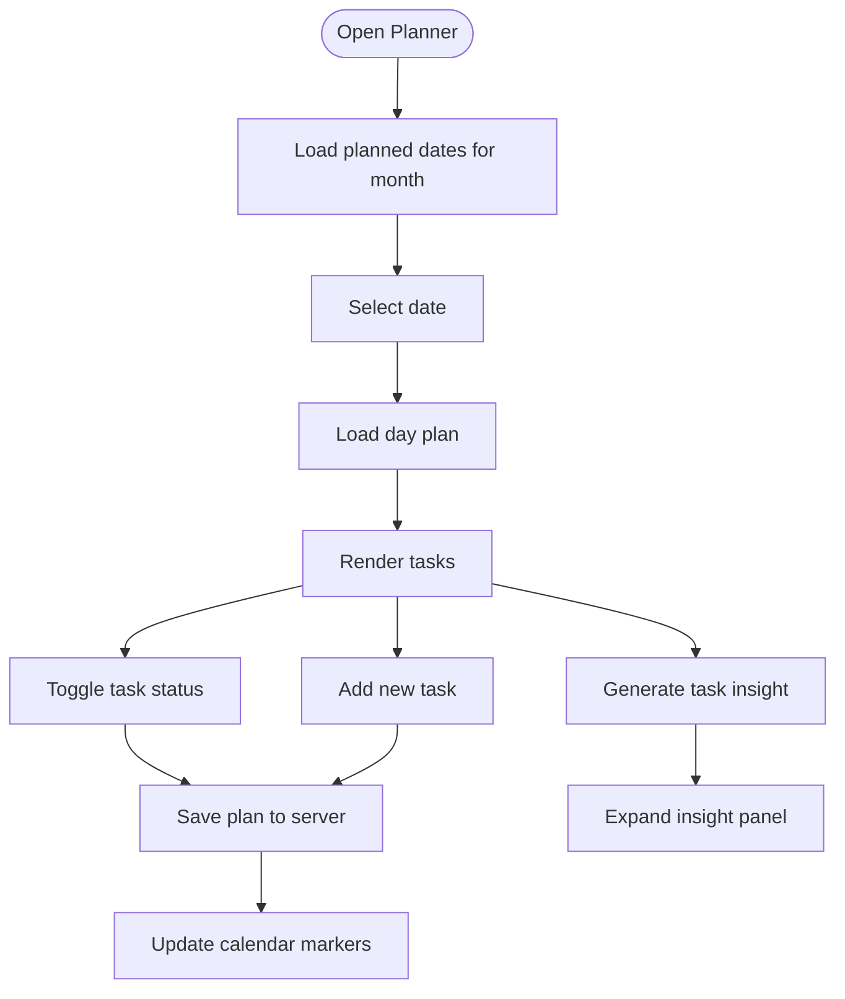
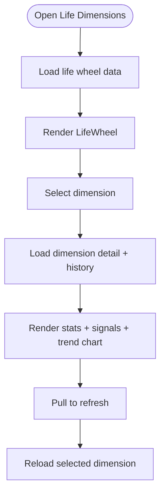
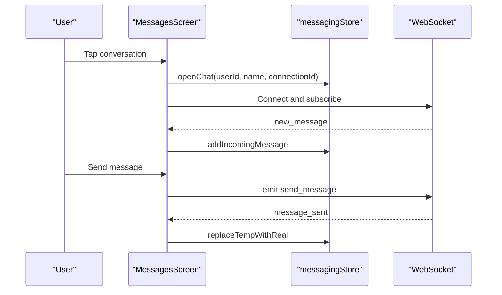
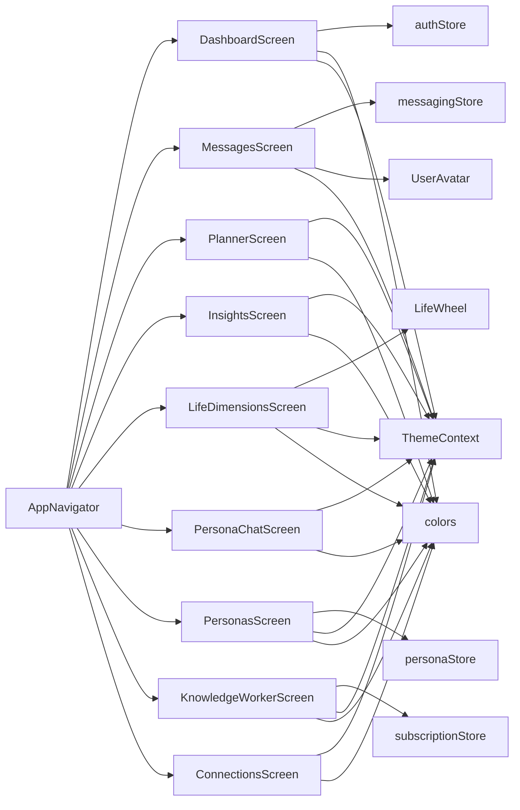

# Screen Components

<cite>
**Referenced Files in This Document**
- [AppNavigator.tsx](file://mobile/src/navigation/AppNavigator.tsx)
- [DashboardScreen.tsx](file://mobile/src/screens/DashboardScreen.tsx)
- [PersonaChatScreen.tsx](file://mobile/src/screens/PersonaChatScreen.tsx)
- [PlannerScreen.tsx](file://mobile/src/screens/PlannerScreen.tsx)
- [InsightsScreen.tsx](file://mobile/src/screens/InsightsScreen.tsx)
- [LifeDimensionsScreen.tsx](file://mobile/src/screens/LifeDimensionsScreen.tsx)
- [MessagesScreen.tsx](file://mobile/src/screens/MessagesScreen.tsx)
- [ConnectionsScreen.tsx](file://mobile/src/screens/ConnectionsScreen.tsx)
- [PersonasScreen.tsx](file://mobile/src/screens/PersonasScreen.tsx)
- [KnowledgeWorkerScreen.tsx](file://mobile/src/screens/KnowledgeWorkerScreen.tsx)
- [UserAvatar.tsx](file://mobile/src/components/UserAvatar.tsx)
- [LifeWheel.tsx](file://mobile/src/components/LifeWheel.tsx)
- [ConfirmModal.tsx](file://mobile/src/components/ConfirmModal.tsx)
- [LoadingState.tsx](file://mobile/src/components/LoadingState.tsx)
- [ThemeContext.tsx](file://mobile/src/contexts/ThemeContext.tsx)
- [colors.ts](file://mobile/src/constants/colors.ts)
- [dimensions.ts](file://mobile/src/constants/dimensions.ts)
- [neonStyles.ts](file://mobile/src/constants/neonStyles.ts)
- [authStore.ts](file://mobile/src/store/authStore.ts)
- [messagingStore.ts](file://mobile/src/store/messagingStore.ts)
- [personaStore.ts](file://mobile/src/store/personaStore.ts)
- [subscriptionStore.ts](file://mobile/src/store/subscriptionStore.ts)
- [thoughtStore.ts](file://mobile/src/store/thoughtStore.ts)
- [voiceStore.ts](file://mobile/src/store/voiceStore.ts)
</cite>

## Table of Contents
1. [Introduction](#introduction)
2. [Project Structure](#project-structure)
3. [Core Components](#core-components)
4. [Architecture Overview](#architecture-overview)
5. [Detailed Component Analysis](#detailed-component-analysis)
6. [Dependency Analysis](#dependency-analysis)
7. [Performance Considerations](#performance-considerations)
8. [Accessibility and Platform Support](#accessibility-and-platform-support)
9. [Troubleshooting Guide](#troubleshooting-guide)
10. [Conclusion](#conclusion)

## Introduction
This document provides comprehensive documentation for the mobile screen components and UI elements powering the application. It covers the 20+ screen implementations including the dashboard, messaging interface, persona chat, planner, insights display, and life dimensions tracking. It also details the component architecture, prop interfaces, state management patterns, mobile-specific UI patterns, reusable components, accessibility features, dark mode support, and platform-specific adaptations for iOS and Android.

## Project Structure
The mobile application follows a modular structure with clear separation of concerns:
- Navigation: Centralized routing via a native stack navigator with bottom tabs for main areas
- Screens: Feature-focused screens organized by domain (Dashboard, Messaging, Planner, Insights, etc.)
- Components: Reusable UI primitives (modals, avatars, charts)
- Stores: Zustand-based global state management for auth, messaging, personas, subscriptions, thoughts, and voice
- Constants: Theming, dimensions, and styles
- Contexts: Theme provider for dark/light mode support

**Diagram sources**
- [AppNavigator.tsx:1-282](file://mobile/src/navigation/AppNavigator.tsx#L1-282)
- [DashboardScreen.tsx:1-763](file://mobile/src/screens/DashboardScreen.tsx#L1-763)
- [MessagesScreen.tsx:1-1017](file://mobile/src/screens/MessagesScreen.tsx#L1-1017)
- [PlannerScreen.tsx:1-428](file://mobile/src/screens/PlannerScreen.tsx#L1-428)
- [InsightsScreen.tsx:1-186](file://mobile/src/screens/InsightsScreen.tsx#L1-186)
- [LifeDimensionsScreen.tsx:1-298](file://mobile/src/screens/LifeDimensionsScreen.tsx#L1-298)
- [PersonaChatScreen.tsx:1-112](file://mobile/src/screens/PersonaChatScreen.tsx#L1-112)
- [PersonasScreen.tsx:1-375](file://mobile/src/screens/PersonasScreen.tsx#L1-375)
- [KnowledgeWorkerScreen.tsx:1-1058](file://mobile/src/screens/KnowledgeWorkerScreen.tsx#L1-1058)
- [UserAvatar.tsx:1-82](file://mobile/src/components/UserAvatar.tsx#L1-82)
- [LifeWheel.tsx:1-159](file://mobile/src/components/LifeWheel.tsx#L1-159)
- [ConfirmModal.tsx:1-61](file://mobile/src/components/ConfirmModal.tsx#L1-61)
- [LoadingState.tsx:1-37](file://mobile/src/components/LoadingState.tsx#L1-37)
- [ThemeContext.tsx](file://mobile/src/contexts/ThemeContext.tsx)
- [colors.ts](file://mobile/src/constants/colors.ts)
- [dimensions.ts](file://mobile/src/constants/dimensions.ts)
- [neonStyles.ts](file://mobile/src/constants/neonStyles.ts)
- [authStore.ts](file://mobile/src/store/authStore.ts)
- [messagingStore.ts](file://mobile/src/store/messagingStore.ts)
- [personaStore.ts](file://mobile/src/store/personaStore.ts)
- [subscriptionStore.ts](file://mobile/src/store/subscriptionStore.ts)
- [thoughtStore.ts](file://mobile/src/store/thoughtStore.ts)
- [voiceStore.ts](file://mobile/src/store/voiceStore.ts)

**Section sources**
- [AppNavigator.tsx:1-282](file://mobile/src/navigation/AppNavigator.tsx#L1-282)

## Core Components
This section documents the reusable UI components that power the screens.

- UserAvatar
  - Purpose: Unified avatar rendering with fallback initials and color hashing
  - Props: name, phoneNumber, avatarUrl, size, style, textStyle, fontSize
  - Behavior: Attempts to load avatarUrl; on failure, renders colored circle with initials
  - Accessibility: Uses hashed colors for uniqueness; supports dynamic sizing
  - Path: [UserAvatar.tsx:1-82](file://mobile/src/components/UserAvatar.tsx#L1-82)

- LifeWheel
  - Purpose: SVG-based radar chart for six life dimensions
  - Props: scores (partial record of dimension -> score), secondaryScores, size, showDots
  - Behavior: Draws concentric rings, radial spokes, polygons, and labeled vertices
  - Styling: Responsive sizing with margins; theme-aware colors
  - Path: [LifeWheel.tsx:1-159](file://mobile/src/components/LifeWheel.tsx#L1-159)

- ConfirmModal
  - Purpose: Modal dialog for confirm/cancel actions with optional destructive styling
  - Props: visible, title, message, confirmText, cancelText, onConfirm, onCancel, destructive
  - Behavior: Renders overlay with centered modal; applies theme-based styles
  - Path: [ConfirmModal.tsx:1-61](file://mobile/src/components/ConfirmModal.tsx#L1-61)

- LoadingState
  - Purpose: Standardized loading and empty states
  - Functions: LoadingScreen (with optional message), EmptyState (with icon/title/subtitle)
  - Behavior: Centered layout with theme-aware colors and spacing
  - Path: [LoadingState.tsx:1-37](file://mobile/src/components/LoadingState.tsx#L1-37)

**Section sources**
- [UserAvatar.tsx:1-82](file://mobile/src/components/UserAvatar.tsx#L1-82)
- [LifeWheel.tsx:1-159](file://mobile/src/components/LifeWheel.tsx#L1-159)
- [ConfirmModal.tsx:1-61](file://mobile/src/components/ConfirmModal.tsx#L1-61)
- [LoadingState.tsx:1-37](file://mobile/src/components/LoadingState.tsx#L1-37)

## Architecture Overview
The application uses a centralized navigation architecture with:
- Bottom tabs for primary navigation (Dashboard, Core Chat, Thought, Circle, More)
- Native stack navigators for screen stacks within each tab
- Theme-aware navigation containers supporting light/dark modes
- Global stores for authentication, messaging, personas, subscriptions, thoughts, and voice

**Diagram sources**
- [AppNavigator.tsx:255-282](file://mobile/src/navigation/AppNavigator.tsx#L255-282)
- [DashboardScreen.tsx:67-168](file://mobile/src/screens/DashboardScreen.tsx#L67-168)

**Section sources**
- [AppNavigator.tsx:1-282](file://mobile/src/navigation/AppNavigator.tsx#L1-282)

## Detailed Component Analysis

### DashboardScreen
- Purpose: Aggregates user insights, plans, actions, relationships, and life dimensions into a personalized home feed
- Key features:
  - Stale-while-revalidate caching with AsyncStorage for instant hydration and background refresh
  - Pull-to-refresh with forced reload bypass
  - Dynamic theming with gradients and neon effects
  - Touch-friendly stats cards, progress bars, and actionable CTAs
- State management:
  - Uses auth store for user context
  - Loads data from multiple APIs concurrently
  - Manages local cache keys and timestamps
- Mobile UI patterns:
  - Safe area insets, scroll with refresh control
  - Gradient overlays, floating stats, and card-based layout
  - Responsive typography and spacing

**Diagram sources**
- [DashboardScreen.tsx:87-168](file://mobile/src/screens/DashboardScreen.tsx#L87-168)

**Section sources**
- [DashboardScreen.tsx:1-763](file://mobile/src/screens/DashboardScreen.tsx#L1-763)

### PersonaChatScreen
- Purpose: Real-time persona chat with streaming responses and Markdown rendering
- Key features:
  - WebSocket-based streaming via orchestration API
  - Markdown display with theme-aware styles
  - Auto-scroll to bottom, typing indicators, and status ticks
  - KeyboardAvoidingView for iOS/Android input handling
- State management:
  - Local message state with user/assistant roles
  - Streaming state with incremental content updates
- Mobile UI patterns:
  - Bubble chat layout with distinct user/assistant styles
  - Send button disabled when streaming; input multiline support

**Diagram sources**
- [PersonaChatScreen.tsx:51-68](file://mobile/src/screens/PersonaChatScreen.tsx#L51-68)

**Section sources**
- [PersonaChatScreen.tsx:1-112](file://mobile/src/screens/PersonaChatScreen.tsx#L1-112)

### PlannerScreen
- Purpose: Daily planner with calendar view, task management, and AI-powered insights
- Key features:
  - Calendar grid with planned date markers
  - Task CRUD with status toggles and skip actions
  - Insight generation per task with expandable details
  - Progress tracking and empty states
- State management:
  - Calendar year/month state with memoized calendar days
  - Planned dates lookup map for quick UI updates
  - Insight loading and expansion state per task
- Mobile UI patterns:
  - Touch-friendly calendar grid with selection feedback
  - Swipe gestures not implemented; uses tap selection
  - Responsive task cards with status badges

**Diagram sources**
- [PlannerScreen.tsx:89-105](file://mobile/src/screens/PlannerScreen.tsx#L89-105)
- [PlannerScreen.tsx:126-185](file://mobile/src/screens/PlannerScreen.tsx#L126-185)

**Section sources**
- [PlannerScreen.tsx:1-428](file://mobile/src/screens/PlannerScreen.tsx#L1-428)

### InsightsScreen
- Purpose: Displays relationship health, thought distribution, resolution rates, and persona effectiveness
- Key features:
  - Relationship health with opt-in toggle and trend calculations
  - Interactive charts and progress bars
  - Dynamic metric rendering with trend indicators
- State management:
  - Stats and health data loaded on mount
  - Opt-in state persisted via user context API
- Mobile UI patterns:
  - Card-based layout with subtle borders and neon accents
  - Compact metric rows with percentage displays

**Section sources**
- [InsightsScreen.tsx:1-186](file://mobile/src/screens/InsightsScreen.tsx#L1-186)

### LifeDimensionsScreen
- Purpose: Comprehensive life dimensions tracking with historical trends and self-ratings
- Key features:
  - Life wheel visualization with observed vs self ratings
  - Dimension detail panels with recent signals and trend charts
  - Weekly check-in reminder and CTA
- State management:
  - Wheel data, selected dimension, detail/history, and refresh controls
  - Focus effect on selected dimension with lazy loading
- Mobile UI patterns:
  - Scroll with refresh control
  - Expandable dimension cards with SVG trend charts

**Diagram sources**
- [LifeDimensionsScreen.tsx:39-73](file://mobile/src/screens/LifeDimensionsScreen.tsx#L39-73)

**Section sources**
- [LifeDimensionsScreen.tsx:1-298](file://mobile/src/screens/LifeDimensionsScreen.tsx#L1-298)

### MessagesScreen
- Purpose: Real-time messaging with multi-user support, reactions, replies, and tri-chat mediator
- Key features:
  - Socket-based real-time updates for messages, typing, reactions, and online status
  - Reply/edit/delete workflows with context menus
  - Tri-chat mediator with summoning, streaming, and action cards
  - Online presence indicators and last seen timestamps
- State management:
  - Conversations, active chat, message lists, and mediator state managed in messaging store
  - Optimistic UI updates with server echoes
- Mobile UI patterns:
  - Long press context menu for actions
  - KeyboardAvoidingView for input field visibility
  - Overflow menu for mediator controls

**Diagram sources**
- [MessagesScreen.tsx:57-203](file://mobile/src/screens/MessagesScreen.tsx#L57-203)

**Section sources**
- [MessagesScreen.tsx:1-1017](file://mobile/src/screens/MessagesScreen.tsx#L1-1017)

### ConnectionsScreen
- Purpose: Manage connections, pending requests, and user search with invite flows
- Key features:
  - Tabbed interface for connections, pending, and search
  - Debounced search with invite prompts for non-users
  - Request lifecycle: send, accept, decline, remove
- State management:
  - Tab state, loading flags, and search debouncing
  - Phone number detection for invite flows
- Mobile UI patterns:
  - Horizontal scrolling category chips
  - Action buttons inline with user rows
  - Invite cards with WhatsApp/SMS options

**Section sources**
- [ConnectionsScreen.tsx:1-371](file://mobile/src/screens/ConnectionsScreen.tsx#L1-371)

### PersonasScreen
- Purpose: Persona management with knowledge base integration and template/library support
- Key features:
  - Persona creation/edit with model selection and system prompts
  - Knowledge base upload/delete for PDFs with progress
  - Category filtering and template/library differentiation
- State management:
  - Persona store for CRUD operations
  - Modal-based forms with validation
- Mobile UI patterns:
  - Slide-up sheet modals for forms
  - Expandable knowledge base sections
  - Model chip selection with active state

**Section sources**
- [PersonasScreen.tsx:1-375](file://mobile/src/screens/PersonasScreen.tsx#L1-375)

### KnowledgeWorkerScreen
- Purpose: AI-powered knowledge worker with document indexing and conversation history
- Key features:
  - Streaming responses with tool activity tracking
  - Document upload (PDF, Word, Excel, CSV, TXT, MD) with chunking info
  - Conversation history management with load/delete
  - Markdown rendering with custom image handling
- State management:
  - Subscription store for tier checks (universal access)
  - Documents and conversations lists
  - Streaming state with tool activities and partial content
- Mobile UI patterns:
  - Suggestions grid for quick starts
  - Persistent thinking indicator during streaming
  - History modal with long-press delete

**Section sources**
- [KnowledgeWorkerScreen.tsx:1-1058](file://mobile/src/screens/KnowledgeWorkerScreen.tsx#L1-1058)

## Dependency Analysis
The screens depend on:
- Navigation: AppNavigator orchestrates tab stacks and screen transitions
- Stores: authStore, messagingStore, personaStore, subscriptionStore, thoughtStore, voiceStore
- Components: UserAvatar, LifeWheel, ConfirmModal, LoadingState
- Constants: colors, dimensions, neonStyles
- Contexts: ThemeContext for theme switching

**Diagram sources**
- [AppNavigator.tsx:1-282](file://mobile/src/navigation/AppNavigator.tsx#L1-282)
- [DashboardScreen.tsx:1-763](file://mobile/src/screens/DashboardScreen.tsx#L1-763)
- [MessagesScreen.tsx:1-1017](file://mobile/src/screens/MessagesScreen.tsx#L1-1017)
- [PlannerScreen.tsx:1-428](file://mobile/src/screens/PlannerScreen.tsx#L1-428)
- [InsightsScreen.tsx:1-186](file://mobile/src/screens/InsightsScreen.tsx#L1-186)
- [LifeDimensionsScreen.tsx:1-298](file://mobile/src/screens/LifeDimensionsScreen.tsx#L1-298)
- [PersonaChatScreen.tsx:1-112](file://mobile/src/screens/PersonaChatScreen.tsx#L1-112)
- [PersonasScreen.tsx:1-375](file://mobile/src/screens/PersonasScreen.tsx#L1-375)
- [KnowledgeWorkerScreen.tsx:1-1058](file://mobile/src/screens/KnowledgeWorkerScreen.tsx#L1-1058)
- [UserAvatar.tsx:1-82](file://mobile/src/components/UserAvatar.tsx#L1-82)
- [LifeWheel.tsx:1-159](file://mobile/src/components/LifeWheel.tsx#L1-159)
- [ThemeContext.tsx](file://mobile/src/contexts/ThemeContext.tsx)
- [colors.ts](file://mobile/src/constants/colors.ts)
- [dimensions.ts](file://mobile/src/constants/dimensions.ts)
- [neonStyles.ts](file://mobile/src/constants/neonStyles.ts)
- [authStore.ts](file://mobile/src/store/authStore.ts)
- [messagingStore.ts](file://mobile/src/store/messagingStore.ts)
- [personaStore.ts](file://mobile/src/store/personaStore.ts)
- [subscriptionStore.ts](file://mobile/src/store/subscriptionStore.ts)
- [thoughtStore.ts](file://mobile/src/store/thoughtStore.ts)
- [voiceStore.ts](file://mobile/src/store/voiceStore.ts)

**Section sources**
- [AppNavigator.tsx:1-282](file://mobile/src/navigation/AppNavigator.tsx#L1-282)

## Performance Considerations
- Caching and Debouncing
  - Dashboard uses AsyncStorage for instant hydration and a 30-second debounce to limit network requests
  - Planner uses memoized calendar computations and planned dates lookup for efficient rendering
- Virtualization and Rendering
  - Large lists use FlatList with optimized batch rendering and removeClippedSubviews
  - Memoized message items prevent unnecessary re-renders during streaming
- Network Efficiency
  - Concurrent API loads reduce total latency
  - Streaming responses update incrementally to minimize DOM changes
- Memory Management
  - Proper cleanup of timers and socket listeners prevents leaks
  - Modal sheets and keyboard avoidance optimize layout recalculations

[No sources needed since this section provides general guidance]

## Accessibility and Platform Support
- Accessibility
  - Semantic labels for interactive elements (e.g., "Chat options", "Summon mediator")
  - Color contrast maintained via theme context
  - Readable font sizes and line heights across components
- Platform Adaptations
  - KeyboardAvoidingView adjusts input field visibility on iOS and Android
  - Platform-specific monospace fonts for code blocks
  - Safe area insets applied for modern devices
- Dark Mode
  - ThemeContext switches navigation themes and component styles
  - Gradients, borders, and neon effects adapt to dark backgrounds
- Touch Targets
  - Minimum 44px touch targets for buttons and interactive elements
  - Long-press context menus for extended actions

[No sources needed since this section provides general guidance]

## Troubleshooting Guide
- Authentication Issues
  - Verify auth store state and token availability before initializing screens
  - Check navigation theme application for dark mode transitions
- Network Failures
  - Implement retry logic for API calls; show empty states gracefully
  - Use loading states for async operations (e.g., insights, planner)
- Real-time Features
  - Ensure socket connection is established before emitting events
  - Handle offline scenarios with optimistic UI and server reconciliation
- Performance Bottlenecks
  - Monitor FlatList rendering; adjust window sizes and batching
  - Debounce search and refresh operations to reduce redundant calls

**Section sources**
- [AppNavigator.tsx:255-282](file://mobile/src/navigation/AppNavigator.tsx#L255-282)
- [DashboardScreen.tsx:117-168](file://mobile/src/screens/DashboardScreen.tsx#L117-168)
- [MessagesScreen.tsx:57-203](file://mobile/src/screens/MessagesScreen.tsx#L57-203)
- [PlannerScreen.tsx:89-105](file://mobile/src/screens/PlannerScreen.tsx#L89-105)

## Conclusion
The mobile screen components are built around a cohesive navigation architecture, robust state management, and reusable UI primitives. They emphasize performance, accessibility, and platform-specific UX patterns while delivering rich functionality across domains like messaging, planning, insights, and persona interactions. The modular design enables maintainability and scalability as new features are introduced.

[No sources needed since this section summarizes without analyzing specific files]