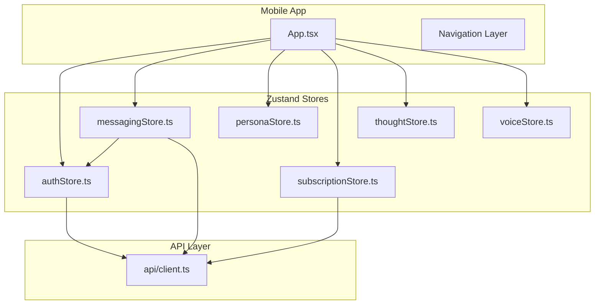
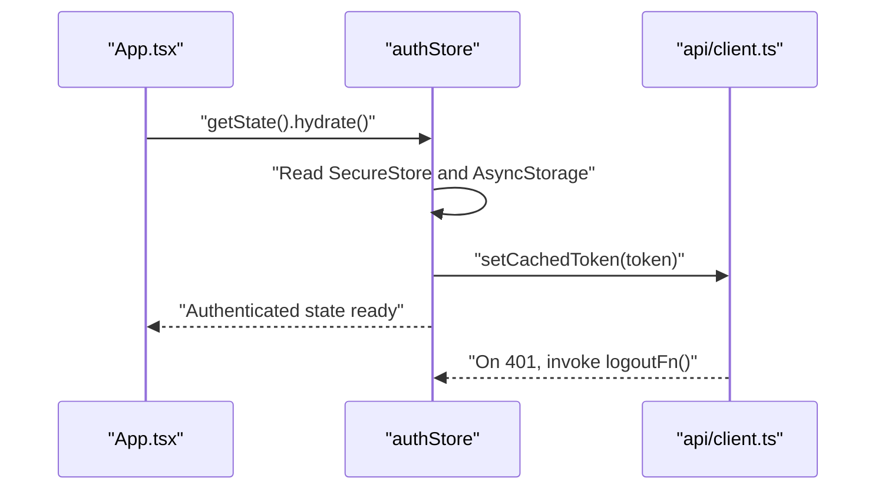
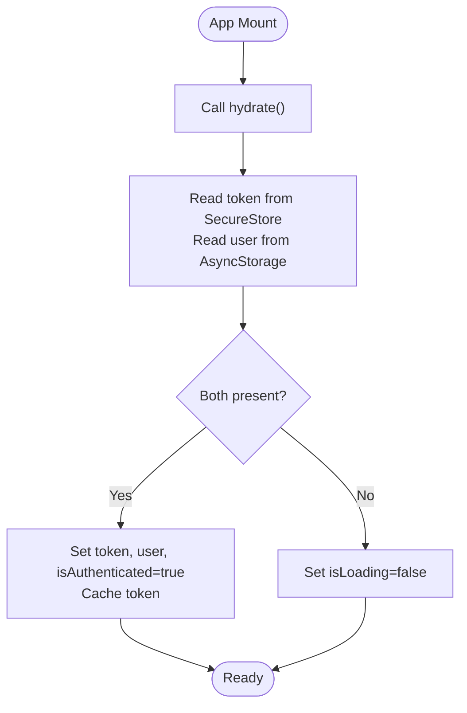
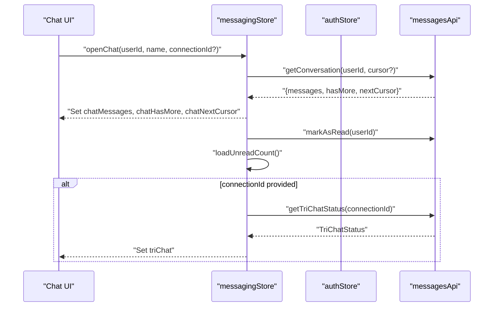
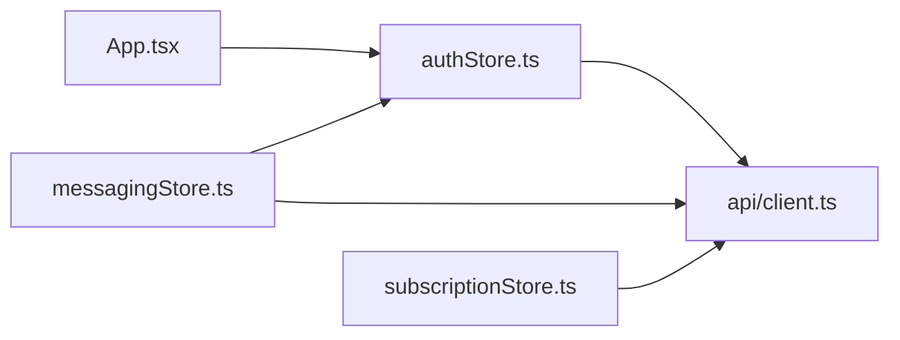

# State Management

<cite>
**Referenced Files in This Document**
- [authStore.ts](file://mobile/src/store/authStore.ts)
- [messagingStore.ts](file://mobile/src/store/messagingStore.ts)
- [personaStore.ts](file://mobile/src/store/personaStore.ts)
- [thoughtStore.ts](file://mobile/src/store/thoughtStore.ts)
- [subscriptionStore.ts](file://mobile/src/store/subscriptionStore.ts)
- [voiceStore.ts](file://mobile/src/store/voiceStore.ts)
- [App.tsx](file://mobile/App.tsx)
- [client.ts](file://mobile/src/api/client.ts)
</cite>

## Table of Contents
1. [Introduction](#introduction)
2. [Project Structure](#project-structure)
3. [Core Components](#core-components)
4. [Architecture Overview](#architecture-overview)
5. [Detailed Component Analysis](#detailed-component-analysis)
6. [Dependency Analysis](#dependency-analysis)
7. [Performance Considerations](#performance-considerations)
8. [Troubleshooting Guide](#troubleshooting-guide)
9. [Conclusion](#conclusion)
10. [Appendices](#appendices)

## Introduction
This document explains the Zustand-based state management system used in the mobile application. It focuses on the store architecture centered around authStore, messagingStore, personaStore, subscriptionStore, and thoughtStore. It covers state persistence strategies, authentication state hydration, real-time state synchronization with the backend, async action patterns, selectors, middleware integration, cleanup and memory management, performance optimization, cross-store communication, debugging approaches, and offline/synchronization challenges.

## Project Structure
The mobile state management is implemented as individual Zustand stores under mobile/src/store/. Each store encapsulates a cohesive domain (authentication, messaging, personas, subscriptions, thoughts, and voice preferences). Stores are consumed by React components via hooks and coordinated with the API client and navigation lifecycle.

**Diagram sources**
- [App.tsx:10-25](file://mobile/App.tsx#L10-L25)
- [authStore.ts:26-71](file://mobile/src/store/authStore.ts#L26-L71)
- [messagingStore.ts:59-372](file://mobile/src/store/messagingStore.ts#L59-L372)
- [personaStore.ts:12-22](file://mobile/src/store/personaStore.ts#L12-L22)
- [subscriptionStore.ts:15-44](file://mobile/src/store/subscriptionStore.ts#L15-L44)
- [thoughtStore.ts:14-26](file://mobile/src/store/thoughtStore.ts#L14-L26)
- [voiceStore.ts:47-69](file://mobile/src/store/voiceStore.ts#L47-L69)
- [client.ts:1-57](file://mobile/src/api/client.ts#L1-L57)

**Section sources**
- [App.tsx:10-25](file://mobile/App.tsx#L10-L25)
- [authStore.ts:26-71](file://mobile/src/store/authStore.ts#L26-L71)
- [messagingStore.ts:59-372](file://mobile/src/store/messagingStore.ts#L59-L372)
- [personaStore.ts:12-22](file://mobile/src/store/personaStore.ts#L12-L22)
- [subscriptionStore.ts:15-44](file://mobile/src/store/subscriptionStore.ts#L15-L44)
- [thoughtStore.ts:14-26](file://mobile/src/store/thoughtStore.ts#L14-L26)
- [voiceStore.ts:47-69](file://mobile/src/store/voiceStore.ts#L47-L69)
- [client.ts:1-57](file://mobile/src/api/client.ts#L1-L57)

## Core Components
- authStore: Manages authentication state, secure token storage, user profile persistence, hydration on app start, and logout.
- messagingStore: Handles connections, conversations, unread counts, message lists, tri-chat mediator state, and real-time updates.
- personaStore: CRUD operations for persona entities.
- subscriptionStore: Loads and reflects subscription tier, expiry, and activity status.
- thoughtStore: CRUD operations for thoughts and selection of the current thought.
- voiceStore: Persists and loads preferred voice option for audio features.

Key patterns:
- Async actions for network-bound state updates.
- Direct state updates for local UI state.
- Cross-store reads via useAuthStore.getState() for contextual logic.
- API client integration with token caching and automatic logout on 401.

**Section sources**
- [authStore.ts:14-24](file://mobile/src/store/authStore.ts#L14-L24)
- [messagingStore.ts:6-57](file://mobile/src/store/messagingStore.ts#L6-L57)
- [personaStore.ts:4-10](file://mobile/src/store/personaStore.ts#L4-L10)
- [subscriptionStore.ts:4-13](file://mobile/src/store/subscriptionStore.ts#L4-L13)
- [thoughtStore.ts:4-12](file://mobile/src/store/thoughtStore.ts#L4-L12)
- [voiceStore.ts:40-45](file://mobile/src/store/voiceStore.ts#L40-L45)

## Architecture Overview
The stores are initialized at app startup and hydrated from persistent storage. The API client caches tokens and automatically triggers logout on unauthorized responses. Messaging state integrates with real-time events and maintains optimistic updates while reconciling server-provided data.

**Diagram sources**
- [App.tsx:13-15](file://mobile/App.tsx#L13-L15)
- [authStore.ts:56-70](file://mobile/src/store/authStore.ts#L56-L70)
- [client.ts:12-40](file://mobile/src/api/client.ts#L12-L40)

## Detailed Component Analysis

### Authentication Store (authStore)
Responsibilities:
- Persist token and user profile securely.
- Hydrate authentication state on app launch.
- Update user profile in place.
- Logout and clear cached token.

Persistence strategy:
- Token stored in SecureStore; user profile stored in AsyncStorage.
- Token caching avoids repeated SecureStore reads.

Hydration flow:
- On mount, reads SecureStore and AsyncStorage.
- Sets authenticated state and clears loading flag.
- On 401, the API interceptor invokes the registered logout function.

**Diagram sources**
- [authStore.ts:56-70](file://mobile/src/store/authStore.ts#L56-L70)
- [client.ts:20-22](file://mobile/src/api/client.ts#L20-L22)

**Section sources**
- [authStore.ts:14-24](file://mobile/src/store/authStore.ts#L14-L24)
- [authStore.ts:32-52](file://mobile/src/store/authStore.ts#L32-L52)
- [authStore.ts:56-70](file://mobile/src/store/authStore.ts#L56-L70)
- [client.ts:12-40](file://mobile/src/api/client.ts#L12-L40)

### Messaging Store (messagingStore)
Responsibilities:
- Manage connections, pending requests, conversations, and unread counts.
- Maintain active chat state, pagination cursor, and message lists.
- Handle optimistic message additions and reconciliation via temporary IDs.
- Real-time tri-chat mediator state: streaming, actions, sessions, and acceptance.

Cross-store communication:
- Reads current user ID from authStore to decide whether to include incoming mediator messages in the active chat.
- Updates unread counters and conversation badges.

**Diagram sources**
- [messagingStore.ts:107-120](file://mobile/src/store/messagingStore.ts#L107-L120)
- [messagingStore.ts:252-262](file://mobile/src/store/messagingStore.ts#L252-L262)
- [messagingStore.ts:135-158](file://mobile/src/store/messagingStore.ts#L135-L158)

**Section sources**
- [messagingStore.ts:6-57](file://mobile/src/store/messagingStore.ts#L6-L57)
- [messagingStore.ts:107-120](file://mobile/src/store/messagingStore.ts#L107-L120)
- [messagingStore.ts:135-158](file://mobile/src/store/messagingStore.ts#L135-L158)
- [messagingStore.ts:252-262](file://mobile/src/store/messagingStore.ts#L252-L262)

### Persona Store (personaStore)
Responsibilities:
- Maintain a list of personas.
- Provide setters and updaters for add, update, and remove operations.

Patterns:
- Pure state updates; no persistence or async actions.

**Section sources**
- [personaStore.ts:4-10](file://mobile/src/store/personaStore.ts#L4-L10)
- [personaStore.ts:12-22](file://mobile/src/store/personaStore.ts#L12-L22)

### Subscription Store (subscriptionStore)
Responsibilities:
- Load subscription details from the backend.
- Reflect tier, expiry, and activity status.
- Reset to defaults when needed.

Patterns:
- Async loader with guard against concurrent loads.
- Defensive fallback on errors.

**Section sources**
- [subscriptionStore.ts:4-13](file://mobile/src/store/subscriptionStore.ts#L4-L13)
- [subscriptionStore.ts:22-37](file://mobile/src/store/subscriptionStore.ts#L22-L37)

### Thought Store (thoughtStore)
Responsibilities:
- Maintain a list of thoughts and the selected current thought.
- Provide setters and updaters for add, update, and remove operations.

Patterns:
- Pure state updates; no persistence or async actions.

**Section sources**
- [thoughtStore.ts:4-12](file://mobile/src/store/thoughtStore.ts#L4-L12)
- [thoughtStore.ts:14-26](file://mobile/src/store/thoughtStore.ts#L14-L26)

### Voice Store (voiceStore)
Responsibilities:
- Persist and load preferred voice option.
- Guard against invalid persisted values.

Patterns:
- AsyncStorage-backed persistence with safe defaults.

**Section sources**
- [voiceStore.ts:40-45](file://mobile/src/store/voiceStore.ts#L40-L45)
- [voiceStore.ts:51-68](file://mobile/src/store/voiceStore.ts#L51-L68)

## Dependency Analysis
- App initialization depends on authStore hydration.
- messagingStore depends on authStore for user context and on API client for network calls.
- API client depends on authStore’s token cache and logout function registration.
- Stores are independent except for messagingStore’s cross-store read of the current user.

**Diagram sources**
- [App.tsx:13-15](file://mobile/App.tsx#L13-L15)
- [authStore.ts:74-75](file://mobile/src/store/authStore.ts#L74-L75)
- [messagingStore.ts:4](file://mobile/src/store/messagingStore.ts#L4)
- [client.ts:12-22](file://mobile/src/api/client.ts#L12-L22)

**Section sources**
- [App.tsx:13-15](file://mobile/App.tsx#L13-L15)
- [authStore.ts:74-75](file://mobile/src/store/authStore.ts#L74-L75)
- [messagingStore.ts:4](file://mobile/src/store/messagingStore.ts#L4)
- [client.ts:12-22](file://mobile/src/api/client.ts#L12-L22)

## Performance Considerations
- Token caching: The API client caches the token to reduce SecureStore reads on every request.
- Optimistic UI: messagingStore adds messages locally and later reconciles with server-provided messages using temporary ID matching.
- Pagination: Uses cursors to load older messages incrementally, reducing initial payload sizes.
- Avoid unnecessary re-renders: Keep state granular; only subscribe to slices needed by components.
- Debounce or throttle frequent UI updates (e.g., reaction toggles) if needed.
- Cleanup: Ensure listeners and timers are cleared when chats are closed.

[No sources needed since this section provides general guidance]

## Troubleshooting Guide
Common issues and remedies:
- Stale authentication after logout:
  - Verify logout clears SecureStore and AsyncStorage entries and resets cached token.
  - Ensure the API interceptor invokes the logout function on 401.
- Hydration race conditions:
  - Call hydrate once during app mount and gate UI rendering until hydration completes.
- Message duplication or missing:
  - Confirm temporary ID matching logic and fallback content+receiver matching.
  - Ensure active chat filtering prevents duplicates across tabs.
- Unread counts drift:
  - After marking as read, refresh unread count and update conversation badges.

**Section sources**
- [authStore.ts:47-52](file://mobile/src/store/authStore.ts#L47-L52)
- [authStore.ts:56-70](file://mobile/src/store/authStore.ts#L56-L70)
- [client.ts:32-40](file://mobile/src/api/client.ts#L32-L40)
- [messagingStore.ts:164-189](file://mobile/src/store/messagingStore.ts#L164-L189)
- [messagingStore.ts:135-158](file://mobile/src/store/messagingStore.ts#L135-L158)
- [messagingStore.ts:100-105](file://mobile/src/store/messagingStore.ts#L100-L105)

## Conclusion
The mobile state management leverages Zustand to provide clear, modular stores for distinct domains. Persistence is handled via SecureStore and AsyncStorage, with token caching for performance. The API client centralizes authentication and error handling, enabling robust hydration and logout flows. messagingStore demonstrates advanced patterns for real-time, optimistic updates and cross-store coordination. Following the recommended practices ensures maintainable, performant, and resilient state management.

[No sources needed since this section summarizes without analyzing specific files]

## Appendices

### Offline State Management and Synchronization
- Offline-first UX:
  - Persist critical UI state (e.g., active chat, replying/editing state) to minimize disruption.
  - Queue outgoing messages with temporary IDs; reconcile with server responses upon reconnect.
- Conflict resolution:
  - Use server timestamps or sequence numbers to merge updates.
  - Prefer server authority for canonical truth; apply local changes as optimistic updates.
- Reconnection strategy:
  - Retry failed requests with exponential backoff.
  - Refresh subscriptions or re-hydrate state on reconnect.

[No sources needed since this section provides general guidance]

### Debugging Approaches
- Enable Zustand Devtools to inspect state and actions.
- Log store updates at boundaries (hydration, API responses).
- Add console traces for critical flows (login, logout, message send/receive).
- Use shallow comparisons for selector-based subscriptions to avoid unnecessary renders.

[No sources needed since this section provides general guidance]