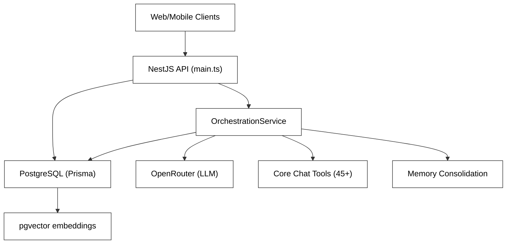
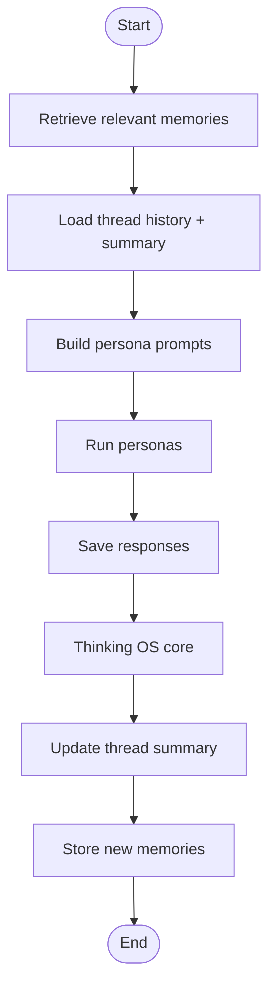
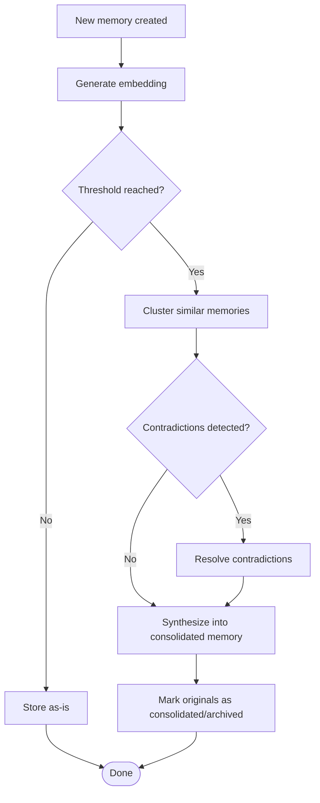
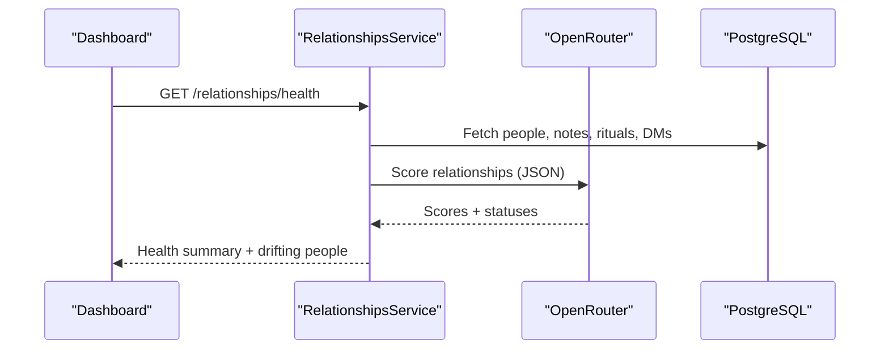
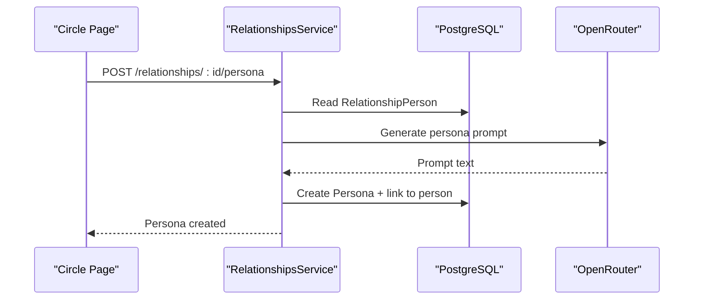
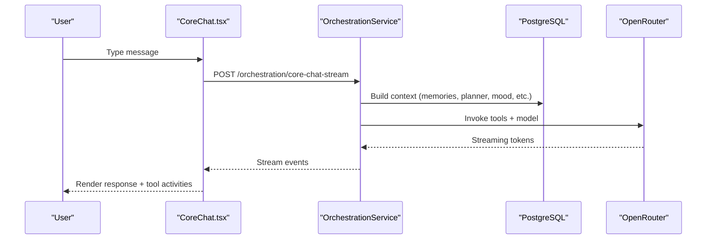
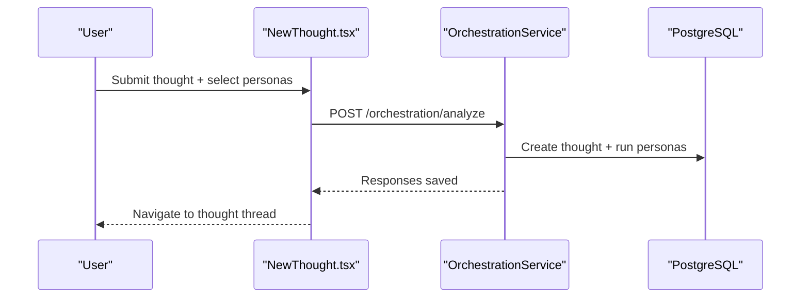
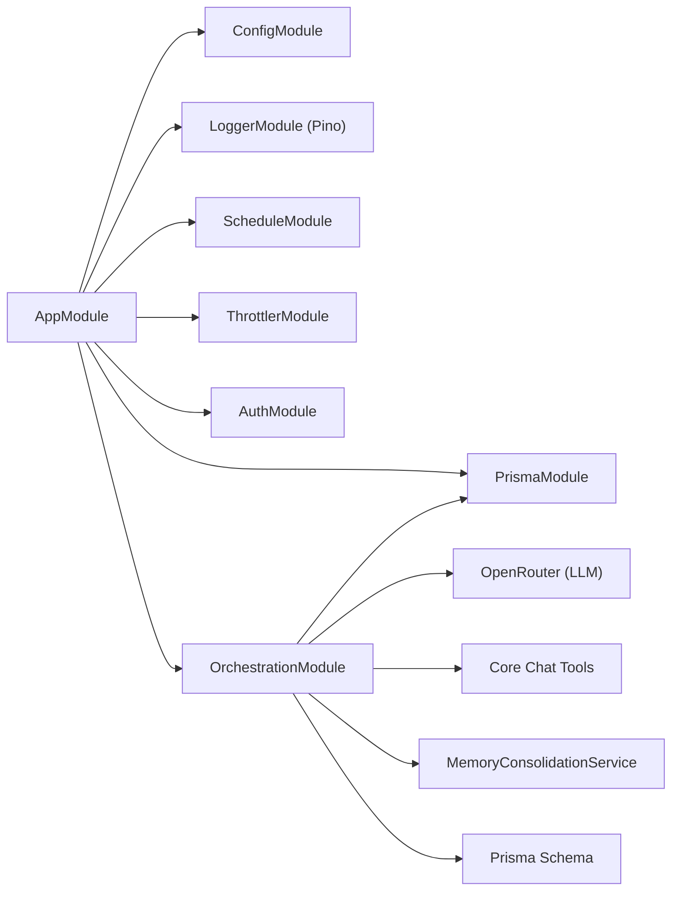

# Project Overview

<cite>
**Referenced Files in This Document**
- [README.md](file://README.md)
- [app.module.ts](file://backend/src/app.module.ts)
- [main.ts](file://backend/src/main.ts)
- [schema.prisma](file://backend/prisma/schema.prisma)
- [orchestration.service.ts](file://backend/src/orchestration/orchestration.service.ts)
- [thought-analysis.graph.ts](file://backend/src/orchestration/graph/thought-analysis.graph.ts)
- [memory-consolidation.service.ts](file://backend/src/orchestration/memory-consolidation.service.ts)
- [relationships.service.ts](file://backend/src/relationships/relationships.service.ts)
- [personas.service.ts](file://backend/src/personas/personas.service.ts)
- [Dashboard.tsx](file://frontend/src/pages/Dashboard.tsx)
- [CoreChat.tsx](file://frontend/src/pages/CoreChat.tsx)
- [NewThought.tsx](file://frontend/src/pages/NewThought.tsx)
</cite>

## Table of Contents
1. [Introduction](#introduction)
2. [Project Structure](#project-structure)
3. [Core Components](#core-components)
4. [Architecture Overview](#architecture-overview)
5. [Detailed Component Analysis](#detailed-component-analysis)
6. [Dependency Analysis](#dependency-analysis)
7. [Performance Considerations](#performance-considerations)
8. [Troubleshooting Guide](#troubleshooting-guide)
9. [Conclusion](#conclusion)

## Introduction
4Ever is a personal AI life operating system designed to help you think more clearly, relate more deeply, and live more intentionally. It provides durable memory and relationship intelligence through:
- Multi-persona thought analysis: capture ideas, then ask multiple AI personas to reflect from distinct perspectives.
- Semantic memory continuity: two-layer memory (thread summaries + pgvector-embedded long-term memories) ensures insights persist across sessions.
- Relationship intelligence: LLM-powered health scoring, drift alerts, rituals, and life events.
- Life management: day planner, mood tracking, action items, and an agentic Core Chat with 45+ tools.

Unlike traditional AI apps that treat each conversation as ephemeral, 4Ever builds a living record of your thoughts, relationships, and patterns—enabling deeper self-awareness and sustained growth.

## Project Structure
The system is organized as a full-stack NestJS backend with a modular architecture, paired with React frontends (web and mobile). The backend orchestrates AI reasoning, manages semantic memory, and exposes APIs for the UIs. The database schema supports rich personal data, including thoughts, personas, memories, relationships, planner data, and more.

```mermaid
graph TB
subgraph "Backend (NestJS)"
AppModule["AppModule"]
Auth["Auth Module"]
Thoughts["Thoughts Module"]
Personas["Personas Module"]
Orch["Orchestration Module"]
Insights["Insights Module"]
Planner["Planner Module"]
CheckIn["CheckIn Module"]
Actions["Actions Module"]
Reflections["Reflections Module"]
KB["Knowledge Base Module"]
Relationships["Relationships Module"]
Rituals["Rituals Module"]
LifeEvents["Life Events Module"]
Tensions["Tensions Module"]
Dimensions["Dimensions Module"]
Messaging["Messaging Module"]
KW["Knowledge Worker Module"]
Admin["Admin Module"]
Usage["Usage Module"]
Consent["Consent Module"]
Health["Health Module"]
Support["Support Module"]
AgentActions["Agent Actions Module"]
end
subgraph "Database (PostgreSQL + pgvector)"
Schema["Prisma Schema"]
end
subgraph "Frontend"
Web["Web UI (React)"]
Mobile["Mobile UI (React Native)"]
end
AppModule --> Auth
AppModule --> Thoughts
AppModule --> Personas
AppModule --> Orch
AppModule --> Insights
AppModule --> Planner
AppModule --> CheckIn
AppModule --> Actions
AppModule --> Reflections
AppModule --> KB
AppModule --> Relationships
AppModule --> Rituals
AppModule --> LifeEvents
AppModule --> Tensions
AppModule --> Dimensions
AppModule --> Messaging
AppModule --> KW
AppModule --> Admin
AppModule --> Usage
AppModule --> Consent
AppModule --> Health
AppModule --> Support
AppModule --> AgentActions
Orch --> Schema
Relationships --> Schema
Planner --> Schema
Thoughts --> Schema
Personas --> Schema
Schema -.-> pgvector["pgvector extension"]
```

**Diagram sources**
- [app.module.ts:34-163](file://backend/src/app.module.ts#L34-L163)
- [schema.prisma:1-120](file://backend/prisma/schema.prisma#L1-L120)

**Section sources**
- [README.md:128-162](file://README.md#L128-L162)
- [app.module.ts:34-163](file://backend/src/app.module.ts#L34-L163)
- [schema.prisma:1-120](file://backend/prisma/schema.prisma#L1-L120)

## Core Components
- AI Orchestration and Graph Engine: A LangGraph-based thought analysis pipeline that retrieves semantic memories, loads thread history, builds persona prompts, runs personas, saves responses, updates summaries, and consolidates memories.
- Semantic Memory: Two-layer memory system with short-term thread summaries and long-term pgvector-embedded memories, enabling contextual recall and synthesis.
- Relationship Intelligence: Health scoring, drift detection, rituals, life events, and sentiment-aware notes for people in your circle.
- Persona Orchestration: Customizable AI personas with per-persona models, templates, and automated persona-from-person creation.
- Life Management: Planner, mood check-ins, action items, insights, and reflections to tie daily activities to long-term growth.
- Core Chat: An agentic conversational layer with 45+ tools (web search, calculator, planner queries, memory search, persona triggers, etc.), streaming responses, and continuous session context.

**Section sources**
- [README.md:9-24](file://README.md#L9-L24)
- [orchestration.service.ts:24-74](file://backend/src/orchestration/orchestration.service.ts#L24-L74)
- [orchestration.service.ts:567-606](file://backend/src/orchestration/orchestration.service.ts#L567-L606)
- [relationships.service.ts:182-478](file://backend/src/relationships/relationships.service.ts#L182-L478)
- [personas.service.ts:25-46](file://backend/src/personas/personas.service.ts#L25-L46)

## Architecture Overview
The backend bootstraps with structured logging, security middleware, rate limiting, and graceful shutdown hooks. It wires 30+ feature modules behind a single global prefix. The orchestration engine composes context from multiple domains (memories, planner, mood, relationships, messaging, etc.) and executes persona analyses or Core Chat responses. Data persistence relies on PostgreSQL with pgvector for semantic search.

**Diagram sources**
- [main.ts:24-125](file://backend/src/main.ts#L24-L125)
- [app.module.ts:34-163](file://backend/src/app.module.ts#L34-L163)
- [orchestration.service.ts:24-74](file://backend/src/orchestration/orchestration.service.ts#L24-L74)
- [schema.prisma:1-120](file://backend/prisma/schema.prisma#L1-L120)

**Section sources**
- [main.ts:24-125](file://backend/src/main.ts#L24-L125)
- [app.module.ts:34-163](file://backend/src/app.module.ts#L34-L163)

## Detailed Component Analysis

### AI Orchestration and Graph Engine
The orchestration engine compiles a LangGraph for thought analysis with a linear chain: retrieve memory → load thread history → build prompts → run personas → save responses → thinking OS core → update summary → store memory. It also constructs rich context for Core Chat by dynamically selecting relevant domains (planner, life review, memory recall, relationships, messaging) and injecting persona lists and session summaries.

**Diagram sources**
- [thought-analysis.graph.ts:15-67](file://backend/src/orchestration/graph/thought-analysis.graph.ts#L15-L67)

**Section sources**
- [orchestration.service.ts:24-74](file://backend/src/orchestration/orchestration.service.ts#L24-L74)
- [orchestration.service.ts:567-606](file://backend/src/orchestration/orchestration.service.ts#L567-L606)
- [orchestration.service.ts:660-764](file://backend/src/orchestration/orchestration.service.ts#L660-L764)

### Semantic Memory Continuity
Semantic memory combines:
- Short-term thread summaries for immediate context.
- Long-term memories stored with pgvector embeddings for similarity search.
- Automatic memory consolidation to reduce redundancy and resolve contradictions.

**Diagram sources**
- [memory-consolidation.service.ts:29-127](file://backend/src/orchestration/memory-consolidation.service.ts#L29-L127)

**Section sources**
- [memory-consolidation.service.ts:29-127](file://backend/src/orchestration/memory-consolidation.service.ts#L29-L127)
- [schema.prisma:170-202](file://backend/prisma/schema.prisma#L170-L202)

### Relationship Intelligence
Relationships are modeled with rich attributes (description, dynamic, communication style, love language, etc.). The system computes health scores via LLM analysis and drift risk thresholds, surfaces recent activity, and supports creating personas from people in your circle.

**Diagram sources**
- [relationships.service.ts:182-478](file://backend/src/relationships/relationships.service.ts#L182-L478)

**Section sources**
- [relationships.service.ts:182-478](file://backend/src/relationships/relationships.service.ts#L182-L478)

### Persona Orchestration
Personas can be user-created or shared templates. The system supports building a persona from a relationship entry, enabling authentic role-play responses grounded in real-world dynamics.

**Diagram sources**
- [relationships.service.ts:576-639](file://backend/src/relationships/relationships.service.ts#L576-L639)

**Section sources**
- [personas.service.ts:25-46](file://backend/src/personas/personas.service.ts#L25-L46)
- [relationships.service.ts:576-639](file://backend/src/relationships/relationships.service.ts#L576-L639)

### Core Chat and Life Management
Core Chat streams responses, visualizes tool usage, and maintains session continuity. The dashboard aggregates planner stats, mood trends, relationship health, and pending actions to guide daily focus.

**Diagram sources**
- [CoreChat.tsx:170-256](file://frontend/src/pages/CoreChat.tsx#L170-L256)
- [orchestration.service.ts:660-764](file://backend/src/orchestration/orchestration.service.ts#L660-L764)

**Section sources**
- [Dashboard.tsx:83-119](file://frontend/src/pages/Dashboard.tsx#L83-L119)
- [CoreChat.tsx:170-256](file://frontend/src/pages/CoreChat.tsx#L170-L256)
- [orchestration.service.ts:660-764](file://backend/src/orchestration/orchestration.service.ts#L660-L764)

### Practical Use Cases
- Thought analysis: Capture a thought, optionally trigger persona analysis, and review multi-perspective insights in the thought thread.
- Relationship tracking: Log notes, monitor drift, set rituals, and review health scores and recent activity.
- Daily planning: Review today/tomorrow’s tasks, update completion stats, and connect planner insights to life dimensions.

**Diagram sources**
- [NewThought.tsx:83-102](file://frontend/src/pages/NewThought.tsx#L83-L102)
- [orchestration.service.ts:567-606](file://backend/src/orchestration/orchestration.service.ts#L567-L606)

**Section sources**
- [NewThought.tsx:83-102](file://frontend/src/pages/NewThought.tsx#L83-L102)
- [Dashboard.tsx:83-119](file://frontend/src/pages/Dashboard.tsx#L83-L119)

## Dependency Analysis
The backend module wiring centralizes configuration, logging, scheduling, throttling, and database access. The orchestration service depends on Prisma, OpenRouter, and optional tools. The schema defines 25+ models with foreign keys and indexes supporting semantic search and analytics.

**Diagram sources**
- [app.module.ts:34-163](file://backend/src/app.module.ts#L34-L163)
- [schema.prisma:12-74](file://backend/prisma/schema.prisma#L12-L74)

**Section sources**
- [app.module.ts:34-163](file://backend/src/app.module.ts#L34-L163)
- [schema.prisma:12-74](file://backend/prisma/schema.prisma#L12-L74)

## Performance Considerations
- Streaming responses: Compression is disabled for Server-Sent Events to preserve token-by-token streaming.
- Rate limiting: Named throttler buckets protect auth endpoints and global limits.
- Memory scaling: pgvector embeddings enable efficient similarity search; periodic consolidation reduces bloat.
- Parallel context loading: Orchestration fetches planner, mood, relationships, and memories concurrently for low-latency responses.

[No sources needed since this section provides general guidance]

## Troubleshooting Guide
- Logging and redaction: Structured JSON logging with automatic redaction of sensitive fields; correlation IDs propagate across services for traceability.
- Security headers: Helmet configured with CSP and resource policies; production requires explicit CORS origins.
- Health probes: Dedicated endpoints for readiness and liveness checks.
- Error handling: Global exception filter forwards unhandled server errors to Sentry; graceful shutdown hooks drain in-flight work.

**Section sources**
- [main.ts:35-125](file://backend/src/main.ts#L35-L125)
- [app.module.ts:44-124](file://backend/src/app.module.ts#L44-L124)

## Conclusion
4Ever reimagines personal AI as a durable, relationship-aware life OS. By combining multi-persona thought analysis, semantic memory continuity, and relationship intelligence with robust AI orchestration and data persistence, it offers both beginner-friendly insights and powerful developer-grade extensibility. Whether you seek clarity on a difficult decision, deeper awareness of your relationships, or disciplined life management, 4Ever’s modular architecture and rich APIs provide a solid foundation for growth and innovation.