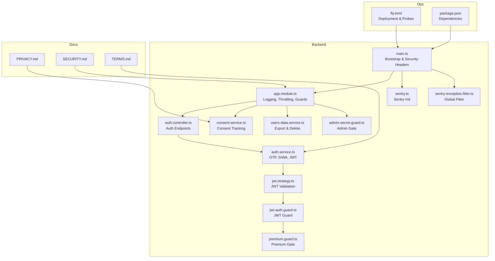
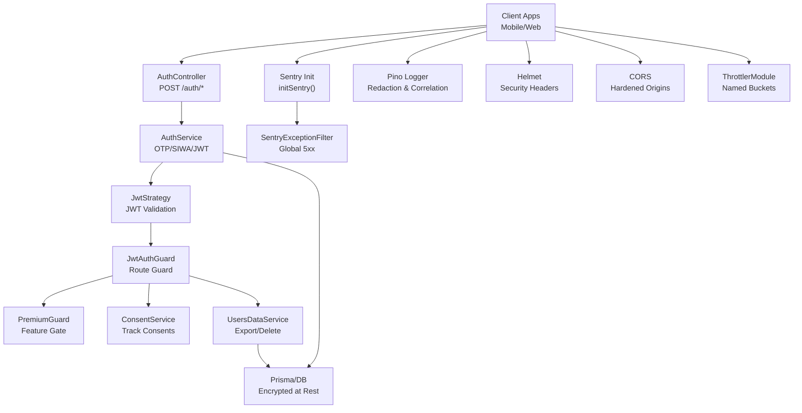
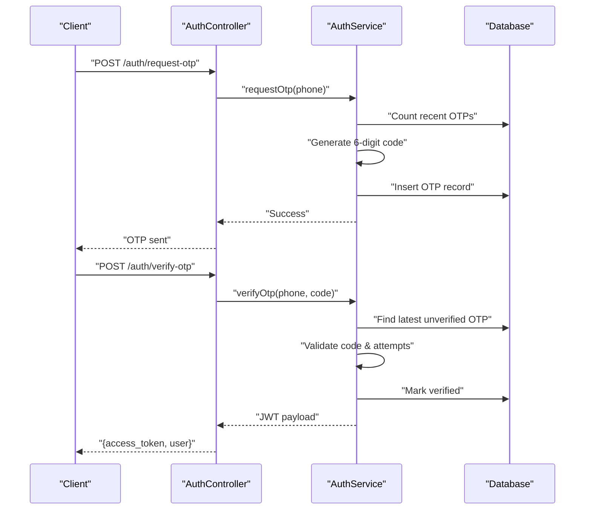
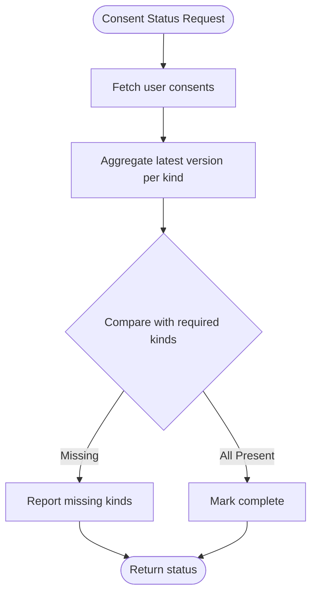
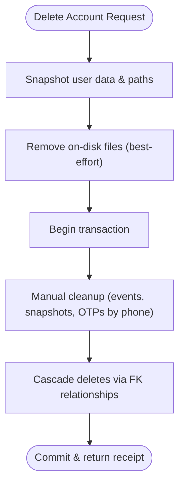
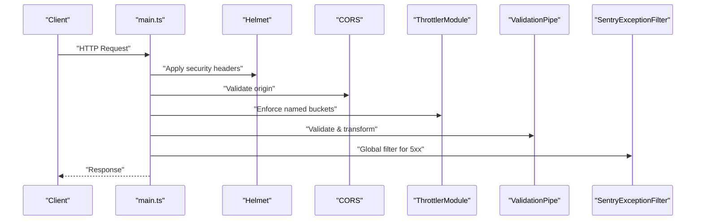
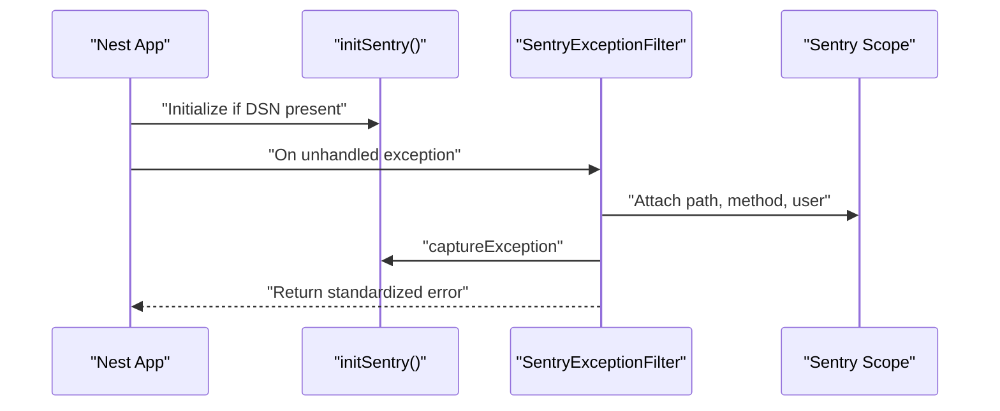
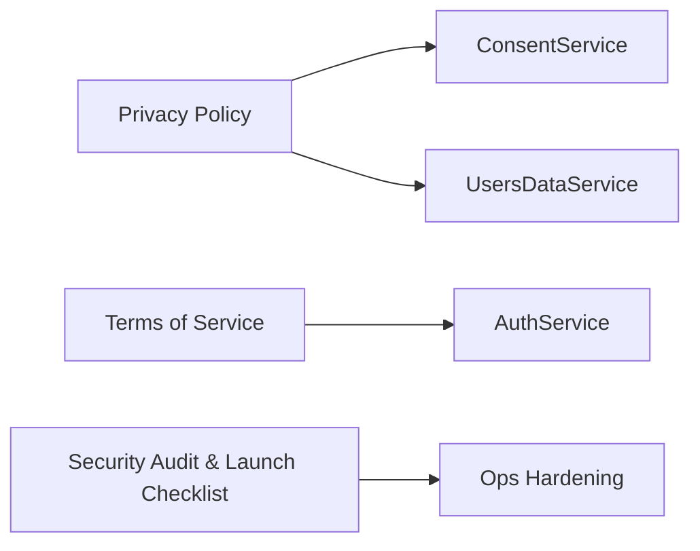
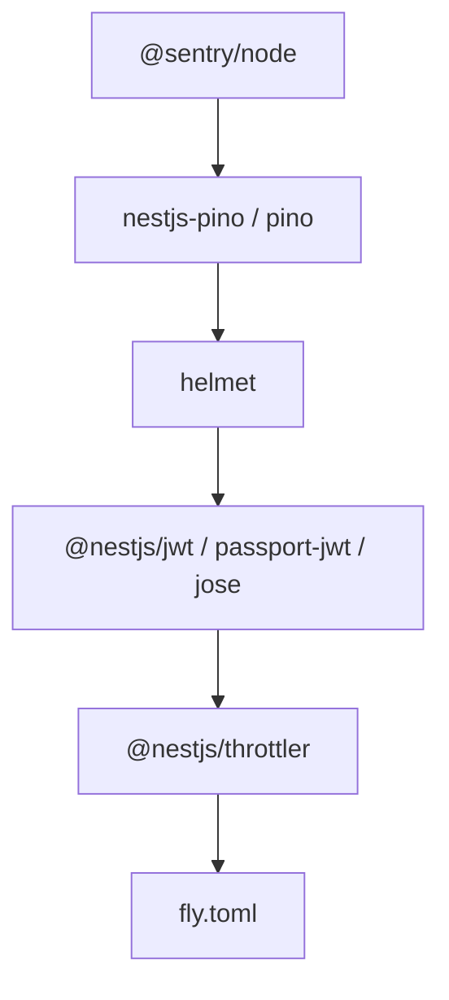

# Security & Compliance

<cite>
**Referenced Files in This Document**
- [PRIVACY.md](file://docs/PRIVACY.md)
- [SECURITY.md](file://docs/SECURITY.md)
- [TERMS.md](file://docs/TERMS.md)
- [auth.service.ts](file://backend/src/auth/auth.service.ts)
- [auth.controller.ts](file://backend/src/auth/auth.controller.ts)
- [jwt-auth.guard.ts](file://backend/src/auth/jwt-auth.guard.ts)
- [jwt.strategy.ts](file://backend/src/auth/jwt.strategy.ts)
- [premium.guard.ts](file://backend/src/auth/premium.guard.ts)
- [consent.service.ts](file://backend/src/consent/consent.service.ts)
- [users-data.service.ts](file://backend/src/users/users-data.service.ts)
- [app.module.ts](file://backend/src/app.module.ts)
- [main.ts](file://backend/src/main.ts)
- [sentry.ts](file://backend/src/sentry.ts)
- [sentry-exception.filter.ts](file://backend/src/common/sentry-exception.filter.ts)
- [admin-secret.guard.ts](file://backend/src/admin/admin-secret.guard.ts)
- [fly.toml](file://backend/fly.toml)
- [package.json](file://backend/package.json)
</cite>

## Table of Contents
1. [Introduction](#introduction)
2. [Project Structure](#project-structure)
3. [Core Components](#core-components)
4. [Architecture Overview](#architecture-overview)
5. [Detailed Component Analysis](#detailed-component-analysis)
6. [Dependency Analysis](#dependency-analysis)
7. [Performance Considerations](#performance-considerations)
8. [Troubleshooting Guide](#troubleshooting-guide)
9. [Conclusion](#conclusion)
10. [Appendices](#appendices)

## Introduction
This document provides comprehensive security and compliance documentation for 4Ever. It covers privacy-first data handling, authentication and authorization, API security, consent and data retention, security monitoring, legal compliance, and developer best practices. The goal is to make the security posture understandable for both technical and non-technical stakeholders.

## Project Structure
Security and compliance are implemented across backend services, configuration, and operational playbooks:
- Backend services implement authentication, authorization, consent, and data deletion/export.
- Application bootstrap configures security headers, CORS, validation, logging, and monitoring.
- Operational playbooks define dependency audits, OWASP mitigations, secrets inventory, and incident response.

**Diagram sources**
- [main.ts:1-143](file://backend/src/main.ts#L1-L143)
- [app.module.ts:1-172](file://backend/src/app.module.ts#L1-L172)
- [auth.controller.ts:1-59](file://backend/src/auth/auth.controller.ts#L1-L59)
- [auth.service.ts:1-340](file://backend/src/auth/auth.service.ts#L1-L340)
- [jwt.strategy.ts:1-27](file://backend/src/auth/jwt.strategy.ts#L1-L27)
- [jwt-auth.guard.ts:1-6](file://backend/src/auth/jwt-auth.guard.ts#L1-L6)
- [premium.guard.ts:1-46](file://backend/src/auth/premium.guard.ts#L1-L46)
- [consent.service.ts:1-106](file://backend/src/consent/consent.service.ts#L1-L106)
- [users-data.service.ts:1-372](file://backend/src/users/users-data.service.ts#L1-L372)
- [sentry.ts:1-57](file://backend/src/sentry.ts#L1-L57)
- [sentry-exception.filter.ts:1-64](file://backend/src/common/sentry-exception.filter.ts#L1-L64)
- [admin-secret.guard.ts:1-32](file://backend/src/admin/admin-secret.guard.ts#L1-L32)
- [PRIVACY.md:1-155](file://docs/PRIVACY.md#L1-L155)
- [SECURITY.md:1-87](file://docs/SECURITY.md#L1-L87)
- [TERMS.md:1-142](file://docs/TERMS.md#L1-L142)
- [fly.toml:1-70](file://backend/fly.toml#L1-L70)
- [package.json:1-96](file://backend/package.json#L1-L96)

**Section sources**
- [main.ts:1-143](file://backend/src/main.ts#L1-L143)
- [app.module.ts:1-172](file://backend/src/app.module.ts#L1-L172)
- [PRIVACY.md:1-155](file://docs/PRIVACY.md#L1-L155)
- [SECURITY.md:1-87](file://docs/SECURITY.md#L1-L87)
- [TERMS.md:1-142](file://docs/TERMS.md#L1-L142)

## Core Components
- Authentication and Authorization
  - OTP via SMS with rate limiting and expiration.
  - Sign in with Apple using JWKS verification and audience checks.
  - JWT-based session with strict validation and short-lived tokens.
  - Guards for JWT and premium feature gating.
- Consent Management
  - Required legal notices tracked per user/version.
  - Reporting-only enforcement with future blocking capability.
- Data Handling and Deletion
  - GDPR-compliant export and deletion with cascading and manual cleanup.
- API Security
  - Helmet security headers, CORS hardening, body size limits, compression, validation, throttling, and structured logging with PII redaction.
- Monitoring and Observability
  - Sentry initialization and global exception filter.
- Deployment and Operations
  - Production hardening (TLS enforcement, health probes, secrets management).

**Section sources**
- [auth.service.ts:1-340](file://backend/src/auth/auth.service.ts#L1-L340)
- [auth.controller.ts:1-59](file://backend/src/auth/auth.controller.ts#L1-L59)
- [jwt.strategy.ts:1-27](file://backend/src/auth/jwt.strategy.ts#L1-L27)
- [jwt-auth.guard.ts:1-6](file://backend/src/auth/jwt-auth.guard.ts#L1-L6)
- [premium.guard.ts:1-46](file://backend/src/auth/premium.guard.ts#L1-L46)
- [consent.service.ts:1-106](file://backend/src/consent/consent.service.ts#L1-L106)
- [users-data.service.ts:1-372](file://backend/src/users/users-data.service.ts#L1-L372)
- [main.ts:1-143](file://backend/src/main.ts#L1-L143)
- [app.module.ts:1-172](file://backend/src/app.module.ts#L1-L172)
- [sentry.ts:1-57](file://backend/src/sentry.ts#L1-L57)
- [sentry-exception.filter.ts:1-64](file://backend/src/common/sentry-exception.filter.ts#L1-L64)
- [fly.toml:1-70](file://backend/fly.toml#L1-L70)

## Architecture Overview
The security architecture integrates authentication, authorization, consent, data handling, API hardening, and observability.

**Diagram sources**
- [auth.controller.ts:1-59](file://backend/src/auth/auth.controller.ts#L1-L59)
- [auth.service.ts:1-340](file://backend/src/auth/auth.service.ts#L1-L340)
- [jwt.strategy.ts:1-27](file://backend/src/auth/jwt.strategy.ts#L1-L27)
- [jwt-auth.guard.ts:1-6](file://backend/src/auth/jwt-auth.guard.ts#L1-L6)
- [premium.guard.ts:1-46](file://backend/src/auth/premium.guard.ts#L1-L46)
- [consent.service.ts:1-106](file://backend/src/consent/consent.service.ts#L1-L106)
- [users-data.service.ts:1-372](file://backend/src/users/users-data.service.ts#L1-L372)
- [sentry.ts:1-57](file://backend/src/sentry.ts#L1-L57)
- [sentry-exception.filter.ts:1-64](file://backend/src/common/sentry-exception.filter.ts#L1-L64)
- [app.module.ts:1-172](file://backend/src/app.module.ts#L1-L172)
- [main.ts:1-143](file://backend/src/main.ts#L1-L143)

## Detailed Component Analysis

### Authentication and Authorization
- OTP-based authentication:
  - Requests are rate-limited per IP and phone number.
  - Codes expire after a short TTL and are cleaned up periodically.
  - Verification enforces retry limits and supports high-risk actions requiring re-authentication.
- Sign in with Apple:
  - Uses JWKS discovery and validates issuer and audience.
  - Supports dual lookup by Apple ID or email to prevent duplicates.
- JWT session:
  - Strict secret validation at startup and runtime.
  - Payload carries user identity and phone for session context.
- Guards:
  - JwtAuthGuard protects routes; PremiumGuard allows universal access today with future extensibility.

**Diagram sources**
- [auth.controller.ts:26-36](file://backend/src/auth/auth.controller.ts#L26-L36)
- [auth.service.ts:32-80](file://backend/src/auth/auth.service.ts#L32-L80)
- [auth.service.ts:86-150](file://backend/src/auth/auth.service.ts#L86-L150)

**Section sources**
- [auth.service.ts:1-340](file://backend/src/auth/auth.service.ts#L1-L340)
- [auth.controller.ts:1-59](file://backend/src/auth/auth.controller.ts#L1-L59)
- [jwt.strategy.ts:1-27](file://backend/src/auth/jwt.strategy.ts#L1-L27)
- [jwt-auth.guard.ts:1-6](file://backend/src/auth/jwt-auth.guard.ts#L1-L6)
- [premium.guard.ts:1-46](file://backend/src/auth/premium.guard.ts#L1-L46)

### Consent Management
- Required notices tracked per user and version.
- Idempotent recording prevents duplicate audit entries.
- Status aggregation reports missing items for onboarding.
- Future enforcement via centralized usage service.

**Diagram sources**
- [consent.service.ts:70-94](file://backend/src/consent/consent.service.ts#L70-L94)

**Section sources**
- [consent.service.ts:1-106](file://backend/src/consent/consent.service.ts#L1-L106)
- [PRIVACY.md:103-119](file://docs/PRIVACY.md#L103-L119)

### Data Export and Secure Deletion
- Export:
  - Aggregates user data across many collections with best-effort error handling.
  - Excludes binary assets to keep exports manageable.
- Deletion:
  - Removes on-disk assets (avatars, documents) with best-effort.
  - Uses transactions to remove database rows, including manual cleanup for phone-keyed artifacts.
  - Returns a receipt with counts for auditability.

**Diagram sources**
- [users-data.service.ts:289-370](file://backend/src/users/users-data.service.ts#L289-L370)

**Section sources**
- [users-data.service.ts:1-372](file://backend/src/users/users-data.service.ts#L1-L372)
- [PRIVACY.md:93-101](file://docs/PRIVACY.md#L93-L101)

### API Security Measures
- Input validation:
  - Global ValidationPipe with whitelisting and transformation.
- Rate limiting:
  - Named throttler buckets (default, auth_short, auth_long) with layered limits.
- CORS:
  - Origins must be explicitly configured; enforced in production.
- Security headers:
  - Helmet applied with tailored CSP and Cross-Origin Resource Policy.
- Body size limits:
  - JSON and URL-encoded payloads limited to prevent abuse.
- Compression:
  - Disabled for SSE to preserve streaming semantics.
- Logging and redaction:
  - Pino structured logs with comprehensive redaction paths and serializers.
- Static assets:
  - Local disk serving disabled in production; private files served via authenticated routes or signed URLs.

**Diagram sources**
- [main.ts:37-89](file://backend/src/main.ts#L37-L89)
- [app.module.ts:133-137](file://backend/src/app.module.ts#L133-L137)
- [app.module.ts:48-124](file://backend/src/app.module.ts#L48-L124)
- [sentry-exception.filter.ts:21-63](file://backend/src/common/sentry-exception.filter.ts#L21-L63)

**Section sources**
- [main.ts:1-143](file://backend/src/main.ts#L1-L143)
- [app.module.ts:1-172](file://backend/src/app.module.ts#L1-L172)
- [SECURITY.md:37-51](file://docs/SECURITY.md#L37-L51)

### Security Monitoring and Observability
- Sentry initialization with environment-aware sampling and PII redaction.
- Global exception filter captures unhandled 5xx errors and attaches contextual tags.
- Pino structured logs with correlation IDs and redaction for traceability.

**Diagram sources**
- [sentry.ts:14-50](file://backend/src/sentry.ts#L14-L50)
- [sentry-exception.filter.ts:21-63](file://backend/src/common/sentry-exception.filter.ts#L21-L63)

**Section sources**
- [sentry.ts:1-57](file://backend/src/sentry.ts#L1-L57)
- [sentry-exception.filter.ts:1-64](file://backend/src/common/sentry-exception.filter.ts#L1-L64)
- [app.module.ts:48-124](file://backend/src/app.module.ts#L48-L124)

### Legal Compliance and Policies
- Privacy Policy outlines data categories, processing purposes, sharing with subprocessors, international transfers, retention, and user rights.
- Terms of Service defines acceptable use, account eligibility, content licensing, subscriptions, termination, disclaimers, and governing law.
- Security Audit and Launch Checklist documents dependency audits, OWASP mitigations, PII redaction coverage, secrets inventory, pre-submission checks, and incident response.

**Diagram sources**
- [PRIVACY.md:1-155](file://docs/PRIVACY.md#L1-L155)
- [TERMS.md:1-142](file://docs/TERMS.md#L1-L142)
- [SECURITY.md:1-87](file://docs/SECURITY.md#L1-L87)
- [consent.service.ts:1-106](file://backend/src/consent/consent.service.ts#L1-L106)
- [users-data.service.ts:1-372](file://backend/src/users/users-data.service.ts#L1-L372)
- [auth.service.ts:1-340](file://backend/src/auth/auth.service.ts#L1-L340)

**Section sources**
- [PRIVACY.md:1-155](file://docs/PRIVACY.md#L1-L155)
- [TERMS.md:1-142](file://docs/TERMS.md#L1-L142)
- [SECURITY.md:1-87](file://docs/SECURITY.md#L1-L87)

## Dependency Analysis
- Security libraries:
  - helmet, @sentry/node, nestjs-pino, passport-jwt, jose, compression, @nestjs/throttler.
- Operational dependencies:
  - fly.toml configures HTTPS enforcement, health probes, and secrets management.
- Dependency audit highlights:
  - Moderate/high severity issues addressed with auto-fix and mitigation strategies.
  - Known unmaintained transitive dependency documented with safe overrides.

**Diagram sources**
- [package.json:27-72](file://backend/package.json#L27-L72)
- [fly.toml:32-55](file://backend/fly.toml#L32-L55)

**Section sources**
- [package.json:1-96](file://backend/package.json#L1-L96)
- [SECURITY.md:5-31](file://docs/SECURITY.md#L5-L31)
- [fly.toml:1-70](file://backend/fly.toml#L1-L70)

## Performance Considerations
- Rate limiting is configured with named buckets to balance usability and abuse prevention.
- Compression is selectively disabled for streaming endpoints to maintain responsiveness.
- Logging is structured and redacted to minimize overhead while enabling traceability.
- Health probes are configured for fast readiness and liveness checks.

[No sources needed since this section provides general guidance]

## Troubleshooting Guide
- CORS configuration errors:
  - Ensure production sets explicit origins; otherwise, startup fails in production.
- JWT validation failures:
  - Verify JWT_SECRET is set to a strong random value and matches strategy configuration.
- OTP issues:
  - Check rate limits, expiration, and cleanup cron job.
- Sentry not capturing errors:
  - Confirm SENTRY_DSN is set; otherwise, initialization is a no-op.
- Admin endpoints inaccessible:
  - ADMIN_SECRET must be configured; otherwise access is denied.

**Section sources**
- [main.ts:68-79](file://backend/src/main.ts#L68-L79)
- [jwt.strategy.ts:8-15](file://backend/src/auth/jwt.strategy.ts#L8-L15)
- [auth.service.ts:328-338](file://backend/src/auth/auth.service.ts#L328-L338)
- [sentry.ts:14-23](file://backend/src/sentry.ts#L14-L23)
- [admin-secret.guard.ts:18-30](file://backend/src/admin/admin-secret.guard.ts#L18-L30)

## Conclusion
4Ever’s backend implements a robust, privacy-first security model with layered authentication, strict API hardening, comprehensive consent and data handling, and strong observability. The documented playbooks and configurations provide a clear path to maintain compliance and resilience as the system evolves.

[No sources needed since this section summarizes without analyzing specific files]

## Appendices

### Appendix A: Security Controls Inventory
- Authentication
  - OTP with rate limiting and expiration.
  - Sign in with Apple with JWKS verification.
  - JWT with strict secret validation.
- Authorization
  - JwtAuthGuard for protected routes.
  - PremiumGuard for feature gating.
- Consent
  - Required notices tracked per user/version.
- Data Handling
  - GDPR export and deletion with cascades and manual cleanup.
- API Hardening
  - Helmet, CORS, validation, throttling, compression, logging, and static asset controls.
- Monitoring
  - Sentry initialization and global exception filter.
- Operations
  - HTTPS enforcement, health probes, secrets management.

**Section sources**
- [auth.service.ts:1-340](file://backend/src/auth/auth.service.ts#L1-L340)
- [jwt.strategy.ts:1-27](file://backend/src/auth/jwt.strategy.ts#L1-L27)
- [jwt-auth.guard.ts:1-6](file://backend/src/auth/jwt-auth.guard.ts#L1-L6)
- [premium.guard.ts:1-46](file://backend/src/auth/premium.guard.ts#L1-L46)
- [consent.service.ts:1-106](file://backend/src/consent/consent.service.ts#L1-L106)
- [users-data.service.ts:1-372](file://backend/src/users/users-data.service.ts#L1-L372)
- [main.ts:1-143](file://backend/src/main.ts#L1-L143)
- [sentry.ts:1-57](file://backend/src/sentry.ts#L1-L57)
- [fly.toml:1-70](file://backend/fly.toml#L1-L70)