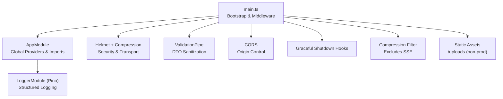
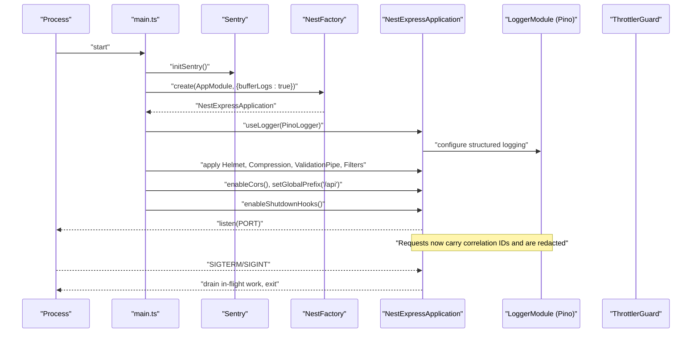
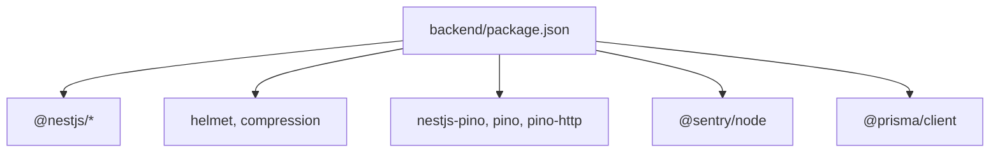

# Application Bootstrap & Configuration

<cite>
**Referenced Files in This Document**
- [main.ts](file://backend/src/main.ts)
- [app.module.ts](file://backend/src/app.module.ts)
- [sentry.ts](file://backend/src/sentry.ts)
- [sentry-exception.filter.ts](file://backend/src/common/sentry-exception.filter.ts)
- [jwt-auth.guard.ts](file://backend/src/auth/jwt-auth.guard.ts)
- [premium.guard.ts](file://backend/src/auth/premium.guard.ts)
- [prisma.module.ts](file://backend/src/prisma/prisma.module.ts)
- [prisma.service.ts](file://backend/src/prisma/prisma.service.ts)
- [auth.module.ts](file://backend/src/auth/auth.module.ts)
- [messaging.module.ts](file://backend/src/messaging/messaging.module.ts)
- [usage.module.ts](file://backend/src/usage/usage.module.ts)
- [health.module.ts](file://backend/src/health/health.module.ts)
- [package.json](file://backend/package.json)
- [nest-cli.json](file://backend/nest-cli.json)
- [tsconfig.json](file://backend/tsconfig.json)
</cite>

## Table of Contents
1. [Introduction](#introduction)
2. [Project Structure](#project-structure)
3. [Core Components](#core-components)
4. [Architecture Overview](#architecture-overview)
5. [Detailed Component Analysis](#detailed-component-analysis)
6. [Dependency Analysis](#dependency-analysis)
7. [Performance Considerations](#performance-considerations)
8. [Troubleshooting Guide](#troubleshooting-guide)
9. [Conclusion](#conclusion)

## Introduction
This document explains how the 4Ever backend application boots, configures itself, and orchestrates its feature modules. It focuses on the main entry point, security middleware, logging with Pino, graceful shutdown, environment variable loading, the AppModule configuration pattern, dependency injection, global interceptors/filters/guards, request correlation IDs, structured logging with PII redaction, error handling strategies, and the application lifecycle from startup to shutdown.

## Project Structure
The backend is a NestJS application organized around feature modules under backend/src. The main entry point initializes Sentry, loads environment variables, creates the Nest application instance, configures middleware, logging, security, validation, CORS, static assets, and graceful shutdown. AppModule composes 25+ feature modules and registers global providers such as throttling and logging.

```mermaid
graph TB
subgraph "Entry Point"
MAIN["backend/src/main.ts"]
end
subgraph "Core Modules"
APP["backend/src/app.module.ts"]
PRISMA["backend/src/prisma/prisma.module.ts"]
USAGE["backend/src/usage/usage.module.ts"]
HEALTH["backend/src/health/health.module.ts"]
end
subgraph "Feature Modules"
AUTH["backend/src/auth/auth.module.ts"]
MSG["backend/src/messaging/messaging.module.ts"]
ORCH["backend/src/orchestration/orchestration.module.ts"]
INS["backend/src/insights/insights.module.ts"]
PLAN["backend/src/planner/planner.module.ts"]
THOUGHTS["backend/src/thoughts/thoughts.module.ts"]
PERSONAS["backend/src/personas/personas.module.ts"]
REL["backend/src/relationships/relationships.module.ts"]
RIT["backend/src/rituals/rituals.module.ts"]
LIFE["backend/src/life-events/life-events.module.ts"]
TENS["backend/src/tensions/tensions.module.ts"]
DIM["backend/src/dimensions/dimensions.module.ts"]
KB["backend/src/knowledge-base/knowledge-base.module.ts"]
KW["backend/src/knowledge-worker/knowledge-worker.module.ts"]
ADMIN["backend/src/admin/admin.module.ts"]
CONSENT["backend/src/consent/consent.module.ts"]
SUPPORT["backend/src/support/support.module.ts"]
AGENT["backend/src/agent-actions/agent-actions.module.ts"]
end
MAIN --> APP
APP --> PRISMA
APP --> USAGE
APP --> HEALTH
APP --> AUTH
APP --> MSG
APP --> ORCH
APP --> INS
APP --> PLAN
APP --> THOUGHTS
APP --> PERSONAS
APP --> REL
APP --> RIT
APP --> LIFE
APP --> TENS
APP --> DIM
APP --> KB
APP --> KW
APP --> ADMIN
APP --> CONSENT
APP --> SUPPORT
APP --> AGENT
```

**Diagram sources**
- [main.ts](file://backend/src/main.ts)
- [app.module.ts](file://backend/src/app.module.ts)
- [prisma.module.ts](file://backend/src/prisma/prisma.module.ts)
- [usage.module.ts](file://backend/src/usage/usage.module.ts)
- [health.module.ts](file://backend/src/health/health.module.ts)
- [auth.module.ts](file://backend/src/auth/auth.module.ts)
- [messaging.module.ts](file://backend/src/messaging/messaging.module.ts)

**Section sources**
- [main.ts](file://backend/src/main.ts)
- [app.module.ts](file://backend/src/app.module.ts)
- [package.json](file://backend/package.json)
- [nest-cli.json](file://backend/nest-cli.json)
- [tsconfig.json](file://backend/tsconfig.json)

## Core Components
- Environment variable loading: The entry point forces-load .env with override to ensure local values take precedence over shell pollution.
- Sentry initialization: Initializes Sentry early to capture fatal bootstrap errors and module evaluation crashes.
- Logging: Swaps Nest’s default logger for Pino globally, enabling structured JSON logs in production and pretty logs in development, with strict PII redaction.
- Security middleware: Helmet for security headers; Compression with streaming exclusion; body size limits; CORS enforcement.
- Validation: Global ValidationPipe configured with whitelisting and transformation.
- Global error handling: A Sentry-backed exception filter forwards 5xx errors to Sentry while preserving Nest’s default 4xx responses.
- Graceful shutdown: Enables Nest shutdown hooks for controlled draining during rolling deploys.
- Static assets: Uploads directory served locally; production serves private assets via authenticated routes or signed URLs.
- Health probes: HealthModule exposes /api/health, /api/livez, and /api/readyz.

**Section sources**
- [main.ts](file://backend/src/main.ts)
- [sentry.ts](file://backend/src/sentry.ts)
- [sentry-exception.filter.ts](file://backend/src/common/sentry-exception.filter.ts)

## Architecture Overview
The application follows a layered NestJS architecture:
- Entry point initializes platform, middleware, logging, security, validation, CORS, and graceful shutdown.
- AppModule aggregates feature modules and global providers (logging, throttling, scheduling).
- Feature modules encapsulate domain concerns and export services for cross-module consumption.
- Global guards, filters, and services are registered at the AppModule level for centralized control.

**Diagram sources**
- [main.ts](file://backend/src/main.ts)
- [app.module.ts](file://backend/src/app.module.ts)

## Detailed Component Analysis

### Entry Point: main.ts
Responsibilities:
- Force-loads .env with override to ensure deterministic environment resolution.
- Initializes Sentry before any other imports to capture early crashes.
- Creates NestExpressApplication with buffered logging until Pino is wired.
- Replaces Nest’s logger with Pino for unified structured logging.
- Applies Helmet, Compression (with SSE exclusion), JSON/urlencoded limits, and CORS.
- Registers global ValidationPipe, SentryExceptionFilter, and sets global API prefix.
- Serves uploads directory in non-production environments.
- Enables graceful shutdown hooks.
- Starts the server and logs bootstrap completion.

Key behaviors:
- Request correlation ID generation via Pino’s genReqId using x-request-id/x-correlation-id or UUID.
- Pino redacts sensitive fields (auth headers, OTPs, tokens, PII) from logs.
- SentryExceptionFilter forwards only 5xx errors to Sentry, preserving 4xx responses.

**Section sources**
- [main.ts](file://backend/src/main.ts)

### Sentry Initialization and Error Reporting
- Early initialization ensures fatal bootstrap errors are captured.
- Conditional initialization: no runtime overhead when SENTRY_DSN is unset.
- Redaction applied to Sentry events mirrors Pino redaction to avoid PII leakage.

**Section sources**
- [sentry.ts](file://backend/src/sentry.ts)

### Global Exception Filter: SentryExceptionFilter
- Catches all exceptions and forwards only 5xx and unknown errors to Sentry.
- Preserves Nest’s default error response shape for backward compatibility.
- Tags request path/method and attaches user ID when available.
- Logs unhandled errors via Nest’s Logger.

**Section sources**
- [sentry-exception.filter.ts](file://backend/src/common/sentry-exception.filter.ts)

### AppModule Configuration Pattern
- Centralizes imports for 25+ feature modules plus global infrastructure.
- Registers LoggerModule with Pino for structured logging, correlation IDs, and redaction.
- Enables ScheduleModule.forRoot() for cron-based tasks.
- Configures ThrottlerModule with named buckets for global and auth-specific limits.
- Exports PrismaService globally for database access across modules.
- Registers ThrottlerGuard as APP_GUARD for global rate limiting.

Module composition highlights:
- AuthModule enforces strong JWT secret validation at startup.
- MessagingModule composes PrismaModule and OntologyModule with JWT configuration.
- UsageModule is global for lightweight telemetry instrumentation.

**Section sources**
- [app.module.ts](file://backend/src/app.module.ts)
- [auth.module.ts](file://backend/src/auth/auth.module.ts)
- [messaging.module.ts](file://backend/src/messaging/messaging.module.ts)
- [prisma.module.ts](file://backend/src/prisma/prisma.module.ts)
- [usage.module.ts](file://backend/src/usage/usage.module.ts)

### Dependency Injection Container Setup
- Global providers:
  - APP_GUARD bound to ThrottlerGuard for rate limiting.
  - PrismaService provided by PrismaModule and exported globally.
  - UsageService provided by UsageModule and exported globally.
- Feature modules export services for cross-module consumption (e.g., MessagingModule exports services used by others).
- Guards:
  - JwtAuthGuard for authentication.
  - PremiumGuard for access control (universal pass-through with observability).

**Section sources**
- [app.module.ts](file://backend/src/app.module.ts)
- [jwt-auth.guard.ts](file://backend/src/auth/jwt-auth.guard.ts)
- [premium.guard.ts](file://backend/src/auth/premium.guard.ts)
- [prisma.service.ts](file://backend/src/prisma/prisma.service.ts)
- [usage.module.ts](file://backend/src/usage/usage.module.ts)

### Request Correlation ID and Distributed Tracing
- Pino’s genReqId selects x-request-id or x-correlation-id from incoming requests, otherwise generates a UUID.
- Child loggers inherit the correlation ID, enabling traceability across services.
- Health endpoints are auto-logged with reduced verbosity to minimize probe noise.

**Section sources**
- [app.module.ts](file://backend/src/app.module.ts)
- [main.ts](file://backend/src/main.ts)

### Structured Logging with PII Redaction
- Pino configured with:
  - Production: raw JSON lines.
  - Development: pretty-printed output via pino-pretty.
  - Strict redaction paths for headers and request/response bodies.
  - Lean serializers to avoid logging full response bodies.
  - Auto log level selection based on HTTP status.
  - Automatic logging exclusions for health probes.

**Section sources**
- [app.module.ts](file://backend/src/app.module.ts)
- [main.ts](file://backend/src/main.ts)

### Error Handling Strategies
- 4xx errors: handled by Nest’s default response shape; not forwarded to Sentry.
- 5xx and unknown errors: captured by SentryExceptionFilter, tagged with path/method/userId, and logged via Nest Logger.
- Fatal bootstrap errors: captured by Sentry before process exit.

**Section sources**
- [sentry-exception.filter.ts](file://backend/src/common/sentry-exception.filter.ts)
- [main.ts](file://backend/src/main.ts)

### Application Lifecycle: Startup to Shutdown
Startup sequence:
1. Force-load .env with override.
2. Initialize Sentry.
3. Create NestExpressApplication with buffered logs.
4. Replace logger with Pino.
5. Apply Helmet, Compression (SSE-aware), JSON/urlencoded limits, CORS.
6. Register ValidationPipe, SentryExceptionFilter, global API prefix.
7. Serve uploads (non-prod), enable graceful shutdown hooks.
8. Listen on configured port and log bootstrap.

Shutdown sequence:
- On SIGTERM/SIGINT, Nest triggers shutdown hooks to drain in-flight work before container termination.

**Diagram sources**
- [main.ts](file://backend/src/main.ts)
- [app.module.ts](file://backend/src/app.module.ts)
- [sentry.ts](file://backend/src/sentry.ts)

## Dependency Analysis
External libraries and roles:
- @nestjs/*: Core framework, configuration, scheduling, throttling, websockets.
- compression, helmet: Transport and security middleware.
- nestjs-pino/pino/pino-http: Structured logging with redaction and correlation.
- @sentry/node: Error tracking with PII redaction.
- @prisma/client: Database ORM with lifecycle hooks.
- Additional domain libraries for LLMs, math, parsing, and media.

**Diagram sources**
- [package.json](file://backend/package.json)

**Section sources**
- [package.json](file://backend/package.json)

## Performance Considerations
- Compression excludes SSE streams to preserve real-time token-by-token delivery.
- JSON/body size limits reduce payload-based abuse and memory pressure.
- Pino’s lean serializers and redaction avoid unnecessary allocations and data transfer.
- Graceful shutdown hooks allow in-flight work to complete, reducing dropped requests during deployments.
- Global throttling prevents hotspots and protects downstream systems.

## Troubleshooting Guide
Common issues and remedies:
- Missing CORS_ORIGINS in production: The application throws to prevent wildcard exposure. Set CORS_ORIGINS explicitly.
- Sentry not reporting: Ensure SENTRY_DSN is set; when unset, Sentry acts as a no-op with zero overhead.
- JWT_SECRET misconfiguration: AuthModule enforces a strong secret at startup; generate a secure secret and configure accordingly.
- Health probes flooding logs: Auto-logging ignores /api/livez, /api/readyz, and /api/health.
- Static uploads not served: Uploads are only served locally; in production, serve via authenticated routes or signed URLs.

**Section sources**
- [main.ts](file://backend/src/main.ts)
- [auth.module.ts](file://backend/src/auth/auth.module.ts)
- [app.module.ts](file://backend/src/app.module.ts)
- [sentry.ts](file://backend/src/sentry.ts)

## Conclusion
The 4Ever backend employs a robust bootstrap and configuration strategy centered on early Sentry initialization, structured logging with PII redaction, comprehensive security middleware, global validation and error handling, and graceful shutdown. AppModule orchestrates 25+ feature modules with global providers for logging, scheduling, throttling, and database access, ensuring a maintainable, observable, and resilient system.