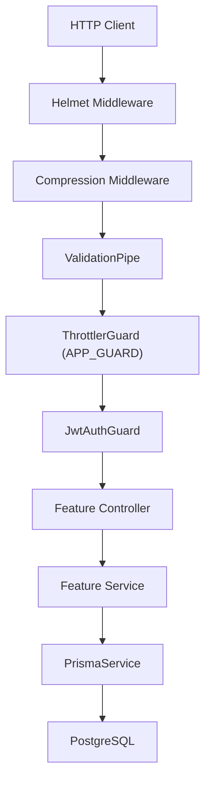
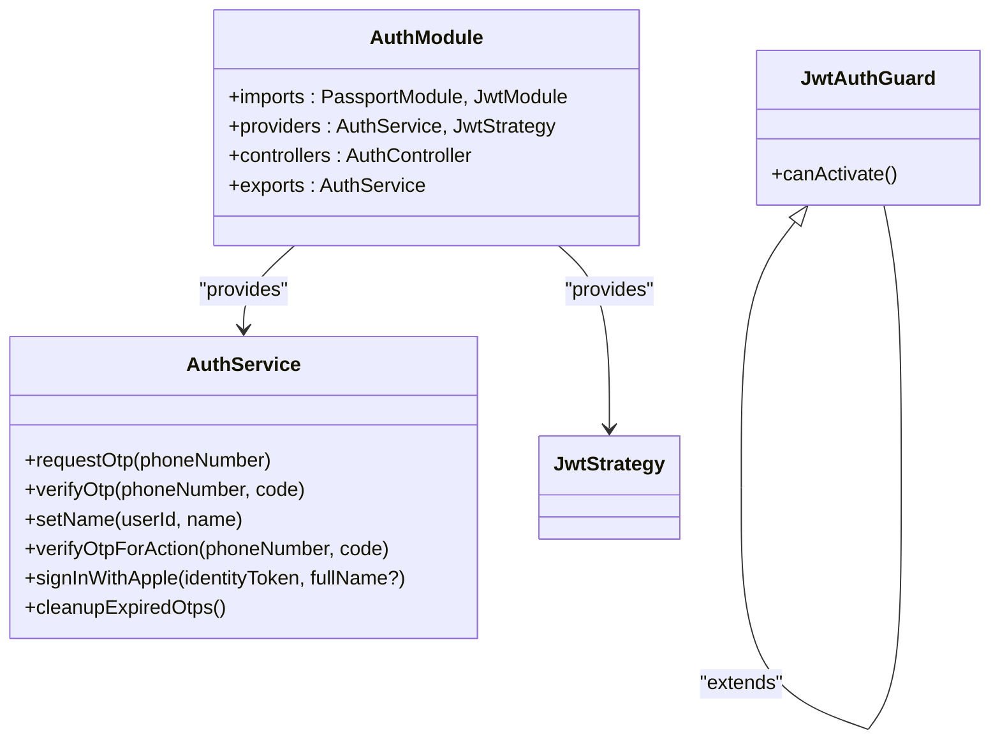
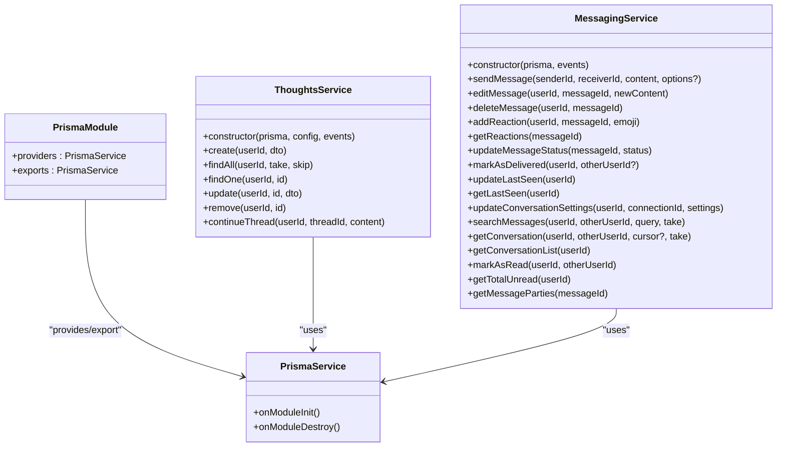
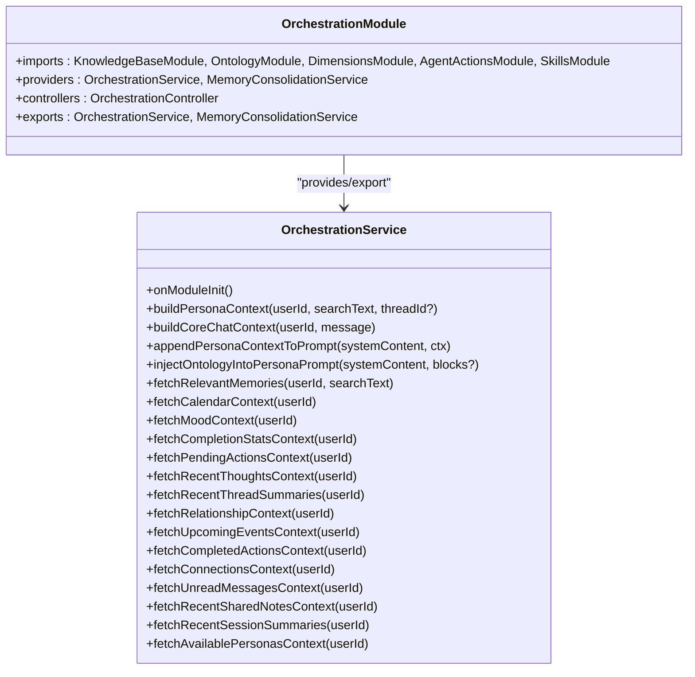
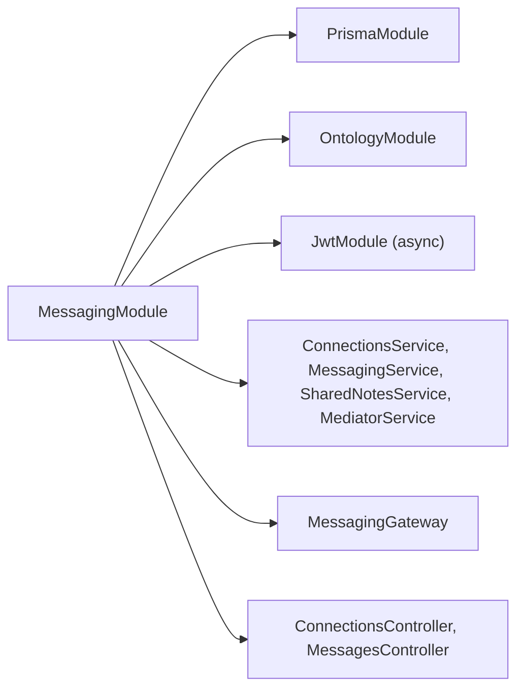
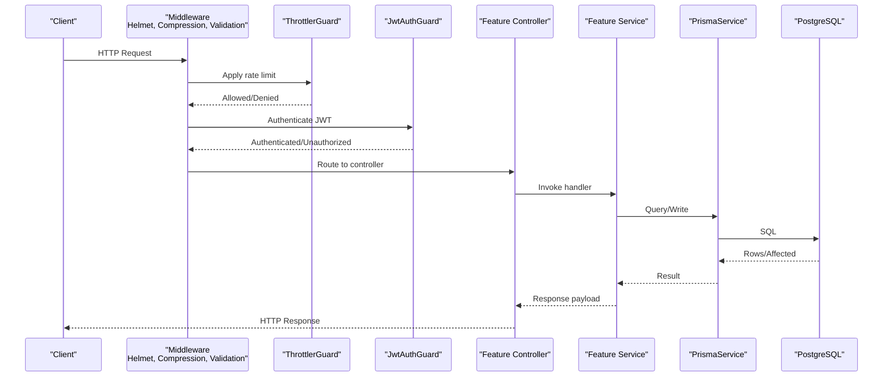
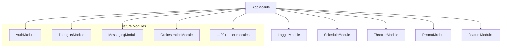

# Backend Architecture

<cite>
**Referenced Files in This Document**
- [main.ts](file://backend/src/main.ts)
- [app.module.ts](file://backend/src/app.module.ts)
- [package.json](file://backend/package.json)
- [auth.module.ts](file://backend/src/auth/auth.module.ts)
- [jwt-auth.guard.ts](file://backend/src/auth/jwt-auth.guard.ts)
- [auth.service.ts](file://backend/src/auth/auth.service.ts)
- [prisma.module.ts](file://backend/src/prisma/prisma.module.ts)
- [prisma.service.ts](file://backend/src/prisma/prisma.service.ts)
- [thoughts.module.ts](file://backend/src/thoughts/thoughts.module.ts)
- [thoughts.service.ts](file://backend/src/thoughts/thoughts.service.ts)
- [messaging.module.ts](file://backend/src/messaging/messaging.module.ts)
- [messaging.service.ts](file://backend/src/messaging/messaging.service.ts)
- [orchestration.module.ts](file://backend/src/orchestration/orchestration.module.ts)
- [orchestration.service.ts](file://backend/src/orchestration/orchestration.service.ts)
- [sentry-exception.filter.ts](file://backend/src/common/sentry-exception.filter.ts)
- [sentry.ts](file://backend/src/sentry.ts)
</cite>

## Table of Contents
1. [Introduction](#introduction)
2. [Project Structure](#project-structure)
3. [Core Components](#core-components)
4. [Architecture Overview](#architecture-overview)
5. [Detailed Component Analysis](#detailed-component-analysis)
6. [Dependency Analysis](#dependency-analysis)
7. [Performance Considerations](#performance-considerations)
8. [Troubleshooting Guide](#troubleshooting-guide)
9. [Conclusion](#conclusion)

## Introduction
This document describes the backend architecture of the 4Ever NestJS application as a modular monolith. The system comprises 25+ feature modules orchestrated by a central AppModule, with a clear separation between HTTP controllers, service layers, and repositories backed by Prisma. Cross-cutting concerns include structured logging with Pino, security middleware (Helmet, Compression), rate limiting (Throttler), global validation, Sentry error reporting, and graceful shutdown hooks. The request lifecycle flows from Nest’s HTTP layer through guards and interceptors to controllers, services, and finally to the Prisma repository pattern.

## Project Structure
The backend follows a feature-based module organization under backend/src. Each feature module encapsulates its own controllers, services, DTOs, and supporting utilities. A central AppModule imports all feature modules and registers global infrastructure such as logging, scheduling, throttling, and database access.

```mermaid
graph TB
subgraph "Runtime"
Main["main.ts<br/>Bootstrap"]
AppModule["AppModule<br/>imports all feature modules"]
end
subgraph "Feature Modules"
Auth["AuthModule"]
Users["UsersModule"]
Thoughts["ThoughtsModule"]
Personas["PersonasModule"]
Orchestration["OrchestrationModule"]
Insights["InsightsModule"]
Planner["PlannerModule"]
CheckIn["CheckInModule"]
Actions["ActionsModule"]
Reflections["ReflectionsModule"]
KB["KnowledgeBaseModule"]
Relationships["RelationshipsModule"]
Rituals["RitualsModule"]
LifeEvents["LifeEventsModule"]
Tensions["TensionsModule"]
Dimensions["DimensionsModule"]
Messaging["MessagingModule"]
KWorker["KnowledgeWorkerModule"]
Admin["AdminModule"]
Usage["UsageModule"]
Consent["ConsentModule"]
Health["HealthModule"]
Support["SupportModule"]
AgentActions["AgentActionsModule"]
end
subgraph "Infrastructure"
Prisma["PrismaModule<br/>PrismaService"]
Pino["LoggerModule (Pino)"]
Throttler["ThrottlerModule"]
Schedule["ScheduleModule"]
end
Main --> AppModule
AppModule --> Auth
AppModule --> Users
AppModule --> Thoughts
AppModule --> Personas
AppModule --> Orchestration
AppModule --> Insights
AppModule --> Planner
AppModule --> CheckIn
AppModule --> Actions
AppModule --> Reflections
AppModule --> KB
AppModule --> Relationships
AppModule --> Rituals
AppModule --> LifeEvents
AppModule --> Tensions
AppModule --> Dimensions
AppModule --> Messaging
AppModule --> KWorker
AppModule --> Admin
AppModule --> Usage
AppModule --> Consent
AppModule --> Health
AppModule --> Support
AppModule --> AgentActions
AppModule --> Prisma
AppModule --> Pino
AppModule --> Throttler
AppModule --> Schedule
```

**Diagram sources**
- [main.ts:24-131](file://backend/src/main.ts#L24-L131)
- [app.module.ts:34-171](file://backend/src/app.module.ts#L34-L171)

**Section sources**
- [main.ts:1-143](file://backend/src/main.ts#L1-L143)
- [app.module.ts:1-172](file://backend/src/app.module.ts#L1-L172)

## Core Components
- AppModule orchestrates all modules, registers global logging (Pino), scheduling, throttling, and imports PrismaModule. It also sets the global prefix and registers the global throttling guard.
- main.ts initializes Sentry, swaps Nest’s default logger for Pino, applies Helmet and Compression, configures CORS, ValidationPipe, global filters, static assets, and graceful shutdown hooks.
- PrismaModule provides a globally available PrismaService that connects/disconnects on module lifecycle events.
- Feature modules expose controllers and services; many export services for reuse by other modules.

Key configuration highlights:
- Logging: LoggerModule with Pino, redaction, lean serializers, correlation IDs, and auto-logging exclusions.
- Security: Helmet with CSP report-only and cross-origin resource policy; Compression with SSE exclusion; body size limits; CORS enforcement.
- Rate limiting: Named throttler buckets (default, auth_short, auth_long) registered globally.
- Validation: Global ValidationPipe with whitelisting and transformation.
- Error handling: Global SentryExceptionFilter captures 5xx errors and forwards to Sentry.

**Section sources**
- [app.module.ts:34-171](file://backend/src/app.module.ts#L34-L171)
- [main.ts:24-131](file://backend/src/main.ts#L24-L131)
- [prisma.module.ts:1-10](file://backend/src/prisma/prisma.module.ts#L1-L10)
- [prisma.service.ts:1-14](file://backend/src/prisma/prisma.service.ts#L1-L14)

## Architecture Overview
The system adheres to NestJS modular monolith best practices:
- Feature modules encapsulate domain logic.
- Services depend on PrismaService for persistence.
- Controllers handle HTTP concerns and delegate to services.
- Guards and interceptors apply cross-cutting policies (authentication, rate limiting).
- Global middleware enforces security and performance policies.

**Diagram sources**
- [main.ts:37-98](file://backend/src/main.ts#L37-L98)
- [app.module.ts:164-169](file://backend/src/app.module.ts#L164-L169)
- [jwt-auth.guard.ts:1-6](file://backend/src/auth/jwt-auth.guard.ts#L1-L6)

## Detailed Component Analysis

### Authentication and Authorization
- AuthModule configures Passport JWT strategy and JWT signing parameters from environment variables with strict validation.
- JwtAuthGuard integrates with Passport to protect routes.
- AuthService coordinates OTP issuance and verification, Apple Sign-In, and scheduled cleanup of expired OTPs.

**Diagram sources**
- [auth.module.ts:9-39](file://backend/src/auth/auth.module.ts#L9-L39)
- [auth.service.ts:8-340](file://backend/src/auth/auth.service.ts#L8-L340)
- [jwt-auth.guard.ts:1-6](file://backend/src/auth/jwt-auth.guard.ts#L1-L6)

**Section sources**
- [auth.module.ts:1-40](file://backend/src/auth/auth.module.ts#L1-L40)
- [jwt-auth.guard.ts:1-6](file://backend/src/auth/jwt-auth.guard.ts#L1-L6)
- [auth.service.ts:1-340](file://backend/src/auth/auth.service.ts#L1-L340)

### Prisma Repository Pattern
- PrismaModule is global and exports PrismaService.
- PrismaService extends PrismaClient and implements lifecycle hooks to connect and disconnect.
- Feature services depend on PrismaService for data access.

**Diagram sources**
- [prisma.module.ts:1-10](file://backend/src/prisma/prisma.module.ts#L1-L10)
- [prisma.service.ts:1-14](file://backend/src/prisma/prisma.service.ts#L1-L14)
- [thoughts.service.ts:1-189](file://backend/src/thoughts/thoughts.service.ts#L1-L189)
- [messaging.service.ts:1-647](file://backend/src/messaging/messaging.service.ts#L1-L647)

**Section sources**
- [prisma.module.ts:1-10](file://backend/src/prisma/prisma.module.ts#L1-L10)
- [prisma.service.ts:1-14](file://backend/src/prisma/prisma.service.ts#L1-L14)
- [thoughts.service.ts:1-189](file://backend/src/thoughts/thoughts.service.ts#L1-L189)
- [messaging.service.ts:1-647](file://backend/src/messaging/messaging.service.ts#L1-L647)

### Orchestration and AI-Driven Workflows
- OrchestrationModule composes knowledge base, ontology, dimensions, agent actions, and skills into a unified orchestration service.
- OrchestrationService builds contextual prompts for persona and core chat workflows, manages memory consolidation, and coordinates AI tools and agents.

**Diagram sources**
- [orchestration.module.ts:1-18](file://backend/src/orchestration/orchestration.module.ts#L1-L18)
- [orchestration.service.ts:23-800](file://backend/src/orchestration/orchestration.service.ts#L23-L800)

**Section sources**
- [orchestration.module.ts:1-18](file://backend/src/orchestration/orchestration.module.ts#L1-L18)
- [orchestration.service.ts:1-800](file://backend/src/orchestration/orchestration.service.ts#L1-L800)

### Messaging Module Dependencies
- MessagingModule imports PrismaModule and OntologyModule, registers JWT for tokenized contexts, and exposes services for connections, messaging, shared notes, mediator, and a WebSocket gateway.

**Diagram sources**
- [messaging.module.ts:14-36](file://backend/src/messaging/messaging.module.ts#L14-L36)

**Section sources**
- [messaging.module.ts:1-37](file://backend/src/messaging/messaging.module.ts#L1-L37)

### Request Lifecycle: From HTTP to Repository
This sequence illustrates the canonical path for a request in the 4Ever backend.

**Diagram sources**
- [main.ts:37-98](file://backend/src/main.ts#L37-L98)
- [app.module.ts:164-169](file://backend/src/app.module.ts#L164-L169)
- [jwt-auth.guard.ts:1-6](file://backend/src/auth/jwt-auth.guard.ts#L1-L6)
- [thoughts.service.ts:22-60](file://backend/src/thoughts/thoughts.service.ts#L22-L60)
- [prisma.service.ts:6-12](file://backend/src/prisma/prisma.service.ts#L6-L12)

## Dependency Analysis
- AppModule aggregates all feature modules and global infrastructure. It registers:
  - LoggerModule (Pino) for structured logging with redaction and correlation IDs.
  - ScheduleModule for cron-based jobs.
  - ThrottlerModule with named buckets for global and auth-specific limits.
  - PrismaModule for database access.
- Feature modules declare internal dependencies and export services for inter-module reuse.
- main.ts configures middleware stack and global filters prior to application listen.

**Diagram sources**
- [app.module.ts:34-171](file://backend/src/app.module.ts#L34-L171)

**Section sources**
- [app.module.ts:1-172](file://backend/src/app.module.ts#L1-L172)
- [main.ts:1-143](file://backend/src/main.ts#L1-L143)

## Performance Considerations
- Compression excludes Server-Sent Events to preserve streaming semantics.
- ValidationPipe enforces DTO-based input sanitization and transformation.
- ThrottlerModule uses named buckets to layer multiple rate limits (e.g., short-window and long-window).
- MessagingService optimizes conversation lists with a single-pass query and grouped unread counts to keep N+1 queries at bay.
- OrchestrationService performs parallel context fetches and resilient fallbacks to minimize latency and improve reliability.

[No sources needed since this section provides general guidance]

## Troubleshooting Guide
- Sentry initialization occurs before any other imports to capture early bootstrap failures. The global exception filter forwards 5xx errors to Sentry while preserving Nest’s default error response shape.
- Pino redacts sensitive fields (tokens, passwords, phone numbers) and logs only lean request/response metadata. Auto-logging excludes health probes to reduce noise.
- CORS requires explicit origins in production to prevent wildcard exposure.

**Section sources**
- [main.ts:22-28](file://backend/src/main.ts#L22-L28)
- [main.ts:90-93](file://backend/src/main.ts#L90-L93)
- [main.ts:113-122](file://backend/src/main.ts#L113-L122)
- [sentry-exception.filter.ts:21-63](file://backend/src/common/sentry-exception.filter.ts#L21-L63)
- [sentry.ts:14-50](file://backend/src/sentry.ts#L14-L50)
- [app.module.ts:48-124](file://backend/src/app.module.ts#L48-L124)

## Conclusion
The 4Ever backend employs a robust modular monolith architecture with clear separation of concerns, comprehensive cross-cutting services (logging, security, rate limiting, error reporting), and a pragmatic Prisma-backed repository pattern. The central AppModule orchestrates 25+ feature modules, while main.ts establishes a secure, observable, and resilient runtime environment. This design supports scalability, maintainability, and operational excellence across diverse feature domains such as thoughts, messaging, orchestration, and AI-driven workflows.