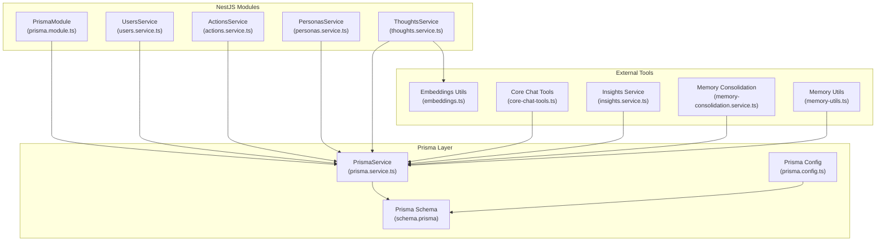
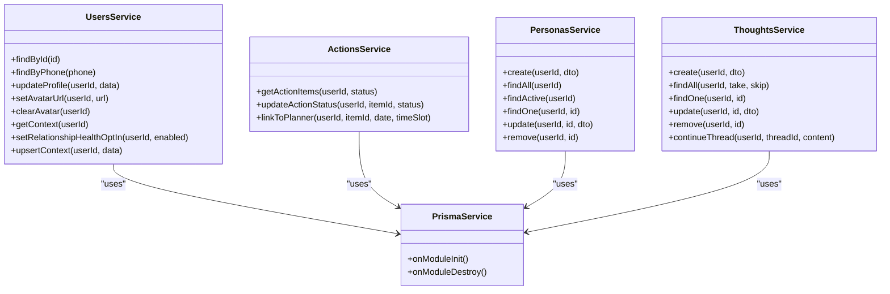
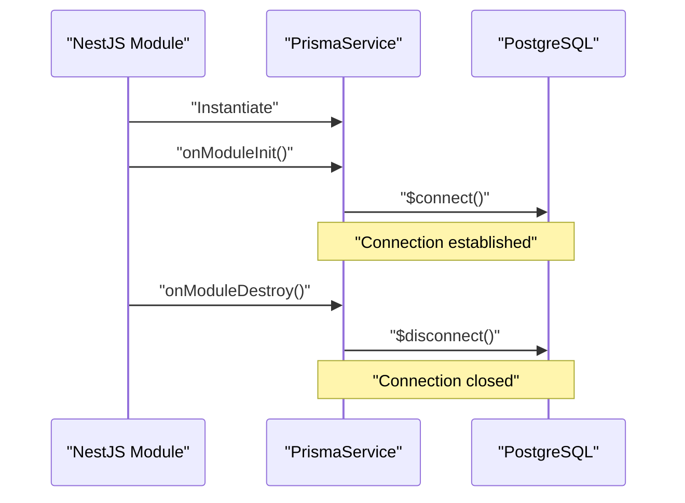
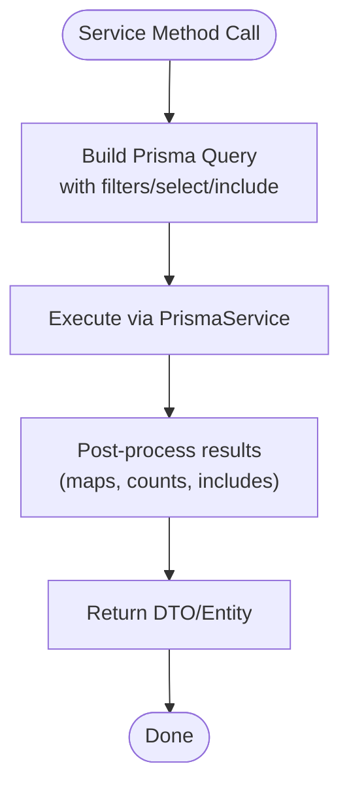
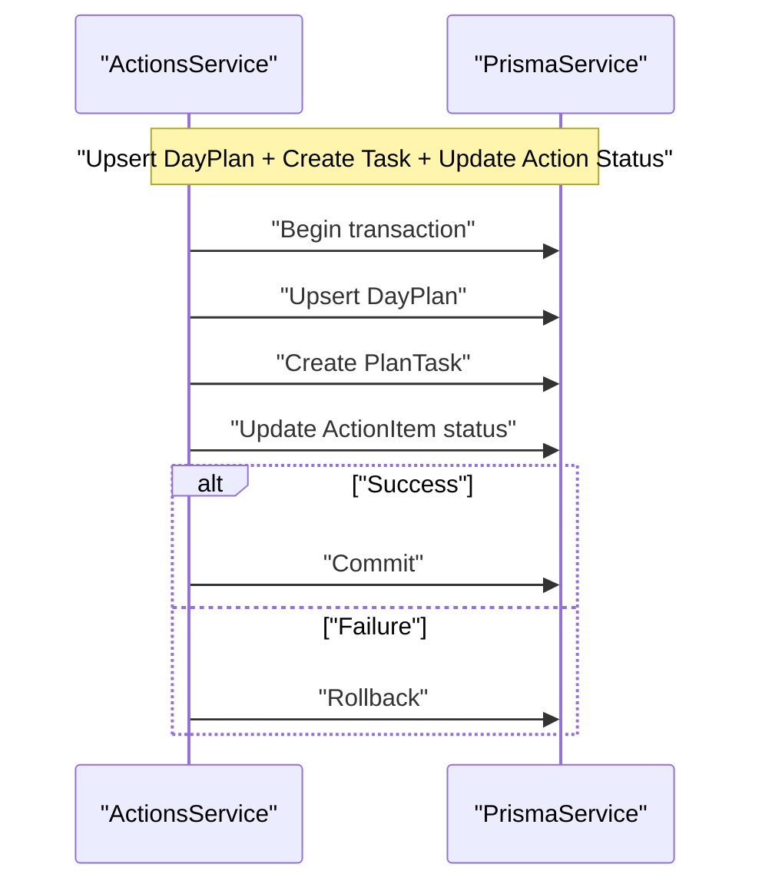
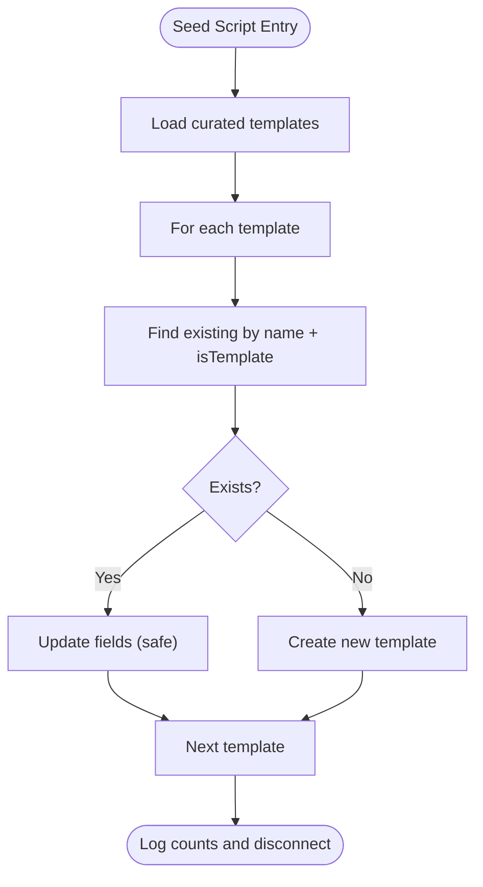
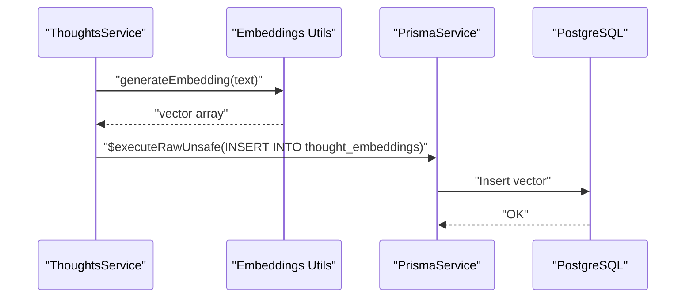

# Data Access Layer & Prisma Integration

<cite>
**Referenced Files in This Document**
- [schema.prisma](file://backend/prisma/schema.prisma)
- [prisma.module.ts](file://backend/src/prisma/prisma.module.ts)
- [prisma.service.ts](file://backend/src/prisma/prisma.service.ts)
- [prisma.config.ts](file://backend/prisma.config.ts)
- [seed-persona-templates.ts](file://backend/scripts/seed-persona-templates.ts)
- [list-users.js](file://backend/list-users.js)
- [users.service.ts](file://backend/src/users/users.service.ts)
- [actions.service.ts](file://backend/src/actions/actions.service.ts)
- [personas.service.ts](file://backend/src/personas/personas.service.ts)
- [thoughts.service.ts](file://backend/src/thoughts/thoughts.service.ts)
- [embeddings.ts](file://backend/src/orchestration/graph/utils/embeddings.ts)
- [memory-utils.ts](file://backend/src/orchestration/graph/utils/memory-utils.ts)
- [core-chat-tools.ts](file://backend/src/orchestration/graph/tools/core-chat-tools.ts)
- [insights.service.ts](file://backend/src/insights/insights.service.ts)
- [memory-consolidation.service.ts](file://backend/src/orchestration/memory-consolidation.service.ts)
- [PRIVACY.md](file://docs/PRIVACY.md)
- [SECURITY.md](file://docs/SECURITY.md)
</cite>

## Table of Contents
1. [Introduction](#introduction)
2. [Project Structure](#project-structure)
3. [Core Components](#core-components)
4. [Architecture Overview](#architecture-overview)
5. [Detailed Component Analysis](#detailed-component-analysis)
6. [Dependency Analysis](#dependency-analysis)
7. [Performance Considerations](#performance-considerations)
8. [Troubleshooting Guide](#troubleshooting-guide)
9. [Conclusion](#conclusion)
10. [Appendices](#appendices)

## Introduction
This document describes the data access layer architecture powered by Prisma ORM. It covers Prisma module configuration, database connection lifecycle, service-layer abstractions, repository-style patterns, transaction handling, database seeding, schema design with vector embeddings for semantic search, indexing strategies, client configuration, migration management, validation and error handling, performance optimization, and security considerations.

## Project Structure
The data access layer is organized around a NestJS module that exposes a globally available Prisma client, with services acting as repositories and orchestrators for domain logic. Prisma schema defines the database model and indexes, while scripts handle seeding and ad-hoc queries.



**Diagram sources**
- [prisma.module.ts:1-10](file://backend/src/prisma/prisma.module.ts#L1-L10)
- [prisma.service.ts:1-14](file://backend/src/prisma/prisma.service.ts#L1-L14)
- [prisma.config.ts:1-15](file://backend/prisma.config.ts#L1-L15)
- [schema.prisma:1-838](file://backend/prisma/schema.prisma#L1-L838)
- [users.service.ts:1-210](file://backend/src/users/users.service.ts#L1-L210)
- [actions.service.ts:1-148](file://backend/src/actions/actions.service.ts#L1-L148)
- [personas.service.ts:1-105](file://backend/src/personas/personas.service.ts#L1-L105)
- [thoughts.service.ts:1-189](file://backend/src/thoughts/thoughts.service.ts#L1-L189)
- [embeddings.ts](file://backend/src/orchestration/graph/utils/embeddings.ts)
- [memory-utils.ts](file://backend/src/orchestration/graph/utils/memory-utils.ts)
- [core-chat-tools.ts](file://backend/src/orchestration/graph/tools/core-chat-tools.ts)
- [insights.service.ts](file://backend/src/insights/insights.service.ts)
- [memory-consolidation.service.ts](file://backend/src/orchestration/memory-consolidation.service.ts)

**Section sources**
- [prisma.module.ts:1-10](file://backend/src/prisma/prisma.module.ts#L1-L10)
- [prisma.service.ts:1-14](file://backend/src/prisma/prisma.service.ts#L1-L14)
- [prisma.config.ts:1-15](file://backend/prisma.config.ts#L1-L15)
- [schema.prisma:1-838](file://backend/prisma/schema.prisma#L1-L838)

## Core Components
- PrismaModule: Registers PrismaService as a singleton and exports it for injection across the application.
- PrismaService: Extends PrismaClient and manages lifecycle via NestJS hooks to connect/disconnect on module init/shutdown.
- Prisma Schema: Defines models, relations, indexes, and PostgreSQL vector extension usage for embeddings.
- Prisma Config: Centralizes schema and migrations paths and reads DATABASE_URL from environment.
- Services as Repositories: UsersService, ActionsService, PersonasService, and ThoughtsService encapsulate CRUD and complex queries behind domain-facing methods.

**Section sources**
- [prisma.module.ts:1-10](file://backend/src/prisma/prisma.module.ts#L1-L10)
- [prisma.service.ts:1-14](file://backend/src/prisma/prisma.service.ts#L1-L14)
- [prisma.config.ts:1-15](file://backend/prisma.config.ts#L1-L15)
- [schema.prisma:1-838](file://backend/prisma/schema.prisma#L1-L838)
- [users.service.ts:18-24](file://backend/src/users/users.service.ts#L18-L24)
- [actions.service.ts:7-12](file://backend/src/actions/actions.service.ts#L7-L12)
- [personas.service.ts:6-8](file://backend/src/personas/personas.service.ts#L6-L8)
- [thoughts.service.ts:10-20](file://backend/src/thoughts/thoughts.service.ts#L10-L20)

## Architecture Overview
The architecture follows a layered pattern:
- NestJS services act as repositories and orchestrators.
- PrismaService provides a typed client with lifecycle management.
- Embedding generation uses raw SQL for vector columns.
- Indexes and relations are defined in Prisma schema to support performance and referential integrity.



**Diagram sources**
- [prisma.service.ts:1-14](file://backend/src/prisma/prisma.service.ts#L1-L14)
- [users.service.ts:18-209](file://backend/src/users/users.service.ts#L18-L209)
- [actions.service.ts:7-147](file://backend/src/actions/actions.service.ts#L7-L147)
- [personas.service.ts:6-104](file://backend/src/personas/personas.service.ts#L6-L104)
- [thoughts.service.ts:10-188](file://backend/src/thoughts/thoughts.service.ts#L10-L188)

## Detailed Component Analysis

### PrismaModule and PrismaService
- PrismaModule is global and exports PrismaService for dependency injection across the app.
- PrismaService extends PrismaClient and connects during module initialization and disconnects on shutdown.



**Diagram sources**
- [prisma.module.ts:4-8](file://backend/src/prisma/prisma.module.ts#L4-L8)
- [prisma.service.ts:5-12](file://backend/src/prisma/prisma.service.ts#L5-L12)

**Section sources**
- [prisma.module.ts:1-10](file://backend/src/prisma/prisma.module.ts#L1-L10)
- [prisma.service.ts:1-14](file://backend/src/prisma/prisma.service.ts#L1-L14)

### Database Schema and Vector Embeddings
- The schema defines models for users, thoughts, threads, memories, personas, and related entities.
- Vector embeddings are modeled for memories and thoughts using PostgreSQL vector extension:
  - MemoryEmbedding with vector(1536)
  - ThoughtEmbedding with vector(1536)
  - DocumentChunk with vector(1536) managed outside Prisma via raw SQL in migrations
- Indexes are strategically placed to accelerate frequent queries (e.g., user-scoped lookups, timestamps, composite keys).

```mermaid
erDiagram
USER ||--o{ THOUGHT : "has"
USER ||--o{ MEMORY : "has"
USER ||--o{ ACTION_ITEM : "has"
USER ||--o{ CORE_CHAT_MESSAGE : "has"
USER ||--o{ DIMENSION_RATING : "has"
USER ||--o{ DIMENSION_SIGNAL : "has"
USER ||--o{ RELATIONSHIP_PERSON : "has"
USER ||--o{ CONNECTION : "requests/sends"
USER ||--o{ DIRECT_MESSAGE : "sends/receives"
USER ||--o{ SHARED_NOTE : "authored"
USER ||--o{ MESSAGE_REACTION : "gives"
USER ||--o{ CORE_CHAT_SUMMARY : "has"
USER ||--o{ PROFILE_CHANGE_LOG : "has"
USER ||--o{ KW_CONVERSATION : "has"
USER ||--o{ KW_DOCUMENT : "owns"
USER ||--o{ LLM_USAGE : "generates"
USER ||--o{ CONSENT : "provides"
THOUGHT }o--|| THOUGHT_THREAD : "contains"
THOUGHT ||--o| THOUGHT_EMBEDDING : "has"
MEMORY ||--o| MEMORY_EMBEDDING : "has"
PERSONA ||--o{ PERSONA_RUN : "produces"
PERSONA ||--o{ PERSONA_CHAT_MESSAGE : "participates"
PERSONA_DOCUMENT ||--o{ DOCUMENT_CHUNK : "chunks"
```



**Diagram sources**
- [schema.prisma:12-838](file://backend/prisma/schema.prisma#L12-L838)

**Section sources**
- [schema.prisma:193-227](file://backend/prisma/schema.prisma#L193-L227)
- [schema.prisma:764-767](file://backend/prisma/schema.prisma#L764-L767)

### Repository Pattern Implementation
- Services encapsulate repository-like methods:
  - UsersService: user lookup, profile updates, avatar management, context upsert, subscription helpers.
  - ActionsService: action item retrieval with related data preloading, status updates, planner linkage.
  - PersonasService: CRUD for personas with template/library separation.
  - ThoughtsService: thought lifecycle, thread creation, embedding generation via raw SQL.
- These services depend on PrismaService for database operations and coordinate domain events.



**Diagram sources**
- [users.service.ts:26-32](file://backend/src/users/users.service.ts#L26-L32)
- [actions.service.ts:23-70](file://backend/src/actions/actions.service.ts#L23-L70)
- [personas.service.ts:10-36](file://backend/src/personas/personas.service.ts#L10-L36)
- [thoughts.service.ts:22-60](file://backend/src/thoughts/thoughts.service.ts#L22-L60)

**Section sources**
- [users.service.ts:18-209](file://backend/src/users/users.service.ts#L18-L209)
- [actions.service.ts:7-147](file://backend/src/actions/actions.service.ts#L7-L147)
- [personas.service.ts:6-104](file://backend/src/personas/personas.service.ts#L6-L104)
- [thoughts.service.ts:10-188](file://backend/src/thoughts/thoughts.service.ts#L10-L188)

### Transaction Handling
- Transactions are not explicitly used in the examined services. Operations that require atomicity (e.g., planner linkage) are implemented as multiple coordinated queries without explicit transaction blocks.
- For critical multi-step operations, wrap calls with PrismaClient transaction APIs to ensure rollback on failure.



**Diagram sources**
- [actions.service.ts:102-146](file://backend/src/actions/actions.service.ts#L102-L146)

**Section sources**
- [actions.service.ts:102-146](file://backend/src/actions/actions.service.ts#L102-L146)

### Database Seeding Strategies
- Seed script for persona templates demonstrates idempotent upserts keyed by name and template flag.
- The script iterates entries, checks existence, and either updates or creates rows, then disconnects cleanly.



**Diagram sources**
- [seed-persona-templates.ts:90-139](file://backend/scripts/seed-persona-templates.ts#L90-L139)

**Section sources**
- [seed-persona-templates.ts:1-140](file://backend/scripts/seed-persona-templates.ts#L1-L140)

### Embedding Generation and Semantic Search
- Thought embeddings are generated asynchronously after thought creation and inserted via raw SQL to populate the vector column.
- Memory embeddings and document chunks leverage vector extension columns defined in migrations.
- Embedding utilities and memory utilities integrate with services to support similarity search and consolidation.



**Diagram sources**
- [thoughts.service.ts:66-81](file://backend/src/thoughts/thoughts.service.ts#L66-L81)
- [embeddings.ts](file://backend/src/orchestration/graph/utils/embeddings.ts)
- [schema.prisma:193-227](file://backend/prisma/schema.prisma#L193-L227)

**Section sources**
- [thoughts.service.ts:22-81](file://backend/src/thoughts/thoughts.service.ts#L22-L81)
- [schema.prisma:193-227](file://backend/prisma/schema.prisma#L193-L227)
- [schema.prisma:764-767](file://backend/prisma/schema.prisma#L764-L767)

### Indexing Strategies
- Composite unique indexes on user-scoped entities (e.g., DayPlan, DailyCheckIn).
- Timestamp-based indexes for chronological queries (e.g., CoreChatMessage, CoreChatSummary).
- Multi-column indexes for filtering and ordering (e.g., OntologyEvent, DimensionRating).
- Indexes on foreign keys and frequently filtered columns to reduce query cost.

**Section sources**
- [schema.prisma:239-241](file://backend/prisma/schema.prisma#L239-L241)
- [schema.prisma:269-273](file://backend/prisma/schema.prisma#L269-L273)
- [schema.prisma:357-359](file://backend/prisma/schema.prisma#L357-L359)
- [schema.prisma:680-683](file://backend/prisma/schema.prisma#L680-L683)
- [schema.prisma:378-381](file://backend/prisma/schema.prisma#L378-L381)

### Prisma Client Configuration and Migration Management
- Prisma config defines schema path, migrations path, and reads DATABASE_URL from environment.
- Migrations are managed under prisma/migrations; the schema declares vector extension and indexes.
- Ad-hoc scripts demonstrate direct PrismaClient usage for quick tasks.

**Section sources**
- [prisma.config.ts:6-14](file://backend/prisma.config.ts#L6-L14)
- [schema.prisma:1-10](file://backend/prisma/schema.prisma#L1-L10)
- [list-users.js:1-14](file://backend/list-users.js#L1-L14)

### Data Validation Patterns and Error Handling
- Services validate inputs and enforce access control:
  - PersonasService throws forbidden errors for template edits/deletes.
  - ActionsService throws not-found errors when resources are missing.
- Embedding generation is fire-and-forget with try/catch to avoid blocking.
- UsageService integration provides graceful fallbacks for quota computation.

**Section sources**
- [personas.service.ts:70-96](file://backend/src/personas/personas.service.ts#L70-L96)
- [actions.service.ts:77-81](file://backend/src/actions/actions.service.ts#L77-L81)
- [thoughts.service.ts:66-81](file://backend/src/thoughts/thoughts.service.ts#L66-L81)
- [users.service.ts:56-68](file://backend/src/users/users.service.ts#L56-L68)

### Raw SQL and Advanced Queries
- Services use $queryRawUnsafe/$executeRawUnsafe for:
  - Embedding insertions into vector columns.
  - Aggregation and analytics in InsightsService.
  - Memory consolidation and similarity matching.
- These operations bypass Prisma typing for specialized features but remain within the service boundary.

**Section sources**
- [thoughts.service.ts:72-77](file://backend/src/thoughts/thoughts.service.ts#L72-L77)
- [insights.service.ts:40, 61, 85, 119, 127, 135, 144, 180, 363:40-40](file://backend/src/insights/insights.service.ts#L40-L40)
- [core-chat-tools.ts:89, 364, 857, 1634, 1640, 2456, 2477, 2504:89-89](file://backend/src/orchestration/graph/tools/core-chat-tools.ts#L89-L89)
- [memory-consolidation.service.ts:42, 148:42-42](file://backend/src/orchestration/memory-consolidation.service.ts#L42-L42)
- [memory-utils.ts:45, 85, 112, 167:45-45](file://backend/src/orchestration/graph/utils/memory-utils.ts#L45-L45)

## Dependency Analysis
- Coupling: Services depend on PrismaService; few cross-service dependencies reduce coupling.
- Cohesion: Each service encapsulates a bounded context (users, actions, personas, thoughts).
- External dependencies: Embeddings utilities, memory utilities, and core chat tools integrate with services for advanced features.

```mermaid
graph LR
PRISMA["PrismaService"] <- --> SCHEMA["Schema Models"]
USERS["UsersService"] --> PRISMA
ACTIONS["ActionsService"] --> PRISMA
PERSONAS["PersonasService"] --> PRISMA
THOUGHTS["ThoughtsService"] --> PRISMA
THOUGHTS --> EMB["Embeddings Utils"]
CORETOOLS["Core Chat Tools"] --> PRISMA
INSIGHTS["Insights Service"] --> PRISMA
MCORE["Memory Consolidation"] --> PRISMA
MEMUTIL["Memory Utils"] --> PRISMA
```

**Diagram sources**
- [prisma.service.ts:1-14](file://backend/src/prisma/prisma.service.ts#L1-L14)
- [schema.prisma:12-838](file://backend/prisma/schema.prisma#L12-L838)
- [users.service.ts:18-209](file://backend/src/users/users.service.ts#L18-L209)
- [actions.service.ts:7-147](file://backend/src/actions/actions.service.ts#L7-L147)
- [personas.service.ts:6-104](file://backend/src/personas/personas.service.ts#L6-L104)
- [thoughts.service.ts:10-188](file://backend/src/thoughts/thoughts.service.ts#L10-L188)
- [embeddings.ts](file://backend/src/orchestration/graph/utils/embeddings.ts)
- [core-chat-tools.ts](file://backend/src/orchestration/graph/tools/core-chat-tools.ts)
- [insights.service.ts](file://backend/src/insights/insights.service.ts)
- [memory-consolidation.service.ts](file://backend/src/orchestration/memory-consolidation.service.ts)
- [memory-utils.ts](file://backend/src/orchestration/graph/utils/memory-utils.ts)

**Section sources**
- [users.service.ts:18-209](file://backend/src/users/users.service.ts#L18-L209)
- [actions.service.ts:7-147](file://backend/src/actions/actions.service.ts#L7-L147)
- [personas.service.ts:6-104](file://backend/src/personas/personas.service.ts#L6-L104)
- [thoughts.service.ts:10-188](file://backend/src/thoughts/thoughts.service.ts#L10-L188)

## Performance Considerations
- Prefer selective projections and include only required relations to minimize payload size.
- Use indexes on frequently filtered columns and composite keys for user-scoped queries.
- Batch related data fetching (e.g., preloading threads and personas) to avoid N+1 queries.
- Offload embedding generation to fire-and-forget tasks to keep request paths responsive.
- Use pagination and limits for large result sets.
- Leverage vector indexes and similarity search for semantic retrieval.

[No sources needed since this section provides general guidance]

## Troubleshooting Guide
- Connection lifecycle: Ensure PrismaService connects on module init and disconnects on destroy.
- Embedding failures: Catch and log errors during embedding generation; verify vector extension availability.
- Not found errors: Validate resource ownership and existence before mutating.
- Quota and subscription lookups: Gracefully handle upstream service errors and return defaults.

**Section sources**
- [prisma.service.ts:5-12](file://backend/src/prisma/prisma.service.ts#L5-L12)
- [thoughts.service.ts:66-81](file://backend/src/thoughts/thoughts.service.ts#L66-L81)
- [personas.service.ts:56-96](file://backend/src/personas/personas.service.ts#L56-L96)
- [users.service.ts:56-68](file://backend/src/users/users.service.ts#L56-L68)

## Conclusion
The data access layer leverages Prisma ORM with a clean service/repository abstraction, robust schema design with vector embeddings, and pragmatic use of raw SQL for specialized features. Lifecycle management, indexing, and modular services enable scalability and maintainability while supporting advanced capabilities like semantic search and analytics.

[No sources needed since this section summarizes without analyzing specific files]

## Appendices

### Security and Privacy Considerations
- Data classification: Identify sensitive attributes (e.g., phone numbers, emails) and apply least-privilege access controls.
- Encryption: Enforce transport encryption and consider at-rest encryption for sensitive data.
- Compliance: Align data retention, deletion requests, and consent management with privacy policies and regulations.
- Logging: Avoid logging sensitive data; sanitize logs for production environments.

**Section sources**
- [PRIVACY.md](file://docs/PRIVACY.md)
- [SECURITY.md](file://docs/SECURITY.md)