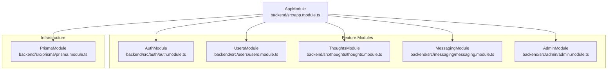
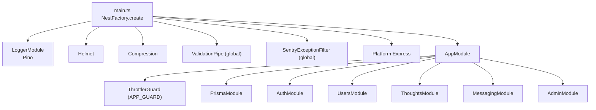
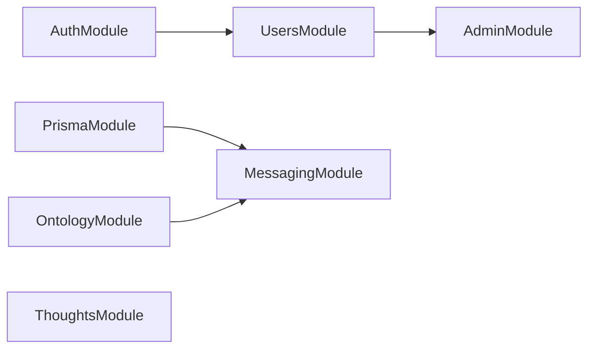
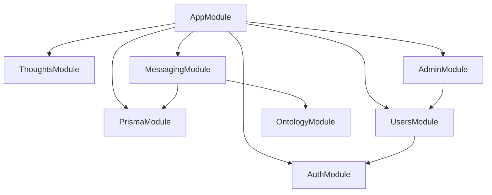

# Module Architecture & Dependency Injection

<cite>
**Referenced Files in This Document**
- [app.module.ts](file://backend/src/app.module.ts)
- [main.ts](file://backend/src/main.ts)
- [prisma.module.ts](file://backend/src/prisma/prisma.module.ts)
- [auth.module.ts](file://backend/src/auth/auth.module.ts)
- [jwt-auth.guard.ts](file://backend/src/auth/jwt-auth.guard.ts)
- [premium.guard.ts](file://backend/src/auth/premium.guard.ts)
- [admin.module.ts](file://backend/src/admin/admin.module.ts)
- [admin-secret.guard.ts](file://backend/src/admin/admin-secret.guard.ts)
- [sentry-exception.filter.ts](file://backend/src/common/sentry-exception.filter.ts)
- [thoughts.module.ts](file://backend/src/thoughts/thoughts.module.ts)
- [messaging.module.ts](file://backend/src/messaging/messaging.module.ts)
- [users.module.ts](file://backend/src/users/users.module.ts)
</cite>

## Table of Contents
1. [Introduction](#introduction)
2. [Project Structure](#project-structure)
3. [Core Components](#core-components)
4. [Architecture Overview](#architecture-overview)
5. [Detailed Component Analysis](#detailed-component-analysis)
6. [Dependency Analysis](#dependency-analysis)
7. [Performance Considerations](#performance-considerations)
8. [Troubleshooting Guide](#troubleshooting-guide)
9. [Conclusion](#conclusion)

## Introduction
This document explains the NestJS module architecture and dependency injection patterns powering the 4Ever backend. The system follows a modular monolith design with 25+ feature modules (e.g., AuthModule, ThoughtsModule, MessagingModule, PrismaModule, AdminModule) orchestrated from a central AppModule. It covers how modules import and export providers, DTOs, and controllers; how the DI container resolves dependencies; and how global guards, interceptors, and pipes integrate into the runtime. It also documents configuration patterns, circular dependency resolution strategies, lazy loading approaches, and testing practices for modules.

## Project Structure
The backend is organized around a central AppModule that aggregates feature modules. Each feature module encapsulates domain logic, DTOs, services, and controllers. Shared infrastructure (logging, database, scheduling, throttling) is configured at the top level. The main entrypoint initializes platform-wide middleware, global pipes/filters, and security policies.

**Diagram sources**
- [app.module.ts:34-163](file://backend/src/app.module.ts#L34-L163)
- [prisma.module.ts:4-9](file://backend/src/prisma/prisma.module.ts#L4-L9)
- [auth.module.ts:9-39](file://backend/src/auth/auth.module.ts#L9-L39)
- [users.module.ts:7-13](file://backend/src/users/users.module.ts#L7-L13)
- [thoughts.module.ts:5-10](file://backend/src/thoughts/thoughts.module.ts#L5-L10)
- [messaging.module.ts:14-36](file://backend/src/messaging/messaging.module.ts#L14-L36)
- [admin.module.ts:6-11](file://backend/src/admin/admin.module.ts#L6-L11)

**Section sources**
- [app.module.ts:1-172](file://backend/src/app.module.ts#L1-L172)
- [main.ts:24-131](file://backend/src/main.ts#L24-L131)

## Core Components
- Central AppModule: Declares global infrastructure (ConfigModule, LoggerModule, ScheduleModule, ThrottlerModule) and imports all feature modules. Registers a global guard (ThrottlerGuard) via APP_GUARD.
- PrismaModule: A globally provided, exported singleton service for database access.
- Feature modules: Each module declares providers (services), controllers, and optionally exports services for cross-module consumption.
- Guards and filters: Global and module-scoped guards (JwtAuthGuard, PremiumGuard, AdminSecretGuard) and a global exception filter (SentryExceptionFilter) enforce security and error reporting.

Key DI patterns:
- Providers are registered in module scopes and exported for use by other modules.
- Services are injected via constructor injection; guards and filters are resolved by the DI container.
- Global providers (APP_GUARD, ValidationPipe, SentryExceptionFilter) are registered at the application level.

**Section sources**
- [app.module.ts:34-169](file://backend/src/app.module.ts#L34-L169)
- [prisma.module.ts:4-9](file://backend/src/prisma/prisma.module.ts#L4-L9)
- [auth.module.ts:35-37](file://backend/src/auth/auth.module.ts#L35-L37)
- [messaging.module.ts:34](file://backend/src/messaging/messaging.module.ts#L34)
- [main.ts:82-93](file://backend/src/main.ts#L82-L93)

## Architecture Overview
The runtime initialization wires global middleware, security headers, compression, validation, and error handling. Feature modules contribute controllers and services, while shared modules (PrismaModule, AuthModule) are imported by multiple features.

**Diagram sources**
- [main.ts:24-131](file://backend/src/main.ts#L24-L131)
- [app.module.ts:34-169](file://backend/src/app.module.ts#L34-L169)

## Detailed Component Analysis

### AppModule and Global Configuration
- Imports and registers:
  - ConfigModule as global.
  - LoggerModule with structured logging, redaction, and correlation ID propagation.
  - ScheduleModule.forRoot().
  - ThrottlerModule.forRoot() with named buckets.
  - All feature modules.
- Providers:
  - APP_GUARD bound to ThrottlerGuard.

Operational impact:
- All modules inherit throttling behavior automatically.
- Logging pipeline is standardized and production-safe with redaction.
- Scheduling and rate limiting are centrally configured.

**Section sources**
- [app.module.ts:34-169](file://backend/src/app.module.ts#L34-L169)

### PrismaModule
- Marks the PrismaService as global and exports it for consumption by other modules.
- Ensures a single database connection/service instance across the application.

Usage pattern:
- Feature modules import PrismaModule and inject PrismaService to access the database.

**Section sources**
- [prisma.module.ts:4-9](file://backend/src/prisma/prisma.module.ts#L4-L9)

### AuthModule
- Registers Passport with jwt as default strategy.
- Configures JwtModule asynchronously using ConfigService to require a strong JWT secret and expiration.
- Exports AuthService for use by dependent modules.

Security note:
- Boot fails fast if JWT_SECRET is missing or weak, preventing insecure token signing.

**Section sources**
- [auth.module.ts:9-39](file://backend/src/auth/auth.module.ts#L9-L39)

### UsersModule
- Imports AuthModule to reuse authentication infrastructure.
- Exports UsersService for use by AdminModule and other consumers.

**Section sources**
- [users.module.ts:7-13](file://backend/src/users/users.module.ts#L7-L13)

### ThoughtsModule
- Provides ThoughtsService and exports it for other modules.
- Controllers are declared within the module.

**Section sources**
- [thoughts.module.ts:5-10](file://backend/src/thoughts/thoughts.module.ts#L5-L10)

### MessagingModule
- Imports PrismaModule and OntologyModule.
- Configures JwtModule asynchronously for messaging-specific token needs.
- Exports multiple services (ConnectionsService, MessagingService, SharedNotesService, MediatorService) for use by other modules.

Dependency flow:
- PrismaModule ensures database access.
- OntologyModule supplies domain knowledge for mediators and tools.

**Section sources**
- [messaging.module.ts:14-36](file://backend/src/messaging/messaging.module.ts#L14-L36)

### AdminModule
- Imports UsersModule to leverage user management capabilities.
- Declares AdminController and AdminSecretGuard.
- AdminSecretGuard enforces access via a shared secret header and reads the expected secret from ConfigService.

**Section sources**
- [admin.module.ts:6-11](file://backend/src/admin/admin.module.ts#L6-L11)
- [admin-secret.guard.ts:14-31](file://backend/src/admin/admin-secret.guard.ts#L14-L31)

### Guards and Filters
- JwtAuthGuard: Extends AuthGuard('jwt') for route protection.
- PremiumGuard: Validates subscription tier using PrismaService; runs after JwtAuthGuard.
- AdminSecretGuard: Enforces admin endpoint access via x-admin-secret header.
- SentryExceptionFilter: Captures 5xx errors and forwards them to Sentry while preserving Nest’s error response shape.

Integration:
- Guards are applied at controller or route level; PremiumGuard depends on JwtAuthGuard and PrismaService.
- SentryExceptionFilter is registered globally in main.ts.

**Section sources**
- [jwt-auth.guard.ts:4-5](file://backend/src/auth/jwt-auth.guard.ts#L4-L5)
- [premium.guard.ts:18-45](file://backend/src/auth/premium.guard.ts#L18-L45)
- [admin-secret.guard.ts:14-31](file://backend/src/admin/admin-secret.guard.ts#L14-L31)
- [sentry-exception.filter.ts:21-63](file://backend/src/common/sentry-exception.filter.ts#L21-L63)

### Module Interdependencies and Exports
- UsersModule depends on AuthModule.
- MessagingModule depends on PrismaModule and OntologyModule.
- AdminModule depends on UsersModule.
- Several modules export services for cross-module consumption (e.g., AuthModule, ThoughtsModule, MessagingModule).

**Diagram sources**
- [users.module.ts:8](file://backend/src/users/users.module.ts#L8)
- [messaging.module.ts:16-17](file://backend/src/messaging/messaging.module.ts#L16-L17)
- [admin.module.ts:7](file://backend/src/admin/admin.module.ts#L7)
- [thoughts.module.ts:8](file://backend/src/thoughts/thoughts.module.ts#L8)

## Dependency Analysis
- Coupling:
  - Feature modules depend on shared modules (PrismaModule, AuthModule) for common capabilities.
  - AdminModule indirectly depends on UsersModule and AuthModule via UsersModule.
- Cohesion:
  - Each module encapsulates a bounded context (authentication, messaging, thoughts, etc.) with clear providers/controllers.
- Circular dependencies:
  - No explicit circular imports observed among the examined modules. If future modules introduce cycles, resolve via forwardRef patterns or extracted interfaces/services.

**Diagram sources**
- [app.module.ts:8-32](file://backend/src/app.module.ts#L8-L32)
- [users.module.ts:8](file://backend/src/users/users.module.ts#L8)
- [admin.module.ts:7](file://backend/src/admin/admin.module.ts#L7)
- [messaging.module.ts:16](file://backend/src/messaging/messaging.module.ts#L16)

**Section sources**
- [app.module.ts:8-32](file://backend/src/app.module.ts#L8-L32)
- [users.module.ts:8](file://backend/src/users/users.module.ts#L8)
- [admin.module.ts:7](file://backend/src/admin/admin.module.ts#L7)
- [messaging.module.ts:16](file://backend/src/messaging/messaging.module.ts#L16)

## Performance Considerations
- Logging throughput: Pino’s lean serializers and redaction reduce log volume and overhead.
- Compression: Disabled for SSE streams to preserve real-time delivery.
- Validation: Whitelisting reduces unnecessary transformations and improves request handling predictability.
- Rate limiting: Named throttler buckets allow layered limits for sensitive endpoints.
- Scheduling: Cron jobs are centralized; ensure job frequency and TTL align with workload.

[No sources needed since this section provides general guidance]

## Troubleshooting Guide
Common issues and resolutions:
- JWT_SECRET misconfiguration:
  - Symptom: Boot failure with a strong secret requirement.
  - Resolution: Set a strong random JWT_SECRET via environment variables.
  - Section sources
    - [auth.module.ts:14-24](file://backend/src/auth/auth.module.ts#L14-L24)
- Admin endpoints disabled:
  - Symptom: Access denied when ADMIN_SECRET is not set.
  - Resolution: Configure ADMIN_SECRET or gate endpoints more strictly.
  - Section sources
    - [admin-secret.guard.ts:22-28](file://backend/src/admin/admin-secret.guard.ts#L22-L28)
- 5xx errors not reported:
  - Symptom: Unexpected errors not captured by Sentry.
  - Resolution: Verify SENTRY_DSN and ensure SentryExceptionFilter is registered globally.
  - Section sources
    - [main.ts:93](file://backend/src/main.ts#L93)
    - [sentry-exception.filter.ts:37-53](file://backend/src/common/sentry-exception.filter.ts#L37-L53)
- Validation failures:
  - Symptom: Requests rejected due to DTO mismatches.
  - Resolution: Align client payloads with DTOs; ValidationPipe is enabled globally.
  - Section sources
    - [main.ts:82-88](file://backend/src/main.ts#L82-L88)

**Section sources**
- [auth.module.ts:14-24](file://backend/src/auth/auth.module.ts#L14-L24)
- [admin-secret.guard.ts:22-28](file://backend/src/admin/admin-secret.guard.ts#L22-L28)
- [main.ts:93](file://backend/src/main.ts#L93)
- [sentry-exception.filter.ts:37-53](file://backend/src/common/sentry-exception.filter.ts#L37-L53)
- [main.ts:82-88](file://backend/src/main.ts#L82-L88)

## Conclusion
The 4Ever backend employs a robust modular monolith built on NestJS. AppModule orchestrates infrastructure and feature modules, while PrismaModule and AuthModule provide foundational services. Guards and filters enforce security and observability at both global and module levels. Providers are scoped and exported deliberately to minimize coupling and enable testable, maintainable modules. The documented patterns—exports, imports, global providers, and guard ordering—form a reliable foundation for extending the system safely and efficiently.