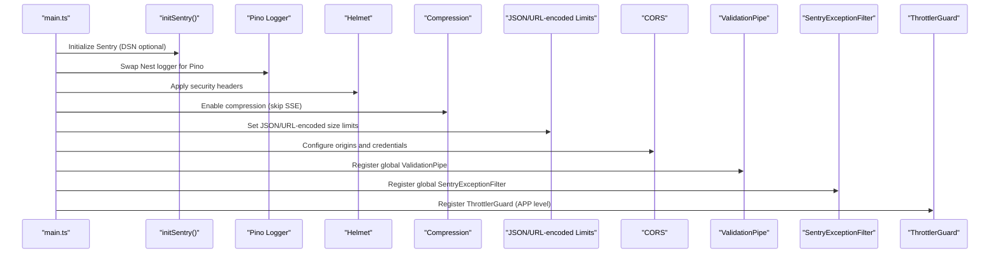
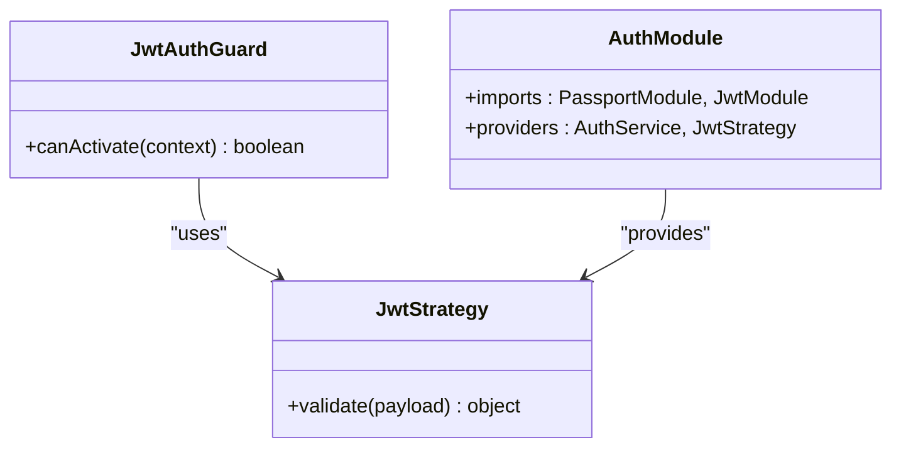
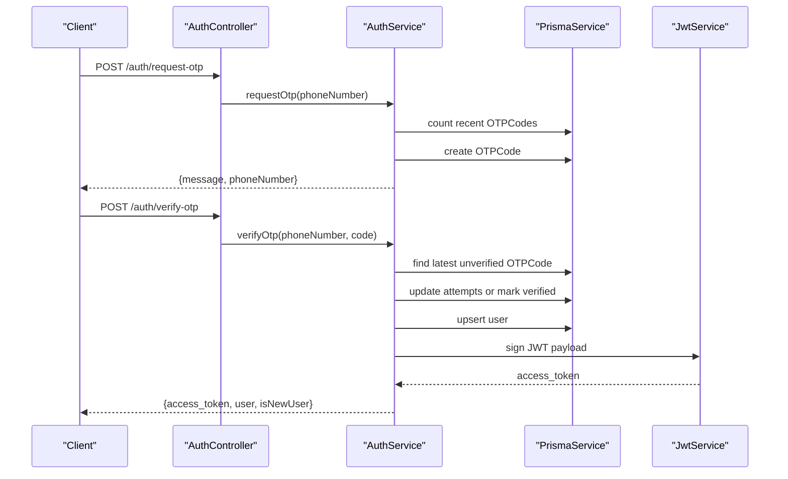
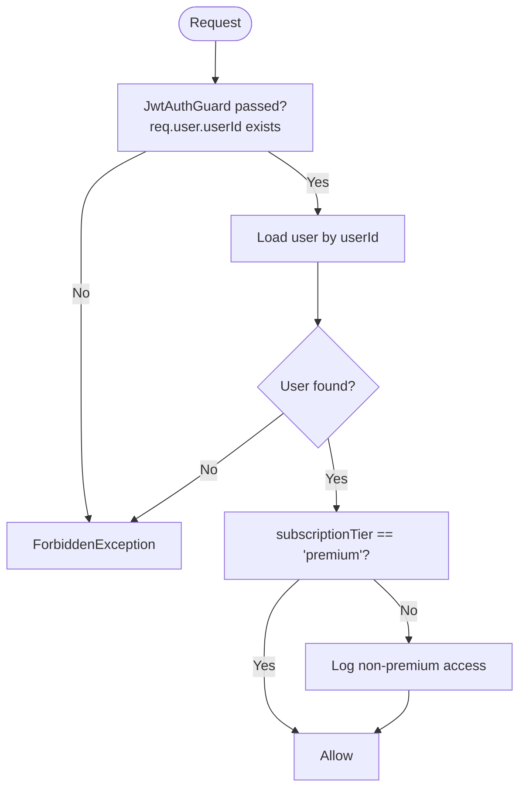
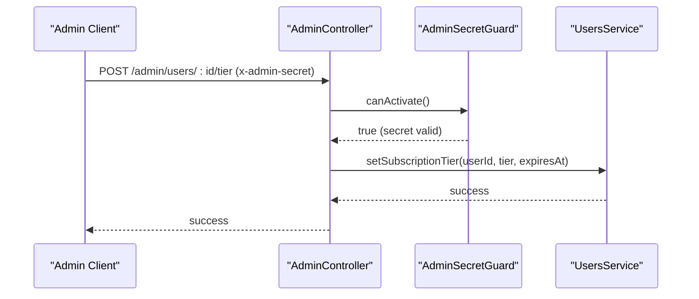
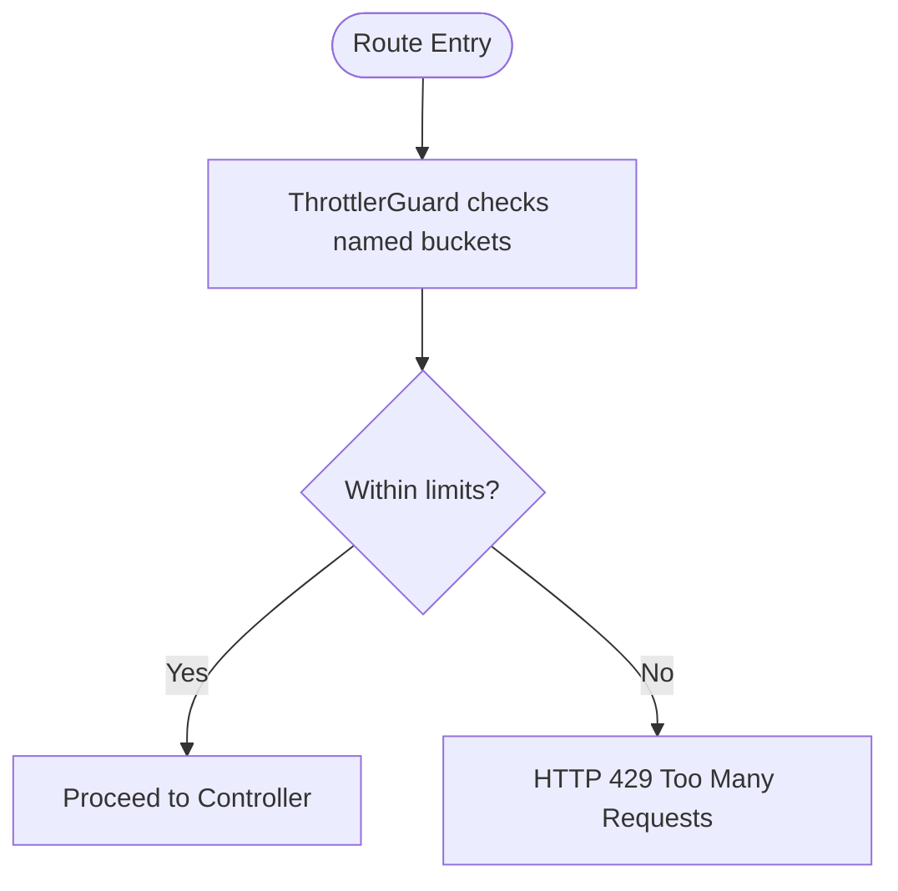
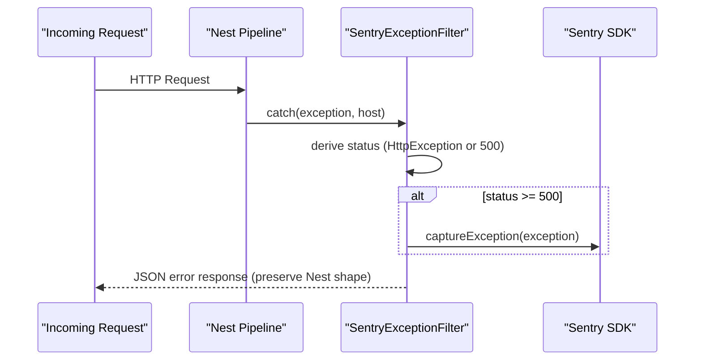
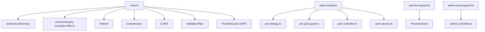

# Security & Middleware Stack

<cite>
**Referenced Files in This Document**
- [main.ts](file://backend/src/main.ts)
- [app.module.ts](file://backend/src/app.module.ts)
- [sentry.ts](file://backend/src/sentry.ts)
- [sentry-exception.filter.ts](file://backend/src/common/sentry-exception.filter.ts)
- [jwt-auth.guard.ts](file://backend/src/auth/jwt-auth.guard.ts)
- [jwt.strategy.ts](file://backend/src/auth/jwt.strategy.ts)
- [auth.module.ts](file://backend/src/auth/auth.module.ts)
- [auth.service.ts](file://backend/src/auth/auth.service.ts)
- [auth.controller.ts](file://backend/src/auth/auth.controller.ts)
- [premium.guard.ts](file://backend/src/auth/premium.guard.ts)
- [admin-secret.guard.ts](file://backend/src/admin/admin-secret.guard.ts)
- [admin.controller.ts](file://backend/src/admin/admin.controller.ts)
</cite>

## Table of Contents
1. [Introduction](#introduction)
2. [Project Structure](#project-structure)
3. [Core Components](#core-components)
4. [Architecture Overview](#architecture-overview)
5. [Detailed Component Analysis](#detailed-component-analysis)
6. [Dependency Analysis](#dependency-analysis)
7. [Performance Considerations](#performance-considerations)
8. [Troubleshooting Guide](#troubleshooting-guide)
9. [Conclusion](#conclusion)

## Introduction
This document details the 4Ever backend’s security and middleware stack. It covers JWT authentication guards, premium feature access control, rate limiting with ThrottlerGuard, exception filtering with Sentry integration, CORS and helmet security headers, compression middleware, and CSRF protection strategies. It also documents authentication flows, token issuance, session management, authorization strategies for premium features and admin access, and middleware ordering and request validation patterns.

## Project Structure
The security and middleware configuration is centralized in the application bootstrap and module configuration, with guard implementations and controllers distributed across the auth and admin modules. Sentry initialization and global exception filtering are wired in the bootstrap, while helmet, compression, CORS, and validation are applied globally.

```mermaid
graph TB
Main["main.ts<br/>Bootstrap & Global Middleware"] --> Helmet["Helmet<br/>Security Headers"]
Main --> Compression["Compression<br/>Response Compression"]
Main --> CORS["CORS<br/>Cross-Origin Policy"]
Main --> Validation["ValidationPipe<br/>Request Validation"]
Main --> SentryInit["Sentry Init<br/>initSentry()"]
Main --> SentryFilter["SentryExceptionFilter<br/>Global Error Filter"]
Main --> Throttler["ThrottlerGuard<br/>APP Level Guard"]
AppModule["app.module.ts<br/>App Module"] --> Throttler
AppModule --> Logger["LoggerModule (Pino)<br/>Structured Logging"]
AppModule --> ThrottlerConfig["ThrottlerModule.forRoot([...])<br/>Named Buckets"]
AuthModule["auth.module.ts<br/>Auth Module"] --> JwtModule["JwtModule<br/>JWT Secret & Expiry"]
AuthModule --> JwtStrategy["JwtStrategy<br/>Passport Strategy"]
AuthModule --> AuthController["auth.controller.ts<br/>Auth Endpoints"]
AuthModule --> JwtAuthGuard["JwtAuthGuard<br/>AuthGuard('jwt')"]
PremiumGuard["premium.guard.ts<br/>Premium Access Control"] -.-> AuthController
AdminSecretGuard["admin-secret.guard.ts<br/>Admin Secret Gate"] -.-> AdminController
```

**Diagram sources**
- [main.ts:24-131](file://backend/src/main.ts#L24-L131)
- [app.module.ts:133-137](file://backend/src/app.module.ts#L133-L137)
- [auth.module.ts:10-33](file://backend/src/auth/auth.module.ts#L10-L33)
- [jwt.strategy.ts:6-26](file://backend/src/auth/jwt.strategy.ts#L6-L26)
- [auth.controller.ts:22-58](file://backend/src/auth/auth.controller.ts#L22-L58)
- [premium.guard.ts:18-44](file://backend/src/auth/premium_guard.ts#L18-L44)
- [admin-secret.guard.ts:14-31](file://backend/src/admin/admin-secret.guard.ts#L14-L31)

**Section sources**
- [main.ts:24-131](file://backend/src/main.ts#L24-L131)
- [app.module.ts:133-137](file://backend/src/app.module.ts#L133-L137)

## Core Components
- JWT Authentication: Passport-based JWT strategy with bearer token extraction, strict secret validation, and payload transformation to include user identity.
- Guards: JwtAuthGuard for endpoint protection and PremiumGuard for premium feature gating; AdminSecretGuard for admin-only endpoints.
- Rate Limiting: Global ThrottlerGuard with named buckets for OTP/auth endpoints and per-route throttling.
- Exception Filtering: Global SentryExceptionFilter forwards 5xx errors to Sentry while preserving Nest error responses.
- Sentry Integration: initSentry initializes Sentry early, with redaction and sampling policies.
- Security Headers: Helmet applied globally; CORS configured with environment-aware origins; compression skips SSE streams; validation enabled globally.

**Section sources**
- [jwt-auth.guard.ts:4-5](file://backend/src/auth/jwt-auth.guard.ts#L4-L5)
- [jwt.strategy.ts:6-26](file://backend/src/auth/jwt.strategy.ts#L6-L26)
- [auth.module.ts:10-33](file://backend/src/auth/auth.module.ts#L10-L33)
- [premium.guard.ts:18-44](file://backend/src/auth/premium.guard.ts#L18-L44)
- [admin-secret.guard.ts:14-31](file://backend/src/admin/admin-secret.guard.ts#L14-L31)
- [app.module.ts:133-137](file://backend/src/app.module.ts#L133-L137)
- [sentry-exception.filter.ts:21-62](file://backend/src/common/sentry-exception.filter.ts#L21-L62)
- [sentry.ts:14-50](file://backend/src/sentry.ts#L14-L50)
- [main.ts:37-89](file://backend/src/main.ts#L37-L89)

## Architecture Overview
The security middleware stack is applied in a specific order during bootstrap to ensure robustness and predictable behavior. The sequence is: Sentry initialization, logger swap, helmet, compression, body size limits, CORS, validation pipe, global filters, and finally, global guards and prefixes.

**Diagram sources**
- [main.ts:24-93](file://backend/src/main.ts#L24-L93)
- [sentry.ts:14-50](file://backend/src/sentry.ts#L14-L50)
- [app.module.ts:164-169](file://backend/src/app.module.ts#L164-L169)

**Section sources**
- [main.ts:24-93](file://backend/src/main.ts#L24-L93)
- [sentry.ts:14-50](file://backend/src/sentry.ts#L14-L50)
- [app.module.ts:164-169](file://backend/src/app.module.ts#L164-L169)

## Detailed Component Analysis

### JWT Authentication Guard and Strategy
- JwtAuthGuard extends NestJS AuthGuard('jwt'), delegating to the passport-jwt strategy.
- JwtStrategy extracts the bearer token, enforces expiration, validates the signing secret, and transforms the JWT payload into a lightweight user object attached to the request.
- AuthModule registers Passport with default jwt strategy and JwtModule with a strong secret and expiry, failing closed if the secret is missing or weak.

**Diagram sources**
- [jwt-auth.guard.ts:4-5](file://backend/src/auth/jwt-auth.guard.ts#L4-L5)
- [jwt.strategy.ts:6-26](file://backend/src/auth/jwt.strategy.ts#L6-L26)
- [auth.module.ts:10-33](file://backend/src/auth/auth.module.ts#L10-L33)

**Section sources**
- [jwt-auth.guard.ts:4-5](file://backend/src/auth/jwt-auth.guard.ts#L4-L5)
- [jwt.strategy.ts:6-26](file://backend/src/auth/jwt.strategy.ts#L6-L26)
- [auth.module.ts:10-33](file://backend/src/auth/auth.module.ts#L10-L33)

### Authentication Flow and Token Issuance
- OTP-based phone auth: request-otp and verify-otp endpoints are rate-limited and protected by layered throttling. On successful verification, a JWT is issued containing user identity.
- Apple Sign-In: Validates Apple identity tokens against Apple’s JWKS, supports audience and issuer checks, and returns a JWT payload compatible with OTP flow.
- No refresh token mechanism is present in the current implementation; access tokens are issued on successful authentication.

**Diagram sources**
- [auth.controller.ts:26-36](file://backend/src/auth/auth.controller.ts#L26-L36)
- [auth.service.ts:32-80](file://backend/src/auth/auth.service.ts#L32-L80)
- [auth.service.ts:86-150](file://backend/src/auth/auth.service.ts#L86-L150)

**Section sources**
- [auth.controller.ts:26-36](file://backend/src/auth/auth.controller.ts#L26-L36)
- [auth.service.ts:32-80](file://backend/src/auth/auth.service.ts#L32-L80)
- [auth.service.ts:86-150](file://backend/src/auth/auth.service.ts#L86-L150)

### Premium Feature Access Control
- PremiumGuard allows all authenticated users to access premium features while logging tier information for observability. It expects JwtAuthGuard to populate req.user.userId and reads the user’s subscription tier from the database.
- The guard must run after JwtAuthGuard to ensure user identity is available.

**Diagram sources**
- [premium.guard.ts:24-44](file://backend/src/auth/premium.guard.ts#L24-L44)

**Section sources**
- [premium.guard.ts:18-44](file://backend/src/auth/premium.guard.ts#L18-L44)

### Admin Access Controls and Secret Header Gate
- AdminSecretGuard enforces admin-only endpoints via a shared secret header (x-admin-secret). It fails closed if the secret is not configured and rejects invalid secrets.
- Admin endpoints are gated at the controller level and include a mutation to adjust user subscription tiers.

**Diagram sources**
- [admin.controller.ts:24-38](file://backend/src/admin/admin.controller.ts#L24-L38)
- [admin-secret.guard.ts:18-30](file://backend/src/admin/admin-secret.guard.ts#L18-L30)

**Section sources**
- [admin.controller.ts:16-38](file://backend/src/admin/admin.controller.ts#L16-L38)
- [admin-secret.guard.ts:14-31](file://backend/src/admin/admin-secret.guard.ts#L14-L31)

### Rate Limiting with ThrottlerGuard
- Global ThrottlerGuard is registered at the application level with named buckets:
  - default: fallback for routes without explicit throttle
  - auth_short: tight per-minute limit for OTP/auth endpoints
  - auth_long: anti-enumeration 15-minute window
- Route-level throttling is applied to OTP endpoints in the AuthController using the same layered buckets.

**Diagram sources**
- [app.module.ts:133-137](file://backend/src/app.module.ts#L133-L137)
- [auth.controller.ts:26-36](file://backend/src/auth/auth.controller.ts#L26-L36)

**Section sources**
- [app.module.ts:133-137](file://backend/src/app.module.ts#L133-L137)
- [auth.controller.ts:10-20](file://backend/src/auth/auth.controller.ts#L10-L20)

### Exception Filter Configuration with Sentry Integration
- SentryExceptionFilter forwards unhandled 5xx errors to Sentry, capturing path, method, and user ID when available, while preserving Nest’s default error response shape for 4xx errors.
- Sentry is initialized early in bootstrap with environment-specific sampling and redaction policies to avoid shipping sensitive data.

**Diagram sources**
- [sentry-exception.filter.ts:25-62](file://backend/src/common/sentry-exception.filter.ts#L25-L62)
- [sentry.ts:14-50](file://backend/src/sentry.ts#L14-L50)
- [main.ts:134-142](file://backend/src/main.ts#L134-L142)

**Section sources**
- [sentry-exception.filter.ts:21-62](file://backend/src/common/sentry-exception.filter.ts#L21-L62)
- [sentry.ts:14-50](file://backend/src/sentry.ts#L14-L50)
- [main.ts:134-142](file://backend/src/main.ts#L134-L142)

### CORS, Helmet Security Headers, Compression, and CSRF Protection
- Helmet: Adds CSP, HSTS, frame options, content type options, and referrer policy. CSP is currently in report-only mode; cross-origin resource policy allows uploads for mobile clients.
- CORS: Origins are loaded from environment variables; production requires explicit origins to fail loudly if omitted; credentials are enabled.
- Compression: Enabled globally with a filter to skip SSE streams to preserve streaming semantics.
- CSRF: No CSRF middleware is configured. CSRF protection strategies should be considered for state-changing operations relying on cookies without SameSite enforcement.

**Section sources**
- [main.ts:37-89](file://backend/src/main.ts#L37-L89)

### Request Validation and Input Sanitization Patterns
- ValidationPipe is registered globally with whitelisting and transformation enabled, rejecting non-whitelisted fields and transforming payloads to DTO shapes.
- Logging redaction strips sensitive fields (tokens, passwords, phone numbers, OTP codes) from logs and Sentry events.
- Body size limits are enforced for JSON and URL-encoded payloads to mitigate abuse.

**Section sources**
- [app.module.ts:99-123](file://backend/src/app.module.ts#L99-L123)
- [sentry.ts:27-48](file://backend/src/sentry.ts#L27-L48)
- [main.ts:62-67](file://backend/src/main.ts#L62-L67)

## Dependency Analysis
The security stack exhibits clear separation of concerns:
- Bootstrap applies transport-level protections and global middleware.
- AuthModule encapsulates JWT configuration and strategies.
- Guards depend on authentication state and database lookups.
- Sentry sits alongside the error pipeline to enrich observability without altering client-facing responses.

**Diagram sources**
- [main.ts:24-93](file://backend/src/main.ts#L24-L93)
- [auth.module.ts:10-33](file://backend/src/auth/auth.module.ts#L10-L33)
- [jwt.strategy.ts:6-26](file://backend/src/auth/jwt.strategy.ts#L6-L26)
- [jwt-auth.guard.ts:4-5](file://backend/src/auth/jwt-auth.guard.ts#L4-L5)
- [auth.controller.ts:22-58](file://backend/src/auth/auth.controller.ts#L22-L58)
- [auth.service.ts:13-26](file://backend/src/auth/auth.service.ts#L13-L26)
- [premium.guard.ts:22-44](file://backend/src/auth/premium.guard.ts#L22-L44)
- [admin-secret.guard.ts:15-31](file://backend/src/admin/admin-secret.guard.ts#L15-L31)
- [admin.controller.ts:16-38](file://backend/src/admin/admin.controller.ts#L16-L38)

**Section sources**
- [main.ts:24-93](file://backend/src/main.ts#L24-L93)
- [auth.module.ts:10-33](file://backend/src/auth/auth.module.ts#L10-L33)
- [premium.guard.ts:22-44](file://backend/src/auth/premium.guard.ts#L22-L44)
- [admin-secret.guard.ts:15-31](file://backend/src/admin/admin-secret.guard.ts#L15-L31)

## Performance Considerations
- Helmet and compression are applied before route handlers, minimizing overhead on hot paths.
- ValidationPipe runs before controllers to fail fast on malformed requests.
- ThrottlerGuard prevents brute-force attacks on OTP endpoints without impacting legitimate users.
- Logging redaction avoids scanning large payloads and sensitive headers, reducing CPU and I/O costs.
- SSE streaming bypasses compression to maintain low latency.

[No sources needed since this section provides general guidance]

## Troubleshooting Guide
- JWT_SECRET misconfiguration: Both AuthModule and JwtStrategy enforce strong secrets; if missing or weak, the server fails to boot. Regenerate a secure secret and redeploy.
- Sentry not reporting: Ensure SENTRY_DSN is set in the environment; otherwise Sentry is a no-op. Verify environment and release tags.
- CORS errors in production: Set CORS_ORIGINS explicitly; the server throws in production if unset to prevent accidental wildcard exposure.
- 429 Too Many Requests on OTP: Verify layered throttling buckets and phone-level attempts in the database.
- Admin endpoints denied: Confirm x-admin-secret header matches ADMIN_SECRET; missing or incorrect secret triggers forbidden responses.

**Section sources**
- [auth.module.ts:15-24](file://backend/src/auth/auth.module.ts#L15-L24)
- [jwt.strategy.ts:12-15](file://backend/src/auth/jwt.strategy.ts#L12-L15)
- [sentry.ts:14-23](file://backend/src/sentry.ts#L14-L23)
- [main.ts:72-75](file://backend/src/main.ts#L72-L75)
- [app.module.ts:133-137](file://backend/src/app.module.ts#L133-L137)
- [admin-secret.guard.ts:22-29](file://backend/src/admin/admin-secret.guard.ts#L22-L29)

## Conclusion
The 4Ever backend employs a layered security approach: strict JWT authentication with validated secrets, global throttling for OTP/auth endpoints, comprehensive error reporting via Sentry, robust helmet security headers, CORS hardening, and structured logging with redaction. Premium feature access is controlled by a guard that leverages authenticated identity, while admin endpoints are gated by a shared secret header. The middleware order ensures predictable behavior, and request validation and input sanitization reduce risk across the stack.