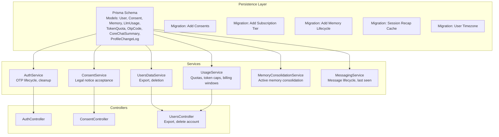
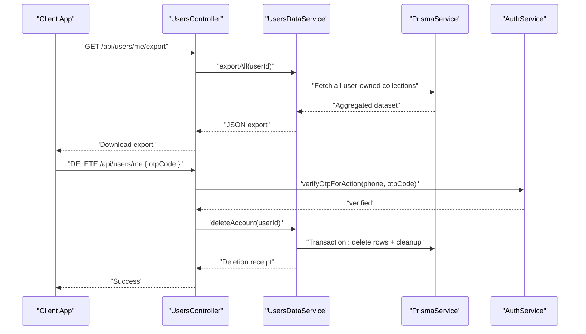
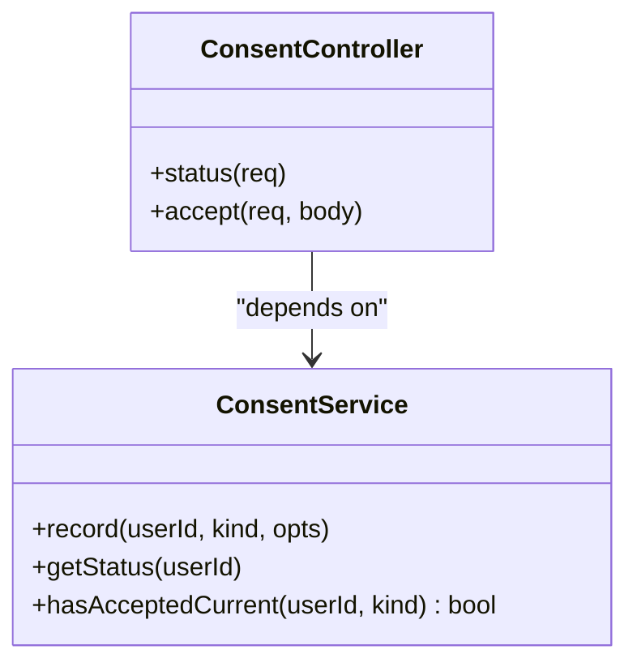
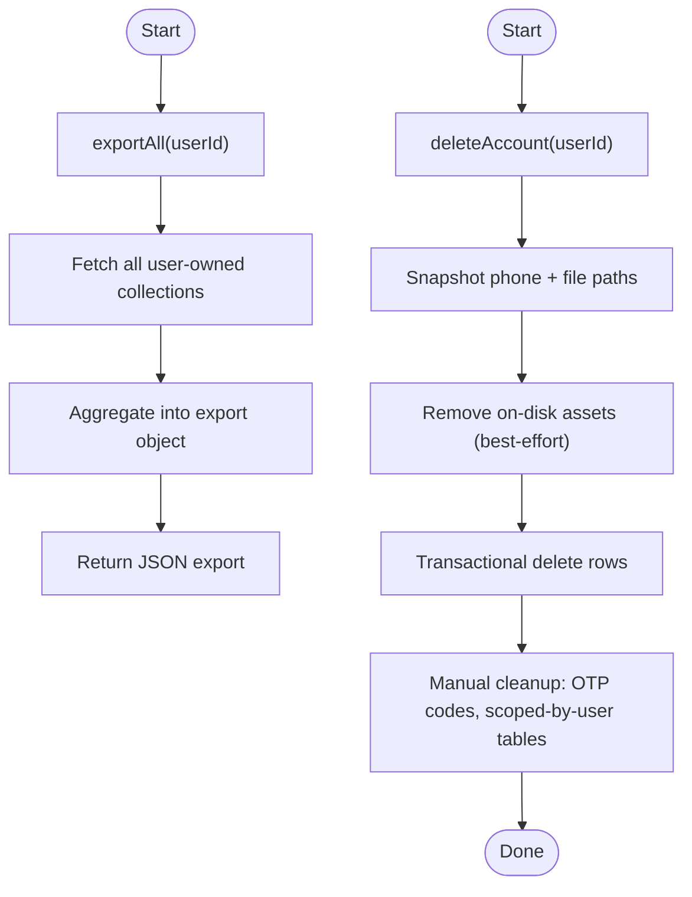
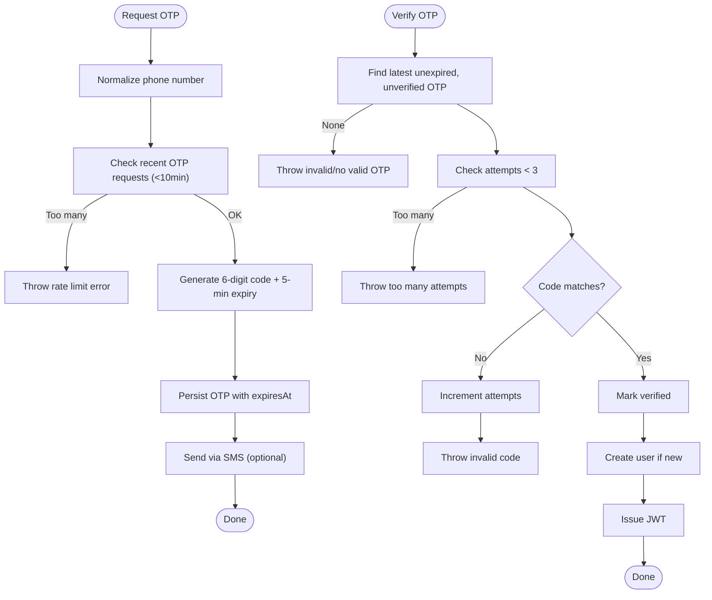
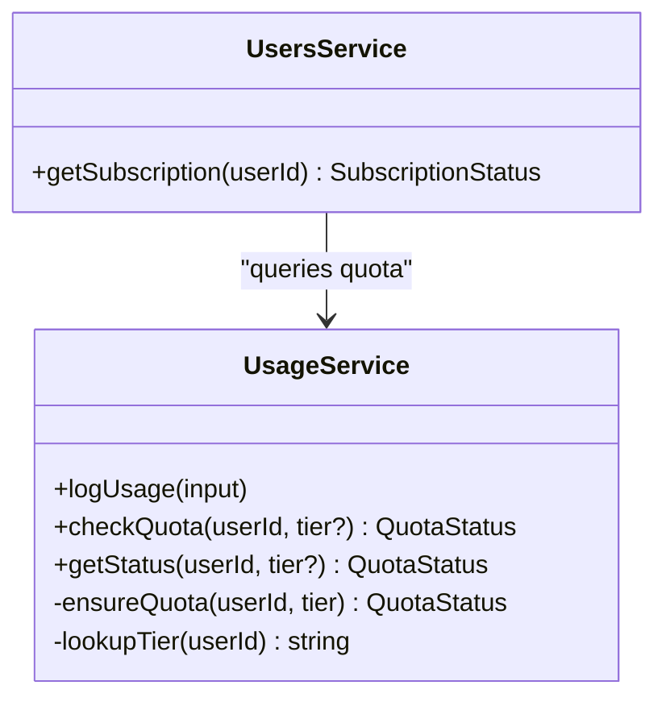
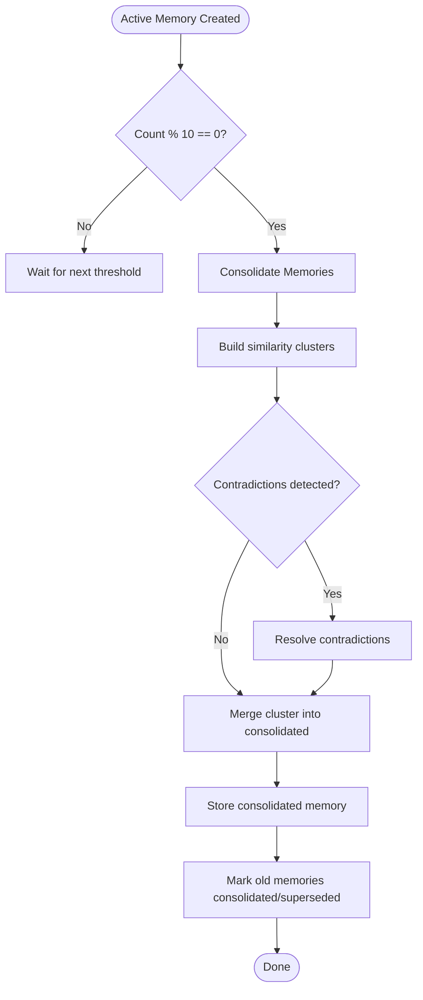
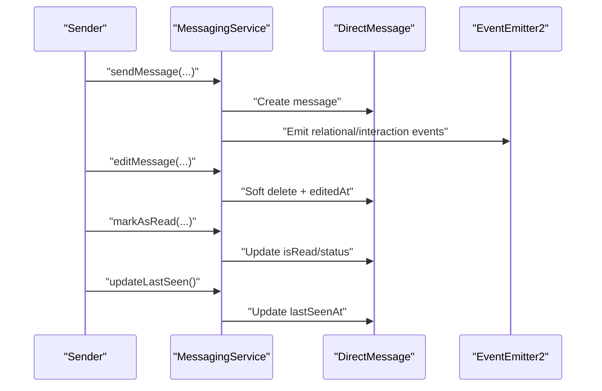
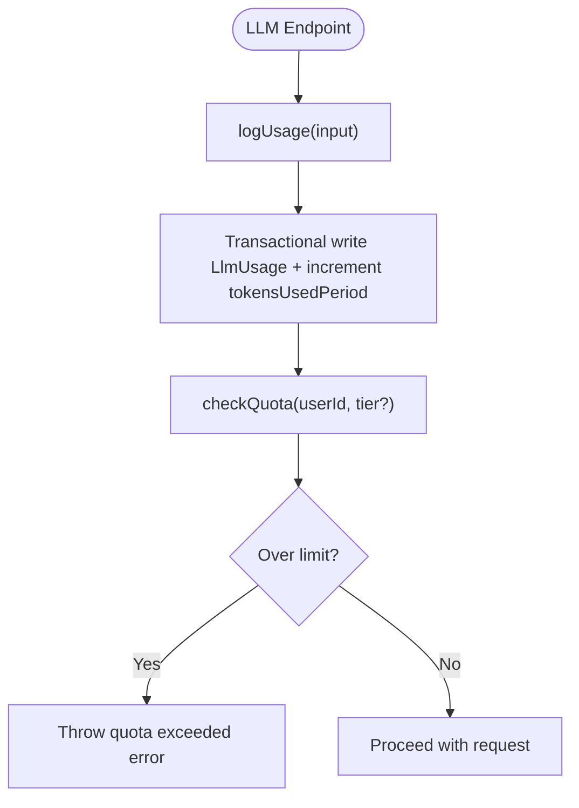
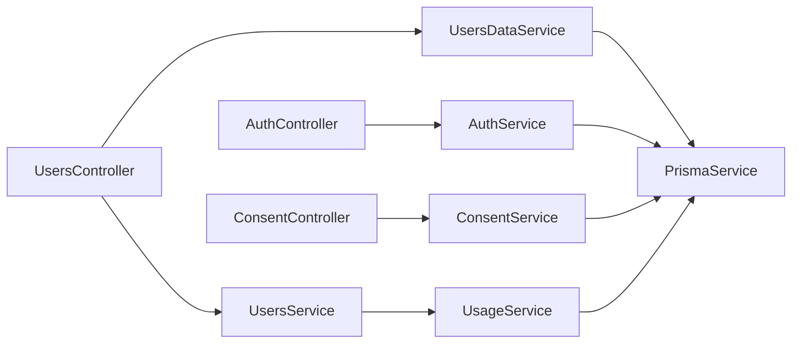

# Data Lifecycle & Retention

<cite>
**Referenced Files in This Document**
- [schema.prisma](file://backend/prisma/schema.prisma)
- [20260510160032_add_consent_and_export_delete/migration.sql](file://backend/prisma/migrations/20260510160032_add_consent_and_export_delete/migration.sql)
- [20260430000000_add_subscription_tier/migration.sql](file://backend/prisma/migrations/20260430000000_add_subscription_tier/migration.sql)
- [20260425120506_add_memory_lifecycle/migration.sql](file://backend/prisma/migrations/20260425120506_add_memory_lifecycle/migration.sql)
- [20260510150000_add_session_recap_cache/migration.sql](file://backend/prisma/migrations/20260510150000_add_session_recap_cache/migration.sql)
- [20260510120000_add_user_timezone/migration.sql](file://backend/prisma/migrations/20260510120000_add_user_timezone/migration.sql)
- [consent.service.ts](file://backend/src/consent/consent.service.ts)
- [consent.controller.ts](file://backend/src/consent/consent.controller.ts)
- [users-data.service.ts](file://backend/src/users/users-data.service.ts)
- [users.controller.ts](file://backend/src/users/users.controller.ts)
- [users.service.ts](file://backend/src/users/users.service.ts)
- [auth.service.ts](file://backend/src/auth/auth.service.ts)
- [usage.service.ts](file://backend/src/usage/usage.service.ts)
- [usage.module.ts](file://backend/src/usage/usage.module.ts)
- [memory-consolidation.service.ts](file://backend/src/orchestration/memory-consolidation.service.ts)
- [messaging.service.ts](file://backend/src/messaging/messaging.service.ts)
- [knowledge-worker.service.ts](file://backend/src/knowledge-worker/knowledge-worker.service.ts)
- [PRIVACY.md](file://docs/PRIVACY.md)
</cite>

## Table of Contents
1. [Introduction](#introduction)
2. [Project Structure](#project-structure)
3. [Core Components](#core-components)
4. [Architecture Overview](#architecture-overview)
5. [Detailed Component Analysis](#detailed-component-analysis)
6. [Dependency Analysis](#dependency-analysis)
7. [Performance Considerations](#performance-considerations)
8. [Troubleshooting Guide](#troubleshooting-guide)
9. [Conclusion](#conclusion)
10. [Appendices](#appendices)

## Introduction
This document defines the data lifecycle and retention policies for 4Ever, covering how user data, messages, memories, and analytics are collected, processed, retained, and eventually deleted. It explains automated cleanup processes for OTP codes, archived memories, and inactive sessions, details consent-based handling aligned with GDPR and platform requirements, and clarifies how subscription tiers influence retention and quotas. It also outlines archival and deletion strategies, anonymization considerations, and audit trails for data access and modifications.

## Project Structure
The data lifecycle spans the persistence layer (Prisma schema and migrations), services implementing policies (consent, usage, user data, auth), and controllers exposing user-facing endpoints. The following diagram maps the primary components involved in data lifecycle management.

**Diagram sources**
- [schema.prisma:12-74](file://backend/prisma/schema.prisma#L12-L74)
- [20260510160032_add_consent_and_export_delete/migration.sql:1-22](file://backend/prisma/migrations/20260510160032_add_consent_and_export_delete/migration.sql#L1-L22)
- [20260430000000_add_subscription_tier/migration.sql:1-5](file://backend/prisma/migrations/20260430000000_add_subscription_tier/migration.sql#L1-L5)
- [20260425120506_add_memory_lifecycle/migration.sql:1-50](file://backend/prisma/migrations/20260425120506_add_memory_lifecycle/migration.sql#L1-L50)
- [20260510150000_add_session_recap_cache/migration.sql:1-5](file://backend/prisma/migrations/20260510150000_add_session_recap_cache/migration.sql#L1-L5)
- [20260510120000_add_user_timezone/migration.sql:1-3](file://backend/prisma/migrations/20260510120000_add_user_timezone/migration.sql#L1-L3)
- [auth.service.ts:324-338](file://backend/src/auth/auth.service.ts#L324-L338)
- [usage.service.ts:11-15](file://backend/src/usage/usage.service.ts#L11-L15)
- [consent.service.ts:22-30](file://backend/src/consent/consent.service.ts#L22-L30)
- [users-data.service.ts:21-31](file://backend/src/users/users-data.service.ts#L21-L31)
- [memory-consolidation.service.ts:15-27](file://backend/src/orchestration/memory-consolidation.service.ts#L15-L27)
- [messaging.service.ts:246-262](file://backend/src/messaging/messaging.service.ts#L246-L262)
- [users.controller.ts:140-189](file://backend/src/users/users.controller.ts#L140-L189)
- [consent.controller.ts:13-25](file://backend/src/consent/consent.controller.ts#L13-L25)

**Section sources**
- [schema.prisma:12-74](file://backend/prisma/schema.prisma#L12-L74)
- [20260510160032_add_consent_and_export_delete/migration.sql:1-22](file://backend/prisma/migrations/20260510160032_add_consent_and_export_delete/migration.sql#L1-L22)
- [20260430000000_add_subscription_tier/migration.sql:1-5](file://backend/prisma/migrations/20260430000000_add_subscription_tier/migration.sql#L1-L5)
- [20260425120506_add_memory_lifecycle/migration.sql:1-50](file://backend/prisma/migrations/20260425120506_add_memory_lifecycle/migration.sql#L1-L50)
- [20260510150000_add_session_recap_cache/migration.sql:1-5](file://backend/prisma/migrations/20260510150000_add_session_recap_cache/migration.sql#L1-L5)
- [20260510120000_add_user_timezone/migration.sql:1-3](file://backend/prisma/migrations/20260510120000_add_user_timezone/migration.sql#L1-L3)

## Core Components
- Consent and legal notice acceptance tracking with versioning and audit trail.
- User data export and deletion with cascading and manual cleanup for non-FK entities.
- OTP lifecycle with automatic cleanup and rate limiting.
- Subscription tiers affecting quotas and premium features.
- Memory lifecycle with consolidation and status transitions.
- Analytics and usage telemetry with token quotas and billing windows.
- Messaging lifecycle with soft delete, reactions, and last seen tracking.

**Section sources**
- [consent.service.ts:22-106](file://backend/src/consent/consent.service.ts#L22-L106)
- [users-data.service.ts:21-372](file://backend/src/users/users-data.service.ts#L21-L372)
- [auth.service.ts:32-204](file://backend/src/auth/auth.service.ts#L32-L204)
- [usage.service.ts:11-242](file://backend/src/usage/usage.service.ts#L11-L242)
- [memory-consolidation.service.ts:35-127](file://backend/src/orchestration/memory-consolidation.service.ts#L35-L127)
- [messaging.service.ts:148-262](file://backend/src/messaging/messaging.service.ts#L148-L262)

## Architecture Overview
The data lifecycle is orchestrated by services that read/write the Prisma schema models and coordinate with controllers for user-facing operations. Automated jobs (cron) maintain data hygiene, while user actions trigger explicit deletions and exports.

**Diagram sources**
- [users.controller.ts:140-189](file://backend/src/users/users.controller.ts#L140-L189)
- [users-data.service.ts:289-372](file://backend/src/users/users-data.service.ts#L289-L372)
- [auth.service.ts:176-204](file://backend/src/auth/auth.service.ts#L176-L204)

## Detailed Component Analysis

### Consent and Legal Notice Acceptance
- Purpose: Track acceptance of privacy policy, terms of service, AI disclosure, and age confirmation with versioning and audit trail.
- Mechanism: Upsert by (userId, kind, version) ensures idempotency; status aggregates latest accepted versions and flags missing items.
- Enforcement: Reporting-only; consent enforcement can be enabled to gate LLM calls via a global flag.

**Diagram sources**
- [consent.service.ts:22-106](file://backend/src/consent/consent.service.ts#L22-L106)
- [consent.controller.ts:13-58](file://backend/src/consent/consent.controller.ts#L13-L58)

**Section sources**
- [consent.service.ts:22-106](file://backend/src/consent/consent.service.ts#L22-L106)
- [consent.controller.ts:13-58](file://backend/src/consent/consent.controller.ts#L13-L58)
- [20260510160032_add_consent_and_export_delete/migration.sql:1-22](file://backend/prisma/migrations/20260510160032_add_consent_and_export_delete/migration.sql#L1-L22)

### User Data Export and Deletion
- Export: Aggregates all user-owned tables into a single JSON object; binary assets are excluded to keep payload manageable.
- Deletion: Transactional cascade-delete with manual cleanup for non-FK-scoped entities (ontology events/snapshots) and phone-keyed OTP codes; on-disk assets removed safely.

**Diagram sources**
- [users-data.service.ts:32-272](file://backend/src/users/users-data.service.ts#L32-L272)
- [users-data.service.ts:289-372](file://backend/src/users/users-data.service.ts#L289-L372)

**Section sources**
- [users-data.service.ts:21-372](file://backend/src/users/users-data.service.ts#L21-L372)
- [users.controller.ts:140-189](file://backend/src/users/users.controller.ts#L140-L189)

### OTP Lifecycle and Cleanup
- Request: Generates a 6-digit code, stores with expiration, rate-limited to 3 per 10 minutes per phone.
- Verification: Enforces max 3 attempts per code; marks verified on success; creates user if new.
- Cleanup: Hourly cron deletes expired OTP codes; development bypass allows testing without OTP.

**Diagram sources**
- [auth.service.ts:32-204](file://backend/src/auth/auth.service.ts#L32-L204)
- [auth.service.ts:324-338](file://backend/src/auth/auth.service.ts#L324-L338)

**Section sources**
- [auth.service.ts:32-204](file://backend/src/auth/auth.service.ts#L32-L204)
- [auth.service.ts:324-338](file://backend/src/auth/auth.service.ts#L324-L338)

### Subscription Tiers and Quotas
- Subscription tier influences monthly token caps and premium features (e.g., tri-chat turns).
- Quota engine enforces per-user, per-calendar-month caps with automatic rollover on month boundary.
- Tier downgrade occurs when subscription expires, reverting to free-tier quotas.

**Diagram sources**
- [usage.service.ts:52-242](file://backend/src/usage/usage.service.ts#L52-L242)
- [users.service.ts:39-70](file://backend/src/users/users.service.ts#L39-L70)
- [20260430000000_add_subscription_tier/migration.sql:1-5](file://backend/prisma/migrations/20260430000000_add_subscription_tier/migration.sql#L1-L5)

**Section sources**
- [usage.service.ts:11-242](file://backend/src/usage/usage.service.ts#L11-L242)
- [users.service.ts:39-70](file://backend/src/users/users.service.ts#L39-L70)
- [20260430000000_add_subscription_tier/migration.sql:1-5](file://backend/prisma/migrations/20260430000000_add_subscription_tier/migration.sql#L1-L5)

### Memory Lifecycle and Consolidation
- Status lifecycle: active → consolidated/contradicted/archived.
- Automatic consolidation: triggered when active memory count reaches multiples of 10; clusters similar memories, detects contradictions, synthesizes consolidated statements.
- Archive/retire: memories can be archived or superseded by consolidated ones.

**Diagram sources**
- [memory-consolidation.service.ts:29-127](file://backend/src/orchestration/memory-consolidation.service.ts#L29-L127)
- [20260425120506_add_memory_lifecycle/migration.sql:1-50](file://backend/prisma/migrations/20260425120506_add_memory_lifecycle/migration.sql#L1-L50)

**Section sources**
- [memory-consolidation.service.ts:35-127](file://backend/src/orchestration/memory-consolidation.service.ts#L35-L127)
- [20260425120506_add_memory_lifecycle/migration.sql:1-50](file://backend/prisma/migrations/20260425120506_add_memory_lifecycle/migration.sql#L1-L50)

### Messaging Lifecycle and Inactivity Tracking
- Message lifecycle: send, edit, soft delete, reactions, delivery/read status.
- Inactivity: lastSeenAt updates on activity; supports “while you were away” recap caching and timezone awareness.

**Diagram sources**
- [messaging.service.ts:53-262](file://backend/src/messaging/messaging.service.ts#L53-L262)
- [20260510150000_add_session_recap_cache/migration.sql:1-5](file://backend/prisma/migrations/20260510150000_add_session_recap_cache/migration.sql#L1-L5)
- [20260510120000_add_user_timezone/migration.sql:1-3](file://backend/prisma/migrations/20260510120000_add_user_timezone/migration.sql#L1-L3)

**Section sources**
- [messaging.service.ts:246-262](file://backend/src/messaging/messaging.service.ts#L246-L262)
- [20260510150000_add_session_recap_cache/migration.sql:1-5](file://backend/prisma/migrations/20260510150000_add_session_recap_cache/migration.sql#L1-L5)
- [20260510120000_add_user_timezone/migration.sql:1-3](file://backend/prisma/migrations/20260510120000_add_user_timezone/migration.sql#L1-L3)

### Analytics and Usage Telemetry
- LLM usage logging: per-request token accounting, cost estimation, and latency capture.
- Quota enforcement: monthly windows with tier-based caps; supports override per user for special accounts.

**Diagram sources**
- [usage.service.ts:62-130](file://backend/src/usage/usage.service.ts#L62-L130)

**Section sources**
- [usage.service.ts:57-130](file://backend/src/usage/usage.service.ts#L57-L130)

### Knowledge Worker Data Handling
- Conversations and messages are stored per user with isolation; streaming responses are persisted after generation.
- Documents are stored with metadata and optional file system paths; cleanup handled during account deletion.

**Section sources**
- [knowledge-worker.service.ts:117-155](file://backend/src/knowledge-worker/knowledge-worker.service.ts#L117-L155)
- [knowledge-worker.service.ts:164-344](file://backend/src/knowledge-worker/knowledge-worker.service.ts#L164-L344)

## Dependency Analysis
- Controllers depend on services for business logic; services depend on Prisma for persistence.
- UsageService is globally injected to minimize cross-module coupling for quota enforcement.
- ConsentService centralizes legal notice tracking; UsageService gates features based on consent state.

**Diagram sources**
- [users.controller.ts:32-38](file://backend/src/users/users.controller.ts#L32-L38)
- [consent.controller.ts:13-16](file://backend/src/consent/consent.controller.ts#L13-L16)
- [users-data.service.ts:24-24](file://backend/src/users/users-data.service.ts#L24-L24)
- [users.service.ts:18-24](file://backend/src/users/users.service.ts#L18-L24)
- [usage.module.ts:1-15](file://backend/src/usage/usage.module.ts#L1-L15)

**Section sources**
- [users.controller.ts:32-38](file://backend/src/users/users.controller.ts#L32-L38)
- [consent.controller.ts:13-16](file://backend/src/consent/consent.controller.ts#L13-L16)
- [users-data.service.ts:24-24](file://backend/src/users/users-data.service.ts#L24-L24)
- [users.service.ts:18-24](file://backend/src/users/users.service.ts#L18-L24)
- [usage.module.ts:1-15](file://backend/src/usage/usage.module.ts#L1-L15)

## Performance Considerations
- Export and deletion are heavy operations; throttled endpoints protect resources.
- Messaging queries optimized with raw SQL and grouped aggregations to avoid N+1 patterns.
- Quota checks are O(1) via single upsert and read.
- OTP cleanup runs hourly to prevent accumulation of stale codes.

[No sources needed since this section provides general guidance]

## Troubleshooting Guide
- OTP verification failures: check attempts, expiry, and rate limits; verify phone normalization.
- Quota exceeded: confirm tier and monthly window; review token usage logs.
- Export failures: verify table accessibility and network timeouts; retry throttled requests.
- Deletion anomalies: ensure transaction boundaries and manual cleanup steps executed.

**Section sources**
- [auth.service.ts:86-150](file://backend/src/auth/auth.service.ts#L86-L150)
- [usage.service.ts:98-130](file://backend/src/usage/usage.service.ts#L98-L130)
- [users-data.service.ts:32-272](file://backend/src/users/users-data.service.ts#L32-L272)
- [users-data.service.ts:289-372](file://backend/src/users/users-data.service.ts#L289-L372)

## Conclusion
4Ever’s data lifecycle integrates explicit consent, robust user controls for export and deletion, automated cleanup for ephemeral data (OTP), and tier-based quotas for analytics and premium features. The schema and services enforce retention boundaries, while audit-ready logs and cascading deletes ensure compliance with privacy regulations and platform requirements.

[No sources needed since this section summarizes without analyzing specific files]

## Appendices

### Data Retention and Deletion Timelines
- Active account data: retained for the life of the account.
- OTP codes: deleted within 10 minutes (unused) or immediately after successful verification.
- Server logs with PII redacted: retained for 30 days.
- Backups: retained for 30 days rolling.
- After account deletion: personal content removed within 30 days; minimal records retained up to 7 years where required by law.

**Section sources**
- [PRIVACY.md:93-102](file://docs/PRIVACY.md#L93-L102)

### Consent-Based Handling and GDPR Alignment
- Required notices: privacy policy, terms of service, AI disclosure, age confirmation.
- Versioning and audit trail: one row per (userId, kind, version) preserves historical consent.
- Enforcement: reporting-only by default; can be toggled to gate LLM calls.

**Section sources**
- [consent.service.ts:4-21](file://backend/src/consent/consent.service.ts#L4-L21)
- [20260510160032_add_consent_and_export_delete/migration.sql:1-22](file://backend/prisma/migrations/20260510160032_add_consent_and_export_delete/migration.sql#L1-L22)
- [PRIVACY.md:103-119](file://docs/PRIVACY.md#L103-L119)

### Subscription Tiers and Premium Features
- Free tier: capped monthly token allowance; limited tri-chat turns.
- Premium tier: higher token cap and unlimited tri-chat turns; subscription expiry downgrades to free.
- Quota overrides: per-user token caps supported for special accounts.

**Section sources**
- [usage.service.ts:11-15](file://backend/src/usage/usage.service.ts#L11-L15)
- [users.service.ts:39-70](file://backend/src/users/users.service.ts#L39-L70)
- [20260430000000_add_subscription_tier/migration.sql:1-5](file://backend/prisma/migrations/20260430000000_add_subscription_tier/migration.sql#L1-L5)

### Data Archival, Backup, and Disaster Recovery
- Backups retained for 30 days rolling; account deletion removes personal content within 30 days.
- Minimal records retained for legal/compliance reasons up to 7 years.

**Section sources**
- [PRIVACY.md:98-102](file://docs/PRIVACY.md#L98-L102)

### Anonymization and Research Compliance
- Export excludes binary assets to reduce risk; consider further redaction/anonymization for research use.
- Consent required for AI-related disclosures; withdrawal impacts dependent features.

**Section sources**
- [users-data.service.ts:27-31](file://backend/src/users/users-data.service.ts#L27-L31)
- [consent.service.ts:4-21](file://backend/src/consent/consent.service.ts#L4-L21)
- [PRIVACY.md:103-119](file://docs/PRIVACY.md#L103-L119)

### Audit Trails and Access Tracking
- Consent records include IP address and user agent for auditability.
- Profile change logs track modifications with timestamps and sources.
- LLM usage logs capture endpoint, tokens, latency, and success/error codes.

**Section sources**
- [20260510160032_add_consent_and_export_delete/migration.sql:7-11](file://backend/prisma/migrations/20260510160032_add_consent_and_export_delete/migration.sql#L7-L11)
- [20260425120506_add_memory_lifecycle/migration.sql:23-41](file://backend/prisma/migrations/20260425120506_add_memory_lifecycle/migration.sql#L23-L41)
- [schema.prisma:776-797](file://backend/prisma/schema.prisma#L776-L797)