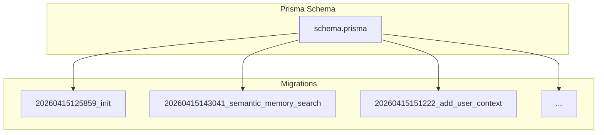
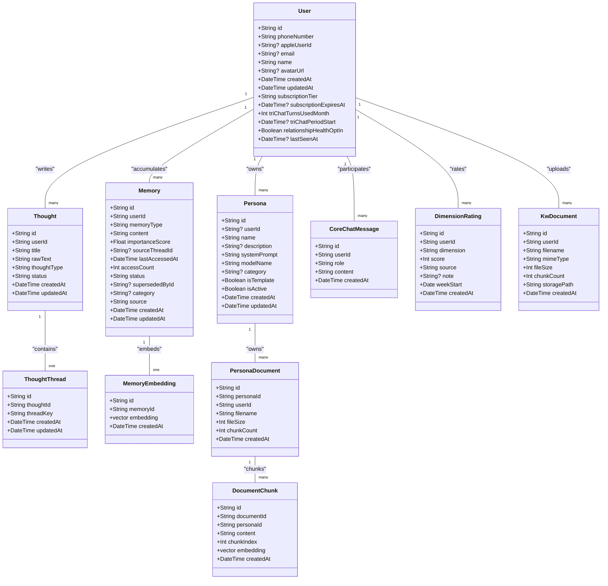
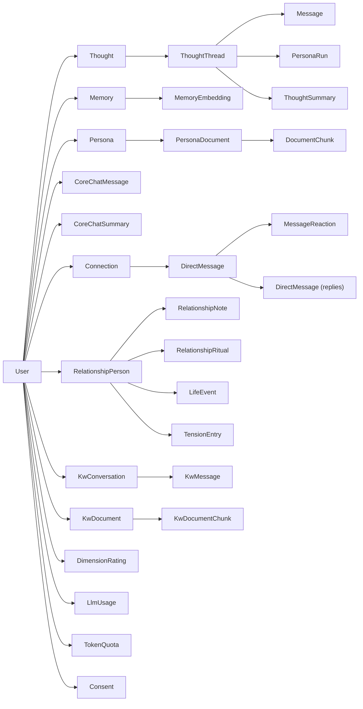

# Database Design

<cite>
**Referenced Files in This Document**
- [schema.prisma](file://backend/prisma/schema.prisma)
- [init migration](file://backend/prisma/migrations/20260415125859_init/migration.sql)
- [semantic memory search migration](file://backend/prisma/migrations/20260415143041_semantic_memory_search/migration.sql)
- [add user context migration](file://backend/prisma/migrations/20260415151222_add_user_context/migration.sql)
- [add insights and thought embeddings migration](file://backend/prisma/migrations/20260415171832_add_insights_and_thought_embeddings/migration.sql)
- [add day planner migration](file://backend/prisma/migrations/20260415175017_add_day_planner/migration.sql)
- [add life dimensions features migration](file://backend/prisma/migrations/20260415184323_add_life_dimensions_features/migration.sql)
- [add persona knowledge base migration](file://backend/prisma/migrations/20260416054230_add_persona_knowledge_base/migration.sql)
- [add core chat messages migration](file://backend/prisma/migrations/20260416193727_add_core_chat_messages/migration.sql)
- [make action threadid optional migration](file://backend/prisma/migrations/20260416202012_make_action_threadid_optional/migration.sql)
- [add relationship circle migration](file://backend/prisma/migrations/20260419180329_add_relationship_circle/migration.sql)
- [add relationship evolution migration](file://backend/prisma/migrations/20260419191045_add_relationship_evolution/migration.sql)
- [add rituals and life events migration](file://backend/prisma/migrations/20260422073952_add_rituals_and_life_events/migration.sql)
- [add tension entries migration](file://backend/prisma/migrations/20260422075259_add_tension_entries/migration.sql)
- [add love language migration](file://backend/prisma/migrations/20260422080027_add_love_language/migration.sql)
- [add persona chat messages migration](file://backend/prisma/migrations/20260422083121_add_persona_chat_messages/migration.sql)
- [add social messaging migration](file://backend/prisma/migrations/20260422085110_add_social_messaging/migration.sql)
- [add performance indexes migration](file://backend/prisma/migrations/20260422213232_add_performance_indexes/migration.sql)
- [add core chat session start migration](file://backend/prisma/migrations/20260425082634_add_core_chat_session_start/migration.sql)
- [add memory lifecycle migration](file://backend/prisma/migrations/20260425120506_add_memory_lifecycle/migration.sql)
- [add whatsapp messaging features migration](file://backend/prisma/migrations/20260425182209_add_whatsapp_messaging_features/migration.sql)
- [phone otp auth migration](file://backend/prisma/migrations/20260425194007_phone_otp_auth/migration.sql)
- [add ontology migration](file://backend/prisma/migrations/20260426120000_add_ontology/migration.sql)
- [add context embeddings migration](file://backend/prisma/migrations/20260427085039_add_context_embeddings/migration.sql)
- [remove context embeddings migration](file://backend/prisma/migrations/20260427112419_remove_context_embeddings/migration.sql)
- [unify persona library migration](file://backend/prisma/migrations/20260428100000_unify_persona_library/migration.sql)
- [add user avatar migration](file://backend/prisma/migrations/20260429080622_add_user_avatar/migration.sql)
- [add kw documents migration](file://backend/prisma/migrations/20260429100000_add_kw_documents/migration.sql)
- [add subscription tier migration](file://backend/prisma/migrations/20260430000000_add_subscription_tier/migration.sql)
- [add kw tables migration](file://backend/prisma/migrations/20260430000100_add_kw_tables/migration.sql)
- [add relationship person linked user migration](file://backend/prisma/migrations/20260430100000_add_relationship_person_linked_user/migration.sql)
- [add relationship person phone migration](file://backend/prisma/migrations/20260430105802_add_relationship_person_phone/migration.sql)
- [add tri chat migration](file://backend/prisma/migrations/20260430200000_add_tri_chat/migration.sql)
- [mediator v2 migration](file://backend/prisma/migrations/20260430210000_mediator_v2/migration.sql)
- [clear history one sided migration](file://backend/prisma/migrations/20260501070733_clear_history_one_sided/migration.sql)
- [add mediator name migration](file://backend/prisma/migrations/20260501081526_add_mediator_name/migration.sql)
- [tri chat default on migration](file://backend/prisma/migrations/20260510120000_add_tri_chat_default_on/migration.sql)
- [add user timezone migration](file://backend/prisma/migrations/20260510150000_add_user_timezone/migration.sql)
- [add session recap cache migration](file://backend/prisma/migrations/20260510160032_add_session_recap_cache/migration.sql)
- [add consent and export delete migration](file://backend/prisma/migrations/20260510170000_add_consent_and_export_delete/migration.sql)
- [add life dimensions migration](file://backend/prisma/migrations/20260510180000_add_life_dimensions/migration.sql)
- [add sign in with apple migration](file://backend/prisma/migrations/20260510220000_add_sign_in_with_apple/migration.sql)
- [add llm usage and token quotas migration](file://backend/prisma/migrations/20260510220000_add_llm_usage_and_token_quotas/migration.sql)
</cite>

## Table of Contents
1. [Introduction](#introduction)
2. [Project Structure](#project-structure)
3. [Core Components](#core-components)
4. [Architecture Overview](#architecture-overview)
5. [Detailed Component Analysis](#detailed-component-analysis)
6. [Dependency Analysis](#dependency-analysis)
7. [Performance Considerations](#performance-considerations)
8. [Troubleshooting Guide](#troubleshooting-guide)
9. [Conclusion](#conclusion)
10. [Appendices](#appendices)

## Introduction
This document describes the database design for the 4Ever application as implemented with Prisma ORM and PostgreSQL. It covers the entity relationship model, the pgvector extension for semantic search, the migration strategy using Prisma Migrate, indexing strategies, foreign keys, and data integrity constraints. It also highlights specialized entities such as DimensionRating and KwDocument, and provides examples of complex queries, vector similarity searches, and join patterns used across the application.

## Project Structure
The database schema is defined in Prisma’s schema file and evolves through a series of chronological migrations. The schema declares models and relations, while migrations define the actual PostgreSQL DDL, including indexes, constraints, and extension usage.

**Diagram sources**
- [schema.prisma](file://backend/prisma/schema.prisma)
- [init migration](file://backend/prisma/migrations/20260415125859_init/migration.sql)
- [semantic memory search migration](file://backend/prisma/migrations/20260415143041_semantic_memory_search/migration.sql)
- [add user context migration](file://backend/prisma/migrations/20260415151222_add_user_context/migration.sql)

**Section sources**
- [schema.prisma](file://backend/prisma/schema.prisma)
- [init migration](file://backend/prisma/migrations/20260415125859_init/migration.sql)

## Core Components
This section outlines the primary entities and their roles in the system, focusing on relationships, attributes, and constraints.

- User
  - Identity and profile: unique identifiers, contact info, avatar, subscription tier, tri-chat usage, relationship health opt-in, and consent records.
  - Rich associations: thoughts, personas, memories, user context, insights, day plans, check-ins, action items, persona documents, core chat messages, relationships, rituals, life events, tensions, persona chat messages, connections, direct messages, shared notes, message reactions, core chat summaries, profile change logs, kw conversations, kw documents, dimension ratings, dimension signals, LLM usage, and token quotas.
  - Constraints: unique phone number, optional Apple user ID, default subscription tier, timestamps.

- Thought
  - Represents user-authored ideas with type, status, and optional embeddings.
  - Relations: belongs to User, has ThoughtThread(s), optional ThoughtEmbedding.

- ThoughtThread
  - Encapsulates a conversation thread within a Thought, with a globally unique thread key.
  - Relations: belongs to Thought, contains Messages and PersonaRuns, optional ThoughtSummary.

- Persona
  - Reusable conversational agents with system prompts, model name, template/activity flags.
  - Relations: optionally belongs to User, runs via PersonaRun, documents via PersonaDocument, chat messages via PersonaChatMessage.

- Memory
  - Long-term knowledge units with lifecycle fields (status, superseded_by_id), access metrics, and optional embeddings.
  - Relations: belongs to User, optional MemoryEmbedding.

- MemoryEmbedding
  - Vector embedding for semantic similarity on memories.

- InsightReport
  - Curated reports generated for the user.

- ThoughtEmbedding
  - Vector embedding for semantic similarity on thoughts.

- DayPlan and PlanTask
  - Structured planning per user per day with tasks and statuses.

- DailyCheckIn
  - Mood and energy ratings per day.

- ActionItem
  - Work items with optional persona/thread linkage and due dates.

- UserContext
  - Extended profile context for personalized experiences.

- PersonaDocument and DocumentChunk
  - Persona-specific knowledge base with chunked content and embeddings.

- CoreChatMessage and CoreChatSummary
  - Real-time core chat messages and session summaries.

- DimensionRating and DimensionSignal
  - Life-dimension tracking via weekly ratings and passive signals.

- RelationshipPerson, RelationshipNote, RelationshipRitual, LifeEvent, TensionEntry
  - Social circle modeling with notes, rituals, events, and tension management.

- Connection, DirectMessage, MessageReaction, SharedNote, MediationSession, MediationEvent
  - Real-time messaging, reactions, shared notes, and tri-chat mediation.

- KwConversation, KwMessage, KwDocument
  - Isolated knowledge worker features with document ingestion and vectorized chunks.

- LlmUsage and TokenQuota
  - Telemetry and quota enforcement for LLM usage.

**Section sources**
- [schema.prisma](file://backend/prisma/schema.prisma)

## Architecture Overview
The database architecture centers around a single PostgreSQL instance with the pgvector extension enabled. Prisma manages schema evolution through migrations, ensuring reproducible deployments. Specialized domains (core chat, persona knowledge base, knowledge worker) share common entities (User, Memory, Thought) while extending with domain-specific tables and indexes.

```mermaid
erDiagram
USER ||--o{ THOUGHT : "writes"
USER ||--o{ PERSONA : "owns"
USER ||--o{ MEMORY : "accumulates"
USER ||--o{ CORE_CHAT_MESSAGE : "participates"
USER ||--o{ CORE_CHAT_SUMMARY : "summarizes"
USER ||--o{ ACTION_ITEM : "owns"
USER ||--o{ DAY_PLAN : "plans"
USER ||--o{ DAILY_CHECK_IN : "rates"
USER ||--o{ RELATIONSHIP_PERSON : "knows"
USER ||--o{ RELATIONSHIP_RITUAL : "organizes"
USER ||--o{ LIFE_EVENT : "experiences"
USER ||--o{ TENSION_ENTRY : "manages"
USER ||--o{ PERSONA_CHAT_MESSAGE : "interacts"
USER ||--o{ DIRECT_MESSAGE : "sends/receives"
USER ||--o{ MESSAGE_REACTION : "reacts"
USER ||--o{ SHARED_NOTE : "authored"
USER ||--o{ KW_CONVERSATION : "has"
USER ||--o{ KW_DOCUMENT : "uploads"
USER ||--o{ CONSENT : "agrees"
USER ||--o{ TOKEN_QUOTA : "has"
USER ||--o{ LLM_USAGE : "consumes"
THOUGHT }o--|| THOUGHT_THREAD : "contains"
THOUGHT ||--o{ THOUGHT_EMBEDDING : "embeds"
THOUGHT_THREAD ||--o{ MESSAGE : "hosts"
THOUGHT_THREAD ||--o{ PERSONA_RUN : "executes"
THOUGHT_THREAD ||--|| THOUGHT_SUMMARY : "summarizes"
MEMORY ||--o{ MEMORY_EMBEDDING : "embeds"
PERSONA ||--o{ PERSONA_RUN : "executes"
PERSONA ||--o{ PERSONA_DOCUMENT : "owns"
PERSONA ||--o{ PERSONA_CHAT_MESSAGE : "participates"
PERSONA_DOCUMENT ||--o{ DOCUMENT_CHUNK : "chunks"
RELATIONSHIP_PERSON ||--o{ RELATIONSHIP_NOTE : "noted"
RELATIONSHIP_PERSON ||--o{ RELATIONSHIP_RITUAL : "involved"
RELATIONSHIP_PERSON ||--o{ LIFE_EVENT : "impacted"
RELATIONSHIP_PERSON ||--o{ TENSION_ENTRY : "causes/relieves"
CONNECTION ||--o{ DIRECT_MESSAGE : "carries"
CONNECTION ||--o{ MEDIATION_SESSION : "mediates"
DIRECT_MESSAGE ||--o{ MESSAGE_REACTION : "reactions"
DIRECT_MESSAGE ||--o{ DIRECT_MESSAGE : "replies"
KW_CONVERSATION ||--o{ KW_MESSAGE : "contains"
KW_DOCUMENT ||--o{ KW_DOCUMENT_CHUNK : "chunks"
```

**Diagram sources**
- [schema.prisma](file://backend/prisma/schema.prisma)

## Detailed Component Analysis

### Entity Model and Relationships
This section maps the Prisma models to their underlying relations and constraints.

**Diagram sources**
- [schema.prisma](file://backend/prisma/schema.prisma)

**Section sources**
- [schema.prisma](file://backend/prisma/schema.prisma)

### Semantic Search with pgvector
The system leverages the pgvector extension for vector similarity search on memories and persona/kw document chunks.

- Extension activation and vector column migration
  - The semantic memory search migration activates the vector extension and converts the embedding storage column to a vector(1536) type for memory embeddings.
  - Persona and Knowledge Worker document chunks also use vector(1536) columns for similarity search.

- Indexing for similarity search
  - Vector indexes are implicitly supported by pgvector; however, application-level queries typically use vector operations with ORDER BY and LIMIT to retrieve nearest neighbors efficiently.

- Typical similarity query pattern
  - Retrieve top-k memories or chunks similar to a query embedding by ordering by distance and limiting results.
  - Example pattern: select vectors, order by vector distance, limit k.

- Migration coverage
  - Initial vector column creation and foreign key adjustments occur in the semantic memory search migration.
  - Persona and Knowledge Worker chunk tables are introduced in later migrations with vector columns and supporting indexes.

**Section sources**
- [semantic memory search migration](file://backend/prisma/migrations/20260415143041_semantic_memory_search/migration.sql)
- [add persona knowledge base migration](file://backend/prisma/migrations/20260416054230_add_persona_knowledge_base/migration.sql)
- [add kw documents migration](file://backend/prisma/migrations/20260429100000_add_kw_documents/migration.sql)

### Migration Strategy and Evolution
Prisma Migrate drives schema evolution through ordered migration files. The evolution includes foundational tables, semantic search, user context, insights, day planner, life dimensions, persona knowledge base, core chat, social messaging, performance indexes, memory lifecycle, WhatsApp features, OTP auth, ontology, context embeddings, persona library unification, user avatar, knowledge worker isolation, tri-chat, mediator enhancements, consent and export/delete, user timezone, session recap cache, and LLM usage/quota.

```mermaid
flowchart TD
A["Initial Setup<br/>users, thoughts, threads, messages, persona_runs, summaries, memories, memory_embeddings"] --> B["Semantic Memory Search<br/>pgvector extension, vector columns"]
B --> C["User Context & Embeddings<br/>UserContext, ThoughtEmbedding"]
C --> D["Day Planner & Insights<br/>DayPlan, PlanTask, InsightReport"]
D --> E["Life Dimensions<br/>DimensionRating, DimensionSignal"]
E --> F["Persona Knowledge Base<br/>PersonaDocument, DocumentChunk"]
F --> G["Core Chat & Summaries<br/>CoreChatMessage, CoreChatSummary"]
G --> H["Social Messaging & Relationships<br/>Connection, DirectMessage, Reaction, SharedNote, RelationshipPerson, Notes, Rituals, Events, Tensions"]
H --> I["Performance Indexes<br/>Indexes on frequently queried columns"]
I --> J["Memory Lifecycle & Profiles<br/>access_count, category, status, superseded_by_id, ProfileChangeLog"]
J --> K["WhatsApp & OTP<br/>WhatsApp messaging features, OTP codes"]
K --> L["Ontology & Context Embeddings<br/>OntologyEvent, OntologySnapshot, removed context embeddings"]
L --> M["Tri-Chat & Mediator<br/>MediationSession, MediationEvent, Connection tri-chat toggles"]
M --> N["Knowledge Worker Isolation<br/>KwConversation, KwMessage, KwDocument, KwDocumentChunks"]
N --> O["Consent & Export/Delete<br/>Consent records"]
O --> P["User Timezone & Session Recap<br/>UserContext timezone, session recap cache"]
P --> Q["LLM Usage & Token Quotas<br/>LlmUsage, TokenQuota"]
```

**Diagram sources**
- [init migration](file://backend/prisma/migrations/20260415125859_init/migration.sql)
- [semantic memory search migration](file://backend/prisma/migrations/20260415143041_semantic_memory_search/migration.sql)
- [add user context migration](file://backend/prisma/migrations/20260415151222_add_user_context/migration.sql)
- [add insights and thought embeddings migration](file://backend/prisma/migrations/20260415171832_add_insights_and_thought_embeddings/migration.sql)
- [add day planner migration](file://backend/prisma/migrations/20260415175017_add_day_planner/migration.sql)
- [add life dimensions features migration](file://backend/prisma/migrations/20260415184323_add_life_dimensions_features/migration.sql)
- [add persona knowledge base migration](file://backend/prisma/migrations/20260416054230_add_persona_knowledge_base/migration.sql)
- [add core chat messages migration](file://backend/prisma/migrations/20260416193727_add_core_chat_messages/migration.sql)
- [add performance indexes migration](file://backend/prisma/migrations/20260422213232_add_performance_indexes/migration.sql)
- [add memory lifecycle migration](file://backend/prisma/migrations/20260425120506_add_memory_lifecycle/migration.sql)
- [add whatsapp messaging features migration](file://backend/prisma/migrations/20260425182209_add_whatsapp_messaging_features/migration.sql)
- [phone otp auth migration](file://backend/prisma/migrations/20260425194007_phone_otp_auth/migration.sql)
- [add ontology migration](file://backend/prisma/migrations/20260426120000_add_ontology/migration.sql)
- [add context embeddings migration](file://backend/prisma/migrations/20260427085039_add_context_embeddings/migration.sql)
- [remove context embeddings migration](file://backend/prisma/migrations/20260427112419_remove_context_embeddings/migration.sql)
- [add tri chat migration](file://backend/prisma/migrations/20260430200000_add_tri_chat/migration.sql)
- [mediator v2 migration](file://backend/prisma/migrations/20260430210000_mediator_v2/migration.sql)
- [add kw documents migration](file://backend/prisma/migrations/20260429100000_add_kw_documents/migration.sql)
- [add kw tables migration](file://backend/prisma/migrations/20260430000100_add_kw_tables/migration.sql)
- [add consent and export delete migration](file://backend/prisma/migrations/20260510170000_add_consent_and_export_delete/migration.sql)
- [add user timezone migration](file://backend/prisma/migrations/20260510150000_add_user_timezone/migration.sql)
- [add session recap cache migration](file://backend/prisma/migrations/20260510160032_add_session_recap_cache/migration.sql)
- [add llm usage and token quotas migration](file://backend/prisma/migrations/20260510220000_add_llm_usage_and_token_quotas/migration.sql)

**Section sources**
- [init migration](file://backend/prisma/migrations/20260415125859_init/migration.sql)
- [semantic memory search migration](file://backend/prisma/migrations/20260415143041_semantic_memory_search/migration.sql)
- [add performance indexes migration](file://backend/prisma/migrations/20260422213232_add_performance_indexes/migration.sql)
- [add memory lifecycle migration](file://backend/prisma/migrations/20260425120506_add_memory_lifecycle/migration.sql)
- [add tri chat migration](file://backend/prisma/migrations/20260430200000_add_tri_chat/migration.sql)
- [mediator v2 migration](file://backend/prisma/migrations/20260430210000_mediator_v2/migration.sql)
- [add kw documents migration](file://backend/prisma/migrations/20260429100000_add_kw_documents/migration.sql)
- [add kw tables migration](file://backend/prisma/migrations/20260430000100_add_kw_tables/migration.sql)
- [add consent and export delete migration](file://backend/prisma/migrations/20260510170000_add_consent_and_export_delete/migration.sql)
- [add user timezone migration](file://backend/prisma/migrations/20260510150000_add_user_timezone/migration.sql)
- [add session recap cache migration](file://backend/prisma/migrations/20260510160032_add_session_recap_cache/migration.sql)
- [add llm usage and token quotas migration](file://backend/prisma/migrations/20260510220000_add_llm_usage_and_token_quotas/migration.sql)

### Indexing Strategies for Performance
Indexes are strategically placed to optimize frequent queries across the application.

- Composite indexes
  - ActionItem: (userId, status)
  - CoreChatMessage: (userId, createdAt)
  - DirectMessage: (senderId, receiverId, createdAt)
  - PersonaChatMessage: (userId, personaId, createdAt)
  - RelationshipNote: (personId, createdAt)
  - Memory: (userId, status)
  - CoreChatSummary: (userId, createdAt)
  - ProfileChangeLog: (userId, createdAt)
  - KwDocument: (userId, createdAt DESC)
  - KwDocumentChunk: (documentId), (userId)
  - OntologyEvent: (userId, domain, processed), (userId, createdAt)
  - OntologySnapshot: (userId, domain)
  - LlmUsage: (userId, createdAt), (userId, endpoint, createdAt), (createdAt)
  - Consent: (userId, kind)
  - TokenQuota: (userId)

- Unique indexes
  - users.email
  - thought_threads.thread_key
  - thought_summaries.thread_id
  - memory_embeddings.memory_id
  - connections.requesterId, receiverId (unique pair)
  - persona_documents.id
  - document_chunks.id
  - kw_documents.id
  - kw_document_chunks.id

- Foreign keys
  - Cascading deletes for child entities when parent is removed.
  - Set null for optional relationships when referenced person is deleted.

**Section sources**
- [add performance indexes migration](file://backend/prisma/migrations/20260422213232_add_performance_indexes/migration.sql)
- [init migration](file://backend/prisma/migrations/20260415125859_init/migration.sql)
- [add memory lifecycle migration](file://backend/prisma/migrations/20260425120506_add_memory_lifecycle/migration.sql)
- [add kw documents migration](file://backend/prisma/migrations/20260429100000_add_kw_documents/migration.sql)
- [add tri chat migration](file://backend/prisma/migrations/20260430200000_add_tri_chat/migration.sql)
- [mediator v2 migration](file://backend/prisma/migrations/20260430210000_mediator_v2/migration.sql)
- [add llm usage and token quotas migration](file://backend/prisma/migrations/20260510220000_add_llm_usage_and_token_quotas/migration.sql)

### Data Integrity Constraints
- Unique constraints ensure data uniqueness for critical fields (e.g., email, thread_key, memory embedding linkage).
- Foreign keys maintain referential integrity across the model, with cascades and set-null behaviors designed for domain semantics.
- Default values and non-null constraints enforce minimal viable state for new records.

**Section sources**
- [init migration](file://backend/prisma/migrations/20260415125859_init/migration.sql)
- [add tri chat migration](file://backend/prisma/migrations/20260430200000_add_tri_chat/migration.sql)
- [add relationship circle migration](file://backend/prisma/migrations/20260419180329_add_relationship_circle/migration.sql)
- [add rituals and life events migration](file://backend/prisma/migrations/20260422073952_add_rituals_and_life_events/migration.sql)

### Examples of Complex Queries and Join Patterns
Below are representative query patterns inferred from the schema and indexes. These describe typical operations without quoting code.

- Retrieve a user’s recent core chat messages with persona chat messages
  - Join CoreChatMessage and PersonaChatMessage on userId, filter by time window, order by createdAt.

- Find related memories using vector similarity
  - Select Memory and MemoryEmbedding, compute vector distance against a query embedding, order by distance ascending, limit k.

- Get persona knowledge base chunks for a document
  - Join PersonaDocument with DocumentChunk on documentId, optionally filter by personaId or content criteria.

- Aggregate life dimension ratings and signals
  - Group DimensionRating and DimensionSignal by weekStart and dimension, compute averages/scores for reporting.

- Fetch tri-chat messages with reactions and replies
  - Join DirectMessage with MessageReaction and itself as replies, filter by connection and timestamps.

- List a user’s knowledge worker documents and latest chunks
  - Join KwDocument with KwDocumentChunk, order by document createdAt DESC, limit per page.

- Enforce token quota usage per user
  - Sum LlmUsage by userId and endpoint within a rolling window, compare to TokenQuota thresholds.

**Section sources**
- [schema.prisma](file://backend/prisma/schema.prisma)
- [add persona knowledge base migration](file://backend/prisma/migrations/20260416054230_add_persona_knowledge_base/migration.sql)
- [add kw documents migration](file://backend/prisma/migrations/20260429100000_add_kw_documents/migration.sql)
- [add llm usage and token quotas migration](file://backend/prisma/migrations/20260510220000_add_llm_usage_and_token_quotas/migration.sql)

### Data Modeling Decisions for Long-Term Memory Continuity and Real-Time Communication
- Memory lifecycle
  - Status tracking (active, consolidated, archived, contradicted) and superseding mechanisms enable continuous memory refinement and conflict resolution.
  - Access metrics (count, last accessed) inform consolidation and pruning policies.

- Real-time communication
  - One-sided clearing in tri-chat allows users to reset their view without deleting others’ data, preserving continuity for the mediator.
  - Mediation sessions capture structured intervention events with acceptance tracking.

- Embeddings-first design
  - Thought and memory embeddings, plus persona/kw document chunks, enable semantic search and retrieval-augmented generation workflows.

- Isolation boundaries
  - Knowledge Worker tables are separate from core chat to isolate premium features and simplify maintenance.

**Section sources**
- [add memory lifecycle migration](file://backend/prisma/migrations/20260425120506_add_memory_lifecycle/migration.sql)
- [add tri chat migration](file://backend/prisma/migrations/20260430200000_add_tri_chat/migration.sql)
- [mediator v2 migration](file://backend/prisma/migrations/20260430210000_mediator_v2/migration.sql)
- [add kw documents migration](file://backend/prisma/migrations/20260429100000_add_kw_documents/migration.sql)
- [add kw tables migration](file://backend/prisma/migrations/20260430000100_add_kw_tables/migration.sql)

## Dependency Analysis
This section maps internal dependencies among entities and highlights how specialized features depend on core tables.

**Diagram sources**
- [schema.prisma](file://backend/prisma/schema.prisma)

**Section sources**
- [schema.prisma](file://backend/prisma/schema.prisma)

## Performance Considerations
- Vector similarity queries
  - Use vector indexes and limit k to control result size; precompute query embeddings and reuse where appropriate.
- Index selection
  - Leverage composite indexes for frequent filters (userId, status, createdAt) to avoid sequential scans.
- Partitioning and archiving
  - Archive old memories and chat messages based on status and timestamps to reduce table sizes.
- Quota enforcement
  - Batch writes for LlmUsage and periodically update TokenQuota to minimize write contention.

[No sources needed since this section provides general guidance]

## Troubleshooting Guide
- Vector extension errors
  - Ensure the vector extension is installed and available in the target database before enabling vector columns.
- Migration conflicts
  - Resolve diverged migrations by aligning schema.prisma with the database state and reapplying incremental migrations.
- Index-related slow queries
  - Verify that composite indexes match query predicates; add missing indexes for high-cardinality filters.
- Embedding mismatches
  - Confirm vector dimension consistency (1536) across embeddings and similarity computations.

[No sources needed since this section provides general guidance]

## Conclusion
The 4Ever database design integrates core user-centric entities with specialized domains for persona knowledge, core chat, tri-chat mediation, life dimensions, and knowledge worker features. The pgvector extension enables semantic search across memories and document chunks. Prisma Migrate ensures a reproducible, versioned schema evolution, while strategic indexing and foreign key constraints maintain performance and integrity. The design supports long-term memory continuity and real-time communication through lifecycle-aware entities and isolation boundaries.

[No sources needed since this section summarizes without analyzing specific files]

## Appendices

### Appendix A: Timeline of Major Features
- Initial setup: users, thoughts, threads, messages, persona runs, summaries, memories, memory embeddings.
- Semantic memory search: pgvector activation and vector columns.
- User context and embeddings: UserContext, ThoughtEmbedding.
- Day planner and insights: DayPlan, PlanTask, InsightReport.
- Life dimensions: DimensionRating, DimensionSignal.
- Persona knowledge base: PersonaDocument, DocumentChunk.
- Core chat and summaries: CoreChatMessage, CoreChatSummary.
- Social messaging and relationships: Connection, DirectMessage, Reaction, SharedNote, RelationshipPerson, Notes, Rituals, Events, Tensions.
- Performance indexes: optimized queries across core entities.
- Memory lifecycle and profiles: access metrics, status, superseding, ProfileChangeLog.
- WhatsApp and OTP: messaging features and authentication.
- Ontology and context embeddings: event and snapshot tables; later removal of context embeddings.
- Tri-chat and mediator: MediationSession, MediationEvent, connection tri-chat toggles.
- Knowledge Worker isolation: KwConversation, KwMessage, KwDocument, KwDocumentChunks.
- Consent and export/delete: Consent records.
- User timezone and session recap: UserContext timezone, session recap cache.
- LLM usage and token quotas: LlmUsage, TokenQuota.

**Section sources**
- [init migration](file://backend/prisma/migrations/20260415125859_init/migration.sql)
- [semantic memory search migration](file://backend/prisma/migrations/20260415143041_semantic_memory_search/migration.sql)
- [add user context migration](file://backend/prisma/migrations/20260415151222_add_user_context/migration.sql)
- [add insights and thought embeddings migration](file://backend/prisma/migrations/20260415171832_add_insights_and_thought_embeddings/migration.sql)
- [add day planner migration](file://backend/prisma/migrations/20260415175017_add_day_planner/migration.sql)
- [add life dimensions features migration](file://backend/prisma/migrations/20260415184323_add_life_dimensions_features/migration.sql)
- [add persona knowledge base migration](file://backend/prisma/migrations/20260416054230_add_persona_knowledge_base/migration.sql)
- [add core chat messages migration](file://backend/prisma/migrations/20260416193727_add_core_chat_messages/migration.sql)
- [add performance indexes migration](file://backend/prisma/migrations/20260422213232_add_performance_indexes/migration.sql)
- [add memory lifecycle migration](file://backend/prisma/migrations/20260425120506_add_memory_lifecycle/migration.sql)
- [add whatsapp messaging features migration](file://backend/prisma/migrations/20260425182209_add_whatsapp_messaging_features/migration.sql)
- [phone otp auth migration](file://backend/prisma/migrations/20260425194007_phone_otp_auth/migration.sql)
- [add ontology migration](file://backend/prisma/migrations/20260426120000_add_ontology/migration.sql)
- [add context embeddings migration](file://backend/prisma/migrations/20260427085039_add_context_embeddings/migration.sql)
- [remove context embeddings migration](file://backend/prisma/migrations/20260427112419_remove_context_embeddings/migration.sql)
- [add tri chat migration](file://backend/prisma/migrations/20260430200000_add_tri_chat/migration.sql)
- [mediator v2 migration](file://backend/prisma/migrations/20260430210000_mediator_v2/migration.sql)
- [add kw documents migration](file://backend/prisma/migrations/20260429100000_add_kw_documents/migration.sql)
- [add kw tables migration](file://backend/prisma/migrations/20260430000100_add_kw_tables/migration.sql)
- [add consent and export delete migration](file://backend/prisma/migrations/20260510170000_add_consent_and_export_delete/migration.sql)
- [add user timezone migration](file://backend/prisma/migrations/20260510150000_add_user_timezone/migration.sql)
- [add session recap cache migration](file://backend/prisma/migrations/20260510160032_add_session_recap_cache/migration.sql)
- [add llm usage and token quotas migration](file://backend/prisma/migrations/20260510220000_add_llm_usage_and_token_quotas/migration.sql)