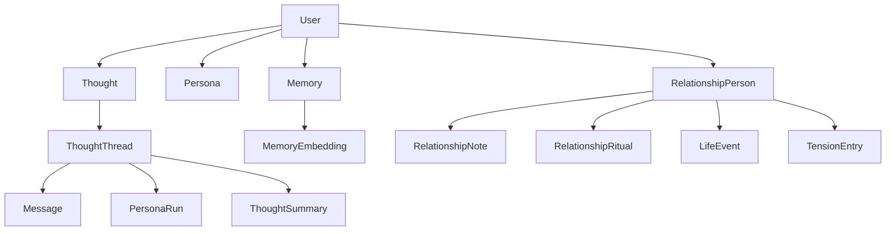
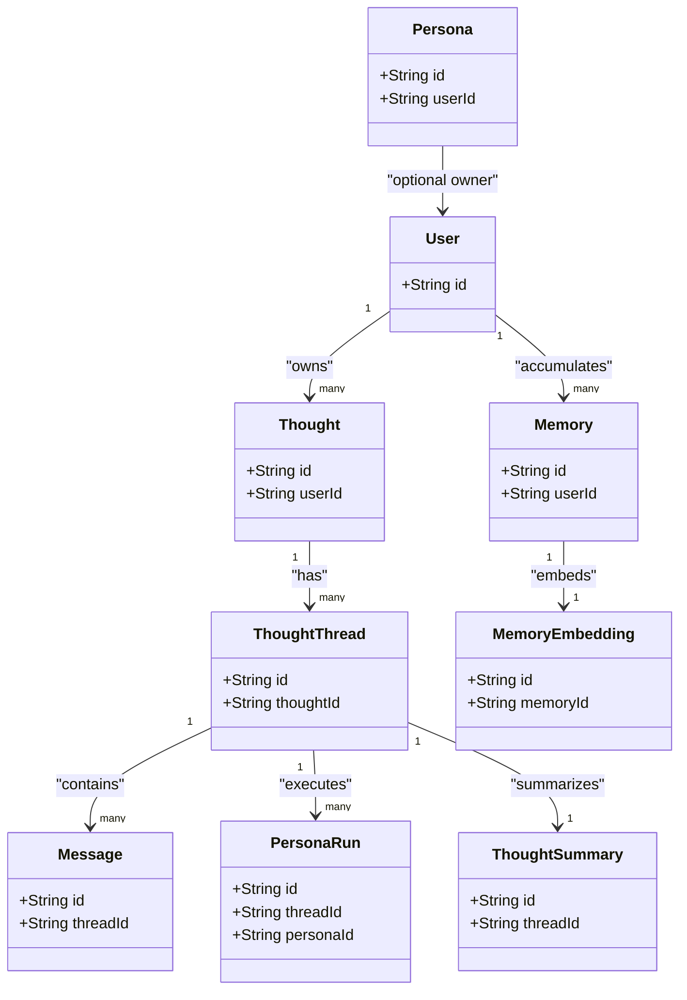
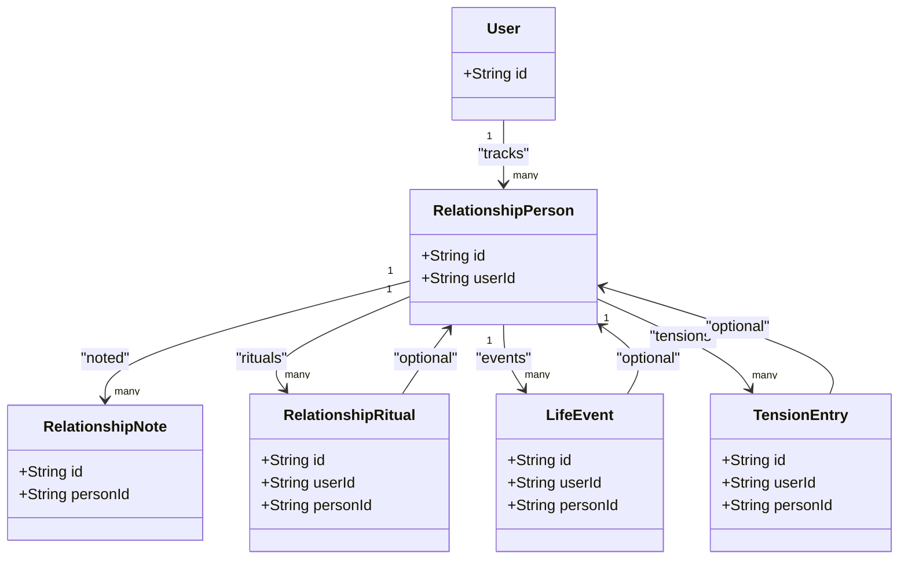
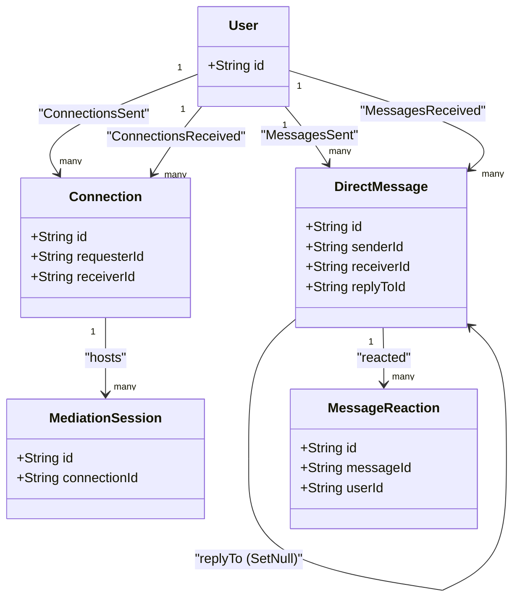
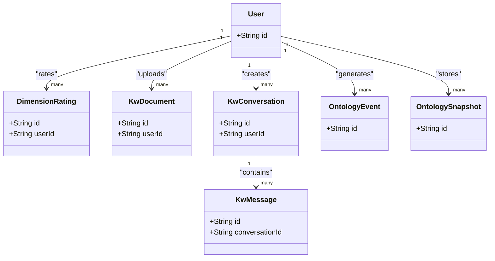
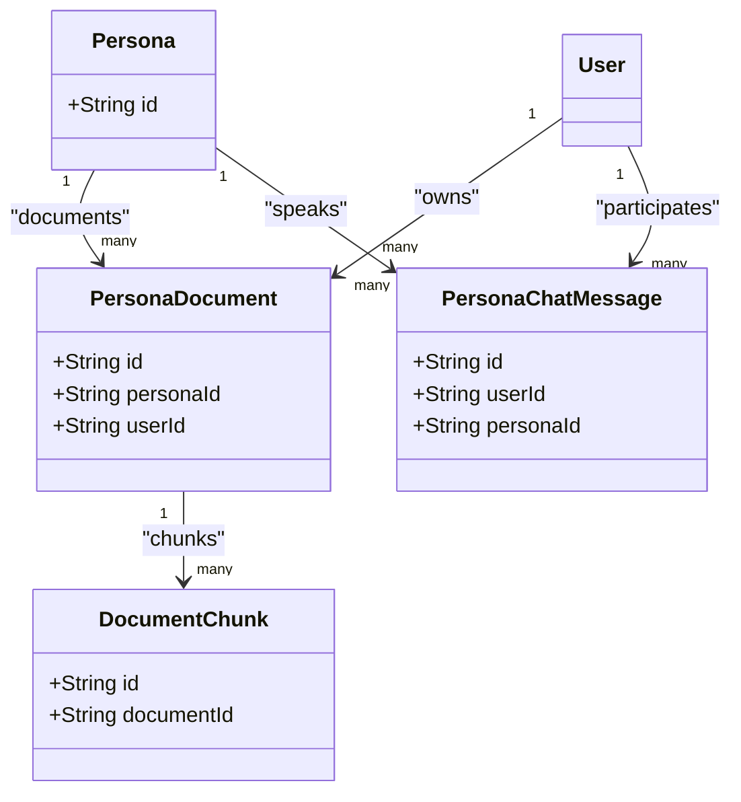
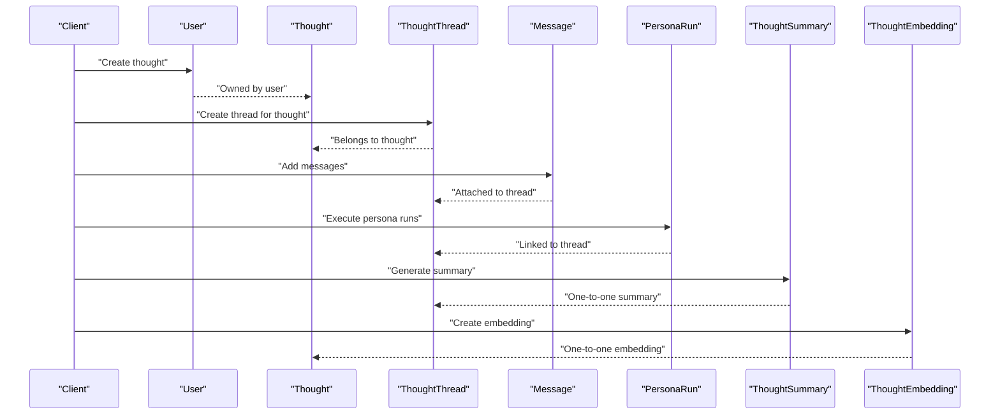
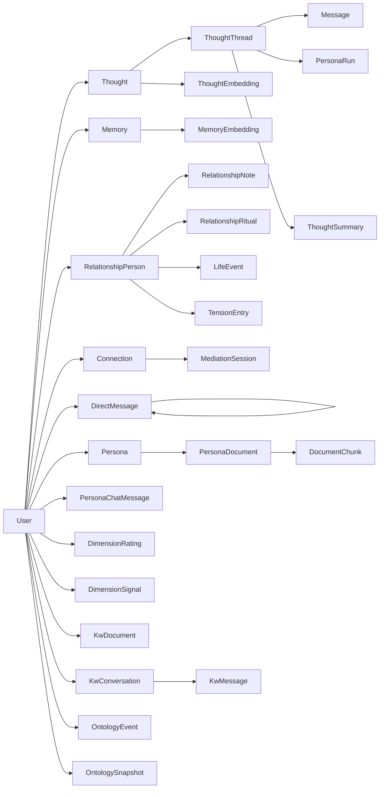

# Entity Relationships

<cite>
**Referenced Files in This Document**
- [schema.prisma](file://backend/prisma/schema.prisma)
- [init migration.sql](file://backend/prisma/migrations/20260415125859_init/migration.sql)
- [social messaging migration.sql](file://backend/prisma/migrations/20260422085110_add_social_messaging/migration.sql)
- [relationship circle migration.sql](file://backend/prisma/migrations/20260419180329_add_relationship_circle/migration.sql)
- [relationship evolution migration.sql](file://backend/prisma/migrations/20260419191045_add_relationship_evolution/migration.sql)
- [rituals and life events migration.sql](file://backend/prisma/migrations/20260422073952_add_rituals_and_life_events/migration.sql)
- [tension entries migration.sql](file://backend/prisma/migrations/20260422075259_add_tension_entries/migration.sql)
- [love language migration.sql](file://backend/prisma/migrations/20260422080027_add_love_language/migration.sql)
- [performance indexes migration.sql](file://backend/prisma/migrations/20260422213232_add_performance_indexes/migration.sql)
- [whatsapp messaging features migration.sql](file://backend/prisma/migrations/20260425182209_add_whatsapp_messaging_features/migration.sql)
- [tri chat migration.sql](file://backend/prisma/migrations/20260430200000_add_tri_chat/migration.sql)
- [mediator v2 migration.sql](file://backend/prisma/migrations/20260430210000_mediator_v2/migration.sql)
- [clear history one sided migration.sql](file://backend/prisma/migrations/20260501070733_clear_history_one_sided/migration.sql)
- [linked user migration.sql](file://backend/prisma/migrations/20260430100000_add_relationship_person_linked_user/migration.sql)
- [phone number migration.sql](file://backend/prisma/migrations/20260430105802_add_relationship_person_phone/migration.sql)
- [kw documents migration.sql](file://backend/prisma/migrations/20260429100000_add_kw_documents/migration.sql)
- [kw tables migration.sql](file://backend/prisma/migrations/20260430000100_add_kw_tables/migration.sql)
- [life dimensions migration.sql](file://backend/prisma/migrations/20260510170000_add_life_dimensions/migration.sql)
- [ontology migration.sql](file://backend/prisma/migrations/20260426120000_add_ontology/migration.sql)
</cite>

## Table of Contents
1. [Introduction](#introduction)
2. [Project Structure](#project-structure)
3. [Core Components](#core-components)
4. [Architecture Overview](#architecture-overview)
5. [Detailed Component Analysis](#detailed-component-analysis)
6. [Dependency Analysis](#dependency-analysis)
7. [Performance Considerations](#performance-considerations)
8. [Troubleshooting Guide](#troubleshooting-guide)
9. [Conclusion](#conclusion)
10. [Appendices](#appendices)

## Introduction
This document provides comprehensive entity relationship documentation for the 4Ever database schema. It focuses on the major entities involved in thought analysis, relationship management, and real-time communication, including User, Thought, Persona, Memory, RelationshipPerson, Message, Connection, and specialized entities such as DimensionRating, KwDocument, and OntologyEvent. For each entity, we describe primary keys, foreign keys, cascade behaviors, many-to-many relationships, and the rationale behind each design. We also explain self-referencing relationships (such as DirectMessage.replyTo) and bidirectional relations (User.connectionsSent and User.connectionsReceived). Finally, we illustrate how these relationships support core application features.

## Project Structure
The database schema is defined using Prisma and evolves through PostgreSQL migrations. The Prisma schema enumerates models and relations, while migrations define the underlying tables, indexes, and foreign keys. This separation allows precise modeling of entities and their relationships, with explicit cascade semantics for data integrity.

```mermaid
graph TB
subgraph "Prisma Schema"
PRISMA["schema.prisma"]
end
subgraph "Migrations"
M_INIT["20260415125859_init/migration.sql"]
M_SOCIAL["20260422085110_add_social_messaging/migration.sql"]
M_REL["20260419180329_add_relationship_circle/migration.sql"]
M_RIT["20260422073952_add_rituals_and_life_events/migration.sql"]
M_TENS["20260422075259_add_tension_entries/migration.sql"]
M_DIM["20260510170000_add_life_dimensions/migration.sql"]
M_KW["20260429100000_add_kw_documents/migration.sql"]
M_KWT["20260430000100_add_kw_tables/migration.sql"]
M_ONTO["20260426120000_add_ontology/migration.sql"]
end
PRISMA --> M_INIT
PRISMA --> M_SOCIAL
PRISMA --> M_REL
PRISMA --> M_RIT
PRISMA --> M_TENS
PRISMA --> M_DIM
PRISMA --> M_KW
PRISMA --> M_KWT
PRISMA --> M_ONTO
```

**Diagram sources**
- [schema.prisma:1-838](file://backend/prisma/schema.prisma#L1-L838)
- [init migration.sql:1-148](file://backend/prisma/migrations/20260415125859_init/migration.sql#L1-L148)
- [social messaging migration.sql:1-54](file://backend/prisma/migrations/20260422085110_add_social_messaging/migration.sql#L1-L54)
- [relationship circle migration.sql:1-35](file://backend/prisma/migrations/20260419180329_add_relationship_circle/migration.sql#L1-L35)
- [rituals and life events migration.sql:1-43](file://backend/prisma/migrations/20260422073952_add_rituals_and_life_events/migration.sql#L1-L43)
- [tension entries migration.sql:1-22](file://backend/prisma/migrations/20260422075259_add_tension_entries/migration.sql#L1-L22)
- [life dimensions migration.sql:1-39](file://backend/prisma/migrations/20260510170000_add_life_dimensions/migration.sql#L1-L39)
- [kw documents migration.sql:1-39](file://backend/prisma/migrations/20260429100000_add_kw_documents/migration.sql#L1-L39)
- [kw tables migration.sql:1-35](file://backend/prisma/migrations/20260430000100_add_kw_tables/migration.sql#L1-L35)
- [ontology migration.sql:1-41](file://backend/prisma/migrations/20260426120000_add_ontology/migration.sql#L1-L41)

**Section sources**
- [schema.prisma:1-838](file://backend/prisma/schema.prisma#L1-L838)

## Core Components
This section outlines the principal entities and their roles in the system, focusing on primary keys, foreign keys, and cascade behaviors as defined in the Prisma schema and migrations.

- User
  - Primary key: id
  - Bidirectional connections via Connection with named relation ends "ConnectionsSent" and "ConnectionsReceived"
  - Self-referencing messages via DirectMessage with named relation ends "MessagesSent" and "MessagesReceived"
  - Many-to-many relationships through shared notes and reactions
  - Cascades: deletes on User cascade to dependent entities (e.g., Thought, Memory, Connection, DirectMessage)

- Thought
  - Primary key: id
  - Foreign key: userId → User(id) with Cascade
  - One-to-many: Thought → ThoughtThread
  - One-to-one: Thought → ThoughtEmbedding

- ThoughtThread
  - Primary key: id
  - Foreign key: thoughtId → Thought(id) with Cascade
  - One-to-many: ThoughtThread → Message and PersonaRun
  - One-to-one: ThoughtThread → ThoughtSummary

- Persona
  - Primary key: id
  - Optional foreign key: userId → User(id) with Cascade
  - One-to-many: Persona → PersonaRun and PersonaDocument
  - One-to-many: Persona → PersonaChatMessage

- Message
  - Primary key: id
  - Foreign key: threadId → ThoughtThread(id) with Cascade
  - No direct foreign key to Persona in Prisma (role/content/personaId present)

- PersonaRun
  - Primary key: id
  - Foreign keys: threadId → ThoughtThread(id), personaId → Persona(id), both with Cascade

- ThoughtSummary
  - Primary key: id
  - Foreign key: threadId → ThoughtThread(id) with Cascade
  - One-to-one relationship with ThoughtThread

- Memory
  - Primary key: id
  - Foreign key: userId → User(id) with Cascade
  - One-to-one: Memory → MemoryEmbedding

- MemoryEmbedding
  - Primary key: id
  - Foreign key: memoryId → Memory(id) with Cascade

- InsightReport
  - Primary key: id
  - Foreign key: userId → User(id) with Cascade

- ThoughtEmbedding
  - Primary key: id
  - Foreign key: thoughtId → Thought(id) with Cascade

- DayPlan
  - Primary key: id
  - Foreign key: userId → User(id) with Cascade
  - One-to-many: DayPlan → PlanTask

- PlanTask
  - Primary key: id
  - Foreign key: planId → DayPlan(id) with Cascade

- DailyCheckIn
  - Primary key: id
  - Foreign key: userId → User(id) with Cascade

- ActionItem
  - Primary key: id
  - Foreign key: userId → User(id) with Cascade

- UserContext
  - Primary key: id
  - Foreign key: userId → User(id) with Cascade

- PersonaDocument
  - Primary key: id
  - Foreign keys: personaId → Persona(id), userId → User(id), both with Cascade
  - One-to-many: PersonaDocument → DocumentChunk

- DocumentChunk
  - Primary key: id
  - Foreign key: documentId → PersonaDocument(id) with Cascade

- CoreChatMessage
  - Primary key: id
  - Foreign key: userId → User(id) with Cascade

- DimensionRating
  - Primary key: id
  - Foreign key: userId → User(id) with Cascade
  - Composite unique constraint on (userId, dimension, source, weekStart)

- DimensionSignal
  - Primary key: id
  - Foreign key: userId → User(id) with Cascade

- RelationshipPerson
  - Primary key: id
  - Foreign key: userId → User(id) with Cascade
  - One-to-many: RelationshipPerson → RelationshipNote, RelationshipRitual, LifeEvent, TensionEntry

- RelationshipNote
  - Primary key: id
  - Foreign key: personId → RelationshipPerson(id) with Cascade

- RelationshipRitual
  - Primary key: id
  - Foreign keys: userId → User(id) with Cascade, personId → RelationshipPerson(id) with SetNull

- LifeEvent
  - Primary key: id
  - Foreign keys: userId → User(id) with Cascade, personId → RelationshipPerson(id) with SetNull

- TensionEntry
  - Primary key: id
  - Foreign keys: userId → User(id) with Cascade, personId → RelationshipPerson(id) with SetNull

- PersonaChatMessage
  - Primary key: id
  - Foreign keys: userId → User(id), personaId → Persona(id), both with Cascade

- Connection
  - Primary key: id
  - Foreign keys: requesterId → User(id), receiverId → User(id), both with Cascade
  - Unique constraint on (requesterId, receiverId)

- DirectMessage
  - Primary key: id
  - Foreign keys: senderId → User(id), receiverId → User(id), both with Cascade
  - Self-reference: replyToId → DirectMessage(id) with SetNull
  - One-to-many: DirectMessage → DirectMessage (replies)

- MediationSession
  - Primary key: id
  - Foreign key: connectionId → Connection(id) with Cascade

- MediationEvent
  - Primary key: id
  - Foreign key: sessionId → MediationSession(id) with Cascade

- MessageReaction
  - Primary key: id
  - Foreign keys: messageId → DirectMessage(id), userId → User(id), both with Cascade
  - Unique constraint on (messageId, userId, emoji)

- SharedNote
  - Primary key: id
  - Foreign key: authorId → User(id) with Cascade

- CoreChatSummary
  - Primary key: id
  - Foreign key: userId → User(id) with Cascade

- ProfileChangeLog
  - Primary key: id
  - Foreign key: userId → User(id) with Cascade

- OntologyEvent
  - Primary key: id
  - No foreign key to User (userId present but not declared as relation in Prisma)
  - Indexed on (userId, domain, processed) and (userId, createdAt)

- OntologySnapshot
  - Primary key: id
  - No foreign key to User (userId present but not declared as relation in Prisma)
  - Unique constraint on (userId, domain, scopeId)

- KwConversation
  - Primary key: id
  - Foreign key: userId → User(id) with Cascade
  - One-to-many: KwConversation → KwMessage

- KwMessage
  - Primary key: id
  - Foreign key: conversationId → KwConversation(id) with Cascade

- KwDocument
  - Primary key: id
  - Foreign key: userId → User(id) with Cascade

- LlmUsage
  - Primary key: id
  - Foreign key: userId → User(id) with Cascade

- Consent
  - Primary key: id
  - Foreign key: userId → User(id) with Cascade
  - Unique constraint on (userId, kind, version)

- TokenQuota
  - Primary key: id
  - Foreign key: userId → User(id) with Cascade

**Section sources**
- [schema.prisma:12-838](file://backend/prisma/schema.prisma#L12-L838)
- [init migration.sql:1-148](file://backend/prisma/migrations/20260415125859_init/migration.sql#L1-L148)
- [social messaging migration.sql:1-54](file://backend/prisma/migrations/20260422085110_add_social_messaging/migration.sql#L1-L54)
- [relationship circle migration.sql:1-35](file://backend/prisma/migrations/20260419180329_add_relationship_circle/migration.sql#L1-L35)
- [rituals and life events migration.sql:1-43](file://backend/prisma/migrations/20260422073952_add_rituals_and_life_events/migration.sql#L1-L43)
- [tension entries migration.sql:1-22](file://backend/prisma/migrations/20260422075259_add_tension_entries/migration.sql#L1-L22)
- [life dimensions migration.sql:1-39](file://backend/prisma/migrations/20260510170000_add_life_dimensions/migration.sql#L1-L39)
- [kw documents migration.sql:1-39](file://backend/prisma/migrations/20260429100000_add_kw_documents/migration.sql#L1-L39)
- [kw tables migration.sql:1-35](file://backend/prisma/migrations/20260430000100_add_kw_tables/migration.sql#L1-L35)
- [ontology migration.sql:1-41](file://backend/prisma/migrations/20260426120000_add_ontology/migration.sql#L1-L41)

## Architecture Overview
The schema supports three primary domains:
- Thought analysis: User → Thought → ThoughtThread → Message/PersonaRun, with embeddings and summaries
- Relationship management: User → RelationshipPerson → RelationshipNote/Ritual/LifeEvent/TensionEntry
- Real-time communication: User ↔ User via Connection and DirectMessage, with reactions and mediated sessions

**Diagram sources**
- [schema.prisma:12-838](file://backend/prisma/schema.prisma#L12-L838)
- [init migration.sql:1-148](file://backend/prisma/migrations/20260415125859_init/migration.sql#L1-L148)

## Detailed Component Analysis

### User and Thought Analysis
- Cardinalities
  - User to Thought: one-to-many
  - Thought to ThoughtThread: one-to-many
  - ThoughtThread to Message/PersonaRun: one-to-many
  - ThoughtThread to ThoughtSummary: one-to-one
  - Thought to ThoughtEmbedding: one-to-one
  - User to Memory: one-to-many
  - Memory to MemoryEmbedding: one-to-one
- Cascade behavior
  - Deletes on User cascade to Thought, Memory, and other dependent entities
  - Deletes on Thought cascade to ThoughtThread and ThoughtEmbedding
  - Deletes on Memory cascade to MemoryEmbedding
- Design rationale
  - Embeddings enable semantic search and similarity queries
  - Threaded messages support persona-driven reasoning and iterative refinement
  - Summaries maintain continuity across long conversations

**Diagram sources**
- [schema.prisma:12-227](file://backend/prisma/schema.prisma#L12-L227)
- [init migration.sql:1-148](file://backend/prisma/migrations/20260415125859_init/migration.sql#L1-L148)

**Section sources**
- [schema.prisma:76-227](file://backend/prisma/schema.prisma#L76-L227)
- [init migration.sql:1-148](file://backend/prisma/migrations/20260415125859_init/migration.sql#L1-L148)

### Relationship Management Entities
- Cardinalities
  - User to RelationshipPerson: one-to-many
  - RelationshipPerson to RelationshipNote/Ritual/LifeEvent/TensionEntry: one-to-many
  - RelationshipRitual/ LifeEvent/ TensionEntry optionally link to RelationshipPerson with SetNull on delete
- Cascade behavior
  - Deletes on User cascade to RelationshipPerson
  - Deletes on RelationshipPerson cascade to RelationshipNote (via Prisma) and SetNull on foreign keys in Ritual/LifeEvent/TensionEntry
- Design rationale
  - Separates people from the user who tracks them, enabling linking to registered users and phone-number resolution
  - Supports dynamic attributes (e.g., love language) and lifecycle events/tensions

**Diagram sources**
- [schema.prisma:401-499](file://backend/prisma/schema.prisma#L401-L499)
- [relationship circle migration.sql:1-35](file://backend/prisma/migrations/20260419180329_add_relationship_circle/migration.sql#L1-L35)
- [rituals and life events migration.sql:1-43](file://backend/prisma/migrations/20260422073952_add_rituals_and_life_events/migration.sql#L1-L43)
- [tension entries migration.sql:1-22](file://backend/prisma/migrations/20260422075259_add_tension_entries/migration.sql#L1-L22)

**Section sources**
- [schema.prisma:401-499](file://backend/prisma/schema.prisma#L401-L499)
- [relationship circle migration.sql:1-35](file://backend/prisma/migrations/20260419180329_add_relationship_circle/migration.sql#L1-L35)
- [rituals and life events migration.sql:1-43](file://backend/prisma/migrations/20260422073952_add_rituals_and_life_events/migration.sql#L1-L43)
- [tension entries migration.sql:1-22](file://backend/prisma/migrations/20260422075259_add_tension_entries/migration.sql#L1-L22)
- [love language migration.sql:1-1](file://backend/prisma/migrations/20260422080027_add_love_language/migration.sql#L1-L1)
- [linked user migration.sql:1-6](file://backend/prisma/migrations/20260430100000_add_relationship_person_linked_user/migration.sql#L1-L6)
- [phone number migration.sql:1-15](file://backend/prisma/migrations/20260430105802_add_relationship_person_phone/migration.sql#L1-L15)

### Real-Time Communication Entities
- Cardinalities
  - User to Connection: bidirectional via Connection (requester/receiver)
  - User to DirectMessage: bidirectional via DirectMessage (sender/receiver)
  - DirectMessage to DirectMessage: one-to-many via replyTo/self-reference
  - DirectMessage to MessageReaction: one-to-many
  - Connection to MediationSession: one-to-many
- Cascade behavior
  - Deletes on User cascade to Connection and DirectMessage
  - Self-reference replyTo with SetNull ensures orphaned replies persist safely
- Design rationale
  - One-sided clearing and mediator sessions enable privacy-preserving chat experiences
  - Reactions and shared notes enrich social interactions

**Diagram sources**
- [schema.prisma:516-596](file://backend/prisma/schema.prisma#L516-L596)
- [social messaging migration.sql:1-54](file://backend/prisma/migrations/20260422085110_add_social_messaging/migration.sql#L1-L54)
- [whatsapp messaging features migration.sql:1-40](file://backend/prisma/migrations/20260425182209_add_whatsapp_messaging_features/migration.sql#L1-L40)
- [tri chat migration.sql:1-2](file://backend/prisma/migrations/20260430200000_add_tri_chat/migration.sql#L1-L2)
- [mediator v2 migration.sql:1-10](file://backend/prisma/migrations/20260430210000_mediator_v2/migration.sql#L1-L10)

**Section sources**
- [schema.prisma:516-596](file://backend/prisma/schema.prisma#L516-L596)
- [social messaging migration.sql:1-54](file://backend/prisma/migrations/20260422085110_add_social_messaging/migration.sql#L1-L54)
- [whatsapp messaging features migration.sql:1-40](file://backend/prisma/migrations/20260425182209_add_whatsapp_messaging_features/migration.sql#L1-L40)
- [performance indexes migration.sql:1-40](file://backend/prisma/migrations/20260422213232_add_performance_indexes/migration.sql#L1-L40)
- [tri chat migration.sql:1-2](file://backend/prisma/migrations/20260430200000_add_tri_chat/migration.sql#L1-L2)
- [mediator v2 migration.sql:1-10](file://backend/prisma/migrations/20260430210000_mediator_v2/migration.sql#L1-L10)
- [clear history one sided migration.sql:1-10](file://backend/prisma/migrations/20260501070733_clear_history_one_sided/migration.sql#L1-L10)

### Specialized Entities: DimensionRating, KwDocument, OntologyEvent
- DimensionRating
  - Primary key: id
  - Foreign key: userId → User(id) with Cascade
  - Composite unique constraint prevents duplicate weekly ratings per dimension/source
- KwDocument and related
  - KwDocument belongs to User; KwConversation belongs to User; KwMessage belongs to KwConversation
  - Document chunks managed outside Prisma with vector embeddings
- OntologyEvent and OntologySnapshot
  - No explicit foreign key relations in Prisma; indexed for efficient processing and snapshotting

**Diagram sources**
- [schema.prisma:366-381](file://backend/prisma/schema.prisma#L366-L381)
- [schema.prisma:748-762](file://backend/prisma/schema.prisma#L748-L762)
- [schema.prisma:718-746](file://backend/prisma/schema.prisma#L718-L746)
- [schema.prisma:670-683](file://backend/prisma/schema.prisma#L670-L683)
- [schema.prisma:685-699](file://backend/prisma/schema.prisma#L685-L699)
- [life dimensions migration.sql:1-39](file://backend/prisma/migrations/20260510170000_add_life_dimensions/migration.sql#L1-L39)
- [kw documents migration.sql:1-39](file://backend/prisma/migrations/20260429100000_add_kw_documents/migration.sql#L1-L39)
- [kw tables migration.sql:1-35](file://backend/prisma/migrations/20260430000100_add_kw_tables/migration.sql#L1-L35)
- [ontology migration.sql:1-41](file://backend/prisma/migrations/20260426120000_add_ontology/migration.sql#L1-L41)

**Section sources**
- [schema.prisma:366-381](file://backend/prisma/schema.prisma#L366-L381)
- [schema.prisma:748-762](file://backend/prisma/schema.prisma#L748-L762)
- [schema.prisma:718-746](file://backend/prisma/schema.prisma#L718-L746)
- [schema.prisma:670-683](file://backend/prisma/schema.prisma#L670-L683)
- [schema.prisma:685-699](file://backend/prisma/schema.prisma#L685-L699)
- [life dimensions migration.sql:1-39](file://backend/prisma/migrations/20260510170000_add_life_dimensions/migration.sql#L1-L39)
- [kw documents migration.sql:1-39](file://backend/prisma/migrations/20260429100000_add_kw_documents/migration.sql#L1-L39)
- [kw tables migration.sql:1-35](file://backend/prisma/migrations/20260430000100_add_kw_tables/migration.sql#L1-L35)
- [ontology migration.sql:1-41](file://backend/prisma/migrations/20260426120000_add_ontology/migration.sql#L1-L41)

### Persona Knowledge Base and Chat
- PersonaDocument and DocumentChunk
  - Document-chunking enables retrieval augmented generation (RAG) for persona prompts
  - Chunks stored separately with optional vector embeddings
- PersonaChatMessage
  - Tracks persona-specific chat sessions scoped to user and persona

**Diagram sources**
- [schema.prisma:318-346](file://backend/prisma/schema.prisma#L318-L346)
- [schema.prisma:501-514](file://backend/prisma/schema.prisma#L501-L514)
- [kw documents migration.sql:1-39](file://backend/prisma/migrations/20260429100000_add_kw_documents/migration.sql#L1-L39)

**Section sources**
- [schema.prisma:318-346](file://backend/prisma/schema.prisma#L318-L346)
- [schema.prisma:501-514](file://backend/prisma/schema.prisma#L501-L514)
- [kw documents migration.sql:1-39](file://backend/prisma/migrations/20260429100000_add_kw_documents/migration.sql#L1-L39)

### Sequence: Thought Creation and Embedding
This sequence illustrates how a thought is created, threaded, summarized, and embedded.

**Diagram sources**
- [schema.prisma:76-168](file://backend/prisma/schema.prisma#L76-L168)
- [init migration.sql:1-148](file://backend/prisma/migrations/20260415125859_init/migration.sql#L1-L148)

## Dependency Analysis
This section maps dependencies among entities and highlights cascade paths that ensure referential integrity.

**Diagram sources**
- [schema.prisma:12-838](file://backend/prisma/schema.prisma#L12-L838)

**Section sources**
- [schema.prisma:12-838](file://backend/prisma/schema.prisma#L12-L838)

## Performance Considerations
- Indexes
  - DirectMessage: composite index on (senderId, receiverId, createdAt) and index on replyToId
  - RelationshipNote: composite index on (personId, createdAt)
  - DimensionRating: unique index on (userId, dimension, source, weekStart) and index on (userId, weekStart)
  - DimensionSignal: indexes on (userId, weekStart) and (userId, dimension, createdAt)
  - KwDocument and KwMessage: indexes on user/conversation timestamps for efficient pagination
  - OntologyEvents and OntologySnapshots: indexes for fast filtering and uniqueness
- Vector embeddings
  - ThoughtEmbedding and MemoryEmbedding enable semantic similarity; ensure appropriate indexing strategies in downstream services
- Cascade deletions
  - Reduce orphaned data but may trigger cascades during user deletion; plan cleanup accordingly

**Section sources**
- [performance indexes migration.sql:1-40](file://backend/prisma/migrations/20260422213232_add_performance_indexes/migration.sql#L1-L40)
- [life dimensions migration.sql:30-39](file://backend/prisma/migrations/20260510170000_add_life_dimensions/migration.sql#L30-L39)
- [kw documents migration.sql:28-39](file://backend/prisma/migrations/20260429100000_add_kw_documents/migration.sql#L28-L39)
- [kw tables migration.sql:26-35](file://backend/prisma/migrations/20260430000100_add_kw_tables/migration.sql#L26-L35)
- [ontology migration.sql:15-41](file://backend/prisma/migrations/20260426120000_add_ontology/migration.sql#L15-L41)

## Troubleshooting Guide
- Cascading deletes
  - Deleting a User removes all owned Thoughts, Memories, Connections, and DirectMessages. Verify cascade paths when removing users.
- Self-referencing replies
  - replyToId uses SetNull on delete; replies persist even if parent is deleted. Monitor orphaned replies if needed.
- Optional relationship links
  - RelationshipRitual, LifeEvent, and TensionEntry permit null personId; ensure application logic handles optional linkage.
- Unique constraints
  - DimensionRating’s composite unique index prevents duplicate weekly ratings; handle conflicts when backfilling or syncing data.
- Index usage
  - Queries on DirectMessage(senderId, receiverId, createdAt) and RelationshipNote(personId, createdAt) rely on indexes; ensure they remain effective after bulk operations.

**Section sources**
- [schema.prisma:551-577](file://backend/prisma/schema.prisma#L551-L577)
- [schema.prisma:444-461](file://backend/prisma/schema.prisma#L444-L461)
- [schema.prisma:463-479](file://backend/prisma/schema.prisma#L463-L479)
- [schema.prisma:481-499](file://backend/prisma/schema.prisma#L481-L499)
- [life dimensions migration.sql:30-39](file://backend/prisma/migrations/20260510170000_add_life_dimensions/migration.sql#L30-L39)

## Conclusion
The 4Ever schema is designed around three pillars: thought analysis, relationship management, and real-time communication. Clear primary keys, explicit foreign keys, and cascade behaviors ensure data integrity. Self-referencing and optional relationships accommodate flexible use cases, while indexes optimize common queries. These relationships collectively support advanced features such as semantic memory, persona-driven reasoning, relationship insights, and secure, mediated messaging.

## Appendices
- Migration evolution
  - Initial schema establishes core thought and memory entities
  - Social messaging adds connections and direct messages with reactions and reply chains
  - Relationship features expand to include notes, rituals, life events, and tensions
  - Dimensions introduce weekly ratings and signals
  - Knowledge Worker introduces isolated document and conversation stores
  - Ontology adds event/snapshot stores for knowledge synthesis

**Section sources**
- [init migration.sql:1-148](file://backend/prisma/migrations/20260415125859_init/migration.sql#L1-L148)
- [social messaging migration.sql:1-54](file://backend/prisma/migrations/20260422085110_add_social_messaging/migration.sql#L1-L54)
- [relationship circle migration.sql:1-35](file://backend/prisma/migrations/20260419180329_add_relationship_circle/migration.sql#L1-L35)
- [rituals and life events migration.sql:1-43](file://backend/prisma/migrations/20260422073952_add_rituals_and_life_events/migration.sql#L1-L43)
- [life dimensions migration.sql:1-39](file://backend/prisma/migrations/20260510170000_add_life_dimensions/migration.sql#L1-L39)
- [kw documents migration.sql:1-39](file://backend/prisma/migrations/20260429100000_add_kw_documents/migration.sql#L1-L39)
- [kw tables migration.sql:1-35](file://backend/prisma/migrations/20260430000100_add_kw_tables/migration.sql#L1-L35)
- [ontology migration.sql:1-41](file://backend/prisma/migrations/20260426120000_add_ontology/migration.sql#L1-L41)