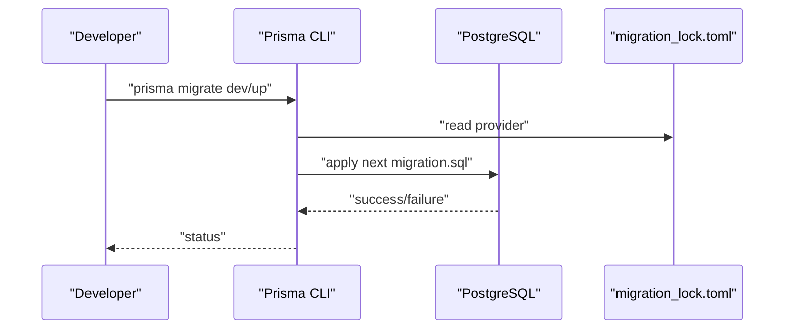
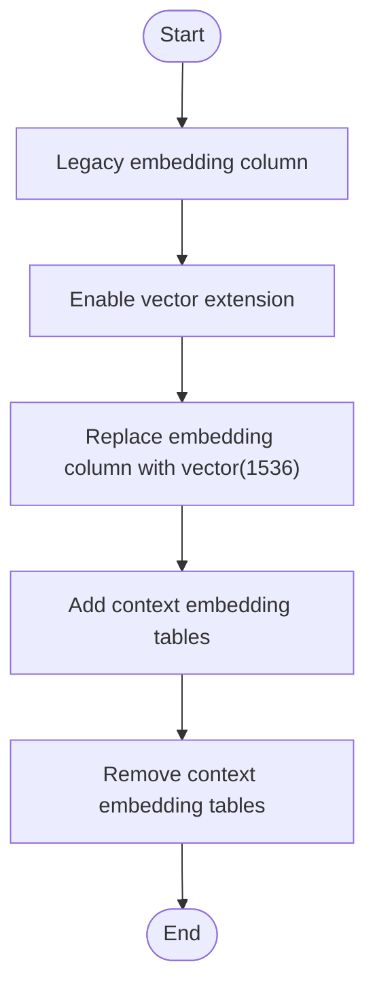
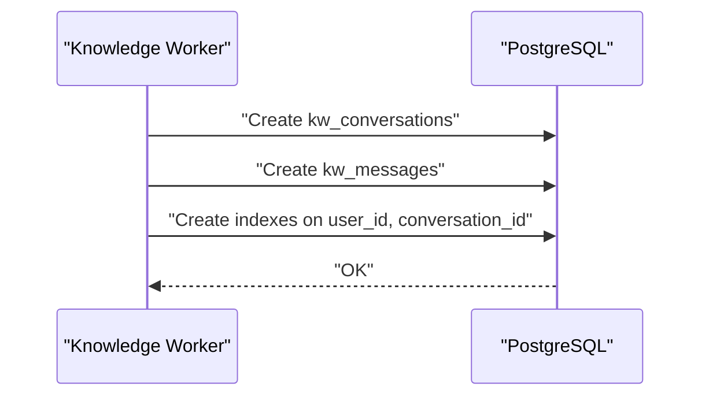
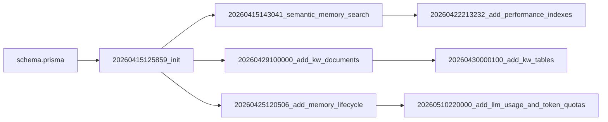

# Migration Management

<cite>
**Referenced Files in This Document**
- [migration_lock.toml](file://backend/prisma/migrations/migration_lock.toml)
- [schema.prisma](file://backend/prisma/schema.prisma)
- [init migration](file://backend/prisma/migrations/20260415125859_init/migration.sql)
- [semantic memory search migration](file://backend/prisma/migrations/20260415143041_semantic_memory_search/migration.sql)
- [add user context migration](file://backend/prisma/migrations/20260415151222_add_user_context/migration.sql)
- [add insights and thought embeddings migration](file://backend/prisma/migrations/20260415171832_add_insights_and_thought_embeddings/migration.sql)
- [add day planner migration](file://backend/prisma/migrations/20260415175017_add_day_planner/migration.sql)
- [add life dimensions features migration](file://backend/prisma/migrations/20260415184323_add_life_dimensions_features/migration.sql)
- [add persona knowledge base migration](file://backend/prisma/migrations/20260416054230_add_persona_knowledge_base/migration.sql)
- [add core chat messages migration](file://backend/prisma/migrations/20260416193727_add_core_chat_messages/migration.sql)
- [make action threadid optional migration](file://backend/prisma/migrations/20260416202012_make_action_threadid_optional/migration.sql)
- [add relationship circle migration](file://backend/prisma/migrations/20260419180329_add_relationship_circle/migration.sql)
- [add relationship evolution migration](file://backend/prisma/migrations/20260419191045_add_relationship_evolution/migration.sql)
- [add rituals and life events migration](file://backend/prisma/migrations/20260422073952_add_rituals_and_life_events/migration.sql)
- [add tension entries migration](file://backend/prisma/migrations/20260422075259_add_tension_entries/migration.sql)
- [add love language migration](file://backend/prisma/migrations/20260422080027_add_love_language/migration.sql)
- [add persona chat messages migration](file://backend/prisma/migrations/20260422083121_add_persona_chat_messages/migration.sql)
- [add social messaging migration](file://backend/prisma/migrations/20260422085110_add_social_messaging/migration.sql)
- [add performance indexes migration](file://backend/prisma/migrations/20260422213232_add_performance_indexes/migration.sql)
- [add core chat session start migration](file://backend/prisma/migrations/20260425082634_add_core_chat_session_start/migration.sql)
- [add memory lifecycle migration](file://backend/prisma/migrations/20260425120506_add_memory_lifecycle/migration.sql)
- [add whatsapp messaging features migration](file://backend/prisma/migrations/20260425182209_add_whatsapp_messaging_features/migration.sql)
- [phone otp auth migration](file://backend/prisma/migrations/20260425194007_phone_otp_auth/migration.sql)
- [add ontology migration](file://backend/prisma/migrations/20260426120000_add_ontology/migration.sql)
- [add context embeddings migration](file://backend/prisma/migrations/20260427085039_add_context_embeddings/migration.sql)
- [remove context embeddings migration](file://backend/prisma/migrations/20260427112419_remove_context_embeddings/migration.sql)
- [unify persona library migration](file://backend/prisma/migrations/20260428100000_unify_persona_library/migration.sql)
- [add user avatar migration](file://backend/prisma/migrations/20260429080622_add_user_avatar/migration.sql)
- [add kw documents migration](file://backend/prisma/migrations/20260429100000_add_kw_documents/migration.sql)
- [add subscription tier migration](file://backend/prisma/migrations/20260430000000_add_subscription_tier/migration.sql)
- [add kw tables migration](file://backend/prisma/migrations/20260430000100_add_kw_tables/migration.sql)
- [add relationship person linked user migration](file://backend/prisma/migrations/20260430100000_add_relationship_person_linked_user/migration.sql)
- [add relationship person phone migration](file://backend/prisma/migrations/20260430105802_add_relationship_person_phone/migration.sql)
- [add tri chat migration](file://backend/prisma/migrations/20260430200000_add_tri_chat/migration.sql)
- [mediator v2 migration](file://backend/prisma/migrations/20260430210000_mediator_v2/migration.sql)
- [clear history one sided migration](file://backend/prisma/migrations/20260501070733_clear_history_one_sided/migration.sql)
- [add mediator name migration](file://backend/prisma/migrations/20260501081526_add_mediator_name/migration.sql)
- [tri chat default on migration](file://backend/prisma/migrations/20260501141000_tri_chat_default_on/migration.sql)
- [add user timezone migration](file://backend/prisma/migrations/20260510120000_add_user_timezone/migration.sql)
- [add session recap cache migration](file://backend/prisma/migrations/20260510150000_add_session_recap_cache/migration.sql)
- [add consent and export delete migration](file://backend/prisma/migrations/20260510160032_add_consent_and_export_delete/migration.sql)
- [add life dimensions migration](file://backend/prisma/migrations/20260510170000_add_life_dimensions/migration.sql)
- [add sign in with apple migration](file://backend/prisma/migrations/20260510180000_add_sign_in_with_apple/migration.sql)
- [add llm usage and token quotas migration](file://backend/prisma/migrations/20260510220000_add_llm_usage_and_token_quotas/migration.sql)
</cite>

## Table of Contents
1. [Introduction](#introduction)
2. [Project Structure](#project-structure)
3. [Core Components](#core-components)
4. [Architecture Overview](#architecture-overview)
5. [Detailed Component Analysis](#detailed-component-analysis)
6. [Dependency Analysis](#dependency-analysis)
7. [Performance Considerations](#performance-considerations)
8. [Troubleshooting Guide](#troubleshooting-guide)
9. [Conclusion](#conclusion)
10. [Appendices](#appendices)

## Introduction
This document describes the migration management process for the 4Ever Prisma-based PostgreSQL database. It explains the chronological evolution of the schema from initial tables through advanced features such as semantic memory, knowledge worker, and performance optimizations. It covers the migration file naming convention (YYYYMMDDHHMMSS_description), the purpose of each migration step, and the migration_lock.toml mechanism that prevents concurrent migrations. It also documents rollback strategies, handling failed migrations, manual intervention requirements, production deployment considerations, and best practices for schema evolution, data preservation, and testing.

## Project Structure
The migration system resides under backend/prisma/migrations. Each migration is a dated folder containing a single migration.sql file. A lock file ensures safe concurrent operation. The Prisma schema defines the current model and PostgreSQL-specific extensions.

**Diagram sources**
- [schema.prisma](file://backend/prisma/schema.prisma)
- [migration_lock.toml](file://backend/prisma/migrations/migration_lock.toml)
- [init migration](file://backend/prisma/migrations/20260415125859_init/migration.sql)
- [semantic memory search migration](file://backend/prisma/migrations/20260415143041_semantic_memory_search/migration.sql)
- [add user context migration](file://backend/prisma/migrations/20260415151222_add_user_context/migration.sql)
- [add insights and thought embeddings migration](file://backend/prisma/migrations/20260415171832_add_insights_and_thought_embeddings/migration.sql)
- [add day planner migration](file://backend/prisma/migrations/20260415175017_add_day_planner/migration.sql)
- [add life dimensions features migration](file://backend/prisma/migrations/20260415184323_add_life_dimensions_features/migration.sql)
- [add persona knowledge base migration](file://backend/prisma/migrations/20260416054230_add_persona_knowledge_base/migration.sql)
- [add core chat messages migration](file://backend/prisma/migrations/20260416193727_add_core_chat_messages/migration.sql)
- [make action threadid optional migration](file://backend/prisma/migrations/20260416202012_make_action_threadid_optional/migration.sql)
- [add relationship circle migration](file://backend/prisma/migrations/20260419180329_add_relationship_circle/migration.sql)
- [add relationship evolution migration](file://backend/prisma/migrations/20260419191045_add_relationship_evolution/migration.sql)
- [add rituals and life events migration](file://backend/prisma/migrations/20260422073952_add_rituals_and_life_events/migration.sql)
- [add tension entries migration](file://backend/prisma/migrations/20260422075259_add_tension_entries/migration.sql)
- [add love language migration](file://backend/prisma/migrations/20260422080027_add_love_language/migration.sql)
- [add persona chat messages migration](file://backend/prisma/migrations/20260422083121_add_persona_chat_messages/migration.sql)
- [add social messaging migration](file://backend/prisma/migrations/20260422085110_add_social_messaging/migration.sql)
- [add performance indexes migration](file://backend/prisma/migrations/20260422213232_add_performance_indexes/migration.sql)
- [add core chat session start migration](file://backend/prisma/migrations/20260425082634_add_core_chat_session_start/migration.sql)
- [add memory lifecycle migration](file://backend/prisma/migrations/20260425120506_add_memory_lifecycle/migration.sql)
- [add whatsapp messaging features migration](file://backend/prisma/migrations/20260425182209_add_whatsapp_messaging_features/migration.sql)
- [phone otp auth migration](file://backend/prisma/migrations/20260425194007_phone_otp_auth/migration.sql)
- [add ontology migration](file://backend/prisma/migrations/20260426120000_add_ontology/migration.sql)
- [add context embeddings migration](file://backend/prisma/migrations/20260427085039_add_context_embeddings/migration.sql)
- [remove context embeddings migration](file://backend/prisma/migrations/20260427112419_remove_context_embeddings/migration.sql)
- [unify persona library migration](file://backend/prisma/migrations/20260428100000_unify_persona_library/migration.sql)
- [add user avatar migration](file://backend/prisma/migrations/20260429080622_add_user_avatar/migration.sql)
- [add kw documents migration](file://backend/prisma/migrations/20260429100000_add_kw_documents/migration.sql)
- [add subscription tier migration](file://backend/prisma/migrations/20260430000000_add_subscription_tier/migration.sql)
- [add kw tables migration](file://backend/prisma/migrations/20260430000100_add_kw_tables/migration.sql)
- [add relationship person linked user migration](file://backend/prisma/migrations/20260430100000_add_relationship_person_linked_user/migration.sql)
- [add relationship person phone migration](file://backend/prisma/migrations/20260430105802_add_relationship_person_phone/migration.sql)
- [add tri chat migration](file://backend/prisma/migrations/20260430200000_add_tri_chat/migration.sql)
- [mediator v2 migration](file://backend/prisma/migrations/20260430210000_mediator_v2/migration.sql)
- [clear history one sided migration](file://backend/prisma/migrations/20260501070733_clear_history_one_sided/migration.sql)
- [add mediator name migration](file://backend/prisma/migrations/20260501081526_add_mediator_name/migration.sql)
- [tri chat default on migration](file://backend/prisma/migrations/20260501141000_tri_chat_default_on/migration.sql)
- [add user timezone migration](file://backend/prisma/migrations/20260510120000_add_user_timezone/migration.sql)
- [add session recap cache migration](file://backend/prisma/migrations/20260510150000_add_session_recap_cache/migration.sql)
- [add consent and export delete migration](file://backend/prisma/migrations/20260510160032_add_consent_and_export_delete/migration.sql)
- [add life dimensions migration](file://backend/prisma/migrations/20260510170000_add_life_dimensions/migration.sql)
- [add sign in with apple migration](file://backend/prisma/migrations/20260510180000_add_sign_in_with_apple/migration.sql)
- [add llm usage and token quotas migration](file://backend/prisma/migrations/20260510220000_add_llm_usage_and_token_quotas/migration.sql)

**Section sources**
- [schema.prisma](file://backend/prisma/schema.prisma)
- [migration_lock.toml](file://backend/prisma/migrations/migration_lock.toml)

## Core Components
- Migration files: Each YYYYMMDDHHMMSS_description folder contains a single migration.sql file that applies a specific schema change.
- Naming convention: Eighteen-digit timestamp followed by an underscore and a lowercase, hyphen-free description.
- Lock mechanism: migration_lock.toml indicates the provider and should be version-controlled to coordinate deployments safely.
- Schema definition: schema.prisma defines the current model and PostgreSQL extensions (e.g., vector) used by migrations.

**Section sources**
- [migration_lock.toml](file://backend/prisma/migrations/migration_lock.toml)
- [schema.prisma](file://backend/prisma/schema.prisma)

## Architecture Overview
The migration pipeline is a linear sequence of immutable changes applied in timestamp order. Each migration is designed to be idempotent in intent and safe for production when validated. The Prisma schema serves as the authoritative source of truth for the current model, while migrations represent the historical path to reach that model.

**Diagram sources**
- [migration_lock.toml](file://backend/prisma/migrations/migration_lock.toml)
- [schema.prisma](file://backend/prisma/schema.prisma)

## Detailed Component Analysis

### Migration Naming Convention and Purpose
- Format: YYYYMMDDHHMMSS_description
- Examples:
  - 20260415125859_init: Initial schema creation.
  - 20260415143041_semantic_memory_search: Switch to PostgreSQL vector extension for embeddings.
  - 20260422213232_add_performance_indexes: Add composite indexes for query hotspots.
  - 20260430000100_add_kw_tables: Introduce Knowledge Worker tables.
  - 20260510220000_add_llm_usage_and_token_quotas: Add cost-control telemetry and quotas.

**Section sources**
- [init migration](file://backend/prisma/migrations/20260415125859_init/migration.sql)
- [semantic memory search migration](file://backend/prisma/migrations/20260415143041_semantic_memory_search/migration.sql)
- [add performance indexes migration](file://backend/prisma/migrations/20260422213232_add_performance_indexes/migration.sql)
- [add kw tables migration](file://backend/prisma/migrations/20260430000100_add_kw_tables/migration.sql)
- [add llm usage and token quotas migration](file://backend/prisma/migrations/20260510220000_add_llm_usage_and_token_quotas/migration.sql)

### Semantic Memory and Embeddings Evolution
- Initial vector storage: Uses a binary vector column in early memory_embeddings.
- Migration to pgvector: Drops legacy column and adds a vector(1536) column with the vector extension enabled.
- Context embeddings: Adds dedicated embedding tables for various domain entities, later removed in a targeted cleanup migration.

**Diagram sources**
- [semantic memory search migration](file://backend/prisma/migrations/20260415143041_semantic_memory_search/migration.sql)
- [add context embeddings migration](file://backend/prisma/migrations/20260427085039_add_context_embeddings/migration.sql)
- [remove context embeddings migration](file://backend/prisma/migrations/20260427112419_remove_context_embeddings/migration.sql)

**Section sources**
- [semantic memory search migration](file://backend/prisma/migrations/20260415143041_semantic_memory_search/migration.sql)
- [add context embeddings migration](file://backend/prisma/migrations/20260427085039_add_context_embeddings/migration.sql)
- [remove context embeddings migration](file://backend/prisma/migrations/20260427112419_remove_context_embeddings/migration.sql)

### Knowledge Worker Feature Rollout
- Documents: Adds document metadata and chunking tables for ingestion.
- Conversations and Messages: Isolated Knowledge Worker tables with indexes optimized for streaming and retrieval.
- Tables: kw_conversations, kw_messages; indexes on user_id and conversation_id.

**Diagram sources**
- [add kw documents migration](file://backend/prisma/migrations/20260429100000_add_kw_documents/migration.sql)
- [add kw tables migration](file://backend/prisma/migrations/20260430000100_add_kw_tables/migration.sql)

**Section sources**
- [add kw documents migration](file://backend/prisma/migrations/20260429100000_add_kw_documents/migration.sql)
- [add kw tables migration](file://backend/prisma/migrations/20260430000100_add_kw_tables/migration.sql)

### Performance Optimizations and Index Strategy
- Composite indexes on frequently filtered/sorted columns:
  - action_items_user_id_status_idx
  - core_chat_messages_user_id_created_at_idx
  - direct_messages_sender_id_receiver_id_created_at_idx
  - persona_chat_messages_user_id_persona_id_created_at_idx
  - relationship_notes_person_id_created_at_idx
- Additional indexes for core_chat_summaries and profile_change_logs to support analytics and lifecycle queries.

**Section sources**
- [add performance indexes migration](file://backend/prisma/migrations/20260422213232_add_performance_indexes/migration.sql)
- [add memory lifecycle migration](file://backend/prisma/migrations/20260425120506_add_memory_lifecycle/migration.sql)

### Advanced Features and Lifecycle Management
- Memory lifecycle: Adds status, category, access counters, and superseding relationships; introduces core_chat_summaries and profile_change_logs.
- Tri-chat and mediator: Adds tri-chat enablement flags, one-sided clearing, mediator name, and default-on behavior.
- Consent and export: Adds consent records and deletion hooks for privacy compliance.
- LLM usage and quotas: Adds per-request telemetry and token quota management for cost control.

**Section sources**
- [add memory lifecycle migration](file://backend/prisma/migrations/20260425120506_add_memory_lifecycle/migration.sql)
- [add tri chat migration](file://backend/prisma/migrations/20260430200000_add_tri_chat/migration.sql)
- [mediator v2 migration](file://backend/prisma/migrations/20260430210000_mediator_v2/migration.sql)
- [clear history one sided migration](file://backend/prisma/migrations/20260501070733_clear_history_one_sided/migration.sql)
- [add mediator name migration](file://backend/prisma/migrations/20260501081526_add_mediator_name/migration.sql)
- [tri chat default on migration](file://backend/prisma/migrations/20260501141000_tri_chat_default_on/migration.sql)
- [add consent and export delete migration](file://backend/prisma/migrations/20260510160032_add_consent_and_export_delete/migration.sql)
- [add llm usage and token quotas migration](file://backend/prisma/migrations/20260510220000_add_llm_usage_and_token_quotas/migration.sql)

### Migration Lock Mechanism
- Purpose: Prevents concurrent migrations across environments by indicating the provider and requiring coordinated deployment.
- Behavior: The presence of the lock file and its provider value guide safe application of migrations.

**Section sources**
- [migration_lock.toml](file://backend/prisma/migrations/migration_lock.toml)

### Rollback Strategies
- Current state: The migration system does not define built-in rollback commands. Migrations are intended to be additive or idempotent in design.
- Recommended approach:
  - Use a staging environment to validate schema changes and queries.
  - Maintain a backup of the production database before applying migrations.
  - If a failure occurs, revert to the last known-good backup and re-apply migrations sequentially from the last successful migration.
  - For destructive changes (e.g., dropping tables), rely on the backup and re-run subsequent migrations.

**Section sources**
- [migration_lock.toml](file://backend/prisma/migrations/migration_lock.toml)

### Handling Failed Migrations and Manual Intervention
- Failure scenarios:
  - Lock conflicts: Resolve by ensuring only one deployment process writes to the database.
  - Data type errors: Verify vector extension availability and correct column definitions.
  - Constraint violations: Ensure referential integrity and indexes are created in the correct order.
- Manual steps:
  - Enable vector extension if missing.
  - Re-run failed migrations individually after fixing the underlying issue.
  - Validate foreign keys and indexes post-migration.

**Section sources**
- [semantic memory search migration](file://backend/prisma/migrations/20260415143041_semantic_memory_search/migration.sql)
- [add performance indexes migration](file://backend/prisma/migrations/20260422213232_add_performance_indexes/migration.sql)

### Production Deployment Considerations
- Safety:
  - Run migrations in a maintenance window or during low-traffic periods.
  - Use read replicas or offline mode for write-heavy migrations.
- Validation:
  - Test migrations on a staging replica of production data.
  - Verify indexes and query plans after adding new indexes.
- Monitoring:
  - Monitor long-running DDL operations and query performance regressions.
  - Track LLM usage metrics after enabling telemetry tables.

**Section sources**
- [add llm usage and token quotas migration](file://backend/prisma/migrations/20260510220000_add_llm_usage_and_token_quotas/migration.sql)
- [add performance indexes migration](file://backend/prisma/migrations/20260422213232_add_performance_indexes/migration.sql)

### Complex Migration Patterns
- Vector embeddings:
  - Replace legacy binary vectors with vector(1536) using the vector extension.
  - Add domain-specific embedding tables and remove them in a later cleanup migration.
- New table additions:
  - Isolated Knowledge Worker tables with appropriate foreign keys and indexes.
  - Lifecycle tables for summaries and change logs.
- Index optimizations:
  - Composite indexes on multi-column filters and sorts.
  - Unique constraints on embedding linkage tables.

**Section sources**
- [semantic memory search migration](file://backend/prisma/migrations/20260415143041_semantic_memory_search/migration.sql)
- [add context embeddings migration](file://backend/prisma/migrations/20260427085039_add_context_embeddings/migration.sql)
- [remove context embeddings migration](file://backend/prisma/migrations/20260427112419_remove_context_embeddings/migration.sql)
- [add kw tables migration](file://backend/prisma/migrations/20260430000100_add_kw_tables/migration.sql)
- [add performance indexes migration](file://backend/prisma/migrations/20260422213232_add_performance_indexes/migration.sql)

### Best Practices for Schema Evolution and Testing
- Idempotency: Design migrations to be safe to re-run when applied in order.
- Backups: Always snapshot production before applying migrations.
- Staging parity: Mirror production schema and data size in staging for realistic testing.
- Index coverage: Add indexes before heavy read workloads; validate EXPLAIN plans.
- Data preservation: Use ALTER TABLE with defaults and nullable columns; avoid DROP COLUMN when possible.
- Testing strategies:
  - Unit test queries against representative datasets.
  - Load test with realistic concurrency and workload mix.
  - Validate Prisma client generation after schema changes.

[No sources needed since this section provides general guidance]

## Dependency Analysis
Migrations depend on:
- Prisma schema for model correctness.
- PostgreSQL vector extension for embeddings.
- Proper ordering due to foreign keys and indexes.

**Diagram sources**
- [schema.prisma](file://backend/prisma/schema.prisma)
- [init migration](file://backend/prisma/migrations/20260415125859_init/migration.sql)
- [semantic memory search migration](file://backend/prisma/migrations/20260415143041_semantic_memory_search/migration.sql)
- [add performance indexes migration](file://backend/prisma/migrations/20260422213232_add_performance_indexes/migration.sql)
- [add kw documents migration](file://backend/prisma/migrations/20260429100000_add_kw_documents/migration.sql)
- [add kw tables migration](file://backend/prisma/migrations/20260430000100_add_kw_tables/migration.sql)
- [add memory lifecycle migration](file://backend/prisma/migrations/20260425120506_add_memory_lifecycle/migration.sql)
- [add llm usage and token quotas migration](file://backend/prisma/migrations/20260510220000_add_llm_usage_and_token_quotas/migration.sql)

**Section sources**
- [schema.prisma](file://backend/prisma/schema.prisma)

## Performance Considerations
- Embedding operations: Ensure vector extension is enabled and leverage GIN/HNSW indexes where applicable.
- Query patterns: Add composite indexes aligned with WHERE and ORDER BY clauses.
- Telemetry overhead: LLM usage logging is designed to be fire-and-forget; monitor cardinality and retention policies.

[No sources needed since this section provides general guidance]

## Troubleshooting Guide
- Concurrent migration failures:
  - Ensure only one process writes to the database.
  - Verify migration_lock.toml is present and committed.
- Vector extension issues:
  - Confirm vector extension is installed and accessible.
  - Recreate embedding columns using vector(1536).
- Index creation timeouts:
  - Run during off-peak hours.
  - Break large indexes into smaller batches if necessary.
- Data integrity:
  - Validate foreign keys after adding new relations.
  - Re-index periodically to maintain query performance.

**Section sources**
- [migration_lock.toml](file://backend/prisma/migrations/migration_lock.toml)
- [semantic memory search migration](file://backend/prisma/migrations/20260415143041_semantic_memory_search/migration.sql)
- [add performance indexes migration](file://backend/prisma/migrations/20260422213232_add_performance_indexes/migration.sql)

## Conclusion
The 4Ever Prisma migration system follows a strict chronological sequence with clear naming and a lock mechanism to prevent conflicts. The evolution includes foundational tables, semantic memory with vector embeddings, performance optimizations, and advanced features like Knowledge Worker and lifecycle management. For safe production deployments, always validate in staging, back up production, and apply migrations in order while monitoring performance and telemetry.

[No sources needed since this section summarizes without analyzing specific files]

## Appendices

### Appendix A: Timeline of Major Milestones
- Initial schema and core chat: 20260415125859_init
- Semantic memory search: 20260415143041_semantic_memory_search
- User context and insights: 20260415151222_add_user_context, 20260415171832_add_insights_and_thought_embeddings
- Planning and dimensions: 20260415175017_add_day_planner, 20260415184323_add_life_dimensions_features
- Knowledge Base and Core Chat enhancements: 20260416054230_add_persona_knowledge_base, 20260416193727_add_core_chat_messages
- Optional thread ID: 20260416202012_make_action_threadid_optional
- Relationships: 20260419180329_add_relationship_circle, 20260419191045_add_relationship_evolution
- Rituals, life events, tensions, love language: 20260422073952_add_rituals_and_life_events, 20260422075259_add_tension_entries, 20260422080027_add_love_language
- Persona chat and social messaging: 20260422083121_add_persona_chat_messages, 20260422085110_add_social_messaging
- Performance indexes: 20260422213232_add_performance_indexes
- Session start and lifecycle: 20260425082634_add_core_chat_session_start, 20260425120506_add_memory_lifecycle
- Messaging features: 20260425182209_add_whatsapp_messaging_features, 20260425194007_phone_otp_auth
- Ontology: 20260426120000_add_ontology
- Context embeddings and cleanup: 20260427085039_add_context_embeddings, 20260427112419_remove_context_embeddings
- Persona unification and avatar: 20260428100000_unify_persona_library, 20260429080622_add_user_avatar
- Knowledge Worker documents: 20260429100000_add_kw_documents
- Subscription tier: 20260430000000_add_subscription_tier
- Knowledge Worker tables: 20260430000100_add_kw_tables
- Relationship person enhancements: 20260430100000_add_relationship_person_linked_user, 20260430105802_add_relationship_person_phone
- Tri-chat and mediator: 20260430200000_add_tri_chat, 20260430210000_mediator_v2, 20260501070733_clear_history_one_sided, 20260501081526_add_mediator_name, 20260501141000_tri_chat_default_on
- User timezone and session recap: 20260510120000_add_user_timezone, 20260510150000_add_session_recap_cache
- Consent and export: 20260510160032_add_consent_and_export_delete
- Life dimensions: 20260510170000_add_life_dimensions
- Sign-in with Apple: 20260510180000_add_sign_in_with_apple
- LLM usage and token quotas: 20260510220000_add_llm_usage_and_token_quotas

**Section sources**
- [init migration](file://backend/prisma/migrations/20260415125859_init/migration.sql)
- [semantic memory search migration](file://backend/prisma/migrations/20260415143041_semantic_memory_search/migration.sql)
- [add performance indexes migration](file://backend/prisma/migrations/20260422213232_add_performance_indexes/migration.sql)
- [add kw tables migration](file://backend/prisma/migrations/20260430000100_add_kw_tables/migration.sql)
- [add llm usage and token quotas migration](file://backend/prisma/migrations/20260510220000_add_llm_usage_and_token_quotas/migration.sql)