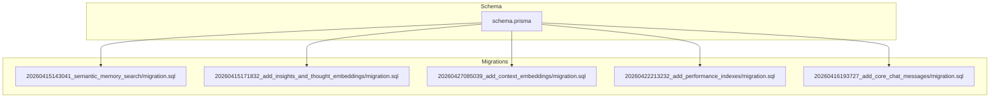
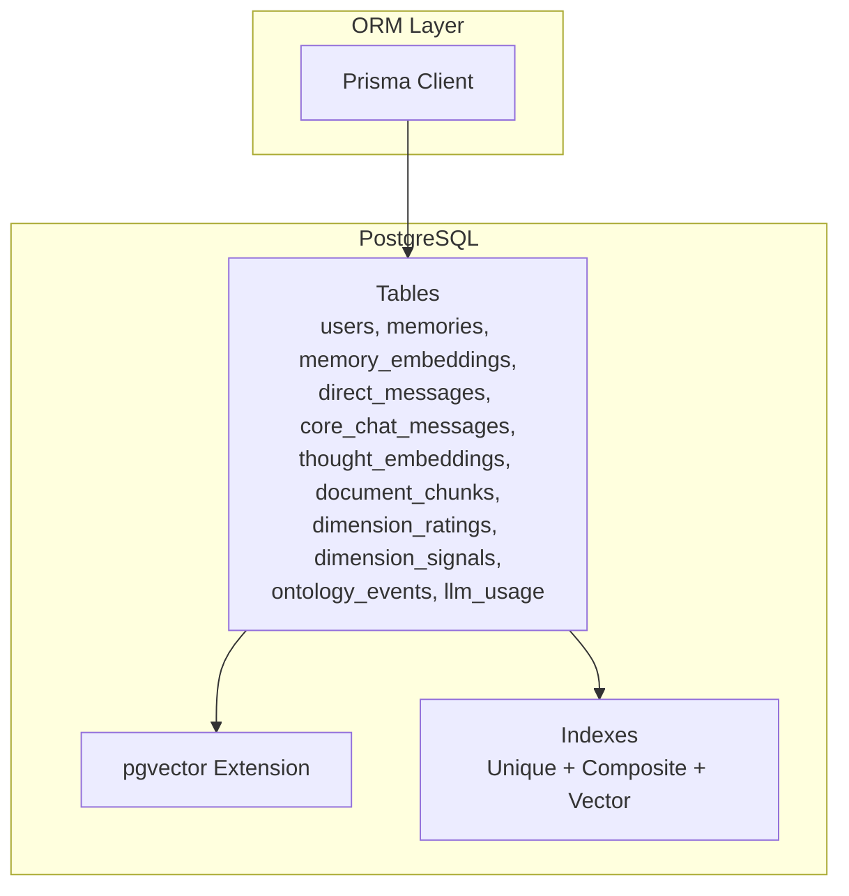
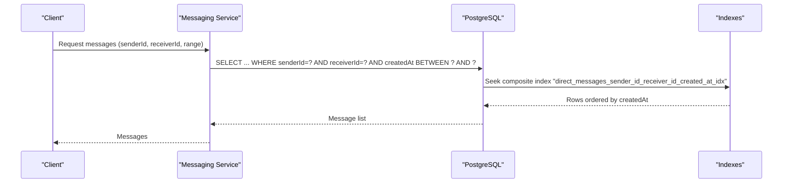
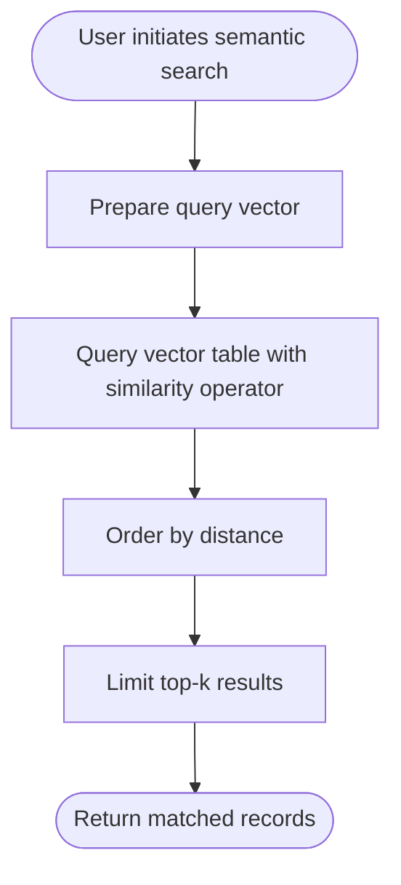
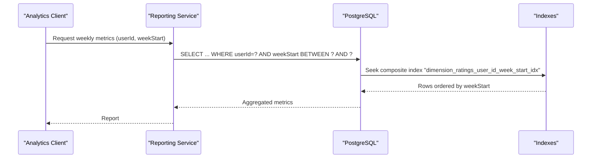
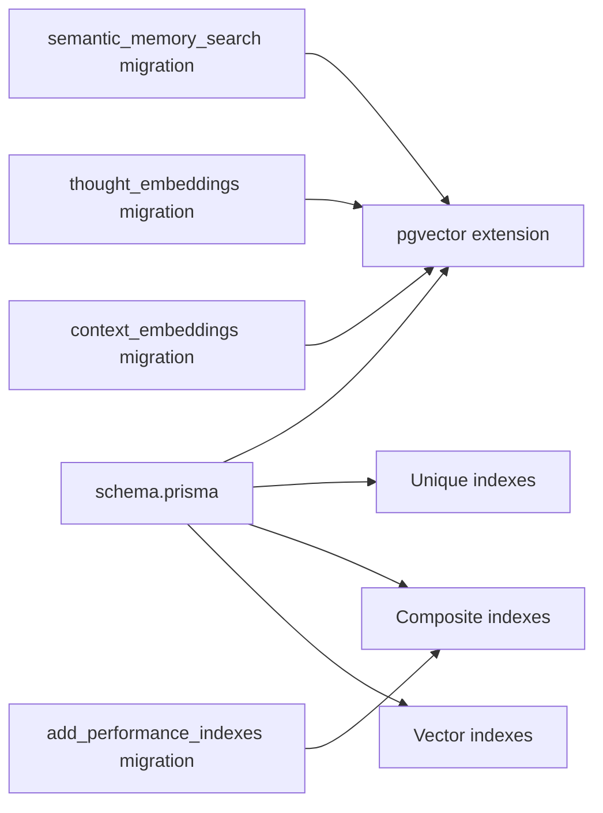

# Performance & Indexing

<cite>
**Referenced Files in This Document**
- [schema.prisma](file://backend/prisma/schema.prisma)
- [20260422213232_add_performance_indexes/migration.sql](file://backend/prisma/migrations/20260422213232_add_performance_indexes/migration.sql)
- [20260415143041_semantic_memory_search/migration.sql](file://backend/prisma/migrations/20260415143041_semantic_memory_search/migration.sql)
- [20260415171832_add_insights_and_thought_embeddings/migration.sql](file://backend/prisma/migrations/20260415171832_add_insights_and_thought_embeddings/migration.sql)
- [20260427085039_add_context_embeddings/migration.sql](file://backend/prisma/migrations/20260427085039_add_context_embeddings/migration.sql)
- [20260416193727_add_core_chat_messages/migration.sql](file://backend/prisma/migrations/20260416193727_add_core_chat_messages/migration.sql)
</cite>

## Table of Contents
1. [Introduction](#introduction)
2. [Project Structure](#project-structure)
3. [Core Components](#core-components)
4. [Architecture Overview](#architecture-overview)
5. [Detailed Component Analysis](#detailed-component-analysis)
6. [Dependency Analysis](#dependency-analysis)
7. [Performance Considerations](#performance-considerations)
8. [Troubleshooting Guide](#troubleshooting-guide)
9. [Conclusion](#conclusion)
10. [Appendices](#appendices)

## Introduction
This document focuses on the 4Ever database optimization strategies implemented via Prisma schema and migrations. It catalogs existing indexes (including unique and composite indexes), explains specialized vector indexes for semantic similarity, and maps index choices to real-time messaging, semantic search, and analytical reporting workloads. It also covers query optimization, connection pooling, caching strategies, write/read trade-offs, monitoring, partitioning, and maintenance procedures grounded in the repository’s schema and migration history.

## Project Structure
The database schema and indexes are defined in the Prisma schema and implemented through PostgreSQL migrations. Key areas:
- Schema-level indexes and relations are declared in the Prisma schema.
- Vector extension and vector column migrations enable semantic similarity search.
- Dedicated performance-index migrations add composite indexes for hot query patterns.

**Diagram sources**
- [schema.prisma](file://backend/prisma/schema.prisma)
- [20260415143041_semantic_memory_search/migration.sql](file://backend/prisma/migrations/20260415143041_semantic_memory_search/migration.sql)
- [20260415171832_add_insights_and_thought_embeddings/migration.sql](file://backend/prisma/migrations/20260415171832_add_insights_and_thought_embeddings/migration.sql)
- [20260427085039_add_context_embeddings/migration.sql](file://backend/prisma/migrations/20260427085039_add_context_embeddings/migration.sql)
- [20260422213232_add_performance_indexes/migration.sql](file://backend/prisma/migrations/20260422213232_add_performance_indexes/migration.sql)
- [20260416193727_add_core_chat_messages/migration.sql](file://backend/prisma/migrations/20260416193727_add_core_chat_messages/migration.sql)

**Section sources**
- [schema.prisma](file://backend/prisma/schema.prisma)
- [20260422213232_add_performance_indexes/migration.sql](file://backend/prisma/migrations/20260422213232_add_performance_indexes/migration.sql)

## Core Components
This section enumerates and explains the indexes present in the schema and migrations, grouped by type and purpose.

- Unique indexes
  - Users: phoneNumber, appleUserId
  - Memories: memory_id (via embedding relation)
  - Thought embeddings: thought_id
  - Action item embeddings: action_item_id
  - Plan task embeddings: plan_task_id
  - Relationship note embeddings: note_id
  - Shared note embeddings: note_id
  - Life event embeddings: life_event_id
  - Session summary embeddings: summary_id
  - Connections: requester_id, receiver_id (unique constraint)
  - Message reactions: messageId, userId, emoji (unique constraint)
  - Consent: userId, kind, version (unique constraint)
  - Ontology snapshots: userId, domain, scopeId (unique constraint)
  - OTP codes: phoneNumber, code (composite index)
  - Llm usage: userId, endpoint, createdAt (composite index)
  - Llm usage: createdAt (single-column index)

- Composite indexes (hot query patterns)
  - Action items: (userId, status)
  - Core chat messages: (userId, createdAt)
  - Direct messages: (senderId, receiverId, createdAt)
  - Persona chat messages: (userId, personaId, createdAt)
  - Relationship notes: (personId, createdAt)
  - Dimension ratings: (userId, weekStart)
  - Dimension signals: (userId, weekStart), (userId, dimension, createdAt)
  - Ontology events: (userId, domain, processed), (userId, createdAt)
  - Core chat summaries: (userId, createdAt)
  - Profile change logs: (userId, createdAt)
  - Llm usage: (userId, createdAt)
  - Kw conversations: (userId, createdAt desc)
  - Kw documents: (userId, createdAt desc)

- Specialized vector indexes for semantic similarity
  - Memory embeddings: vector(1536) column enabled via pgvector extension
  - Thought embeddings: vector(1536) column
  - Document chunks: vector(1536) column (managed outside Prisma)
  - Context embeddings: vector(1536) for multiple entity types (action items, plan tasks, relationship notes, shared notes, life events, session summaries)

Rationale by workload:
- Real-time messaging: composite indexes on (senderId, receiverId, createdAt) and (userId, createdAt) optimize message retrieval and chat timelines.
- Semantic search: vector indexes enable approximate nearest neighbor (ANN) similarity searches for memories, thoughts, persona documents, and contextual embeddings.
- Analytical reporting: composite indexes on (userId, weekStart), (userId, createdAt), and (userId, domain, processed) support efficient aggregations and time-series analytics.

**Section sources**
- [schema.prisma](file://backend/prisma/schema.prisma)
- [20260422213232_add_performance_indexes/migration.sql](file://backend/prisma/migrations/20260422213232_add_performance_indexes/migration.sql)
- [20260415143041_semantic_memory_search/migration.sql](file://backend/prisma/migrations/20260415143041_semantic_memory_search/migration.sql)
- [20260415171832_add_insights_and_thought_embeddings/migration.sql](file://backend/prisma/migrations/20260415171832_add_insights_and_thought_embeddings/migration.sql)
- [20260427085039_add_context_embeddings/migration.sql](file://backend/prisma/migrations/20260427085039_add_context_embeddings/migration.sql)

## Architecture Overview
The database architecture integrates Prisma ORM with PostgreSQL and the pgvector extension. Indexes are declared in the Prisma schema and materialized via migrations. Vector similarity search leverages the vector data type and supporting GIN/HNSW indexes (created implicitly by pgvector). Composite indexes target frequent query filters and sort keys.

**Diagram sources**
- [schema.prisma](file://backend/prisma/schema.prisma)
- [20260415143041_semantic_memory_search/migration.sql](file://backend/prisma/migrations/20260415143041_semantic_memory_search/migration.sql)
- [20260427085039_add_context_embeddings/migration.sql](file://backend/prisma/migrations/20260427085039_add_context_embeddings/migration.sql)

## Detailed Component Analysis

### Messaging Timeline Queries
Messaging relies on composite indexes to efficiently fetch conversations and timelines.

**Diagram sources**
- [schema.prisma](file://backend/prisma/schema.prisma)
- [20260422213232_add_performance_indexes/migration.sql](file://backend/prisma/migrations/20260422213232_add_performance_indexes/migration.sql)

**Section sources**
- [schema.prisma](file://backend/prisma/schema.prisma)
- [20260422213232_add_performance_indexes/migration.sql](file://backend/prisma/migrations/20260422213232_add_performance_indexes/migration.sql)

### Semantic Similarity Search
Vector indexes enable ANN search for memories, thoughts, and persona documents.

**Diagram sources**
- [20260415143041_semantic_memory_search/migration.sql](file://backend/prisma/migrations/20260415143041_semantic_memory_search/migration.sql)
- [20260415171832_add_insights_and_thought_embeddings/migration.sql](file://backend/prisma/migrations/20260415171832_add_insights_and_thought_embeddings/migration.sql)
- [20260427085039_add_context_embeddings/migration.sql](file://backend/prisma/migrations/20260427085039_add_context_embeddings/migration.sql)

**Section sources**
- [20260415143041_semantic_memory_search/migration.sql](file://backend/prisma/migrations/20260415143041_semantic_memory_search/migration.sql)
- [20260415171832_add_insights_and_thought_embeddings/migration.sql](file://backend/prisma/migrations/20260415171832_add_insights_and_thought_embeddings/migration.sql)
- [20260427085039_add_context_embeddings/migration.sql](file://backend/prisma/migrations/20260427085039_add_context_embeddings/migration.sql)

### Analytical Reporting Workflows
Composite indexes support time-series and grouped analytics.

**Diagram sources**
- [schema.prisma](file://backend/prisma/schema.prisma)

**Section sources**
- [schema.prisma](file://backend/prisma/schema.prisma)

## Dependency Analysis
The schema declares relations and indexes; migrations materialize them. Vector indexes depend on the pgvector extension being installed. Composite indexes depend on query predicates and sort keys defined in application logic.

**Diagram sources**
- [schema.prisma](file://backend/prisma/schema.prisma)
- [20260422213232_add_performance_indexes/migration.sql](file://backend/prisma/migrations/20260422213232_add_performance_indexes/migration.sql)
- [20260415143041_semantic_memory_search/migration.sql](file://backend/prisma/migrations/20260415143041_semantic_memory_search/migration.sql)
- [20260415171832_add_insights_and_thought_embeddings/migration.sql](file://backend/prisma/migrations/20260415171832_add_insights_and_thought_embeddings/migration.sql)
- [20260427085039_add_context_embeddings/migration.sql](file://backend/prisma/migrations/20260427085039_add_context_embeddings/migration.sql)

**Section sources**
- [schema.prisma](file://backend/prisma/schema.prisma)
- [20260422213232_add_performance_indexes/migration.sql](file://backend/prisma/migrations/20260422213232_add_performance_indexes/migration.sql)
- [20260415143041_semantic_memory_search/migration.sql](file://backend/prisma/migrations/20260415143041_semantic_memory_search/migration.sql)
- [20260415171832_add_insights_and_thought_embeddings/migration.sql](file://backend/prisma/migrations/20260415171832_add_insights_and_thought_embeddings/migration.sql)
- [20260427085039_add_context_embeddings/migration.sql](file://backend/prisma/migrations/20260427085039_add_context_embeddings/migration.sql)

## Performance Considerations
- Query optimization
  - Prefer selective filters that match leading columns of composite indexes (e.g., (userId, createdAt)).
  - Use LIMIT for timeline queries to reduce result scanning.
  - For vector similarity, leverage order-by-distance and limit-k to cap result sets.
- Connection pooling
  - Configure pool size proportional to concurrent workload; ensure idle timeouts avoid connection churn.
- Caching strategies
  - Cache frequently accessed timelines and user contexts with cache-aside pattern.
  - Invalidate per-user caches on write to maintain freshness.
- Write vs read trade-offs
  - Unique indexes improve read correctness and JOIN performance but add write overhead on INSERT/UPDATE.
  - Composite indexes speed up targeted queries but increase WAL and maintenance cost during bulk writes.
  - Vector indexes enable powerful semantic search but require periodic index maintenance and consume storage.
- Monitoring
  - Track slow query logs and query plans; focus on missing index warnings and seq scans on indexed columns.
  - Monitor index bloat and vacuum/analyze cadence.
- Partitioning
  - Consider time-based partitioning for large tables (e.g., direct_messages, core_chat_messages) to improve retention and maintenance.
- Maintenance
  - Schedule periodic VACUUM FULL/ANALYZE or concurrent reindex/vacuum as needed.
  - Rebuild vector indexes periodically if ANN accuracy degrades.

[No sources needed since this section provides general guidance]

## Troubleshooting Guide
- Slow queries
  - Inspect EXPLAIN/EXPLAIN ANALYZE to confirm index usage and detect seq scans.
  - Verify WHERE clause aligns with leading columns of composite indexes.
- Index usage analysis
  - Use database statistics and query plans to validate composite index effectiveness.
  - For vector similarity, ensure pgvector is installed and configured.
- Recommendations
  - Add missing indexes for high-frequency filters.
  - Reorder composite indexes to match common WHERE/ORDER BY patterns.
  - For vector tables, ensure similarity thresholds and k-values are tuned for performance.

**Section sources**
- [schema.prisma](file://backend/prisma/schema.prisma)
- [20260422213232_add_performance_indexes/migration.sql](file://backend/prisma/migrations/20260422213232_add_performance_indexes/migration.sql)

## Conclusion
The 4Ever schema and migrations establish a robust indexing foundation for real-time messaging, semantic search, and analytical reporting. Unique and composite indexes optimize targeted reads, while vector indexes enable scalable similarity search. Careful monitoring, maintenance, and iterative tuning will sustain performance as the user base grows.

[No sources needed since this section summarizes without analyzing specific files]

## Appendices

### Appendix A: Index Inventory by Table
- users
  - Unique: phoneNumber, appleUserId
- memories
  - Unique: memory_id (embedding relation)
- memory_embeddings
  - Column: embedding(vector)
- thoughts
  - Index: isTemplate
- thought_embeddings
  - Unique: thought_id
- action_items
  - Index: (userId, status)
- core_chat_messages
  - Index: (userId, createdAt)
- direct_messages
  - Index: (senderId, receiverId, createdAt)
- persona_chat_messages
  - Index: (userId, personaId, createdAt)
- relationship_notes
  - Index: (personId, createdAt)
- dimension_ratings
  - Unique: (userId, dimension, source, weekStart)
  - Index: (userId, weekStart)
- dimension_signals
  - Index: (userId, weekStart)
  - Index: (userId, dimension, createdAt)
- ontology_events
  - Index: (userId, domain, processed)
  - Index: (userId, createdAt)
- ontology_snapshots
  - Unique: (userId, domain, scopeId)
  - Index: (userId, domain)
- message_reactions
  - Unique: (messageId, userId, emoji)
- otp_codes
  - Index: (phoneNumber, code)
- core_chat_summaries
  - Index: (userId, createdAt)
- profile_change_logs
  - Index: (userId, createdAt)
- llm_usage
  - Index: (userId, createdAt)
  - Index: (userId, endpoint, createdAt)
  - Index: (createdAt)
- kw_conversations
  - Index: (userId, createdAt desc)
- kw_documents
  - Index: (userId, createdAt desc)

**Section sources**
- [schema.prisma](file://backend/prisma/schema.prisma)
- [20260422213232_add_performance_indexes/migration.sql](file://backend/prisma/migrations/20260422213232_add_performance_indexes/migration.sql)