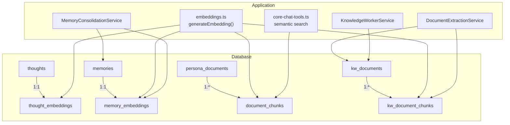
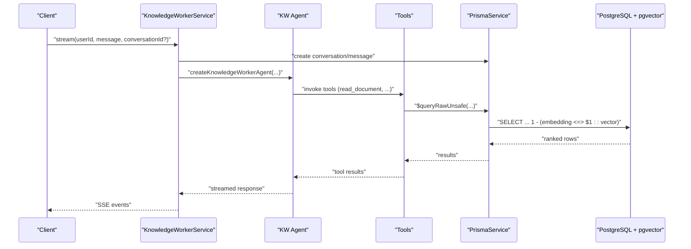
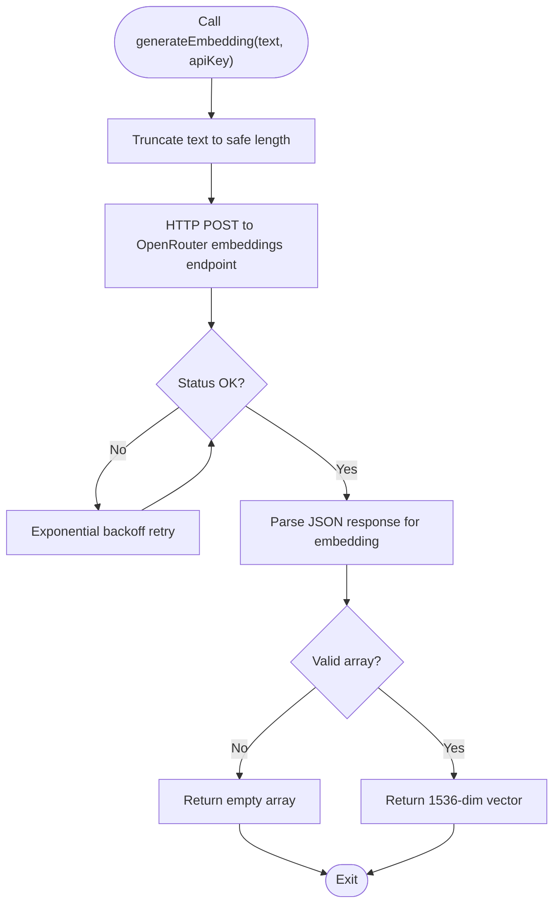
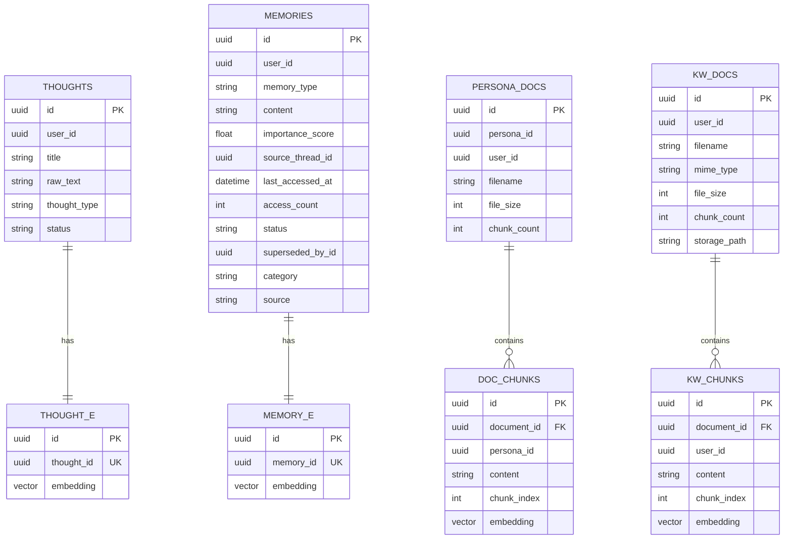
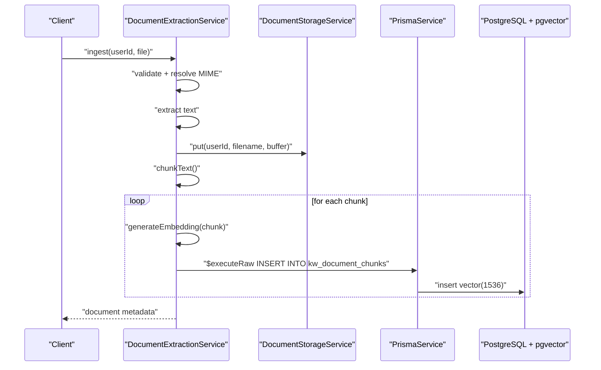
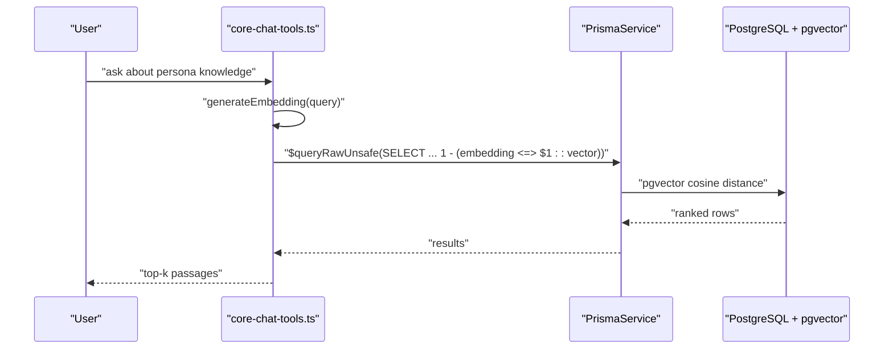
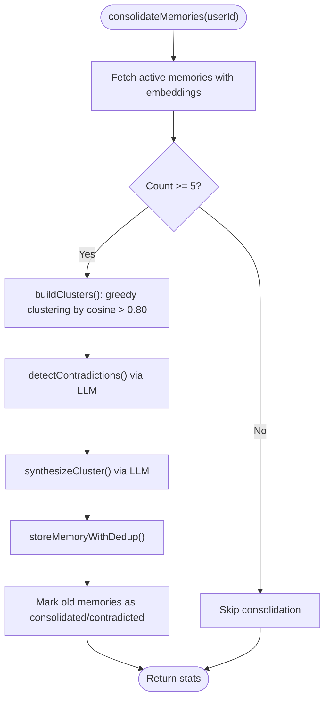
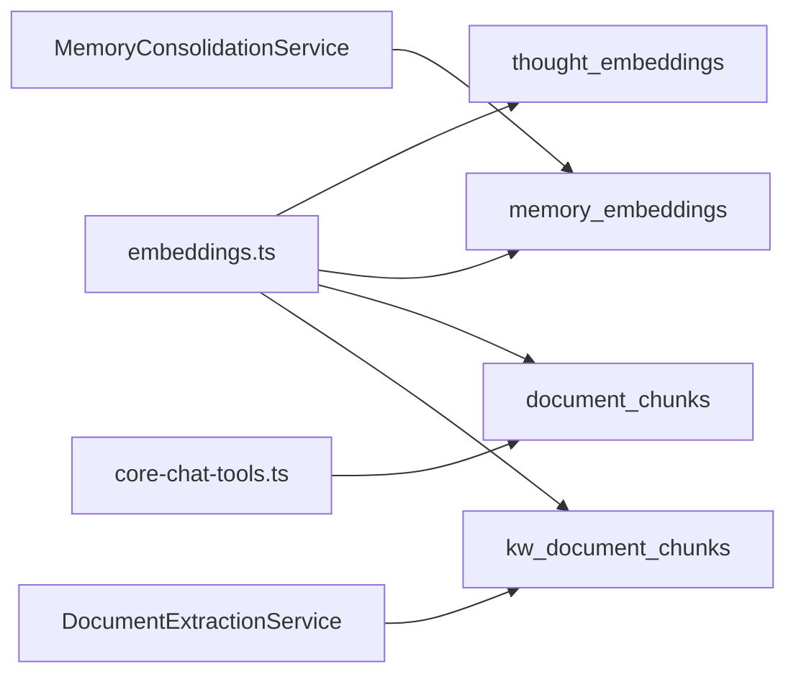

# Vector Embeddings & Semantic Search

<cite>
**Referenced Files in This Document**
- [schema.prisma](file://backend/prisma/schema.prisma)
- [embeddings.ts](file://backend/src/orchestration/graph/utils/embeddings.ts)
- [add_insights_and_thought_embeddings/migration.sql](file://backend/prisma/migrations/20260415171832_add_insights_and_thought_embeddings/migration.sql)
- [add_context_embeddings/migration.sql](file://backend/prisma/migrations/20260427085039_add_context_embeddings/migration.sql)
- [remove_context_embeddings/migration.sql](file://backend/prisma/migrations/20260427112419_remove_context_embeddings/migration.sql)
- [memory-consolidation.service.ts](file://backend/src/orchestration/memory-consolidation.service.ts)
- [knowledge-worker.service.ts](file://backend/src/knowledge-worker/knowledge-worker.service.ts)
- [document-extraction.service.ts](file://backend/src/knowledge-worker/services/document-extraction.service.ts)
- [document-storage.service.ts](file://backend/src/knowledge-worker/services/document-storage.service.ts)
- [docker-compose.yml](file://docker-compose.yml)
- [core-chat-tools.ts](file://backend/src/orchestration/graph/tools/core-chat-tools.ts)
</cite>

## Table of Contents
1. [Introduction](#introduction)
2. [Project Structure](#project-structure)
3. [Core Components](#core-components)
4. [Architecture Overview](#architecture-overview)
5. [Detailed Component Analysis](#detailed-component-analysis)
6. [Dependency Analysis](#dependency-analysis)
7. [Performance Considerations](#performance-considerations)
8. [Troubleshooting Guide](#troubleshooting-guide)
9. [Conclusion](#conclusion)
10. [Appendices](#appendices)

## Introduction
This document explains the vector embeddings system built on PostgreSQL with the pgvector extension. It covers the embedding model architecture (1536-dimensional vectors), generation pipeline for thoughts, memories, persona documents, and document chunks, and the semantic similarity search implementation using cosine distance. It also details the embedding lifecycle from creation to periodic regeneration, performance optimization strategies, indexing considerations, query patterns for efficient retrieval, maintenance and storage concerns, and the relationship between vector embeddings and AI-powered features such as memory consolidation and knowledge worker document processing.

## Project Structure
The vector embeddings system spans database schema, migrations, embedding generation utilities, and application services:
- Database schema defines vector columns and relationships for thoughts, memories, persona documents, and document chunks.
- Migrations define the embedding tables and foreign keys.
- Embedding generation utility integrates with OpenRouter to produce 1536-dimension vectors.
- Services implement ingestion, semantic search, and memory consolidation using pgvector.

**Diagram sources**
- [schema.prisma:193-227](file://backend/prisma/schema.prisma#L193-L227)
- [add_insights_and_thought_embeddings/migration.sql:14-32](file://backend/prisma/migrations/20260415171832_add_insights_and_thought_embeddings/migration.sql#L14-L32)
- [add_context_embeddings/migration.sql:1-96](file://backend/prisma/migrations/20260427085039_add_context_embeddings/migration.sql#L1-L96)
- [embeddings.ts:17-82](file://backend/src/orchestration/graph/utils/embeddings.ts#L17-L82)
- [document-extraction.service.ts:82-111](file://backend/src/knowledge-worker/services/document-extraction.service.ts#L82-L111)
- [core-chat-tools.ts:856-886](file://backend/src/orchestration/graph/tools/core-chat-tools.ts#L856-L886)
- [memory-consolidation.service.ts:42-127](file://backend/src/orchestration/memory-consolidation.service.ts#L42-L127)

**Section sources**
- [schema.prisma:193-227](file://backend/prisma/schema.prisma#L193-L227)
- [add_insights_and_thought_embeddings/migration.sql:14-32](file://backend/prisma/migrations/20260415171832_add_insights_and_thought_embeddings/migration.sql#L14-L32)
- [add_context_embeddings/migration.sql:1-96](file://backend/prisma/migrations/20260427085039_add_context_embeddings/migration.sql#L1-L96)
- [embeddings.ts:17-82](file://backend/src/orchestration/graph/utils/embeddings.ts#L17-L82)
- [document-extraction.service.ts:40-111](file://backend/src/knowledge-worker/services/document-extraction.service.ts#L40-L111)
- [core-chat-tools.ts:856-886](file://backend/src/orchestration/graph/tools/core-chat-tools.ts#L856-L886)
- [memory-consolidation.service.ts:29-127](file://backend/src/orchestration/memory-consolidation.service.ts#L29-L127)

## Core Components
- Embedding generation utility: Produces 1536-dimension vectors using OpenRouter’s text-embedding-3-small model with retry/backoff.
- Database schema and migrations: Define vector columns for thoughts, memories, persona documents, and knowledge worker document chunks.
- Knowledge Worker ingestion: Parses, chunks, embeds, and persists user-uploaded documents into kw_document_chunks with pgvector embeddings.
- Core Chat persona knowledge search: Performs cosine similarity search across persona document chunks.
- Memory consolidation: Periodically clusters active memories by cosine similarity, detects contradictions, and consolidates semantically similar memories.

**Section sources**
- [embeddings.ts:17-82](file://backend/src/orchestration/graph/utils/embeddings.ts#L17-L82)
- [schema.prisma:193-227](file://backend/prisma/schema.prisma#L193-L227)
- [add_insights_and_thought_embeddings/migration.sql:14-32](file://backend/prisma/migrations/20260415171832_add_insights_and_thought_embeddings/migration.sql#L14-L32)
- [document-extraction.service.ts:40-111](file://backend/src/knowledge-worker/services/document-extraction.service.ts#L40-L111)
- [core-chat-tools.ts:856-886](file://backend/src/orchestration/graph/tools/core-chat-tools.ts#L856-L886)
- [memory-consolidation.service.ts:29-127](file://backend/src/orchestration/memory-consolidation.service.ts#L29-L127)

## Architecture Overview
The system uses PostgreSQL with pgvector to store 1536-dimension embeddings. Embeddings are generated off-host via OpenRouter and inserted into dedicated embedding tables or vector columns. Retrieval uses native cosine distance operators to rank relevant memories, persona knowledge, and document chunks.

**Diagram sources**
- [knowledge-worker.service.ts:164-343](file://backend/src/knowledge-worker/knowledge-worker.service.ts#L164-L343)
- [document-extraction.service.ts:82-111](file://backend/src/knowledge-worker/services/document-extraction.service.ts#L82-L111)
- [core-chat-tools.ts:856-886](file://backend/src/orchestration/graph/tools/core-chat-tools.ts#L856-L886)

## Detailed Component Analysis

### Embedding Generation Utility
- Model: text-embedding-3-small (1536 dimensions).
- Input truncation: limits input length to avoid exceeding provider constraints.
- Retry/backoff: exponential backoff on 429/5xx and transient errors.
- Output: numeric array representing the embedding vector.

**Diagram sources**
- [embeddings.ts:17-82](file://backend/src/orchestration/graph/utils/embeddings.ts#L17-L82)

**Section sources**
- [embeddings.ts:17-82](file://backend/src/orchestration/graph/utils/embeddings.ts#L17-L82)

### Database Schema and Embedding Tables
- ThoughtEmbedding: 1:1 with thoughts, vector(1536).
- MemoryEmbedding: 1:1 with memories, vector(1536).
- DocumentChunk: vector(1536) for persona documents.
- kw_document_chunks: vector(1536) for knowledge worker documents (created via raw SQL in migration).
- Foreign keys enforce referential integrity.

**Diagram sources**
- [schema.prisma:193-227](file://backend/prisma/schema.prisma#L193-L227)
- [add_insights_and_thought_embeddings/migration.sql:14-32](file://backend/prisma/migrations/20260415171832_add_insights_and_thought_embeddings/migration.sql#L14-L32)
- [add_context_embeddings/migration.sql:1-96](file://backend/prisma/migrations/20260427085039_add_context_embeddings/migration.sql#L1-L96)

**Section sources**
- [schema.prisma:193-227](file://backend/prisma/schema.prisma#L193-L227)
- [add_insights_and_thought_embeddings/migration.sql:14-32](file://backend/prisma/migrations/20260415171832_add_insights_and_thought_embeddings/migration.sql#L14-L32)
- [add_context_embeddings/migration.sql:1-96](file://backend/prisma/migrations/20260427085039_add_context_embeddings/migration.sql#L1-L96)

### Knowledge Worker Document Ingestion Pipeline
- Validates MIME type and enforces size limits.
- Extracts text from PDF, DOCX, XLS/XLSX, CSV, TXT, and MD.
- Chunks text into ~800-token segments with ~100-token overlap.
- Generates embeddings per chunk and inserts into kw_document_chunks with vector(1536).
- Persists raw file to local storage for future regeneration.

**Diagram sources**
- [document-extraction.service.ts:40-111](file://backend/src/knowledge-worker/services/document-extraction.service.ts#L40-L111)
- [document-storage.service.ts:24-35](file://backend/src/knowledge-worker/services/document-storage.service.ts#L24-L35)

**Section sources**
- [document-extraction.service.ts:40-111](file://backend/src/knowledge-worker/services/document-extraction.service.ts#L40-L111)
- [document-storage.service.ts:24-35](file://backend/src/knowledge-worker/services/document-storage.service.ts#L24-L35)

### Core Chat Persona Knowledge Search
- Generates a query embedding from user input.
- Executes a cosine similarity query against persona document chunks.
- Filters by minimum similarity threshold and returns ranked snippets.

**Diagram sources**
- [core-chat-tools.ts:856-886](file://backend/src/orchestration/graph/tools/core-chat-tools.ts#L856-L886)

**Section sources**
- [core-chat-tools.ts:856-886](file://backend/src/orchestration/graph/tools/core-chat-tools.ts#L856-L886)

### Memory Consolidation and Semantic Clustering
- Periodically consolidates active memories by building clusters using cosine similarity (threshold > 0.80).
- Detects contradictions within clusters and marks older conflicting memories as “contradicted”.
- Synthesizes clusters into consolidated memories and stores them with deduplication.
- Triggers consolidation every 10th memory creation.

**Diagram sources**
- [memory-consolidation.service.ts:29-127](file://backend/src/orchestration/memory-consolidation.service.ts#L29-L127)

**Section sources**
- [memory-consolidation.service.ts:29-127](file://backend/src/orchestration/memory-consolidation.service.ts#L29-L127)

## Dependency Analysis
- Embedding generation depends on OPENROUTER_API_KEY and uses OpenRouter’s embeddings endpoint.
- Knowledge Worker ingestion writes to kw_document_chunks via raw SQL; Prisma does not directly manage rows in this table.
- Core Chat persona knowledge search queries document_chunks using pgvector cosine distance.
- Memory consolidation joins memories with memory_embeddings and uses raw SQL for similarity ranking.

**Diagram sources**
- [embeddings.ts:17-82](file://backend/src/orchestration/graph/utils/embeddings.ts#L17-L82)
- [document-extraction.service.ts:82-111](file://backend/src/knowledge-worker/services/document-extraction.service.ts#L82-L111)
- [core-chat-tools.ts:856-886](file://backend/src/orchestration/graph/tools/core-chat-tools.ts#L856-L886)
- [memory-consolidation.service.ts:42-127](file://backend/src/orchestration/memory-consolidation.service.ts#L42-L127)

**Section sources**
- [embeddings.ts:17-82](file://backend/src/orchestration/graph/utils/embeddings.ts#L17-L82)
- [document-extraction.service.ts:82-111](file://backend/src/knowledge-worker/services/document-extraction.service.ts#L82-L111)
- [core-chat-tools.ts:856-886](file://backend/src/orchestration/graph/tools/core-chat-tools.ts#L856-L886)
- [memory-consolidation.service.ts:42-127](file://backend/src/orchestration/memory-consolidation.service.ts#L42-L127)

## Performance Considerations
- Indexing: Use GIN/GiST or HNSW indexes on vector columns for large-scale cosine similarity search. Enable appropriate ivfflat or hnsw configurations for approximate nearest neighbor (ANN) acceleration.
- Query patterns: Prefer limiting results and filtering by minimum similarity to reduce result sets. Use LIMIT clauses and consider pre-filtering by persona/document IDs.
- Batch ingestion: For knowledge worker documents, batch insert vectors to minimize round trips.
- Caching: Cache frequent query embeddings for repeated searches within short time windows.
- Provider quotas: Respect OpenRouter rate limits and implement backoff; monitor token usage and costs.
- Storage: Compress or archive old embeddings if retention allows; periodically prune low-signal embeddings.

[No sources needed since this section provides general guidance]

## Troubleshooting Guide
- Embedding generation failures:
  - Symptoms: Empty arrays returned from generateEmbedding.
  - Causes: API rate limits (429), server errors (5xx), invalid responses.
  - Resolution: Verify OPENROUTER_API_KEY, enable retries, and monitor logs.
- Semantic search returns few/no results:
  - Symptoms: Low similarity scores or empty results.
  - Causes: Insufficient overlap in query text, mismatched content domains, or low-quality embeddings.
  - Resolution: Increase topK, adjust minimum similarity thresholds, improve chunking strategy, and regenerate embeddings for problematic content.
- Memory consolidation not triggering:
  - Symptoms: Memories not consolidated despite growing counts.
  - Causes: Count threshold not met or previous consolidation run errors.
  - Resolution: Check memory count logic and logs; ensure embeddings exist for active memories.
- Vector storage anomalies:
  - Symptoms: Missing embeddings in kw_document_chunks.
  - Causes: Partial ingestion due to embedding failures or storage errors.
  - Resolution: Re-ingest documents; verify chunkCount and embedding insertion steps.

**Section sources**
- [embeddings.ts:53-82](file://backend/src/orchestration/graph/utils/embeddings.ts#L53-L82)
- [document-extraction.service.ts:82-111](file://backend/src/knowledge-worker/services/document-extraction.service.ts#L82-L111)
- [memory-consolidation.service.ts:291-304](file://backend/src/orchestration/memory-consolidation.service.ts#L291-L304)

## Conclusion
The vector embeddings system leverages PostgreSQL with pgvector to enable robust semantic search across thoughts, memories, persona knowledge, and user-uploaded documents. By generating 1536-dimensional embeddings via OpenRouter and storing them efficiently in the database, the system supports memory consolidation, knowledge worker document processing, and persona knowledge retrieval. Proper indexing, query tuning, and maintenance procedures are essential for scalable performance.

[No sources needed since this section summarizes without analyzing specific files]

## Appendices

### Embedding Lifecycle
- Creation: Embeddings generated during ingestion for thoughts, memories, persona documents, and knowledge worker chunks.
- Storage: Persisted in dedicated embedding tables or vector columns.
- Retrieval: Cosine similarity queries rank relevant items for memory consolidation, persona knowledge search, and document search.
- Regeneration: Triggered when content changes; embeddings are regenerated and updated to reflect new semantics.

**Section sources**
- [add_insights_and_thought_embeddings/migration.sql:14-32](file://backend/prisma/migrations/20260415171832_add_insights_and_thought_embeddings/migration.sql#L14-L32)
- [add_context_embeddings/migration.sql:1-96](file://backend/prisma/migrations/20260427085039_add_context_embeddings/migration.sql#L1-L96)
- [document-extraction.service.ts:82-111](file://backend/src/knowledge-worker/services/document-extraction.service.ts#L82-L111)
- [memory-consolidation.service.ts:42-127](file://backend/src/orchestration/memory-consolidation.service.ts#L42-L127)

### Environment and Infrastructure Notes
- PostgreSQL image with pgvector is used for local development.
- Ensure DATABASE_URL points to a pgvector-enabled database.

**Section sources**
- [docker-compose.yml:1-17](file://docker-compose.yml#L1-L17)