# Deployment & Infrastructure

<cite>
**Referenced Files in This Document**
- [backend/Dockerfile](file://backend/Dockerfile)
- [frontend/Dockerfile](file://frontend/Dockerfile)
- [docker-compose.yml](file://docker-compose.yml)
- [docker-compose.override.yml](file://docker-compose.override.yml)
- [backend/fly.toml](file://backend/fly.toml)
- [backend/railway.json](file://backend/railway.json)
- [backend/package.json](file://backend/package.json)
- [frontend/package.json](file://frontend/package.json)
- [backend/src/health/health.controller.ts](file://backend/src/health/health.controller.ts)
- [backend/src/sentry.ts](file://backend/src/sentry.ts)
- [backend/src/main.ts](file://backend/src/main.ts)
- [backend/src/app.module.ts](file://backend/src/app.module.ts)
- [backend/prisma/schema.prisma](file://backend/prisma/schema.prisma)
- [backend/check-db.sql](file://backend/check-db.sql)
- [backend/src/auth/auth.service.ts](file://backend/src/auth/auth.service.ts)
- [backend/src/auth/auth.controller.ts](file://backend/src/auth/auth.controller.ts)
- [backend/src/auth/dto/request-otp.dto.ts](file://backend/src/auth/dto/request-otp.dto.ts)
- [backend/src/auth/dto/verify-otp.dto.ts](file://backend/src/auth/dto/verify-otp.dto.ts)
- [backend/prisma/migrations/20260425194007_phone_otp_auth/migration.sql](file://backend/prisma/migrations/20260425194007_phone_otp_auth/migration.sql)
- [scripts/scan-secrets.js](file://scripts/scan-secrets.js)
</cite>

## Update Summary
**Changes Made**
- Added AWS SNS SMS OTP functionality documentation
- Updated environment variable management section to include AWS credential requirements
- Enhanced security considerations with AWS credential configuration
- Updated deployment workflows to include AWS credential setup
- Added AWS region and sender ID configuration details

## Table of Contents
1. [Introduction](#introduction)
2. [Project Structure](#project-structure)
3. [Core Components](#core-components)
4. [Architecture Overview](#architecture-overview)
5. [Detailed Component Analysis](#detailed-component-analysis)
6. [Dependency Analysis](#dependency-analysis)
7. [Performance Considerations](#performance-considerations)
8. [Troubleshooting Guide](#troubleshooting-guide)
9. [Conclusion](#conclusion)
10. [Appendices](#appendices)

## Introduction
This document provides comprehensive deployment and infrastructure guidance for the 4Ever application. It covers containerization with Docker multi-stage builds, orchestration via docker-compose for local development and multi-container deployment, cloud platform configurations for Fly.io and Railway, database provisioning with PostgreSQL and pgvector, monitoring and logging with Sentry and Pino, health checks, security hardening, environment variable management, scaling strategies, and operational procedures including rollouts and rollbacks.

**Updated** Added AWS SNS SMS OTP functionality for phone-based authentication, including credential configuration and regional setup.

## Project Structure
The repository is organized into three primary areas:
- backend: NestJS API with Prisma ORM, Dockerfile, docker-compose orchestration, platform deployment configs (Fly.io, Railway), health endpoints, Sentry initialization, and Pino logging configuration.
- frontend: React SPA built with Vite and served by nginx in a multi-stage Dockerfile; includes a reverse proxy to the backend.
- scripts: Pre-push secret scanning tool to prevent committing sensitive values.

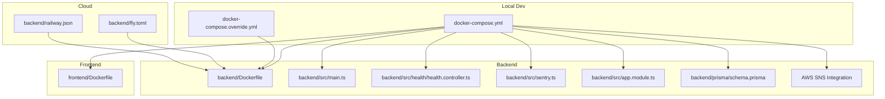

**Diagram sources**
- [docker-compose.yml:1-68](file://docker-compose.yml#L1-L68)
- [docker-compose.override.yml:1-33](file://docker-compose.override.yml#L1-L33)
- [backend/Dockerfile:1-83](file://backend/Dockerfile#L1-L83)
- [frontend/Dockerfile:1-63](file://frontend/Dockerfile#L1-L63)
- [backend/src/main.ts:1-143](file://backend/src/main.ts#L1-L143)
- [backend/src/health/health.controller.ts:1-121](file://backend/src/health/health.controller.ts#L1-L121)
- [backend/src/sentry.ts:1-57](file://backend/src/sentry.ts#L1-L57)
- [backend/src/app.module.ts:1-172](file://backend/src/app.module.ts#L1-L172)
- [backend/prisma/schema.prisma:1-10](file://backend/prisma/schema.prisma#L1-L10)
- [backend/fly.toml:1-70](file://backend/fly.toml#L1-L70)
- [backend/railway.json:1-15](file://backend/railway.json#L1-L15)

**Section sources**
- [docker-compose.yml:1-68](file://docker-compose.yml#L1-L68)
- [docker-compose.override.yml:1-33](file://docker-compose.override.yml#L1-L33)
- [backend/Dockerfile:1-83](file://backend/Dockerfile#L1-L83)
- [frontend/Dockerfile:1-63](file://frontend/Dockerfile#L1-L63)

## Core Components
- Containerization
  - Backend multi-stage Dockerfile produces a hardened runtime image with non-root user, minimal dependencies, and health checks.
  - Frontend multi-stage Dockerfile compiles a static bundle and serves it via nginx with reverse proxy to the backend.
- Orchestration
  - docker-compose defines services for Postgres with pgvector, backend, and frontend, including environment variables, health checks, and persistent volumes.
  - docker-compose.override enables development features like hot reload and development environment.
- Cloud Deployment
  - Fly.io configuration specifies VM sizing, health checks, rolling deploys, and secrets management.
  - Railway configuration defines Docker build, health checks, and restart policies.
- Database
  - Prisma schema configures PostgreSQL with the vector extension for embeddings; migrations are applied during deploy.
- Monitoring and Logging
  - Sentry initialization with redaction and sampling; Pino structured logging with redaction and correlation IDs.
  - Health endpoints (/api/livez, /api/readyz, /api/health) for liveness and readiness probes.
- Security and Secrets
  - Environment hardening enforced by requiring secrets at startup; pre-push secret scanning script.
  - CORS origins enforced in production; Helmet security headers; upload serving disabled in production.
- **AWS SNS Integration**
  - SMS OTP functionality using AWS SNS client for transactional SMS delivery.
  - Regional configuration support with default ap-south-1 for India compliance.
  - Sender ID configuration for DLT-registered senders in India.

**Section sources**
- [backend/Dockerfile:1-83](file://backend/Dockerfile#L1-L83)
- [frontend/Dockerfile:1-63](file://frontend/Dockerfile#L1-L63)
- [docker-compose.yml:1-68](file://docker-compose.yml#L1-L68)
- [docker-compose.override.yml:1-33](file://docker-compose.override.yml#L1-L33)
- [backend/fly.toml:1-70](file://backend/fly.toml#L1-L70)
- [backend/railway.json:1-15](file://backend/railway.json#L1-L15)
- [backend/prisma/schema.prisma:1-10](file://backend/prisma/schema.prisma#L1-L10)
- [backend/src/sentry.ts:1-57](file://backend/src/sentry.ts#L1-L57)
- [backend/src/app.module.ts:48-124](file://backend/src/app.module.ts#L48-L124)
- [backend/src/health/health.controller.ts:14-121](file://backend/src/health/health.controller.ts#L14-L121)
- [scripts/scan-secrets.js:1-132](file://scripts/scan-secrets.js#L1-L132)
- [backend/src/auth/auth.service.ts:6-44](file://backend/src/auth/auth.service.ts#L6-L44)

## Architecture Overview
The deployment architecture supports local development and cloud production with clear separation of concerns:
- Local development uses docker-compose to spin up Postgres with pgvector, the backend API, and the frontend with reverse proxy.
- Cloud platforms (Fly.io, Railway) run the backend containerized with health checks and rolling deploys.
- Database migrations are executed at deploy time; uploads are configured for persistence or migration to object storage in production.
- **AWS SNS Integration** provides SMS OTP functionality with regional configuration and sender ID support.

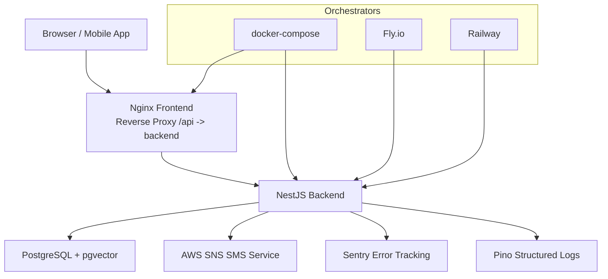

**Diagram sources**
- [docker-compose.yml:1-68](file://docker-compose.yml#L1-L68)
- [frontend/Dockerfile:23-56](file://frontend/Dockerfile#L23-L56)
- [backend/src/main.ts:37-94](file://backend/src/main.ts#L37-L94)
- [backend/src/sentry.ts:14-50](file://backend/src/sentry.ts#L14-L50)
- [backend/src/app.module.ts:48-124](file://backend/src/app.module.ts#L48-L124)
- [backend/fly.toml:32-54](file://backend/fly.toml#L32-L54)
- [backend/railway.json:7-14](file://backend/railway.json#L7-L14)

## Detailed Component Analysis

### Backend Containerization Strategy
The backend Dockerfile implements a hardened multi-stage build:
- deps stage installs all dependencies (including dev) to optimize caching.
- build stage generates Prisma client and compiles TypeScript to dist.
- runtime stage produces a minimal image with production-only dependencies, non-root user, dumb-init for signal handling, health checks, and exposed port.

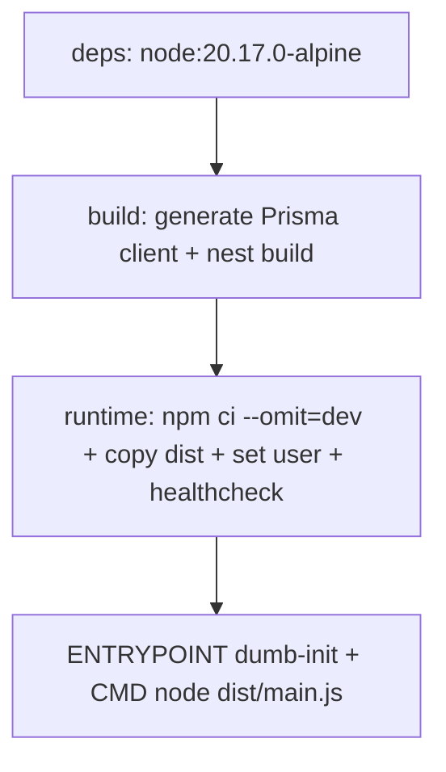

**Diagram sources**
- [backend/Dockerfile:22-83](file://backend/Dockerfile#L22-L83)

**Section sources**
- [backend/Dockerfile:1-83](file://backend/Dockerfile#L1-L83)

### Frontend Containerization Strategy
The frontend Dockerfile:
- builder stage compiles the Vite bundle.
- runtime stage serves the bundle via nginxinc/nginx-unprivileged with security headers and a reverse proxy to the backend's /api path.
- Health check probes the root path.

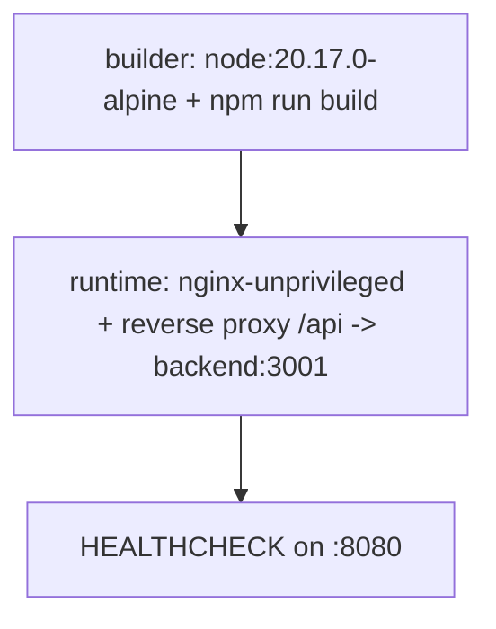

**Diagram sources**
- [frontend/Dockerfile:6-63](file://frontend/Dockerfile#L6-L63)

**Section sources**
- [frontend/Dockerfile:1-63](file://frontend/Dockerfile#L1-L63)

### Orchestration with docker-compose
docker-compose defines:
- postgres service with pgvector image, environment variables, health check, and persistent volume.
- backend service with environment variables (including JWT_SECRET requirement), dependency on postgres, uploads volume, and port mapping.
- frontend service with reverse proxy to backend and port mapping.
- docker-compose.override enables development mode with hot reload and development environment.

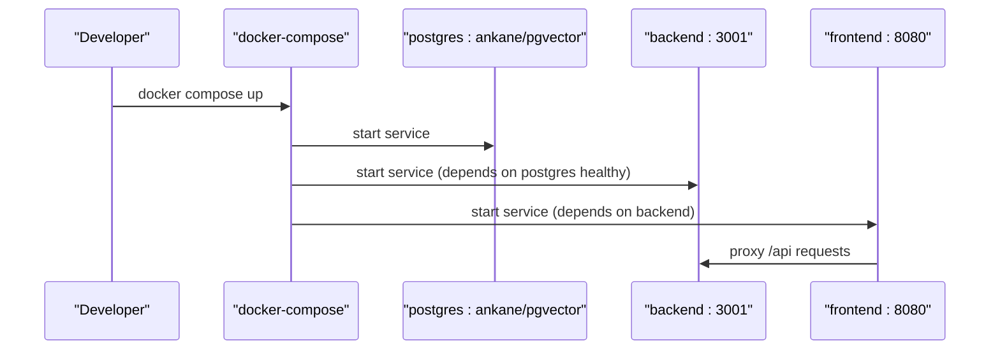

**Diagram sources**
- [docker-compose.yml:1-68](file://docker-compose.yml#L1-L68)
- [docker-compose.override.yml:19-33](file://docker-compose.override.yml#L19-L33)

**Section sources**
- [docker-compose.yml:1-68](file://docker-compose.yml#L1-L68)
- [docker-compose.override.yml:1-33](file://docker-compose.override.yml#L1-L33)

### Cloud Deployment: Fly.io
Fly.io configuration:
- App name, primary region, Dockerfile path, environment variables (NODE_ENV, PORT, LOG_LEVEL).
- HTTP service with forced HTTPS, auto-stop/start, minimum machines running, and rolling strategy.
- Health checks mapped to /api/livez and /api/readyz.
- VM sizing guidance and notes on scaling and Redis for rate limiting.

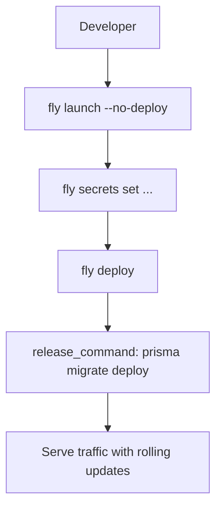

**Diagram sources**
- [backend/fly.toml:1-70](file://backend/fly.toml#L1-L70)

**Section sources**
- [backend/fly.toml:1-70](file://backend/fly.toml#L1-L70)

### Cloud Deployment: Railway
Railway configuration:
- Dockerfile build specification.
- Start command runs Prisma migrations then starts the server.
- Health check path and restart policy.

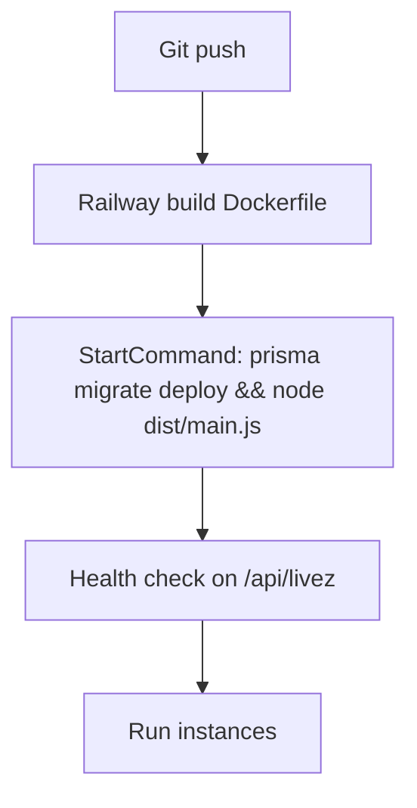

**Diagram sources**
- [backend/railway.json:1-15](file://backend/railway.json#L1-L15)

**Section sources**
- [backend/railway.json:1-15](file://backend/railway.json#L1-L15)

### Database Provisioning and Schema
Prisma schema:
- PostgreSQL datasource with vector extension for embeddings.
- Models define entities and relationships; vector columns are handled via raw SQL in migrations.
- Migration commands are available in package.json for development and production.

**Updated** Added phone-based authentication with OTP codes table for SMS verification functionality.

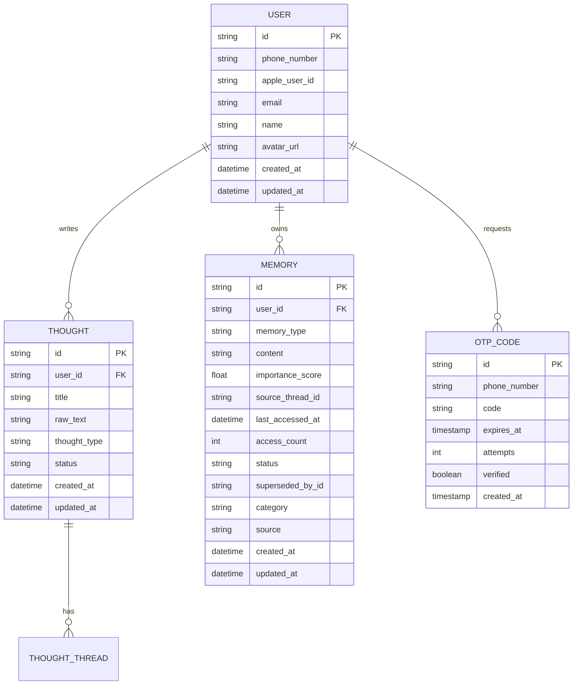

**Diagram sources**
- [backend/prisma/schema.prisma:12-74](file://backend/prisma/schema.prisma#L12-L74)
- [backend/prisma/schema.prisma:76-91](file://backend/prisma/schema.prisma#L76-L91)
- [backend/prisma/schema.prisma:170-191](file://backend/prisma/schema.prisma#L170-L191)
- [backend/prisma/migrations/20260425194007_phone_otp_auth/migration.sql:30-45](file://backend/prisma/migrations/20260425194007_phone_otp_auth/migration.sql#L30-L45)

**Section sources**
- [backend/prisma/schema.prisma:1-10](file://backend/prisma/schema.prisma#L1-L10)
- [backend/check-db.sql:1-8](file://backend/check-db.sql#L1-L8)
- [backend/package.json:21-25](file://backend/package.json#L21-L25)
- [backend/prisma/migrations/20260425194007_phone_otp_auth/migration.sql:1-45](file://backend/prisma/migrations/20260425194007_phone_otp_auth/migration.sql#L1-L45)

### Monitoring and Logging Setup
- Sentry
  - Initialized early in main.ts; configured with environment, release, sampling, and beforeSend redaction for sensitive fields.
  - Global exception filter forwards unhandled errors to Sentry.
- Pino
  - Structured logging via LoggerModule.forRoot with redaction, correlation IDs, and lean serializers.
  - Auto-logging excludes health endpoints to reduce noise.
- Health Checks
  - /api/livez for liveness, /api/readyz for readiness, and legacy /api/health retained for compatibility.

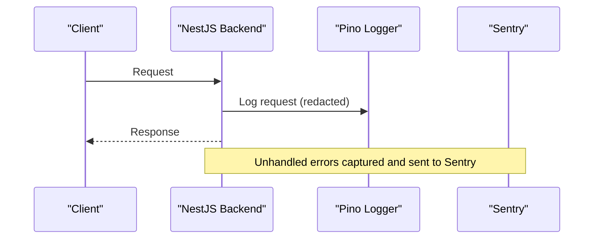

**Diagram sources**
- [backend/src/main.ts:16-94](file://backend/src/main.ts#L16-L94)
- [backend/src/sentry.ts:14-50](file://backend/src/sentry.ts#L14-L50)
- [backend/src/app.module.ts:48-124](file://backend/src/app.module.ts#L48-L124)
- [backend/src/health/health.controller.ts:27-106](file://backend/src/health/health.controller.ts#L27-L106)

**Section sources**
- [backend/src/main.ts:1-143](file://backend/src/main.ts#L1-L143)
- [backend/src/sentry.ts:1-57](file://backend/src/sentry.ts#L1-L57)
- [backend/src/app.module.ts:48-124](file://backend/src/app.module.ts#L48-L124)
- [backend/src/health/health.controller.ts:1-121](file://backend/src/health/health.controller.ts#L1-L121)

### Security Considerations
- SSL/TLS and Headers
  - Fly.io forces HTTPS for the HTTP service.
  - Helmet sets security headers; CSP is configured in report-only mode initially.
- Environment Hardening
  - JWT_SECRET is required and must not be empty; backend fails to start if missing.
  - CORS_ORIGINS must be set in production; otherwise the app throws an error.
  - Uploads are served locally only in non-production environments.
- Secrets Management
  - fly secrets set is used to manage environment variables.
  - Pre-push secret scanner scans for high-confidence secret patterns and exits non-zero on findings.
- **AWS SNS Security**
  - AWS credentials are loaded via environment variables with placeholder detection.
  - Credentials are validated before initializing SNS client to prevent accidental activation.
  - Region configuration defaults to ap-south-1 for India compliance with DLT requirements.

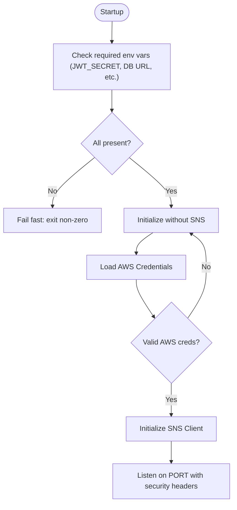

**Diagram sources**
- [backend/src/main.ts:68-75](file://backend/src/main.ts#L68-L75)
- [backend/src/main.ts:20-22](file://backend/src/main.ts#L20-L22)
- [backend/Dockerfile:29-40](file://backend/Dockerfile#L29-L40)
- [scripts/scan-secrets.js:24-39](file://scripts/scan-secrets.js#L24-L39)
- [backend/src/auth/auth.service.ts:21-44](file://backend/src/auth/auth.service.ts#L21-L44)

**Section sources**
- [backend/src/main.ts:68-75](file://backend/src/main.ts#L68-L75)
- [backend/Dockerfile:29-40](file://backend/Dockerfile#L29-L40)
- [scripts/scan-secrets.js:1-132](file://scripts/scan-secrets.js#L1-L132)
- [backend/src/auth/auth.service.ts:21-44](file://backend/src/auth/auth.service.ts#L21-L44)

### Environment Variable Management
- docker-compose
  - Required: DATABASE_URL, JWT_SECRET (fails if empty).
  - Optional: OPENROUTER_API_KEY, TWILIO_* credentials, TAVILY_API_KEY, E2B_API_KEY, ADMIN_SECRET, CORS_ORIGINS, TTS_MODEL.
  - **AWS SNS**: AWS_REGION, AWS_ACCESS_KEY_ID, AWS_SECRET_ACCESS_KEY, AWS_SNS_SENDER_ID.
- fly.toml
  - Sets NODE_ENV, PORT, LOG_LEVEL, CORS_ORIGINS via secrets, and forces HTTPS.
- railway.json
  - Uses environment variables via secrets and health checks.

**Updated** Added AWS SNS credential environment variables for SMS OTP functionality.

**Section sources**
- [docker-compose.yml:24-40](file://docker-compose.yml#L24-L40)
- [backend/fly.toml:26-30](file://backend/fly.toml#L26-L30)
- [backend/railway.json:1-15](file://backend/railway.json#L1-L15)
- [backend/src/auth/auth.service.ts:21-24](file://backend/src/auth/auth.service.ts#L21-L24)

### Scaling Strategies
- Fly.io guidance:
  - Start with 1 shared-cpu-1x VM; scale horizontally as LLM streaming is I/O bound.
  - Add Redis for shared rate-limit state when running multiple machines.
- Railway:
  - Restart policy set to ON_FAILURE with retries; health checks ensure availability.

**Section sources**
- [backend/fly.toml:61-69](file://backend/fly.toml#L61-L69)
- [backend/railway.json:10-13](file://backend/railway.json#L10-L13)

### Deployment Workflows and Rollback Procedures
- Local Development
  - Use docker-compose with or without docker-compose.override for hot reload.
- Production Deployment
  - Fly.io: fly launch, fly secrets set, fly deploy; release_command runs Prisma migrations.
  - Railway: Git push triggers build; start command runs migrations then server.
- Rollback
  - Fly.io: redeploy previous release image/tag; adjust min_machines_running as needed.
  - Railway: redeploy previous commit or use rollback feature if available.

**Section sources**
- [docker-compose.yml:1-68](file://docker-compose.yml#L1-L68)
- [docker-compose.override.yml:1-33](file://docker-compose.override.yml#L1-L33)
- [backend/fly.toml:67-70](file://backend/fly.toml#L67-L70)
- [backend/railway.json:7-14](file://backend/railway.json#L7-L14)

### Infrastructure Maintenance Practices
- Database Maintenance
  - Use Prisma migrate commands for schema changes; verify with check-db.sql queries.
- Logging and Observability
  - Pino redacts sensitive fields; Sentry captures exceptions with beforeSend redaction.
- Security Audits
  - Run scripts/scan-secrets.js locally before pushing to detect potential leaks.

**Section sources**
- [backend/check-db.sql:1-8](file://backend/check-db.sql#L1-L8)
- [backend/src/sentry.ts:27-48](file://backend/src/sentry.ts#L27-L48)
- [scripts/scan-secrets.js:68-95](file://scripts/scan-secrets.js#L68-L95)

### AWS SNS SMS OTP Integration
**New Section** The backend now includes AWS SNS integration for SMS OTP functionality:

- **Dependency**: @aws-sdk/client-sns v3.1077.0 is included in package.json dependencies.
- **Configuration**: 
  - AWS_REGION: Defaults to ap-south-1 for India compliance
  - AWS_ACCESS_KEY_ID: Primary credential for SNS access
  - AWS_SECRET_ACCESS_KEY: Secret credential for SNS access
  - AWS_SNS_SENDER_ID: Optional sender ID for DLT-registered senders
- **Initialization**: SNS client is created only when valid credentials are detected, preventing accidental activation with placeholder values.
- **Message Attributes**: Automatically sets SMSType to Transactional for OTP delivery and includes SenderID when configured.
- **Regional Support**: Supports multiple AWS regions with proper credential configuration.

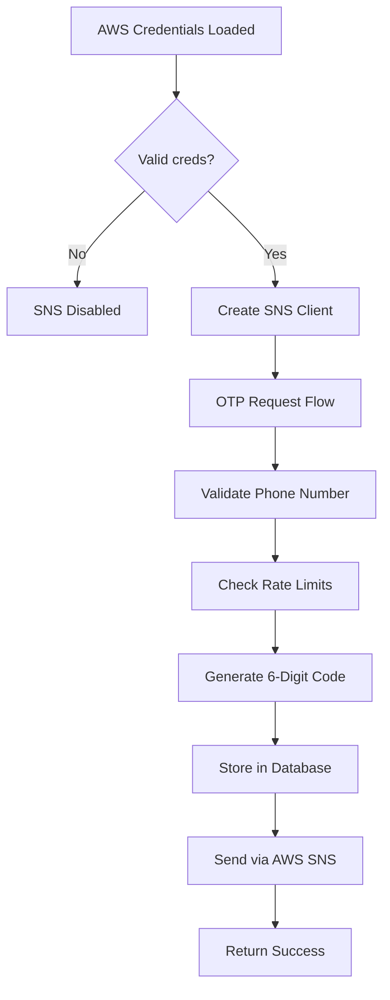

**Diagram sources**
- [backend/src/auth/auth.service.ts:31-44](file://backend/src/auth/auth.service.ts#L31-L44)
- [backend/src/auth/auth.service.ts:50-116](file://backend/src/auth/auth.service.ts#L50-L116)

**Section sources**
- [backend/package.json:28](file://backend/package.json#L28)
- [backend/src/auth/auth.service.ts:6-44](file://backend/src/auth/auth.service.ts#L6-L44)
- [backend/src/auth/auth.service.ts:50-116](file://backend/src/auth/auth.service.ts#L50-L116)

## Dependency Analysis
The backend module composition integrates logging, scheduling, throttling, Prisma, and feature modules. Health endpoints are provided by HealthModule.

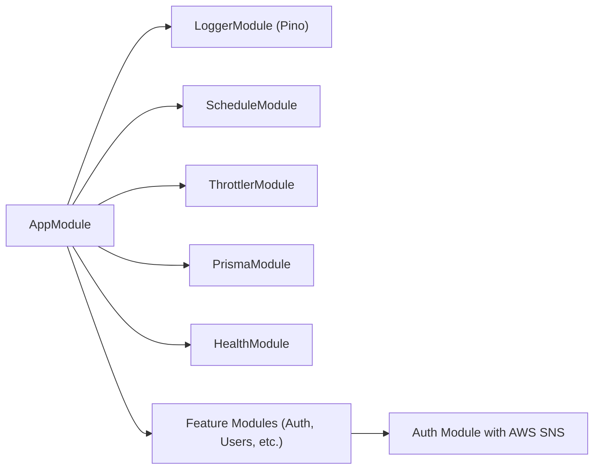

**Diagram sources**
- [backend/src/app.module.ts:34-172](file://backend/src/app.module.ts#L34-L172)
- [backend/src/health/health.controller.ts:14-121](file://backend/src/health/health.controller.ts#L14-L121)
- [backend/src/auth/auth.service.ts:10-44](file://backend/src/auth/auth.service.ts#L10-L44)

**Section sources**
- [backend/src/app.module.ts:1-172](file://backend/src/app.module.ts#L1-L172)
- [backend/src/health/health.controller.ts:1-121](file://backend/src/health/health.controller.ts#L1-L121)
- [backend/src/auth/auth.service.ts:10-44](file://backend/src/auth/auth.service.ts#L10-L44)

## Performance Considerations
- Container Images
  - Runtime image uses npm ci --omit=dev to minimize size and attack surface.
  - dumb-init ensures graceful shutdown for streaming endpoints.
- Logging
  - Pino structured logging reduces overhead; autoLogging excludes health endpoints.
- Database
  - Prisma client is generated in the build stage; migrations run at deploy time.
- CDN and Assets
  - Frontend nginx serves static assets efficiently; reverse proxy preserves streaming.
- **AWS SNS Optimization**
  - SNS client is lazily initialized only when credentials are present.
  - Transactional SMS type ensures optimal delivery for OTP codes.
  - Rate limiting prevents SMS spam while maintaining user experience.

**Section sources**
- [backend/Dockerfile:49-82](file://backend/Dockerfile#L49-L82)
- [frontend/Dockerfile:59-63](file://frontend/Dockerfile#L59-L63)
- [backend/src/app.module.ts:117-123](file://backend/src/app.module.ts#L117-L123)
- [backend/src/auth/auth.service.ts:31-44](file://backend/src/auth/auth.service.ts#L31-L44)

## Troubleshooting Guide
- Health Probes
  - Verify /api/livez and /api/readyz endpoints; readiness probe checks database connectivity and required environment variables.
- Database Connectivity
  - Ensure DATABASE_URL points to a Postgres instance with pgvector enabled; confirm migrations have been applied.
- CORS Issues
  - In production, set CORS_ORIGINS explicitly; otherwise the app throws an error.
- Sentry
  - If SENTRY_DSN is unset, Sentry.init is a no-op; otherwise ensure beforeSend redaction is effective.
- Secret Exposure
  - Run scripts/scan-secrets.js to detect high-confidence patterns; rotate credentials and remove from history if needed.
- **AWS SNS Issues**
  - Check AWS_REGION, AWS_ACCESS_KEY_ID, and AWS_SECRET_ACCESS_KEY environment variables.
  - Verify SNS client initialization logs show "SNS client initialised successfully".
  - For India deployments, ensure AWS_SNS_SENDER_ID is configured for DLT compliance.
  - Check that SMS messages are being sent with SMSType set to Transactional.

**Section sources**
- [backend/src/health/health.controller.ts:52-106](file://backend/src/health/health.controller.ts#L52-L106)
- [backend/src/main.ts:68-75](file://backend/src/main.ts#L68-L75)
- [backend/src/sentry.ts:14-50](file://backend/src/sentry.ts#L14-L50)
- [scripts/scan-secrets.js:97-132](file://scripts/scan-secrets.js#L97-L132)
- [backend/src/auth/auth.service.ts:26-44](file://backend/src/auth/auth.service.ts#L26-L44)

## Conclusion
The 4Ever application employs robust containerization, orchestrated local development, and production-grade cloud deployments on Fly.io and Railway. Its database leverages PostgreSQL with pgvector for embeddings, while monitoring and logging are implemented with Sentry and Pino. Security is enforced through environment hardening, strict CORS controls, and proactive secret scanning. Health checks and structured logging facilitate reliable operations, and the documented workflows support efficient rollouts and maintenance.

**Updated** The application now includes AWS SNS SMS OTP functionality with regional configuration and sender ID support, enabling phone-based authentication with transactional SMS delivery optimized for India compliance.

## Appendices
- Environment Variables Reference
  - Required: DATABASE_URL, JWT_SECRET
  - Optional: OPENROUTER_API_KEY, TWILIO_ACCOUNT_SID, TWILIO_AUTH_TOKEN, TWILIO_PHONE_NUMBER, TAVILY_API_KEY, E2B_API_KEY, ADMIN_SECRET, CORS_ORIGINS, TTS_MODEL
  - **AWS SNS**: AWS_REGION, AWS_ACCESS_KEY_ID, AWS_SECRET_ACCESS_KEY, AWS_SNS_SENDER_ID
- Health Endpoints
  - /api/livez (liveness), /api/readyz (readiness), /api/health (legacy)
- **AWS SNS Configuration**
  - Default Region: ap-south-1 (India)
  - Required Permissions: SNS Publish permissions for SMS delivery
  - Sender ID: Required for DLT-registered senders in India
  - Message Type: Transactional for OTP codes

[No sources needed since this section summarizes previously cited information]