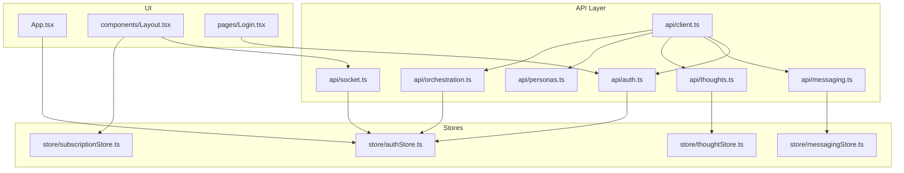
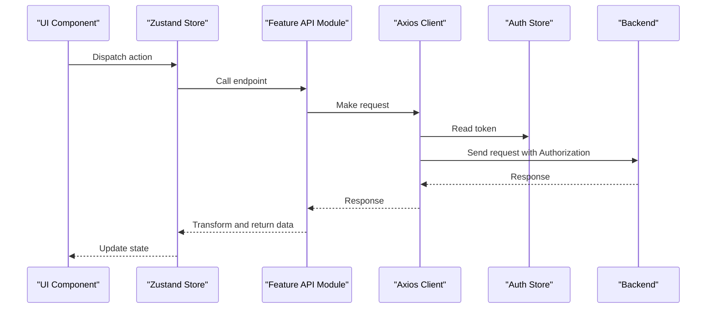
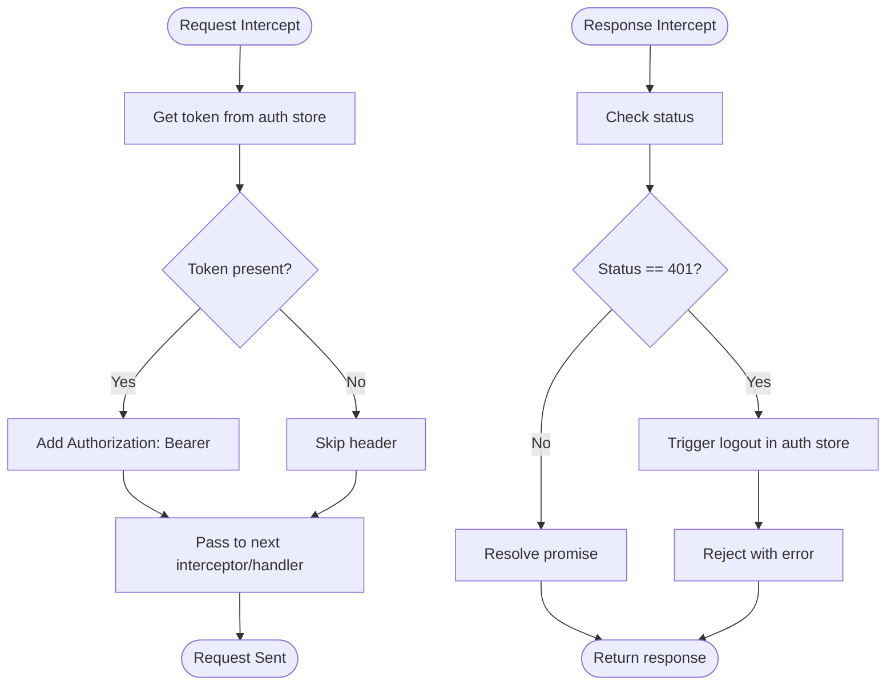
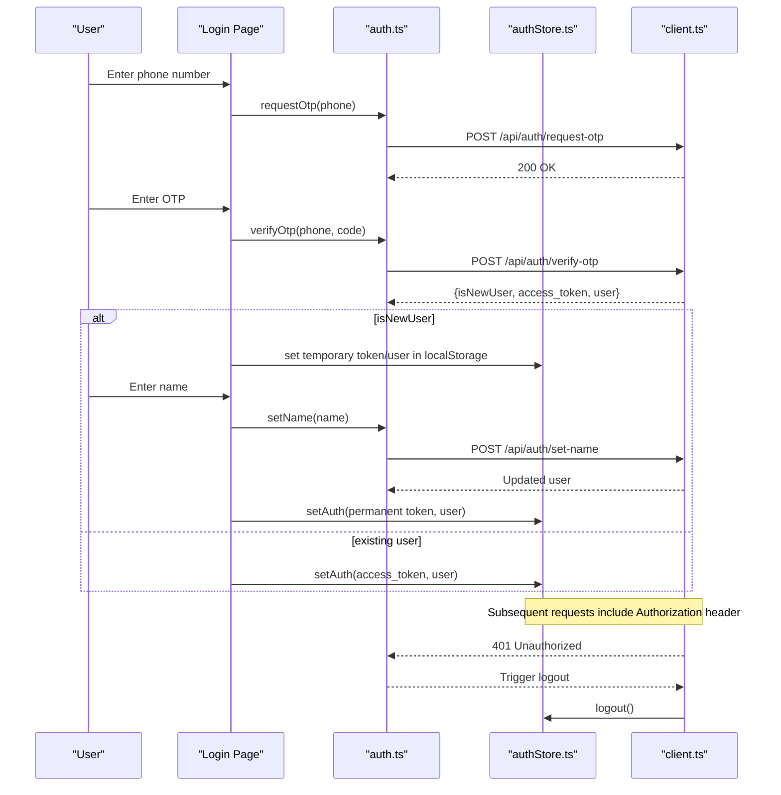
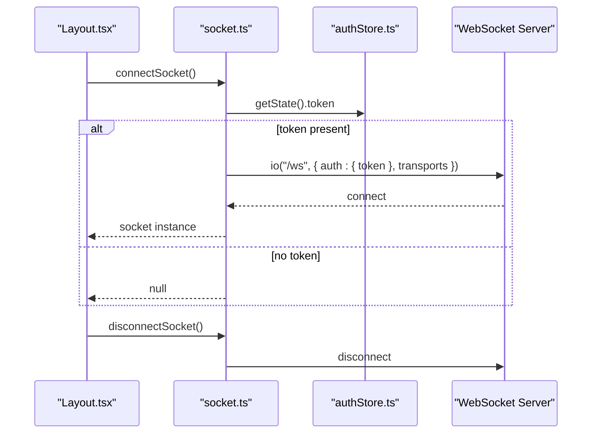
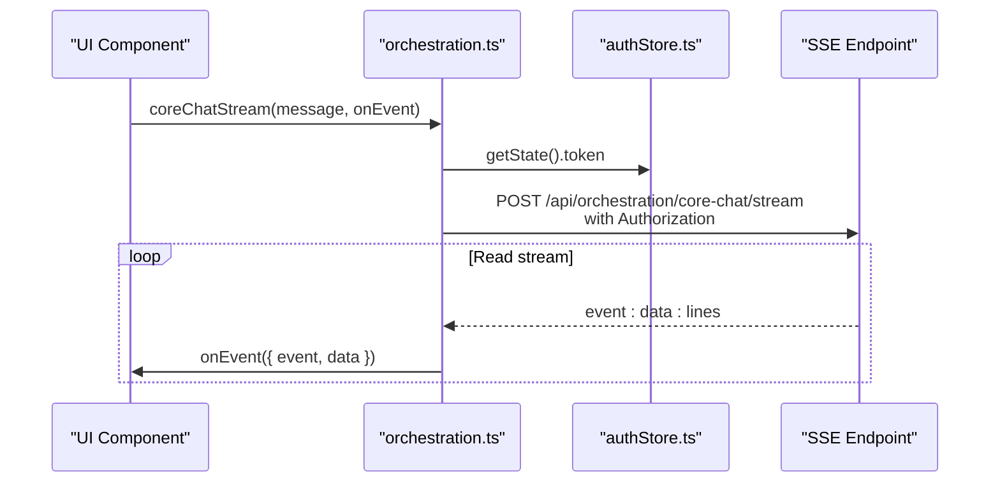
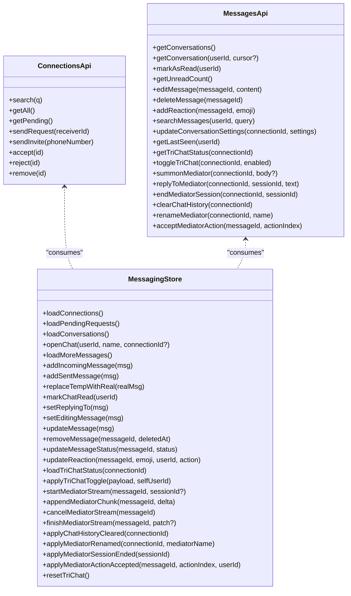
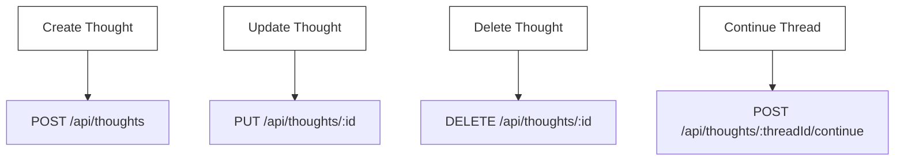
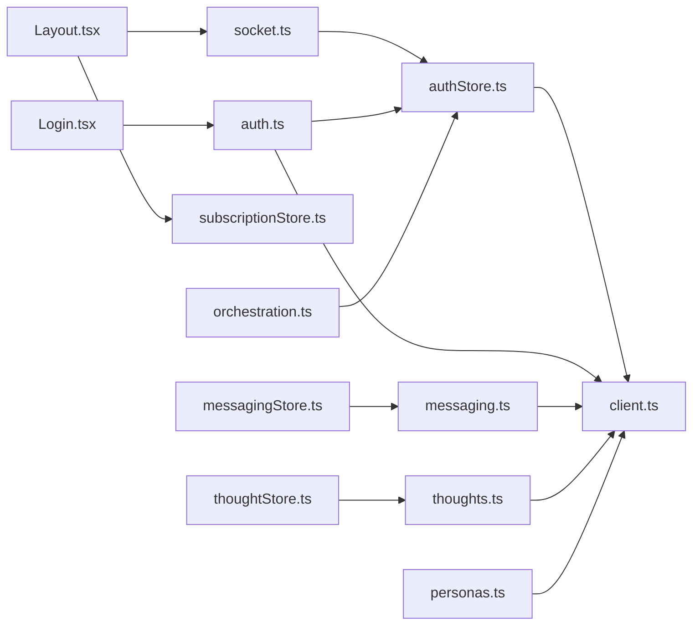

# API Integration

<cite>
**Referenced Files in This Document**
- [client.ts](file://frontend/src/api/client.ts)
- [auth.ts](file://frontend/src/api/auth.ts)
- [socket.ts](file://frontend/src/api/socket.ts)
- [authStore.ts](file://frontend/src/store/authStore.ts)
- [App.tsx](file://frontend/src/App.tsx)
- [Login.tsx](file://frontend/src/pages/Login.tsx)
- [messaging.ts](file://frontend/src/api/messaging.ts)
- [messagingStore.ts](file://frontend/src/store/messagingStore.ts)
- [thoughts.ts](file://frontend/src/api/thoughts.ts)
- [thoughtStore.ts](file://frontend/src/store/thoughtStore.ts)
- [personas.ts](file://frontend/src/api/personas.ts)
- [orchestration.ts](file://frontend/src/api/orchestration.ts)
- [Layout.tsx](file://frontend/src/components/Layout.tsx)
- [subscriptionStore.ts](file://frontend/src/store/subscriptionStore.ts)
</cite>

## Table of Contents
1. [Introduction](#introduction)
2. [Project Structure](#project-structure)
3. [Core Components](#core-components)
4. [Architecture Overview](#architecture-overview)
5. [Detailed Component Analysis](#detailed-component-analysis)
6. [Dependency Analysis](#dependency-analysis)
7. [Performance Considerations](#performance-considerations)
8. [Troubleshooting Guide](#troubleshooting-guide)
9. [Conclusion](#conclusion)
10. [Appendices](#appendices)

## Introduction
This document explains the 4Ever frontend API integration, focusing on the centralized HTTP client configuration, authentication flow with token management, and WebSocket integration for real-time features. It also covers the API client architecture, request/response handling, error management, retry mechanisms, authentication endpoints, session management, token refresh strategies, real-time communication via Socket.IO and Server-Sent Events (SSE), usage patterns, error handling strategies, performance optimization techniques, rate limiting, caching strategies, and offline capability considerations.

## Project Structure
The frontend API layer is organized by feature modules under a dedicated API directory. Each module encapsulates typed endpoints and integrates with a shared HTTP client and authentication store. Real-time features are implemented via Socket.IO and SSE streams. State management is handled by Zustand stores.

**Diagram sources**
- [client.ts:1-30](file://frontend/src/api/client.ts#L1-L30)
- [auth.ts:1-37](file://frontend/src/api/auth.ts#L1-L37)
- [messaging.ts:1-237](file://frontend/src/api/messaging.ts#L1-L237)
- [thoughts.ts:1-49](file://frontend/src/api/thoughts.ts#L1-L49)
- [personas.ts:1-49](file://frontend/src/api/personas.ts#L1-L49)
- [orchestration.ts:1-238](file://frontend/src/api/orchestration.ts#L1-L238)
- [socket.ts:1-38](file://frontend/src/api/socket.ts#L1-L38)
- [authStore.ts:1-32](file://frontend/src/store/authStore.ts#L1-L32)
- [messagingStore.ts:1-412](file://frontend/src/store/messagingStore.ts#L1-L412)
- [thoughtStore.ts:1-79](file://frontend/src/store/thoughtStore.ts#L1-L79)
- [subscriptionStore.ts:1-46](file://frontend/src/store/subscriptionStore.ts#L1-L46)
- [App.tsx:1-70](file://frontend/src/App.tsx#L1-L70)
- [Layout.tsx:1-436](file://frontend/src/components/Layout.tsx#L1-L436)
- [Login.tsx:1-277](file://frontend/src/pages/Login.tsx#L1-L277)

**Section sources**
- [client.ts:1-30](file://frontend/src/api/client.ts#L1-L30)
- [auth.ts:1-37](file://frontend/src/api/auth.ts#L1-L37)
- [messaging.ts:1-237](file://frontend/src/api/messaging.ts#L1-L237)
- [thoughts.ts:1-49](file://frontend/src/api/thoughts.ts#L1-L49)
- [personas.ts:1-49](file://frontend/src/api/personas.ts#L1-L49)
- [orchestration.ts:1-238](file://frontend/src/api/orchestration.ts#L1-L238)
- [socket.ts:1-38](file://frontend/src/api/socket.ts#L1-L38)
- [authStore.ts:1-32](file://frontend/src/store/authStore.ts#L1-L32)
- [messagingStore.ts:1-412](file://frontend/src/store/messagingStore.ts#L1-L412)
- [thoughtStore.ts:1-79](file://frontend/src/store/thoughtStore.ts#L1-L79)
- [subscriptionStore.ts:1-46](file://frontend/src/store/subscriptionStore.ts#L1-L46)
- [App.tsx:1-70](file://frontend/src/App.tsx#L1-L70)
- [Layout.tsx:1-436](file://frontend/src/components/Layout.tsx#L1-L436)
- [Login.tsx:1-277](file://frontend/src/pages/Login.tsx#L1-L277)

## Core Components
- Centralized HTTP client with Axios, configured base URL and automatic bearer token injection from the auth store. Includes a 401 handler to trigger logout.
- Feature-specific API modules exposing typed endpoints for authentication, messaging, thoughts, personas, orchestration, and subscriptions.
- Real-time integrations: Socket.IO for presence and tri-chat events, and SSE for streaming orchestration responses.
- State stores for authentication, messaging, thoughts, and subscription tiers.

Key responsibilities:
- api/client.ts: Base configuration, interceptors, and global error handling.
- api/auth.ts: Authentication endpoints and user profile retrieval.
- api/socket.ts: Socket.IO connection lifecycle and event logging.
- store/authStore.ts: Token, user, and authentication state persistence.
- api/messaging.ts and store/messagingStore.ts: Conversation and message management, tri-chat state, and mediator streams.
- api/thoughts.ts and store/thoughtStore.ts: Thought CRUD and thread continuation.
- api/personas.ts: Persona CRUD.
- api/orchestration.ts: SSE-based streaming for orchestration features.
- components/Layout.tsx: Socket connection lifecycle and periodic unread counts.
- pages/Login.tsx: Multi-step authentication flow using auth endpoints.

**Section sources**
- [client.ts:1-30](file://frontend/src/api/client.ts#L1-L30)
- [auth.ts:1-37](file://frontend/src/api/auth.ts#L1-L37)
- [socket.ts:1-38](file://frontend/src/api/socket.ts#L1-L38)
- [authStore.ts:1-32](file://frontend/src/store/authStore.ts#L1-L32)
- [messaging.ts:1-237](file://frontend/src/api/messaging.ts#L1-L237)
- [messagingStore.ts:1-412](file://frontend/src/store/messagingStore.ts#L1-L412)
- [thoughts.ts:1-49](file://frontend/src/api/thoughts.ts#L1-L49)
- [thoughtStore.ts:1-79](file://frontend/src/store/thoughtStore.ts#L1-L79)
- [personas.ts:1-49](file://frontend/src/api/personas.ts#L1-L49)
- [orchestration.ts:1-238](file://frontend/src/api/orchestration.ts#L1-L238)
- [Layout.tsx:77-84](file://frontend/src/components/Layout.tsx#L77-L84)
- [Login.tsx:40-104](file://frontend/src/pages/Login.tsx#L40-L104)

## Architecture Overview
The frontend composes a cohesive API integration:
- HTTP requests are routed through a single Axios instance with shared interceptors.
- Authentication state drives token inclusion and automatic logout on unauthorized responses.
- Real-time features are layered on top of the HTTP client:
  - Socket.IO handles persistent connections for tri-chat and presence.
  - SSE endpoints deliver streaming updates for orchestration features.
- Stores orchestrate data fetching, pagination, optimistic updates, and synchronization.

**Diagram sources**
- [client.ts:11-27](file://frontend/src/api/client.ts#L11-L27)
- [authStore.ts:18-31](file://frontend/src/store/authStore.ts#L18-L31)
- [messaging.ts:107-145](file://frontend/src/api/messaging.ts#L107-L145)
- [thoughts.ts:17-48](file://frontend/src/api/thoughts.ts#L17-L48)
- [personas.ts:19-48](file://frontend/src/api/personas.ts#L19-L48)

## Detailed Component Analysis

### Centralized HTTP Client
- Base URL is set to "/api".
- Request interceptor reads the token from the auth store and attaches an Authorization header when present.
- Response interceptor checks for 401 status and triggers logout to invalidate session and redirect to login.

**Diagram sources**
- [client.ts:11-27](file://frontend/src/api/client.ts#L11-L27)
- [authStore.ts:18-31](file://frontend/src/store/authStore.ts#L18-L31)

**Section sources**
- [client.ts:1-30](file://frontend/src/api/client.ts#L1-L30)
- [authStore.ts:1-32](file://frontend/src/store/authStore.ts#L1-L32)

### Authentication Flow and Session Management
- Multi-step login flow:
  - Phone number submission triggers OTP request.
  - OTP verification either logs in or sets a temporary token and user for new users.
  - New users set a name; the backend returns an updated user object.
- Temporary tokens are stored in localStorage during the new user flow until the name is set, after which the permanent token is applied to the auth store.
- The auth store persists token, user, and authentication state to storage for resilience across reloads.
- On 401 responses, the HTTP client automatically logs out the user.

**Diagram sources**
- [Login.tsx:40-104](file://frontend/src/pages/Login.tsx#L40-L104)
- [auth.ts:16-36](file://frontend/src/api/auth.ts#L16-L36)
- [client.ts:19-27](file://frontend/src/api/client.ts#L19-L27)
- [authStore.ts:18-31](file://frontend/src/store/authStore.ts#L18-L31)

**Section sources**
- [Login.tsx:1-277](file://frontend/src/pages/Login.tsx#L1-L277)
- [auth.ts:1-37](file://frontend/src/api/auth.ts#L1-L37)
- [authStore.ts:1-32](file://frontend/src/store/authStore.ts#L1-L32)
- [client.ts:1-30](file://frontend/src/api/client.ts#L1-L30)

### Real-Time Communication: Socket.IO
- Socket connection is established only when a token is present.
- Connection and disconnection events are logged.
- The Layout component connects on mount and disconnects on unmount, ensuring lifecycle alignment with the UI.

**Diagram sources**
- [Layout.tsx:77-84](file://frontend/src/components/Layout.tsx#L77-L84)
- [socket.ts:10-30](file://frontend/src/api/socket.ts#L10-L30)
- [authStore.ts:18-31](file://frontend/src/store/authStore.ts#L18-L31)

**Section sources**
- [socket.ts:1-38](file://frontend/src/api/socket.ts#L1-L38)
- [Layout.tsx:77-84](file://frontend/src/components/Layout.tsx#L77-L84)
- [authStore.ts:1-32](file://frontend/src/store/authStore.ts#L1-L32)

### Real-Time Communication: Server-Sent Events (SSE)
- Orchestration endpoints expose SSE streams for real-time tool activity and response chunks.
- The SSE implementation uses fetch with a readable stream, parsing "event:" and "data:" lines.
- The auth token is included in the Authorization header for protected SSE endpoints.

**Diagram sources**
- [orchestration.ts:100-149](file://frontend/src/api/orchestration.ts#L100-L149)
- [authStore.ts:18-31](file://frontend/src/store/authStore.ts#L18-L31)

**Section sources**
- [orchestration.ts:1-238](file://frontend/src/api/orchestration.ts#L1-L238)
- [authStore.ts:1-32](file://frontend/src/store/authStore.ts#L1-L32)

### Messaging API and Store
- Typed models define connections, conversations, messages, reactions, shared notes, and tri-chat status.
- API module exposes CRUD and operational endpoints for connections, messages, and tri-chat.
- Store orchestrates:
  - Loading and pagination of conversations and messages.
  - Optimistic updates for sent messages and reactions.
  - Incoming message routing based on active chat membership.
  - Tri-chat status and mediator streaming state.
  - Unread counters synchronized with server.

**Diagram sources**
- [messaging.ts:107-217](file://frontend/src/api/messaging.ts#L107-L217)
- [messagingStore.ts:72-411](file://frontend/src/store/messagingStore.ts#L72-L411)

**Section sources**
- [messaging.ts:1-237](file://frontend/src/api/messaging.ts#L1-L237)
- [messagingStore.ts:1-412](file://frontend/src/store/messagingStore.ts#L1-L412)

### Thoughts API and Store
- CRUD operations for thoughts and thread continuation.
- Store manages lists, current selection, and optimistic updates.

**Diagram sources**
- [thoughts.ts:17-48](file://frontend/src/api/thoughts.ts#L17-L48)
- [thoughtStore.ts:62-79](file://frontend/src/store/thoughtStore.ts#L62-L79)

**Section sources**
- [thoughts.ts:1-49](file://frontend/src/api/thoughts.ts#L1-L49)
- [thoughtStore.ts:1-79](file://frontend/src/store/thoughtStore.ts#L1-L79)

### Personas API
- CRUD operations for personas with optional activation flag.

**Section sources**
- [personas.ts:1-49](file://frontend/src/api/personas.ts#L1-L49)

### Subscription Store
- Loads and persists subscription tier, expiration, and active status with graceful fallback on failures.

**Section sources**
- [subscriptionStore.ts:1-46](file://frontend/src/store/subscriptionStore.ts#L1-L46)

## Dependency Analysis
- api/client.ts depends on store/authStore.ts for token retrieval and logout on 401.
- api/auth.ts depends on api/client.ts for HTTP transport.
- api/socket.ts depends on store/authStore.ts for token and on the Socket.IO library.
- components/Layout.tsx depends on api/socket.ts and store/subscriptionStore.ts for connection lifecycle and subscription state.
- pages/Login.tsx depends on api/auth.ts and store/authStore.ts for the multi-step authentication flow.
- api/messaging.ts and store/messagingStore.ts depend on each other for conversation/message state management.
- api/orchestration.ts depends on store/authStore.ts for token inclusion in SSE endpoints.

**Diagram sources**
- [client.ts:1-30](file://frontend/src/api/client.ts#L1-L30)
- [auth.ts:1-37](file://frontend/src/api/auth.ts#L1-L37)
- [socket.ts:1-38](file://frontend/src/api/socket.ts#L1-L38)
- [authStore.ts:1-32](file://frontend/src/store/authStore.ts#L1-L32)
- [Layout.tsx:77-84](file://frontend/src/components/Layout.tsx#L77-L84)
- [subscriptionStore.ts:1-46](file://frontend/src/store/subscriptionStore.ts#L1-L46)
- [Login.tsx:40-104](file://frontend/src/pages/Login.tsx#L40-L104)
- [messaging.ts:1-237](file://frontend/src/api/messaging.ts#L1-L237)
- [messagingStore.ts:1-412](file://frontend/src/store/messagingStore.ts#L1-L412)
- [thoughts.ts:1-49](file://frontend/src/api/thoughts.ts#L1-L49)
- [thoughtStore.ts:1-79](file://frontend/src/store/thoughtStore.ts#L1-L79)
- [personas.ts:1-49](file://frontend/src/api/personas.ts#L1-L49)
- [orchestration.ts:1-238](file://frontend/src/api/orchestration.ts#L1-L238)

**Section sources**
- [client.ts:1-30](file://frontend/src/api/client.ts#L1-L30)
- [auth.ts:1-37](file://frontend/src/api/auth.ts#L1-L37)
- [socket.ts:1-38](file://frontend/src/api/socket.ts#L1-L38)
- [authStore.ts:1-32](file://frontend/src/store/authStore.ts#L1-L32)
- [Layout.tsx:77-84](file://frontend/src/components/Layout.tsx#L77-L84)
- [subscriptionStore.ts:1-46](file://frontend/src/store/subscriptionStore.ts#L1-L46)
- [Login.tsx:40-104](file://frontend/src/pages/Login.tsx#L40-L104)
- [messaging.ts:1-237](file://frontend/src/api/messaging.ts#L1-L237)
- [messagingStore.ts:1-412](file://frontend/src/store/messagingStore.ts#L1-L412)
- [thoughts.ts:1-49](file://frontend/src/api/thoughts.ts#L1-L49)
- [thoughtStore.ts:1-79](file://frontend/src/store/thoughtStore.ts#L1-L79)
- [personas.ts:1-49](file://frontend/src/api/personas.ts#L1-L49)
- [orchestration.ts:1-238](file://frontend/src/api/orchestration.ts#L1-L238)

## Performance Considerations
- Request deduplication and caching:
  - Implement a lightweight cache keyed by URL and serialized query parameters to avoid duplicate requests for identical data.
  - Invalidate cache entries on mutation operations (create/update/delete).
- Pagination and incremental loading:
  - Use cursors and hasMore flags to load data incrementally and reduce payload sizes.
- Debounced network calls:
  - Debounce search and filter operations to minimize frequent requests.
- Streaming efficiency:
  - For SSE, ensure event parsing is resilient and buffers are processed efficiently to avoid UI jank.
- Offline readiness:
  - Persist critical state in stores to enable partial offline usage; queue mutations and replay upon reconnection.
  - Use background sync strategies for non-critical writes.
- Retry and exponential backoff:
  - Introduce retry with exponential backoff for transient failures, respecting a maximum retry window.
- Rate limiting:
  - Enforce client-side rate limits on frequent polling (e.g., unread counts) and consolidate intervals.
  - Respect server-side rate limits by honoring 429 responses and implementing backpressure.

[No sources needed since this section provides general guidance]

## Troubleshooting Guide
- 401 Unauthorized:
  - Symptom: Requests fail with 401.
  - Resolution: The HTTP client triggers logout automatically; ensure auth store is persisted and re-login resolves the issue.
- Socket connection failures:
  - Symptom: No real-time updates.
  - Resolution: Verify token availability before connecting; confirm server supports WebSocket and polling transports.
- SSE stream errors:
  - Symptom: Streams abort unexpectedly.
  - Resolution: Inspect Authorization header, ensure endpoint availability, and handle parser errors gracefully.
- Message duplication or missing:
  - Symptom: Duplicate or missing messages in chat.
  - Resolution: Use clientTempId matching and content+receiver fallback to reconcile messages; ensure addIncomingMessage filters by active chat membership.
- Unread counts drift:
  - Symptom: Incorrect unread totals.
  - Resolution: Periodic synchronization with server and per-conversation badge resets on read actions.

**Section sources**
- [client.ts:19-27](file://frontend/src/api/client.ts#L19-L27)
- [socket.ts:10-30](file://frontend/src/api/socket.ts#L10-L30)
- [messagingStore.ts:156-183](file://frontend/src/store/messagingStore.ts#L156-L183)
- [Layout.tsx:77-84](file://frontend/src/components/Layout.tsx#L77-L84)

## Conclusion
The 4Ever frontend employs a centralized HTTP client with robust interceptors, a clear authentication flow with token management, and layered real-time capabilities via Socket.IO and SSE. Feature APIs are modular and typed, backed by Zustand stores that manage state transitions, optimistic updates, and synchronization. By adopting caching, pagination, retries, and offline strategies, the integration remains responsive and resilient under varying network conditions.

[No sources needed since this section summarizes without analyzing specific files]

## Appendices

### API Usage Patterns
- Authentication:
  - Use authApi.requestOtp and authApi.verifyOtp for phone-based login.
  - Use authApi.setName for new users after OTP verification.
- Messaging:
  - Load conversations and messages; paginate with cursors.
  - Apply optimistic updates for reactions and edits; reconcile with replaceTempWithReal.
- Orchestration:
  - Use coreChatStream or personaDirectChatStream for real-time tool feedback.
- Thoughts:
  - Create, update, delete, and continue threads with typed DTOs.

**Section sources**
- [auth.ts:16-36](file://frontend/src/api/auth.ts#L16-L36)
- [messaging.ts:107-217](file://frontend/src/api/messaging.ts#L107-L217)
- [orchestration.ts:32-79](file://frontend/src/api/orchestration.ts#L32-L79)
- [thoughts.ts:17-48](file://frontend/src/api/thoughts.ts#L17-L48)