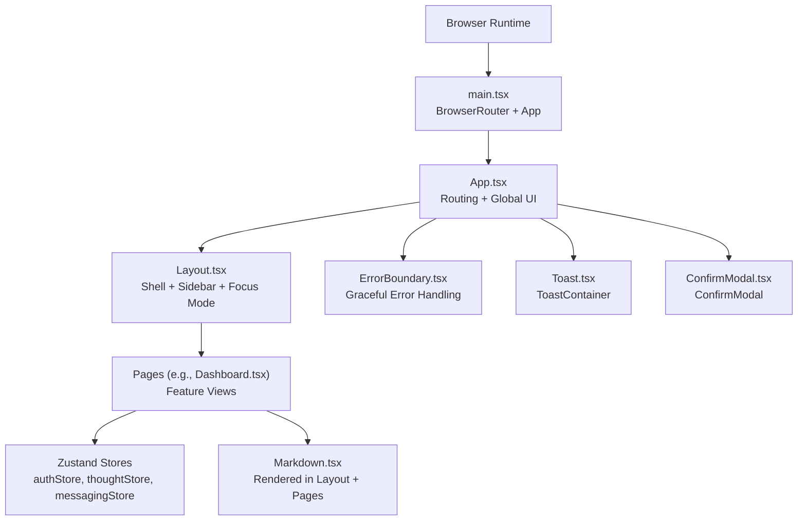
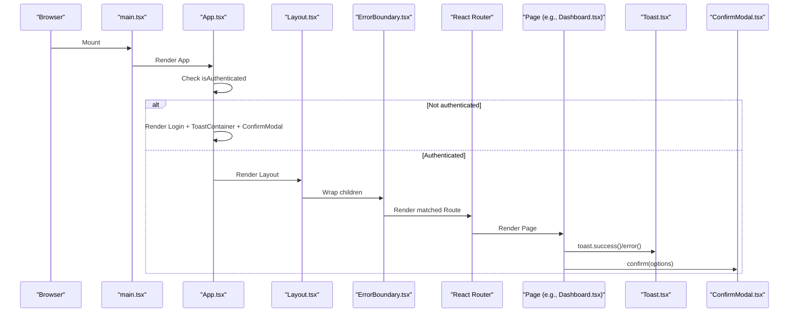
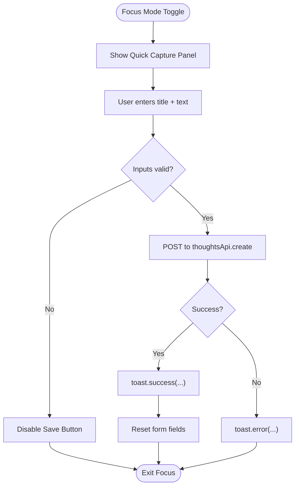
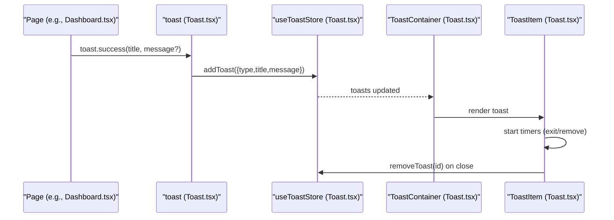
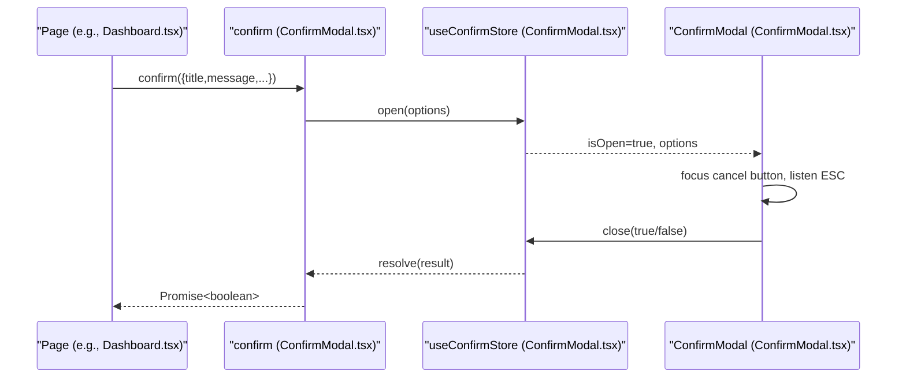
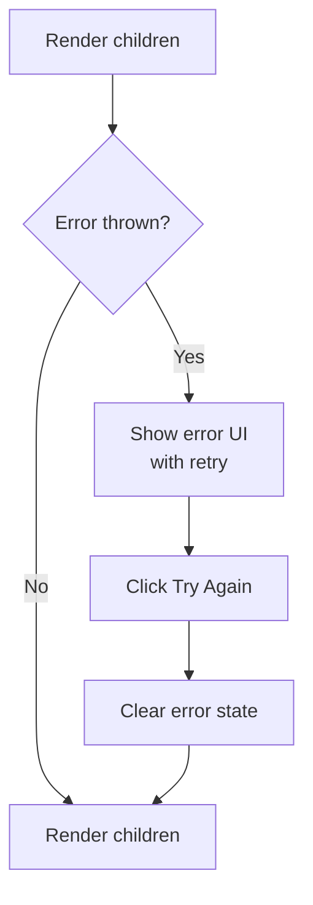
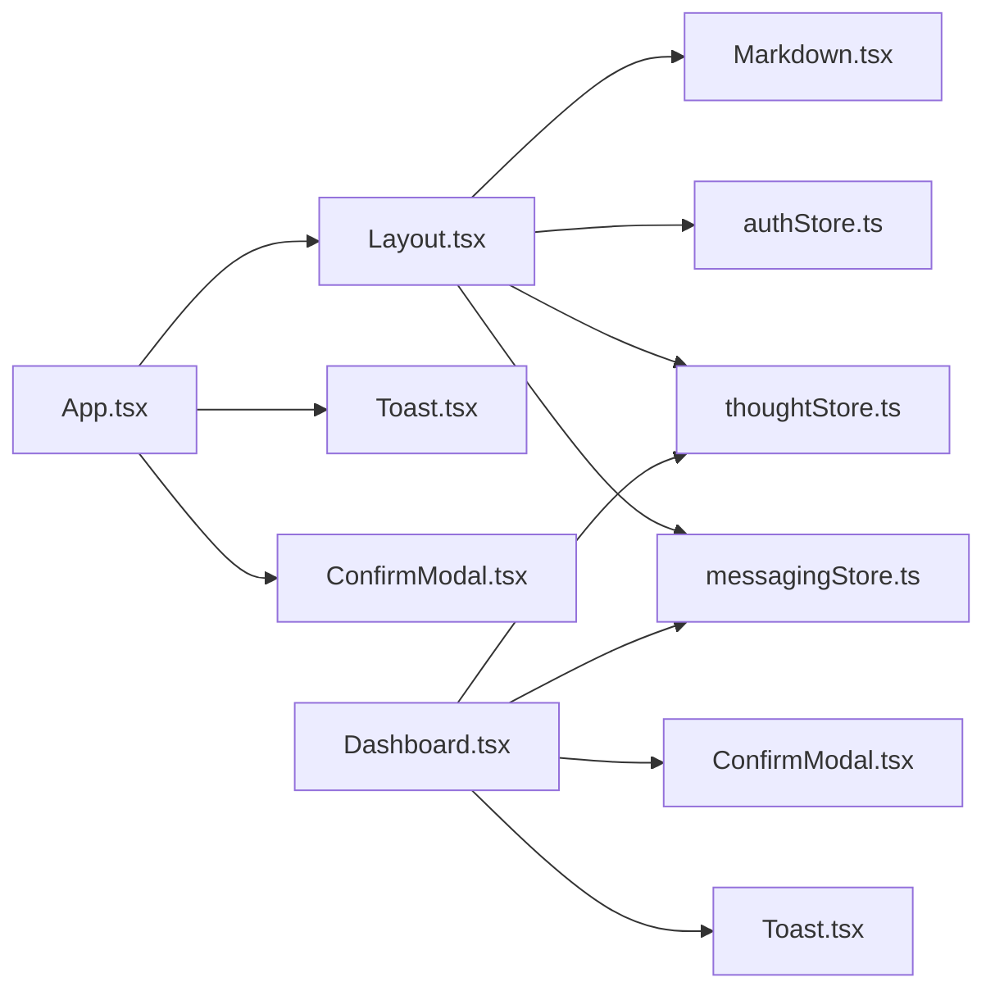

# Component System

<cite>
**Referenced Files in This Document**
- [App.tsx](file://frontend/src/App.tsx)
- [Layout.tsx](file://frontend/src/components/Layout.tsx)
- [Toast.tsx](file://frontend/src/components/Toast.tsx)
- [ConfirmModal.tsx](file://frontend/src/components/ConfirmModal.tsx)
- [ErrorBoundary.tsx](file://frontend/src/components/ErrorBoundary.tsx)
- [Markdown.tsx](file://frontend/src/components/Markdown.tsx)
- [CollapsibleMarkdown.tsx](file://frontend/src/components/CollapsibleMarkdown.tsx)
- [Dashboard.tsx](file://frontend/src/pages/Dashboard.tsx)
- [authStore.ts](file://frontend/src/store/authStore.ts)
- [thoughtStore.ts](file://frontend/src/store/thoughtStore.ts)
- [messagingStore.ts](file://frontend/src/store/messagingStore.ts)
- [main.tsx](file://frontend/src/main.tsx)
- [index.css](file://frontend/src/index.css)
- [tailwind.config.js](file://frontend/src/tailwind.config.js)
</cite>

## Table of Contents
1. [Introduction](#introduction)
2. [Project Structure](#project-structure)
3. [Core Components](#core-components)
4. [Architecture Overview](#architecture-overview)
5. [Detailed Component Analysis](#detailed-component-analysis)
6. [Dependency Analysis](#dependency-analysis)
7. [Performance Considerations](#performance-considerations)
8. [Troubleshooting Guide](#troubleshooting-guide)
9. [Conclusion](#conclusion)
10. [Appendices](#appendices)

## Introduction
This document describes the reusable component system of the 4Ever React frontend. It focuses on the Layout, Toast, ConfirmModal, ErrorBoundary, and Markdown components, explaining their composition patterns, prop interfaces, and usage examples. It also details the component hierarchy starting from the root App component, how child components inherit context and props, and provides guidelines for component development, styling, and accessibility. Special attention is given to error boundary behavior and the toast notification system, along with integration patterns and best practices for consistency.

## Project Structure
The frontend is a Vite/Tailwind-based React application bootstrapped in main.tsx and rendered under BrowserRouter. The App component orchestrates routing and composes global UI elements such as Layout, ErrorBoundary, ToastContainer, and ConfirmModal. Child pages (e.g., Dashboard) are rendered inside Layout and consume stores and APIs.

**Diagram sources**
- [main.tsx:1-14](file://frontend/src/main.tsx#L1-L14)
- [App.tsx:25-67](file://frontend/src/App.tsx#L25-L67)
- [Layout.tsx:49-435](file://frontend/src/components/Layout.tsx#L49-L435)
- [ErrorBoundary.tsx:13-59](file://frontend/src/components/ErrorBoundary.tsx#L13-L59)
- [Toast.tsx:99-110](file://frontend/src/components/Toast.tsx#L99-L110)
- [ConfirmModal.tsx:42-134](file://frontend/src/components/ConfirmModal.tsx#L42-L134)
- [Dashboard.tsx:55-186](file://frontend/src/pages/Dashboard.tsx#L55-L186)
- [Markdown.tsx:9-94](file://frontend/src/components/Markdown.tsx#L9-L94)

**Section sources**
- [main.tsx:1-14](file://frontend/src/main.tsx#L1-L14)
- [App.tsx:1-70](file://frontend/src/App.tsx#L1-L70)

## Core Components
This section summarizes the five reusable components and their roles.

- Layout: Provides the shell with sidebar navigation, focus mode quick capture and AI chat, subscription and messaging integration, and renders children passed from routes.
- Toast: A toast notification system built with Zustand for state and Lucide icons for visuals, exposing a simple helper API and a container component.
- ConfirmModal: A global confirmation dialog with a Zustand store, keyboard handling, and variant styling for danger/warning/default.
- ErrorBoundary: A class-based error boundary that catches rendering errors and displays a friendly retry UI.
- Markdown: A component that renders GitHub-flavored markdown with Tailwind-styled defaults and custom overrides for headings, lists, code blocks, links, and tables.

Usage examples:
- Toast is invoked globally via a helper (e.g., success/error) and displayed via ToastContainer.
- ConfirmModal is opened via a helper and resolves a promise with a boolean result.
- ErrorBoundary wraps route content to prevent app crashes and offer a retry mechanism.
- Markdown is embedded within Layout’s focus mode chat and other pages.

**Section sources**
- [Layout.tsx:49-435](file://frontend/src/components/Layout.tsx#L49-L435)
- [Toast.tsx:32-110](file://frontend/src/components/Toast.tsx#L32-L110)
- [ConfirmModal.tsx:37-134](file://frontend/src/components/ConfirmModal.tsx#L37-L134)
- [ErrorBoundary.tsx:13-59](file://frontend/src/components/ErrorBoundary.tsx#L13-L59)
- [Markdown.tsx:9-94](file://frontend/src/components/Markdown.tsx#L9-L94)

## Architecture Overview
The component hierarchy starts at the root App, which:
- Reads authentication state from authStore to decide whether to render Login or the authenticated Layout.
- Renders ErrorBoundary around routed pages.
- Wraps the entire app with Layout and mounts ToastContainer and ConfirmModal once.

Layout composes:
- Navigation and sidebar with responsive behavior.
- Focus Mode UI for quick capture and AI chat.
- Subscription and messaging stores integration.
- Markdown rendering for assistant responses.

**Diagram sources**
- [main.tsx:7-13](file://frontend/src/main.tsx#L7-L13)
- [App.tsx:25-67](file://frontend/src/App.tsx#L25-L67)
- [Layout.tsx:49-435](file://frontend/src/components/Layout.tsx#L49-L435)
- [ErrorBoundary.tsx:13-59](file://frontend/src/components/ErrorBoundary.tsx#L13-L59)
- [Dashboard.tsx:127-152](file://frontend/src/pages/Dashboard.tsx#L127-L152)
- [Toast.tsx:32-42](file://frontend/src/components/Toast.tsx#L32-L42)
- [ConfirmModal.tsx:37-40](file://frontend/src/components/ConfirmModal.tsx#L37-L40)

## Detailed Component Analysis

### Layout Component
Responsibilities:
- Manage sidebar visibility and collapse state persisted in localStorage.
- Provide navigation items and active state detection.
- Integrate authentication, subscription, and messaging stores.
- Implement Focus Mode with quick capture form and AI chat panel.
- Render children passed from React Router.

Key props and composition:
- Accepts children via a single prop interface.
- Uses Lucide icons for navigation and actions.
- Integrates with orchestrationApi for quick chat and thoughtsApi for quick capture.

Focus Mode flow:

**Diagram sources**
- [Layout.tsx:113-131](file://frontend/src/components/Layout.tsx#L113-L131)
- [Layout.tsx:123-127](file://frontend/src/components/Layout.tsx#L123-L127)
- [Toast.tsx:32-42](file://frontend/src/components/Toast.tsx#L32-L42)

**Section sources**
- [Layout.tsx:40-42](file://frontend/src/components/Layout.tsx#L40-L42)
- [Layout.tsx:50-90](file://frontend/src/components/Layout.tsx#L50-L90)
- [Layout.tsx:113-131](file://frontend/src/components/Layout.tsx#L113-L131)
- [Layout.tsx:138-154](file://frontend/src/components/Layout.tsx#L138-L154)
- [Layout.tsx:157-287](file://frontend/src/components/Layout.tsx#L157-L287)
- [Layout.tsx:208-272](file://frontend/src/components/Layout.tsx#L208-L272)

### Toast Component
System design:
- Centralized state via Zustand store with helpers for success/error/warning/info.
- ToastContainer renders all active toasts with exit animations and optional auto-dismiss.
- Each toast supports a title and optional message, with variant-specific colors and icons.

Usage pattern:
- Call helper methods to enqueue notifications.
- ToastContainer is mounted once at the root for global access.

**Diagram sources**
- [Dashboard.tsx:127-133](file://frontend/src/pages/Dashboard.tsx#L127-L133)
- [Dashboard.tsx:148-151](file://frontend/src/pages/Dashboard.tsx#L148-L151)
- [Toast.tsx:32-42](file://frontend/src/components/Toast.tsx#L32-L42)
- [Toast.tsx:22-30](file://frontend/src/components/Toast.tsx#L22-L30)
- [Toast.tsx:99-110](file://frontend/src/components/Toast.tsx#L99-L110)
- [Toast.tsx:44-96](file://frontend/src/components/Toast.tsx#L44-L96)

**Section sources**
- [Toast.tsx:6-21](file://frontend/src/components/Toast.tsx#L6-L21)
- [Toast.tsx:22-30](file://frontend/src/components/Toast.tsx#L22-L30)
- [Toast.tsx:32-42](file://frontend/src/components/Toast.tsx#L32-L42)
- [Toast.tsx:44-96](file://frontend/src/components/Toast.tsx#L44-L96)
- [Toast.tsx:99-110](file://frontend/src/components/Toast.tsx#L99-L110)

### ConfirmModal Component
System design:
- Zustand store manages modal state, options, and promise resolution.
- Keyboard handling focuses the cancel button and listens for Escape.
- Variant styling supports danger, warning, and default modes.

Usage pattern:
- Call confirm(options) to open the modal and await a boolean result.
- Close with confirm(true) or cancel(false).

**Diagram sources**
- [Dashboard.tsx:138-144](file://frontend/src/pages/Dashboard.tsx#L138-L144)
- [ConfirmModal.tsx:37-40](file://frontend/src/components/ConfirmModal.tsx#L37-L40)
- [ConfirmModal.tsx:22-35](file://frontend/src/components/ConfirmModal.tsx#L22-L35)
- [ConfirmModal.tsx:42-134](file://frontend/src/components/ConfirmModal.tsx#L42-L134)

**Section sources**
- [ConfirmModal.tsx:5-21](file://frontend/src/components/ConfirmModal.tsx#L5-L21)
- [ConfirmModal.tsx:22-35](file://frontend/src/components/ConfirmModal.tsx#L22-L35)
- [ConfirmModal.tsx:37-40](file://frontend/src/components/ConfirmModal.tsx#L37-L40)
- [ConfirmModal.tsx:42-134](file://frontend/src/components/ConfirmModal.tsx#L42-L134)

### ErrorBoundary Component
Behavior:
- Catches rendering errors via getDerivedStateFromError.
- Displays a friendly UI with error message and a retry button.
- Clears error state on retry.

**Diagram sources**
- [ErrorBoundary.tsx:19-25](file://frontend/src/components/ErrorBoundary.tsx#L19-L25)
- [ErrorBoundary.tsx:31-58](file://frontend/src/components/ErrorBoundary.tsx#L31-L58)

**Section sources**
- [ErrorBoundary.tsx:4-11](file://frontend/src/components/ErrorBoundary.tsx#L4-L11)
- [ErrorBoundary.tsx:13-29](file://frontend/src/components/ErrorBoundary.tsx#L13-L29)
- [ErrorBoundary.tsx:31-58](file://frontend/src/components/ErrorBoundary.tsx#L31-L58)

### Markdown Component
Features:
- Renders GitHub-flavored markdown with Tailwind-friendly defaults.
- Overrides headings, paragraphs, lists, code blocks, inline code, blockquotes, links, horizontal rules, and tables.
- Supports custom className propagation.

Integration:
- Used within Layout’s focus mode chat to render assistant responses.

**Section sources**
- [Markdown.tsx:4-7](file://frontend/src/components/Markdown.tsx#L4-L7)
- [Markdown.tsx:10-94](file://frontend/src/components/Markdown.tsx#L10-L94)
- [Layout.tsx:244](file://frontend/src/components/Layout.tsx#L244)

### CollapsibleMarkdown Component
Features:
- Parses markdown into preamble and collapsible sections based on headings.
- Renders sections with expand/collapse controls.
- Falls back to regular Markdown when there are 0-1 sections.

**Section sources**
- [CollapsibleMarkdown.tsx:5-10](file://frontend/src/components/CollapsibleMarkdown.tsx#L5-L10)
- [CollapsibleMarkdown.tsx:18-38](file://frontend/src/components/CollapsibleMarkdown.tsx#L18-L38)
- [CollapsibleMarkdown.tsx:70-87](file://frontend/src/components/CollapsibleMarkdown.tsx#L70-L87)

## Dependency Analysis
Component and store dependencies:
- App depends on authStore for authentication gating and mounts ToastContainer and ConfirmModal globally.
- Layout consumes authStore, thoughtStore, messagingStore, and subscription store; integrates with APIs for chat and quick capture; renders Markdown.
- Dashboard demonstrates integration with ConfirmModal and Toast via helper APIs and uses thoughtStore and messagingStore.
- Toast and ConfirmModal rely on Zustand stores for state and expose helper APIs for consumption.

**Diagram sources**
- [App.tsx:25-67](file://frontend/src/App.tsx#L25-L67)
- [Layout.tsx:28-37](file://frontend/src/components/Layout.tsx#L28-L37)
- [Dashboard.tsx:18-19](file://frontend/src/pages/Dashboard.tsx#L18-L19)
- [authStore.ts:18-31](file://frontend/src/store/authStore.ts#L18-L31)
- [thoughtStore.ts:62-79](file://frontend/src/store/thoughtStore.ts#L62-L79)
- [messagingStore.ts:72-412](file://frontend/src/store/messagingStore.ts#L72-L412)

**Section sources**
- [App.tsx:25-67](file://frontend/src/App.tsx#L25-L67)
- [Layout.tsx:28-37](file://frontend/src/components/Layout.tsx#L28-L37)
- [Dashboard.tsx:18-19](file://frontend/src/pages/Dashboard.tsx#L18-L19)

## Performance Considerations
- Toast and ConfirmModal use lightweight Zustand stores; keep payloads minimal to avoid unnecessary re-renders.
- Layout’s Focus Mode chat maintains message arrays; consider pagination or truncation for long histories.
- Markdown rendering is client-side; for very large documents, consider lazy loading or server-side rendering.
- Sidebar collapse state is persisted in localStorage; ensure keys remain stable to avoid cache thrash.

## Troubleshooting Guide
Common issues and resolutions:
- Toast not appearing:
  - Ensure ToastContainer is mounted once at the root.
  - Verify helper calls are made after store initialization.
- ConfirmModal not closing:
  - Ensure confirm(options) is awaited and close handlers are called with true/false.
  - Check that Escape key handling is not blocked by nested modals.
- ErrorBoundary not catching errors:
  - Verify ErrorBoundary wraps the intended component tree.
  - Remember that ErrorBoundary handles rendering errors; network errors should be handled in components.
- Markdown styles not applied:
  - Confirm Tailwind utilities are included and prose classes are not overridden unexpectedly.

**Section sources**
- [Toast.tsx:99-110](file://frontend/src/components/Toast.tsx#L99-L110)
- [ConfirmModal.tsx:46-55](file://frontend/src/components/ConfirmModal.tsx#L46-L55)
- [ErrorBoundary.tsx:19-25](file://frontend/src/components/ErrorBoundary.tsx#L19-L25)
- [Markdown.tsx:10-94](file://frontend/src/components/Markdown.tsx#L10-L94)

## Conclusion
The 4Ever React frontend employs a clear separation of concerns: App orchestrates routing and global UI, Layout provides the shell and focus mode, and Toast/ConfirmModal deliver user feedback and confirmation. ErrorBoundary ensures graceful degradation. Markdown standardizes content rendering. The system leverages Zustand for predictable state management and Tailwind for consistent styling. Following the patterns documented here will help maintain consistency and reliability across the application.

## Appendices

### Component Composition Patterns
- Global UI mounting: ToastContainer and ConfirmModal are rendered once at the root for global availability.
- Route wrapping: ErrorBoundary wraps routed pages to isolate rendering errors.
- Store-driven UI: Layout reads from authStore, thoughtStore, messagingStore, and subscription store to drive UI state and integrations.
- Helper APIs: toast and confirm provide ergonomic, imperative APIs for asynchronous user feedback and confirmation.

**Section sources**
- [App.tsx:21-23](file://frontend/src/App.tsx#L21-L23)
- [App.tsx:40-64](file://frontend/src/App.tsx#L40-L64)
- [Layout.tsx:57-76](file://frontend/src/components/Layout.tsx#L57-L76)
- [Toast.tsx:32-42](file://frontend/src/components/Toast.tsx#L32-L42)
- [ConfirmModal.tsx:37-40](file://frontend/src/components/ConfirmModal.tsx#L37-L40)

### Styling and Accessibility Guidelines
- Styling approach:
  - Tailwind utilities define base styles and component classes (.btn-primary, .input, .textarea, .card).
  - Theme extension defines primary color palette and animation utilities.
  - Prose classes style Markdown-rendered content consistently.
- Accessibility considerations:
  - Use semantic HTML and aria labels where appropriate.
  - Ensure focus management for modals (ConfirmModal focuses cancel button).
  - Provide visible focus indicators and sufficient color contrast.
  - Avoid relying solely on color to convey meaning; pair icons with text.

**Section sources**
- [index.css:11-31](file://frontend/src/index.css#L11-L31)
- [index.css:33-102](file://frontend/src/index.css#L33-L102)
- [tailwind.config.js:7-36](file://frontend/src/tailwind.config.js#L7-L36)
- [ConfirmModal.tsx:46-55](file://frontend/src/components/ConfirmModal.tsx#L46-L55)