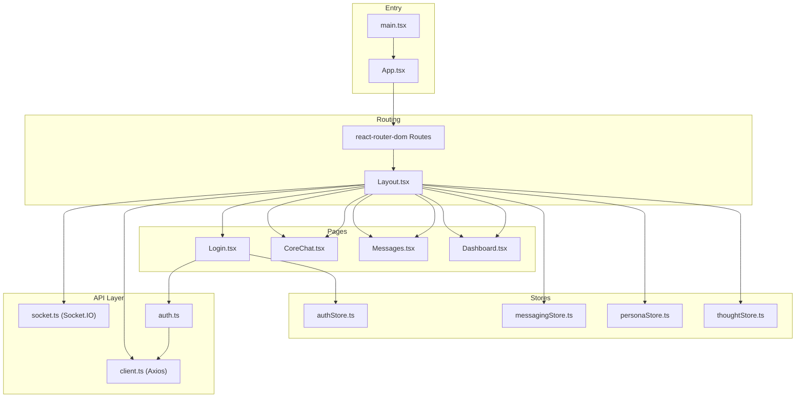
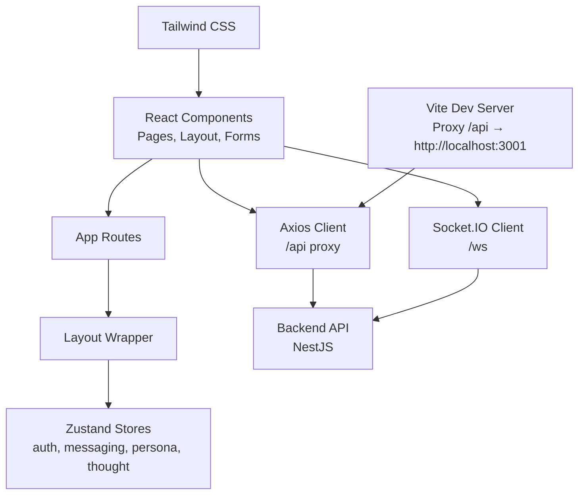
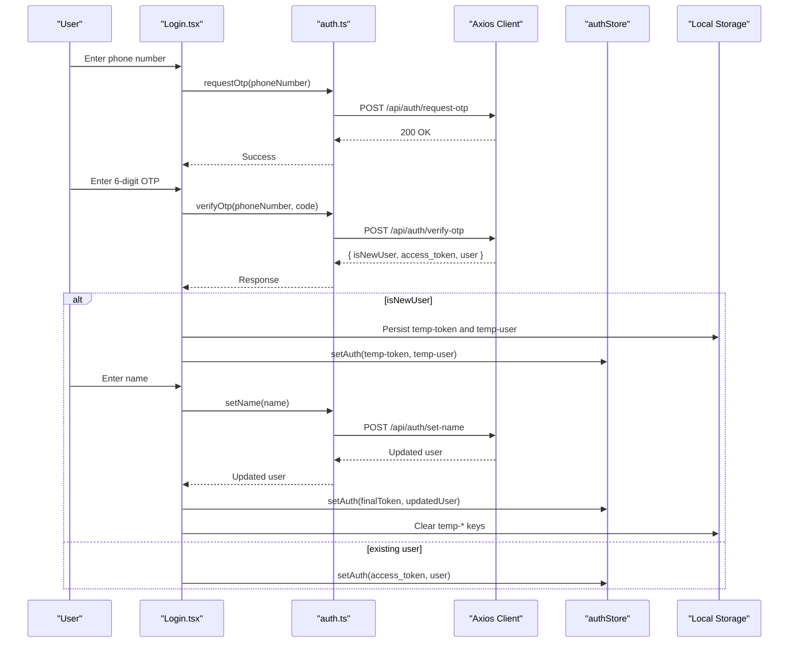
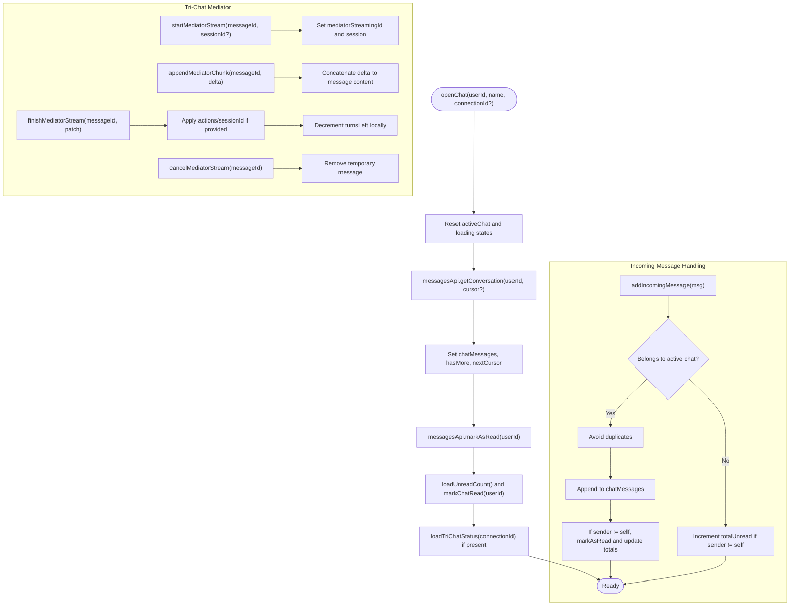
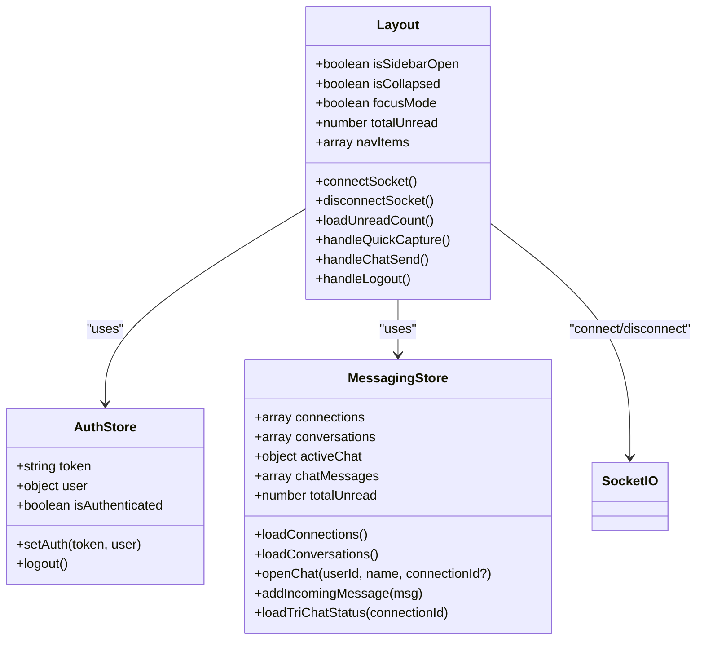
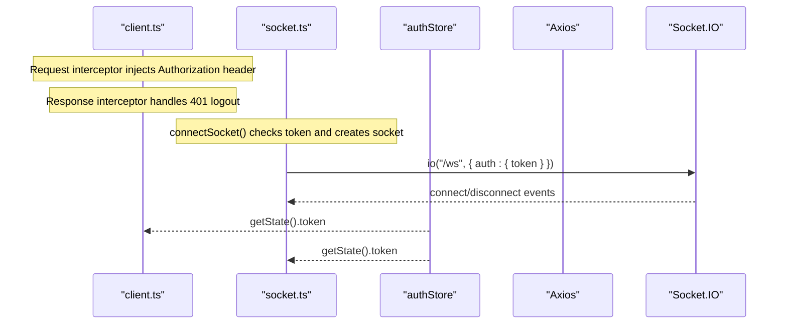
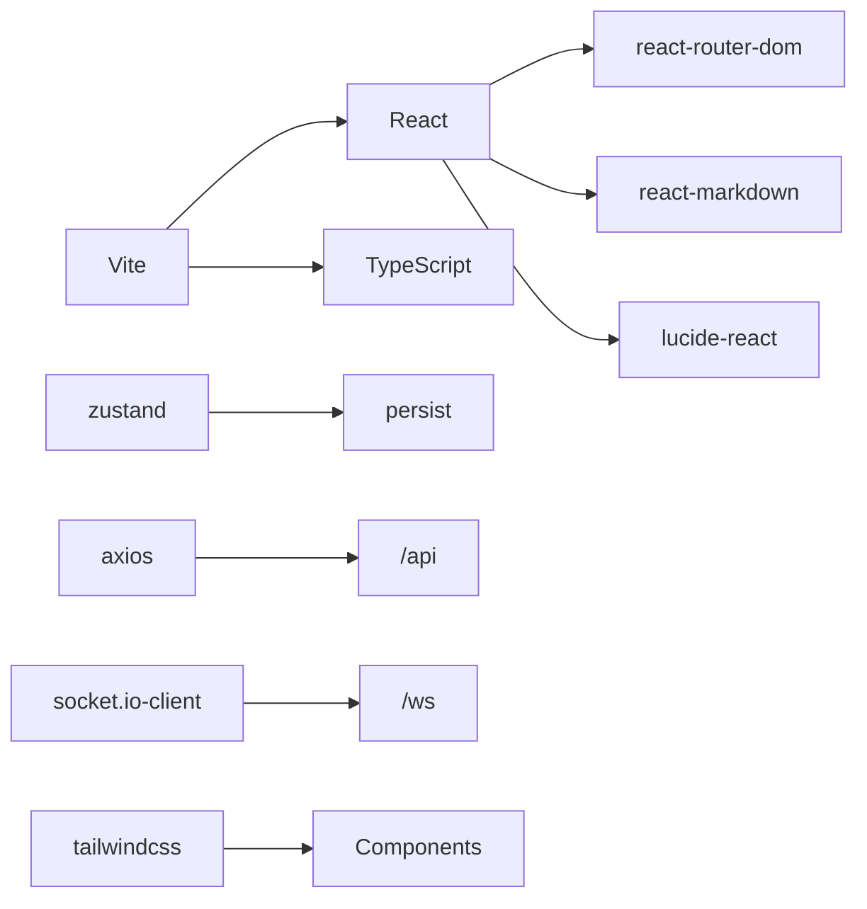

# Frontend Architecture

<cite>
**Referenced Files in This Document**
- [App.tsx](file://frontend/src/App.tsx)
- [main.tsx](file://frontend/src/main.tsx)
- [Layout.tsx](file://frontend/src/components/Layout.tsx)
- [ErrorBoundary.tsx](file://frontend/src/components/ErrorBoundary.tsx)
- [authStore.ts](file://frontend/src/store/authStore.ts)
- [messagingStore.ts](file://frontend/src/store/messagingStore.ts)
- [personaStore.ts](file://frontend/src/store/personaStore.ts)
- [thoughtStore.ts](file://frontend/src/store/thoughtStore.ts)
- [client.ts](file://frontend/src/api/client.ts)
- [socket.ts](file://frontend/src/api/socket.ts)
- [auth.ts](file://frontend/src/api/auth.ts)
- [Login.tsx](file://frontend/src/pages/Login.tsx)
- [vite.config.ts](file://frontend/vite.config.ts)
- [tailwind.config.js](file://frontend/tailwind.config.js)
- [package.json](file://frontend/package.json)
</cite>

## Table of Contents
1. [Introduction](#introduction)
2. [Project Structure](#project-structure)
3. [Core Components](#core-components)
4. [Architecture Overview](#architecture-overview)
5. [Detailed Component Analysis](#detailed-component-analysis)
6. [Dependency Analysis](#dependency-analysis)
7. [Performance Considerations](#performance-considerations)
8. [Troubleshooting Guide](#troubleshooting-guide)
9. [Conclusion](#conclusion)

## Introduction
This document describes the frontend architecture of the 4Ever React application. It covers the entry points, routing and layout system, state management with Zustand, API client and WebSocket integration, build configuration with Vite and Tailwind CSS, component composition patterns, form handling with validation, and error boundaries. It also explains the integration between frontend components and backend APIs, including the authentication flow and real-time message synchronization.

## Project Structure
The frontend is organized around a React application bootstrapped with Vite, styled with Tailwind CSS, and structured into:
- Entry points: main.tsx and App.tsx
- Routing and layout: App routes and Layout wrapper
- Pages: feature-specific screens under pages/
- Components: reusable UI building blocks under components/
- Stores: Zustand stores for auth, messaging, persona, thought, and subscription state
- API: Axios client, Socket.IO integration, and typed API modules
- Build and styling: Vite configuration, Tailwind setup, and TypeScript

**Diagram sources**
- [main.tsx:1-14](file://frontend/src/main.tsx#L1-L14)
- [App.tsx:1-70](file://frontend/src/App.tsx#L1-L70)
- [Layout.tsx:1-436](file://frontend/src/components/Layout.tsx#L1-L436)
- [Login.tsx:1-277](file://frontend/src/pages/Login.tsx#L1-L277)
- [authStore.ts:1-32](file://frontend/src/store/authStore.ts#L1-L32)
- [messagingStore.ts:1-412](file://frontend/src/store/messagingStore.ts#L1-L412)
- [personaStore.ts:1-39](file://frontend/src/store/personaStore.ts#L1-L39)
- [thoughtStore.ts:1-79](file://frontend/src/store/thoughtStore.ts#L1-L79)
- [client.ts:1-30](file://frontend/src/api/client.ts#L1-L30)
- [socket.ts:1-38](file://frontend/src/api/socket.ts#L1-L38)
- [auth.ts:1-37](file://frontend/src/api/auth.ts#L1-L37)

**Section sources**
- [main.tsx:1-14](file://frontend/src/main.tsx#L1-L14)
- [App.tsx:1-70](file://frontend/src/App.tsx#L1-L70)
- [Layout.tsx:1-436](file://frontend/src/components/Layout.tsx#L1-L436)
- [vite.config.ts:1-22](file://frontend/vite.config.ts#L1-L22)
- [tailwind.config.js:1-37](file://frontend/tailwind.config.js#L1-L37)
- [package.json:1-35](file://frontend/package.json#L1-L35)

## Core Components
- Entry points:
  - main.tsx initializes React, wraps the app in BrowserRouter, and renders App.
  - App.tsx defines routes and conditionally renders Login when unauthenticated or Layout with protected routes when authenticated.
- Layout and navigation:
  - Layout.tsx provides a responsive sidebar, mobile menu, focus mode, quick capture, AI chat panel, and persistent socket connection and unread counters.
- Authentication flow:
  - Login.tsx implements a three-step phone → OTP → name flow using auth.ts and updates authStore.
- State management:
  - authStore: JWT token, user profile, and authentication state persisted to storage.
  - messagingStore: connections, conversations, active chat, tri-chat mediator state, and real-time message handling.
  - personaStore: CRUD for personas.
  - thoughtStore: CRUD for thoughts, threads, and persona runs.
- API and WebSocket:
  - client.ts centralizes HTTP requests with automatic Authorization header injection and 401 logout handling.
  - socket.ts manages Socket.IO connection with auth token and lifecycle hooks.
  - auth.ts exposes typed endpoints for OTP, verification, name setting, and user retrieval.
- Error handling:
  - ErrorBoundary.tsx provides a fallback UI with retry and error details logging.

**Section sources**
- [main.tsx:1-14](file://frontend/src/main.tsx#L1-L14)
- [App.tsx:1-70](file://frontend/src/App.tsx#L1-L70)
- [Layout.tsx:1-436](file://frontend/src/components/Layout.tsx#L1-L436)
- [Login.tsx:1-277](file://frontend/src/pages/Login.tsx#L1-L277)
- [authStore.ts:1-32](file://frontend/src/store/authStore.ts#L1-L32)
- [messagingStore.ts:1-412](file://frontend/src/store/messagingStore.ts#L1-L412)
- [personaStore.ts:1-39](file://frontend/src/store/personaStore.ts#L1-L39)
- [thoughtStore.ts:1-79](file://frontend/src/store/thoughtStore.ts#L1-L79)
- [client.ts:1-30](file://frontend/src/api/client.ts#L1-L30)
- [socket.ts:1-38](file://frontend/src/api/socket.ts#L1-L38)
- [auth.ts:1-37](file://frontend/src/api/auth.ts#L1-L37)
- [ErrorBoundary.tsx:1-60](file://frontend/src/components/ErrorBoundary.tsx#L1-L60)

## Architecture Overview
The frontend follows a layered architecture:
- Presentation layer: React components and pages
- Routing and layout: App routes and Layout wrapper
- State management: Zustand stores for domain-specific state
- API layer: Axios client and Socket.IO client
- Backend integration: REST endpoints via /api proxy and WebSocket events

**Diagram sources**
- [App.tsx:1-70](file://frontend/src/App.tsx#L1-L70)
- [Layout.tsx:1-436](file://frontend/src/components/Layout.tsx#L1-L436)
- [authStore.ts:1-32](file://frontend/src/store/authStore.ts#L1-L32)
- [messagingStore.ts:1-412](file://frontend/src/store/messagingStore.ts#L1-L412)
- [client.ts:1-30](file://frontend/src/api/client.ts#L1-L30)
- [socket.ts:1-38](file://frontend/src/api/socket.ts#L1-L38)
- [vite.config.ts:1-22](file://frontend/vite.config.ts#L1-L22)
- [tailwind.config.js:1-37](file://frontend/tailwind.config.js#L1-L37)

## Detailed Component Analysis

### Authentication Flow and State Management
The authentication flow is a multi-step process handled in Login.tsx and integrated with authStore and auth.ts. The flow ensures secure onboarding and persistent login state.

**Diagram sources**
- [Login.tsx:1-277](file://frontend/src/pages/Login.tsx#L1-L277)
- [auth.ts:1-37](file://frontend/src/api/auth.ts#L1-L37)
- [client.ts:1-30](file://frontend/src/api/client.ts#L1-L30)
- [authStore.ts:1-32](file://frontend/src/store/authStore.ts#L1-L32)

**Section sources**
- [Login.tsx:1-277](file://frontend/src/pages/Login.tsx#L1-L277)
- [auth.ts:1-37](file://frontend/src/api/auth.ts#L1-L37)
- [authStore.ts:1-32](file://frontend/src/store/authStore.ts#L1-L32)

### Real-Time Messaging and Tri-Chat State
The messagingStore coordinates connections, conversations, active chats, and tri-chat mediator sessions. It integrates with Socket.IO for real-time updates and maintains optimistic UI behavior.

**Diagram sources**
- [messagingStore.ts:1-412](file://frontend/src/store/messagingStore.ts#L1-L412)
- [Layout.tsx:1-436](file://frontend/src/components/Layout.tsx#L1-L436)

**Section sources**
- [messagingStore.ts:1-412](file://frontend/src/store/messagingStore.ts#L1-L412)
- [Layout.tsx:1-436](file://frontend/src/components/Layout.tsx#L1-L436)

### Layout System and Responsive Navigation
Layout.tsx implements a responsive sidebar with collapsible behavior, mobile menu, focus mode, quick capture, and AI chat panel. It connects to Socket.IO for real-time updates and manages subscription state.

**Diagram sources**
- [Layout.tsx:1-436](file://frontend/src/components/Layout.tsx#L1-L436)
- [authStore.ts:1-32](file://frontend/src/store/authStore.ts#L1-L32)
- [messagingStore.ts:1-412](file://frontend/src/store/messagingStore.ts#L1-L412)
- [socket.ts:1-38](file://frontend/src/api/socket.ts#L1-L38)

**Section sources**
- [Layout.tsx:1-436](file://frontend/src/components/Layout.tsx#L1-L436)

### API Client and WebSocket Integration
Centralized HTTP requests are handled by an Axios instance configured with base URL and interceptors for Authorization and 401 handling. Socket.IO integration provides real-time features with token-based authentication.

**Diagram sources**
- [client.ts:1-30](file://frontend/src/api/client.ts#L1-L30)
- [socket.ts:1-38](file://frontend/src/api/socket.ts#L1-L38)
- [authStore.ts:1-32](file://frontend/src/store/authStore.ts#L1-L32)

**Section sources**
- [client.ts:1-30](file://frontend/src/api/client.ts#L1-L30)
- [socket.ts:1-38](file://frontend/src/api/socket.ts#L1-L38)
- [authStore.ts:1-32](file://frontend/src/store/authStore.ts#L1-L32)

### Form Handling and Validation Patterns
The Login component demonstrates a multi-step form with:
- Controlled inputs and step transitions
- Input sanitization and masking (OTP numeric input)
- Countdown timers for resend OTP
- Error propagation and user feedback
- Conditional rendering based on current step

Validation patterns include:
- Required field checks
- Length constraints (OTP length)
- Country code guidance
- Disabled states during async operations

**Section sources**
- [Login.tsx:1-277](file://frontend/src/pages/Login.tsx#L1-L277)

### Error Boundary Implementation
ErrorBoundary.tsx provides a robust fallback UI with:
- Derived state on error
- Console logging for diagnostics
- Retry mechanism to recover from transient errors
- Readable error presentation with message truncation

**Section sources**
- [ErrorBoundary.tsx:1-60](file://frontend/src/components/ErrorBoundary.tsx#L1-L60)

## Dependency Analysis
The frontend relies on modern React tooling and libraries:
- React and ecosystem: react, react-router-dom, react-markdown, lucide-react
- State management: zustand with persistence middleware
- Networking: axios for HTTP, socket.io-client for WebSocket
- Styling: tailwindcss, autoprefixer, postcss, tailwind-merge, clsx
- Build: vite with React plugin and TypeScript

**Diagram sources**
- [package.json:1-35](file://frontend/package.json#L1-L35)
- [vite.config.ts:1-22](file://frontend/vite.config.ts#L1-L22)
- [tailwind.config.js:1-37](file://frontend/tailwind.config.js#L1-L37)

**Section sources**
- [package.json:1-35](file://frontend/package.json#L1-L35)
- [vite.config.ts:1-22](file://frontend/vite.config.ts#L1-L22)
- [tailwind.config.js:1-37](file://frontend/tailwind.config.js#L1-L37)

## Performance Considerations
- Zustand selectors: Prefer store selectors to minimize re-renders (e.g., subscription tier and active flags).
- Memoization: Use memoization for expensive computations in Layout and pages.
- Lazy loading: Consider lazy-loading heavy pages to reduce initial bundle size.
- Network efficiency: Debounce frequent polling for unread counts; batch updates where possible.
- Rendering: Virtualize long lists in messaging and thought threads.
- Bundle size: Tree-shake unused icons and components; keep third-party dependencies up to date.

## Troubleshooting Guide
Common issues and resolutions:
- Authentication failures:
  - Verify OTP step completes and tokens are stored in authStore and persisted.
  - Check network requests for OTP resend and verify endpoints.
- 401 Unauthorized:
  - Ensure Authorization header is attached via client.ts interceptor.
  - Confirm logout is triggered on 401 response.
- WebSocket disconnections:
  - Confirm token availability before connecting.
  - Monitor connect/disconnect logs and reconnect logic.
- Real-time message desync:
  - Validate deduplication logic for incoming messages.
  - Ensure tri-chat mediator state updates are applied consistently.
- UI responsiveness:
  - Collapse sidebar state persists via localStorage; verify keys are readable.
  - Focus mode quick capture saves thought and displays toast notifications.

**Section sources**
- [client.ts:1-30](file://frontend/src/api/client.ts#L1-L30)
- [socket.ts:1-38](file://frontend/src/api/socket.ts#L1-L38)
- [messagingStore.ts:1-412](file://frontend/src/store/messagingStore.ts#L1-L412)
- [Layout.tsx:1-436](file://frontend/src/components/Layout.tsx#L1-L436)
- [authStore.ts:1-32](file://frontend/src/store/authStore.ts#L1-L32)

## Conclusion
The 4Ever frontend employs a clean separation of concerns with React and Zustand for state, Axios and Socket.IO for networking, and Tailwind CSS for styling. The routing and layout system provide a cohesive user experience, while the authentication flow and real-time messaging enable seamless interaction with backend services. The architecture supports scalability and maintainability through modular stores, typed API modules, and robust error handling.