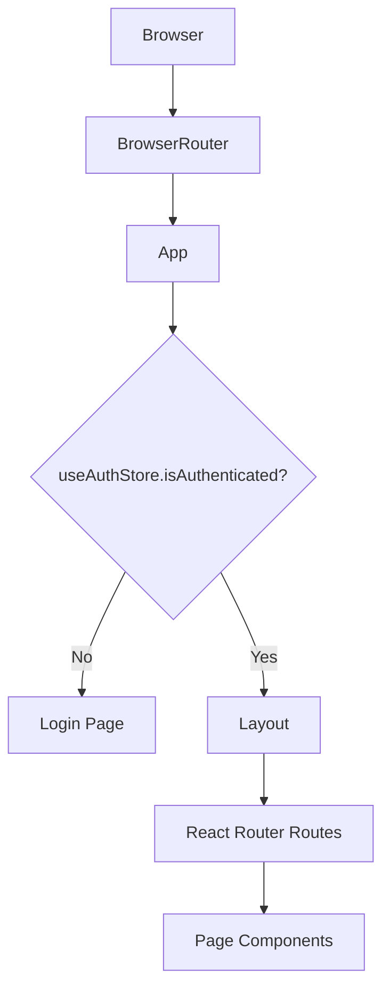
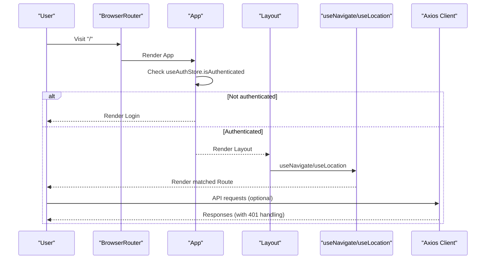
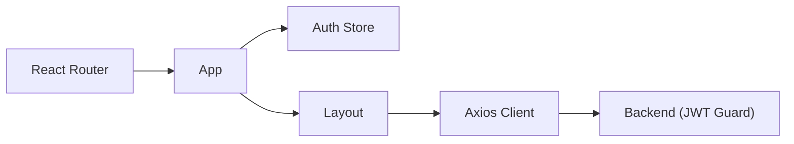

# Routing and Navigation

<cite>
**Referenced Files in This Document**
- [main.tsx](file://frontend/src/main.tsx)
- [App.tsx](file://frontend/src/App.tsx)
- [Layout.tsx](file://frontend/src/components/Layout.tsx)
- [authStore.ts](file://frontend/src/store/authStore.ts)
- [auth.ts](file://frontend/src/api/auth.ts)
- [Login.tsx](file://frontend/src/pages/Login.tsx)
- [Dashboard.tsx](file://frontend/src/pages/Dashboard.tsx)
- [ThoughtThread.tsx](file://frontend/src/pages/ThoughtThread.tsx)
- [Personas.tsx](file://frontend/src/pages/Personas.tsx)
- [client.ts](file://frontend/src/api/client.ts)
- [jwt-auth.guard.ts](file://backend/src/auth/jwt-auth.guard.ts)
- [vite.config.ts](file://frontend/vite.config.ts)
</cite>

## Table of Contents
1. [Introduction](#introduction)
2. [Project Structure](#project-structure)
3. [Core Components](#core-components)
4. [Architecture Overview](#architecture-overview)
5. [Detailed Component Analysis](#detailed-component-analysis)
6. [Dependency Analysis](#dependency-analysis)
7. [Performance Considerations](#performance-considerations)
8. [Troubleshooting Guide](#troubleshooting-guide)
9. [Conclusion](#conclusion)

## Introduction
This document explains the routing and navigation system of the 4Ever React application. It covers React Router configuration, route definitions, navigation patterns, authentication-driven routing, protected routes, programmatic navigation, route parameter handling, and integration with authentication state. It also includes guidance on SEO considerations, preloading strategies, and performance optimization for navigation.

## Project Structure
The frontend uses React Router v6 with a single route definition file and a layout wrapper. Authentication state is centralized in a Zustand store, and the Axios client injects Authorization headers and handles 401 responses by logging out the user.

**Diagram sources**
- [main.tsx:1-14](file://frontend/src/main.tsx#L1-L14)
- [App.tsx:25-67](file://frontend/src/App.tsx#L25-L67)
- [Layout.tsx:49-436](file://frontend/src/components/Layout.tsx#L49-L436)

**Section sources**
- [main.tsx:1-14](file://frontend/src/main.tsx#L1-L14)
- [App.tsx:1-70](file://frontend/src/App.tsx#L1-L70)

## Core Components
- BrowserRouter initialization sets up routing at the root.
- App renders either Login (unauthenticated) or the authenticated Layout with nested routes.
- Layout provides the sidebar navigation, focus mode, and programmatic navigation hooks.
- Auth store manages token, user, and isAuthenticated state.
- Axios client injects Authorization headers and logs out on 401.

Key responsibilities:
- Route definitions and fallback handling.
- Conditional rendering based on authentication.
- Programmatic navigation via useNavigate.
- Route parameter extraction via useParams.

**Section sources**
- [main.tsx:1-14](file://frontend/src/main.tsx#L1-L14)
- [App.tsx:25-67](file://frontend/src/App.tsx#L25-L67)
- [Layout.tsx:56-136](file://frontend/src/components/Layout.tsx#L56-L136)
- [authStore.ts:18-31](file://frontend/src/store/authStore.ts#L18-L31)
- [client.ts:11-27](file://frontend/src/api/client.ts#L11-L27)

## Architecture Overview
The routing architecture is a thin wrapper around React Router with authentication gating at the application level. The Layout component centralizes navigation UI and programmatic navigation.

**Diagram sources**
- [main.tsx:7-12](file://frontend/src/main.tsx#L7-L12)
- [App.tsx:25-67](file://frontend/src/App.tsx#L25-L67)
- [Layout.tsx:55-56](file://frontend/src/components/Layout.tsx#L55-L56)
- [client.ts:11-27](file://frontend/src/api/client.ts#L11-L27)

## Detailed Component Analysis

### Route Definitions and Protected Rendering
- Root outlet conditionally renders Login when not authenticated.
- When authenticated, the Layout wraps Routes that define the app’s pages.
- A catch-all route redirects unmatched paths to the home route.

Protected rendering pattern:
- App checks isAuthenticated from the auth store.
- If false, only Login is rendered; otherwise, Layout and Routes are rendered.

Route hierarchy highlights:
- Home: "/" → Dashboard
- Thought thread: "/thought/:id" → ThoughtThread
- Other pages: /new-thought, /personas, /my-context, /insights, /planner, /actions, /reflections, /core, /knowledge-worker, /circle, /connections, /messages, /shared/:connectionId, /memory
- Catch-all: "*" → Redirect to "/"

**Section sources**
- [App.tsx:25-67](file://frontend/src/App.tsx#L25-L67)
- [App.tsx:42-59](file://frontend/src/App.tsx#L42-L59)

### Authentication Guards and State
- Auth store persists token and user, exposes isAuthenticated, and logout.
- Axios interceptor attaches Authorization header when token exists.
- Axios interceptor detects 401 and triggers logout.

Integration with backend:
- Backend JWT guard authenticates protected endpoints.
- Frontend relies on token presence and 401 handling to maintain sync.

**Section sources**
- [authStore.ts:18-31](file://frontend/src/store/authStore.ts#L18-L31)
- [client.ts:11-27](file://frontend/src/api/client.ts#L11-L27)
- [jwt-auth.guard.ts:1-6](file://backend/src/auth/jwt-auth.guard.ts#L1-L6)

### Navigation Patterns and Programmatic Navigation
- useNavigate is used for:
  - Logout redirection to "/login"
  - Returning from ThoughtThread with navigate(-1)
  - Redirecting to "/personas" when no active personas are available
- useLocation is used to compute active sidebar items.
- useSearchParams is not used in the analyzed files; URL params are handled via useParams.

Sidebar navigation:
- Layout defines navItems with path, label, and icon.
- Active item highlighting uses location.pathname equality.

**Section sources**
- [Layout.tsx:133-136](file://frontend/src/components/Layout.tsx#L133-L136)
- [ThoughtThread.tsx:404-405](file://frontend/src/pages/ThoughtThread.tsx#L404-L405)
- [ThoughtThread.tsx:531-532](file://frontend/src/pages/ThoughtThread.tsx#L531-L532)
- [Layout.tsx:326-351](file://frontend/src/components/Layout.tsx#L326-L351)

### Route Parameter Handling
- ThoughtThread extracts ":id" via useParams and loads the thought and related personas.
- Navigation to "/thought/:id" is initiated from Dashboard’s thought list.

Parameter usage:
- useParams<{ id: string }>
- Route pattern: "/thought/:id"

**Section sources**
- [ThoughtThread.tsx:49-51](file://frontend/src/pages/ThoughtThread.tsx#L49-L51)
- [Dashboard.tsx:728-731](file://frontend/src/pages/Dashboard.tsx#L728-L731)

### Page Components Structure
- Dashboard: Home screen with widgets, thought list, and navigation links.
- Login: Multi-step authentication flow (phone, OTP, name).
- ThoughtThread: Thought detail with persona analysis, streaming replies, and export.
- Personas: Persona management, categories, and knowledge base integration.

Navigation within pages:
- Dashboard links to Planner, Circle, Messages, Personas, etc.
- ThoughtThread provides back navigation and export actions.

**Section sources**
- [Dashboard.tsx:55-794](file://frontend/src/pages/Dashboard.tsx#L55-L794)
- [Login.tsx:8-277](file://frontend/src/pages/Login.tsx#L8-L277)
- [ThoughtThread.tsx:49-1016](file://frontend/src/pages/ThoughtThread.tsx#L49-L1016)
- [Personas.tsx:35-556](file://frontend/src/pages/Personas.tsx#L35-L556)

### Authentication Flow and Redirect Logic
- Login component orchestrates phone → OTP → name steps.
- On successful OTP verification for new users, temporary storage is used until name is set.
- After setting name, the auth store is updated and the user is considered authenticated.

Redirect logic:
- After logout, user is redirected to Login via "/login".
- On 401 from API, the auth store is cleared and the app re-renders unauthenticated.

**Section sources**
- [Login.tsx:40-104](file://frontend/src/pages/Login.tsx#L40-L104)
- [Layout.tsx:133-136](file://frontend/src/components/Layout.tsx#L133-L136)
- [client.ts:22-24](file://frontend/src/api/client.ts#L22-L24)

### Conditional Navigation Based on User State
- App renders Login when not authenticated; otherwise, authenticated routes are available.
- Layout hides sensitive navigation when focus mode is active.
- Some actions (e.g., accessing Personas) redirect to appropriate routes when prerequisites are missing.

**Section sources**
- [App.tsx:25-67](file://frontend/src/App.tsx#L25-L67)
- [Layout.tsx:156-287](file://frontend/src/components/Layout.tsx#L156-L287)
- [ThoughtThread.tsx:531-532](file://frontend/src/pages/ThoughtThread.tsx#L531-L532)

### Integration with Authentication State
- Auth store is consumed at the root App level to decide authenticated vs. unauthenticated UI.
- Axios interceptors rely on the store’s token to sign requests.
- On 401, the store is cleared, causing App to render Login.

**Section sources**
- [App.tsx:26](file://frontend/src/App.tsx#L26)
- [client.ts:11-27](file://frontend/src/api/client.ts#L11-L27)

## Dependency Analysis
The routing layer depends on:
- React Router for declarative routing and navigation.
- Zustand for authentication state persistence.
- Axios for HTTP requests and automatic Authorization header injection.
- Backend JWT guard for server-side authentication enforcement.

**Diagram sources**
- [App.tsx:25-67](file://frontend/src/App.tsx#L25-L67)
- [Layout.tsx:49-436](file://frontend/src/components/Layout.tsx#L49-L436)
- [client.ts:11-27](file://frontend/src/api/client.ts#L11-L27)
- [jwt-auth.guard.ts:1-6](file://backend/src/auth/jwt-auth.guard.ts#L1-L6)

**Section sources**
- [App.tsx:1-70](file://frontend/src/App.tsx#L1-L70)
- [Layout.tsx:28-37](file://frontend/src/components/Layout.tsx#L28-L37)
- [client.ts:1-30](file://frontend/src/api/client.ts#L1-L30)
- [jwt-auth.guard.ts:1-6](file://backend/src/auth/jwt-auth.guard.ts#L1-L6)

## Performance Considerations
- Route-based rendering: Keep route components lightweight; defer heavy work to lazy-loaded chunks if needed.
- Conditional rendering: Avoid expensive computations inside App’s conditional branch; memoize selectors if necessary.
- Programmatic navigation: Prefer useNavigate for SPA transitions to avoid full reloads.
- Preloading strategies:
  - Preload frequently visited pages (e.g., Dashboard) after login.
  - Use route-based prefetching for linked resources (e.g., persona lists when visiting ThoughtThread).
- Bundle splitting: Split large route components to reduce initial bundle size.
- Avoid unnecessary re-renders: Use shallow comparisons for props and memoization for derived data.

[No sources needed since this section provides general guidance]

## Troubleshooting Guide
Common issues and resolutions:
- 401 Unauthorized:
  - Symptom: Requests fail with 401.
  - Cause: Expired or invalid token.
  - Resolution: Axios interceptor clears auth state; App switches to Login automatically.
- Navigation loops:
  - Symptom: Redirects between Login and Dashboard.
  - Cause: Token present but user not loaded; or inconsistent auth state.
  - Resolution: Ensure auth store is hydrated on startup; verify token validity.
- Route parameter errors:
  - Symptom: ThoughtThread shows not found.
  - Cause: Invalid or missing ":id".
  - Resolution: Validate route parameter and handle missing data gracefully.
- Sidebar active state:
  - Symptom: Active item not highlighted.
  - Cause: Path mismatch or dynamic segments.
  - Resolution: Match against location.pathname; adjust navItems accordingly.

**Section sources**
- [client.ts:22-24](file://frontend/src/api/client.ts#L22-L24)
- [App.tsx:25-67](file://frontend/src/App.tsx#L25-L67)
- [ThoughtThread.tsx:356-376](file://frontend/src/pages/ThoughtThread.tsx#L356-L376)
- [Layout.tsx:326-351](file://frontend/src/components/Layout.tsx#L326-L351)

## Conclusion
The 4Ever React application implements a clean, authentication-driven routing model. App-level conditional rendering ensures protected routes while maintaining a seamless SPA experience. Programmatic navigation, route parameters, and Axios interceptors integrate tightly with the auth store to provide secure, responsive navigation. Extending the system involves adding new routes, guarding protected pages, and leveraging the existing auth and API infrastructure.