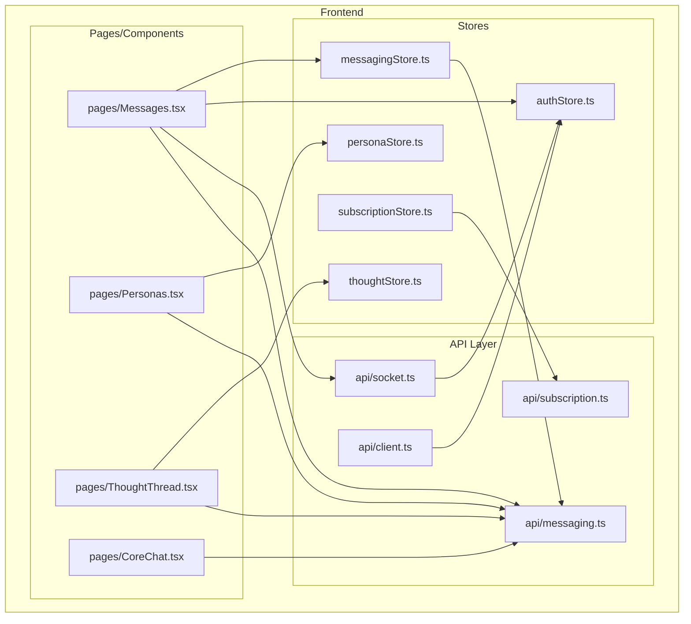
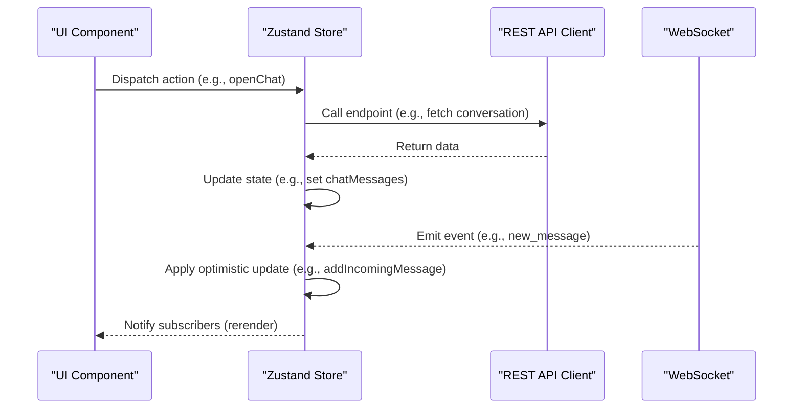
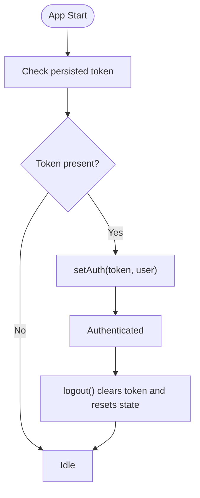
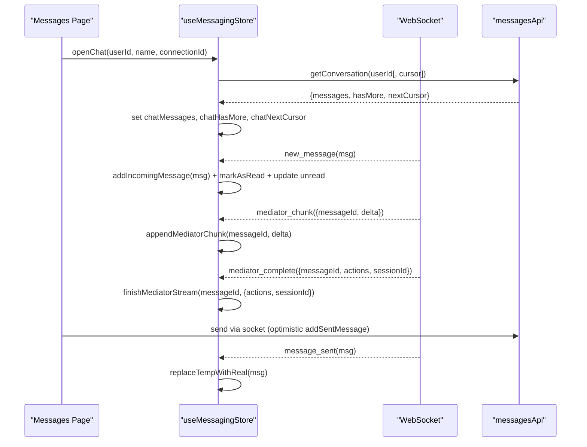
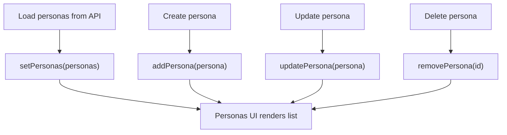
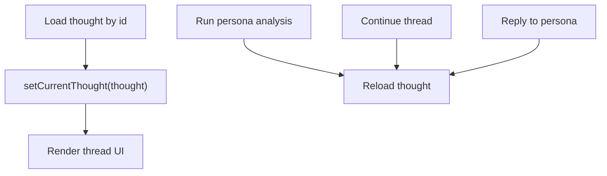
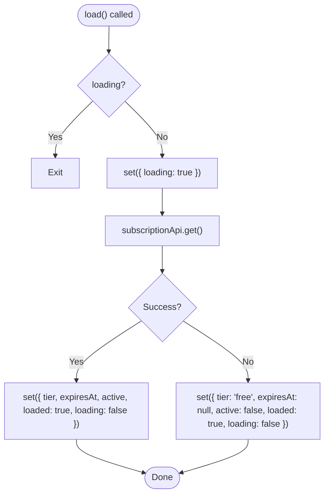
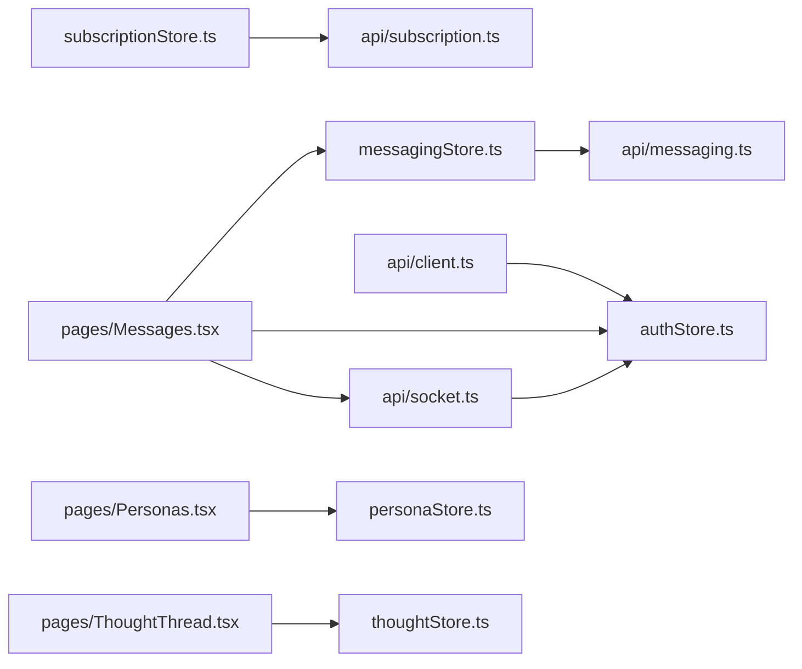

# State Management

<cite>
**Referenced Files in This Document**
- [authStore.ts](file://frontend/src/store/authStore.ts)
- [messagingStore.ts](file://frontend/src/store/messagingStore.ts)
- [personaStore.ts](file://frontend/src/store/personaStore.ts)
- [thoughtStore.ts](file://frontend/src/store/thoughtStore.ts)
- [subscriptionStore.ts](file://frontend/src/store/subscriptionStore.ts)
- [messaging.ts](file://frontend/src/api/messaging.ts)
- [subscription.ts](file://frontend/src/api/subscription.ts)
- [client.ts](file://frontend/src/api/client.ts)
- [socket.ts](file://frontend/src/api/socket.ts)
- [Messages.tsx](file://frontend/src/pages/Messages.tsx)
- [Personas.tsx](file://frontend/src/pages/Personas.tsx)
- [ThoughtThread.tsx](file://frontend/src/pages/ThoughtThread.tsx)
- [CoreChat.tsx](file://frontend/src/pages/CoreChat.tsx)
</cite>

## Table of Contents
1. [Introduction](#introduction)
2. [Project Structure](#project-structure)
3. [Core Components](#core-components)
4. [Architecture Overview](#architecture-overview)
5. [Detailed Component Analysis](#detailed-component-analysis)
6. [Dependency Analysis](#dependency-analysis)
7. [Performance Considerations](#performance-considerations)
8. [Troubleshooting Guide](#troubleshooting-guide)
9. [Conclusion](#conclusion)
10. [Appendices](#appendices)

## Introduction
This document explains the state management architecture for the 4Ever React application using Zustand stores. It covers five primary stores:
- Authentication store for user session management
- Messaging store for real-time communication state
- Persona store for AI persona selection
- Thought store for thought thread management
- Subscription store for premium feature access

It details store architecture, state shapes, action creators, selectors, persistence strategies, inter-store communication, and integration with backend APIs and WebSocket events. Practical usage patterns in components, optimistic updates, and guidelines for extending the system are included.

## Project Structure
The frontend state management is organized under a dedicated store module with clear separation of concerns:
- Store definitions live under frontend/src/store
- API clients and endpoints live under frontend/src/api
- Pages/components consume stores and drive UI behavior

**Diagram sources**
- [authStore.ts:1-32](file://frontend/src/store/authStore.ts#L1-L32)
- [messagingStore.ts:1-412](file://frontend/src/store/messagingStore.ts#L1-L412)
- [personaStore.ts:1-39](file://frontend/src/store/personaStore.ts#L1-L39)
- [thoughtStore.ts:1-79](file://frontend/src/store/thoughtStore.ts#L1-L79)
- [subscriptionStore.ts:1-46](file://frontend/src/store/subscriptionStore.ts#L1-L46)
- [client.ts:1-30](file://frontend/src/api/client.ts#L1-L30)
- [socket.ts:1-38](file://frontend/src/api/socket.ts#L1-L38)
- [messaging.ts:1-237](file://frontend/src/api/messaging.ts#L1-L237)
- [subscription.ts:1-15](file://frontend/src/api/subscription.ts#L1-L15)
- [Messages.tsx:1-969](file://frontend/src/pages/Messages.tsx#L1-L969)
- [Personas.tsx:1-556](file://frontend/src/pages/Personas.tsx#L1-L556)
- [ThoughtThread.tsx:1-1016](file://frontend/src/pages/ThoughtThread.tsx#L1-L1016)
- [CoreChat.tsx:1-551](file://frontend/src/pages/CoreChat.tsx#L1-L551)

**Section sources**
- [authStore.ts:1-32](file://frontend/src/store/authStore.ts#L1-L32)
- [messagingStore.ts:1-412](file://frontend/src/store/messagingStore.ts#L1-L412)
- [personaStore.ts:1-39](file://frontend/src/store/personaStore.ts#L1-L39)
- [thoughtStore.ts:1-79](file://frontend/src/store/thoughtStore.ts#L1-L79)
- [subscriptionStore.ts:1-46](file://frontend/src/store/subscriptionStore.ts#L1-L46)
- [client.ts:1-30](file://frontend/src/api/client.ts#L1-L30)
- [socket.ts:1-38](file://frontend/src/api/socket.ts#L1-L38)
- [messaging.ts:1-237](file://frontend/src/api/messaging.ts#L1-L237)
- [subscription.ts:1-15](file://frontend/src/api/subscription.ts#L1-L15)
- [Messages.tsx:1-969](file://frontend/src/pages/Messages.tsx#L1-L969)
- [Personas.tsx:1-556](file://frontend/src/pages/Personas.tsx#L1-L556)
- [ThoughtThread.tsx:1-1016](file://frontend/src/pages/ThoughtThread.tsx#L1-L1016)
- [CoreChat.tsx:1-551](file://frontend/src/pages/CoreChat.tsx#L1-L551)

## Core Components
This section outlines each store’s responsibilities, state shape, and action creators.

- Authentication Store (authStore.ts)
  - Purpose: Manage JWT token, user identity, and authentication state.
  - Persistence: Uses Zustand persist middleware to synchronize with localStorage.
  - Key actions: setAuth(token, user), logout().
  - Selector pattern: useAuthStore(state => ...) for consuming slices.

- Messaging Store (messagingStore.ts)
  - Purpose: Centralize connections, conversations, active chat, unread counts, and tri-chat mediator state.
  - Real-time integration: WebSocket events update state optimistically and synchronously.
  - Actions: loadConnections(), loadPendingRequests(), loadConversations(), openChat(), loadMoreMessages(), addIncomingMessage(), addSentMessage(), replaceTempWithReal(), markChatRead(), closeChat(), and tri-chat actions.
  - Optimistic updates: Temporary messages are inserted locally and replaced with server echoes; unread counters adjust instantly.

- Persona Store (personaStore.ts)
  - Purpose: Manage persona library and selection for thought analysis.
  - Actions: setPersonas(), addPersona(), updatePersona(), removePersona().

- Thought Store (thoughtStore.ts)
  - Purpose: Manage thought threads, persona runs, and message collections for analysis.
  - Actions: setThoughts(), setCurrentThought(), addThought(), updateThought(), removeThought().

- Subscription Store (subscriptionStore.ts)
  - Purpose: Track subscription tier, expiry, and activation status for premium features.
  - Actions: load(), set(subscription), reset().
  - Behavior: On load failure, falls back to free tier to keep UX resilient.

**Section sources**
- [authStore.ts:1-32](file://frontend/src/store/authStore.ts#L1-L32)
- [messagingStore.ts:1-412](file://frontend/src/store/messagingStore.ts#L1-L412)
- [personaStore.ts:1-39](file://frontend/src/store/personaStore.ts#L1-L39)
- [thoughtStore.ts:1-79](file://frontend/src/store/thoughtStore.ts#L1-L79)
- [subscriptionStore.ts:1-46](file://frontend/src/store/subscriptionStore.ts#L1-L46)

## Architecture Overview
The state management architecture follows a unidirectional data flow:
- Components subscribe to stores via hooks.
- Stores expose actions that mutate state and coordinate with API clients.
- API clients attach auth tokens and handle 401 responses by logging out.
- WebSocket connections deliver real-time updates and complement REST APIs.

**Diagram sources**
- [Messages.tsx:1-969](file://frontend/src/pages/Messages.tsx#L1-L969)
- [messagingStore.ts:1-412](file://frontend/src/store/messagingStore.ts#L1-L412)
- [client.ts:1-30](file://frontend/src/api/client.ts#L1-L30)
- [socket.ts:1-38](file://frontend/src/api/socket.ts#L1-L38)

## Detailed Component Analysis

### Authentication Store
- State shape: token, user, isAuthenticated.
- Persistence: localStorage-backed via Zustand persist.
- Integration: Axios interceptor injects Authorization header; 401 triggers logout.

**Diagram sources**
- [authStore.ts:18-31](file://frontend/src/store/authStore.ts#L18-L31)
- [client.ts:11-27](file://frontend/src/api/client.ts#L11-L27)

**Section sources**
- [authStore.ts:1-32](file://frontend/src/store/authStore.ts#L1-L32)
- [client.ts:1-30](file://frontend/src/api/client.ts#L1-L30)

### Messaging Store
- State shape: connections, pendingRequests, conversations, activeChat, chatMessages, unread totals, tri-chat status, mediator streaming placeholders.
- Actions:
  - Data loading: loadConnections, loadPendingRequests, loadConversations, loadUnreadCount, openChat, loadMoreMessages.
  - Message lifecycle: addIncomingMessage, addSentMessage, replaceTempWithReal, updateMessage, removeMessage, updateMessageStatus, updateReaction.
  - Tri-chat: loadTriChatStatus, applyTriChatToggle, startMediatorStream, appendMediatorChunk, finishMediatorStream, cancelMediatorStream, mediatorStreamError, applyChatHistoryCleared, applyMediatorRenamed, applyMediatorSessionEnded, applyMediatorActionAccepted, resetTriChat.
- Real-time behavior: WebSocket listeners update state for incoming/outgoing messages, read receipts, reactions, tri-chat toggles, mediator streams, and chat history actions.

**Diagram sources**
- [messagingStore.ts:72-411](file://frontend/src/store/messagingStore.ts#L72-L411)
- [Messages.tsx:42-170](file://frontend/src/pages/Messages.tsx#L42-L170)
- [messaging.ts:147-217](file://frontend/src/api/messaging.ts#L147-L217)

**Section sources**
- [messagingStore.ts:1-412](file://frontend/src/store/messagingStore.ts#L1-L412)
- [Messages.tsx:1-969](file://frontend/src/pages/Messages.tsx#L1-L969)
- [messaging.ts:1-237](file://frontend/src/api/messaging.ts#L1-L237)

### Persona Store
- State shape: personas array.
- Actions: setPersonas, addPersona, updatePersona, removePersona.
- Usage: Personas page loads personas via REST and updates store; supports creation, editing, deletion, and knowledge base attachment.

**Diagram sources**
- [personaStore.ts:24-39](file://frontend/src/store/personaStore.ts#L24-L39)
- [Personas.tsx:61-131](file://frontend/src/pages/Personas.tsx#L61-L131)

**Section sources**
- [personaStore.ts:1-39](file://frontend/src/store/personaStore.ts#L1-L39)
- [Personas.tsx:1-556](file://frontend/src/pages/Personas.tsx#L1-L556)

### Thought Store
- State shape: thoughts array, currentThought.
- Actions: setThoughts, setCurrentThought, addThought, updateThought, removeThought.
- Usage: ThoughtThread page loads a thought, displays persona responses, and supports analysis continuation and persona replies.

**Diagram sources**
- [thoughtStore.ts:62-79](file://frontend/src/store/thoughtStore.ts#L62-L79)
- [ThoughtThread.tsx:84-160](file://frontend/src/pages/ThoughtThread.tsx#L84-L160)

**Section sources**
- [thoughtStore.ts:1-79](file://frontend/src/store/thoughtStore.ts#L1-L79)
- [ThoughtThread.tsx:1-1016](file://frontend/src/pages/ThoughtThread.tsx#L1-L1016)

### Subscription Store
- State shape: tier, expiresAt, active, loaded, loading.
- Actions: load(), set(subscription), reset().
- Behavior: load() prevents duplicate requests, sets loading, fetches from subscriptionApi, and handles errors by falling back to free tier.

**Diagram sources**
- [subscriptionStore.ts:15-45](file://frontend/src/store/subscriptionStore.ts#L15-L45)
- [subscription.ts:9-15](file://frontend/src/api/subscription.ts#L9-L15)

**Section sources**
- [subscriptionStore.ts:1-46](file://frontend/src/store/subscriptionStore.ts#L1-L46)
- [subscription.ts:1-15](file://frontend/src/api/subscription.ts#L1-L15)

## Dependency Analysis
- Store-to-API coupling:
  - messagingStore depends on messaging.ts endpoints for conversations, unread counts, tri-chat, and mediator actions.
  - subscriptionStore depends on subscription.ts endpoints for subscription status.
  - All REST endpoints rely on api/client.ts, which injects auth tokens and handles 401 globally.
- WebSocket integration:
  - socket.ts manages a single persistent connection using token from authStore.
  - Messages.tsx listens to numerous events and applies optimistic updates via messagingStore.
- Component-to-store usage:
  - Messages.tsx consumes messagingStore and authStore, and drives WebSocket interactions.
  - Personas.tsx consumes personaStore and orchestrates persona CRUD.
  - ThoughtThread.tsx consumes thoughtStore and coordinates persona analysis.
  - CoreChat.tsx integrates with orchestration APIs for core chat history and streaming.

**Diagram sources**
- [messagingStore.ts:1-412](file://frontend/src/store/messagingStore.ts#L1-L412)
- [subscriptionStore.ts:1-46](file://frontend/src/store/subscriptionStore.ts#L1-L46)
- [messaging.ts:1-237](file://frontend/src/api/messaging.ts#L1-L237)
- [subscription.ts:1-15](file://frontend/src/api/subscription.ts#L1-L15)
- [client.ts:1-30](file://frontend/src/api/client.ts#L1-L30)
- [socket.ts:1-38](file://frontend/src/api/socket.ts#L1-L38)
- [Messages.tsx:1-969](file://frontend/src/pages/Messages.tsx#L1-L969)
- [Personas.tsx:1-556](file://frontend/src/pages/Personas.tsx#L1-L556)
- [ThoughtThread.tsx:1-1016](file://frontend/src/pages/ThoughtThread.tsx#L1-L1016)

**Section sources**
- [messagingStore.ts:1-412](file://frontend/src/store/messagingStore.ts#L1-L412)
- [subscriptionStore.ts:1-46](file://frontend/src/store/subscriptionStore.ts#L1-L46)
- [messaging.ts:1-237](file://frontend/src/api/messaging.ts#L1-L237)
- [subscription.ts:1-15](file://frontend/src/api/subscription.ts#L1-L15)
- [client.ts:1-30](file://frontend/src/api/client.ts#L1-L30)
- [socket.ts:1-38](file://frontend/src/api/socket.ts#L1-L38)
- [Messages.tsx:1-969](file://frontend/src/pages/Messages.tsx#L1-L969)
- [Personas.tsx:1-556](file://frontend/src/pages/Personas.tsx#L1-L556)
- [ThoughtThread.tsx:1-1016](file://frontend/src/pages/ThoughtThread.tsx#L1-L1016)

## Performance Considerations
- Minimize re-renders:
  - Use narrow selectors to avoid unnecessary rerenders when subscribing to large slices of state.
  - Prefer memoized computations (e.g., useMemo) for derived lists (e.g., filtered personas).
- Efficient updates:
  - Batch updates where possible (e.g., replacing temp messages in a single set operation).
  - Use immutable patterns to enable shallow equality checks.
- Network and WebSocket:
  - Debounce or throttle frequent actions (e.g., typing indicators).
  - Avoid redundant subscriptions to WebSocket events; ensure cleanup on unmount.
- Persistence:
  - Persist only essential keys to reduce storage overhead (already handled by authStore persist).
- Pagination and virtualization:
  - For long message lists, consider virtualized rendering to limit DOM nodes.

## Troubleshooting Guide
- Authentication failures:
  - 401 responses automatically log out the user via the axios interceptor. Verify token presence and refresh behavior.
- WebSocket disconnections:
  - Reconnect logic exists; ensure token availability before connecting. Inspect connection/disconnection logs.
- Real-time desync:
  - Messaging store applies optimistic updates; server echoes should reconcile state. If discrepancies occur, verify server responses and event handlers.
- Subscription fallback:
  - On load failure, subscriptionStore assumes free tier. Confirm network connectivity and backend health.
- Component state not updating:
  - Ensure components subscribe to the correct store slices and that actions are dispatched from within the component lifecycle.

**Section sources**
- [client.ts:19-27](file://frontend/src/api/client.ts#L19-L27)
- [socket.ts:10-30](file://frontend/src/api/socket.ts#L10-L30)
- [subscriptionStore.ts:22-38](file://frontend/src/store/subscriptionStore.ts#L22-L38)

## Conclusion
The 4Ever application employs a clean, modular Zustand-based state management system. Stores encapsulate domain-specific state and actions, while API clients and WebSocket integrations provide seamless backend connectivity. The architecture emphasizes optimistic updates, real-time synchronization, and resilience against transient failures. Following the patterns documented here enables consistent extension and maintenance of state across the application.

## Appendices

### Store Usage Examples in Components
- Messages page:
  - Subscribes to conversations, activeChat, chatMessages, and triChat state.
  - Uses messagingStore actions to load data and manage chat lifecycle.
  - Integrates WebSocket events for real-time updates and mediator streams.
- Personas page:
  - Consumes personaStore for CRUD operations and filters personas by category.
- Thought thread page:
  - Uses thoughtStore to render and update thought threads.
  - Triggers persona analysis and replies via orchestration APIs.
- Core chat page:
  - Loads and streams core chat history via orchestration APIs.

**Section sources**
- [Messages.tsx:15-25](file://frontend/src/pages/Messages.tsx#L15-L25)
- [Personas.tsx:35-38](file://frontend/src/pages/Personas.tsx#L35-L38)
- [ThoughtThread.tsx:49-53](file://frontend/src/pages/ThoughtThread.tsx#L49-L53)
- [CoreChat.tsx:91-133](file://frontend/src/pages/CoreChat.tsx#L91-L133)

### State Persistence Strategies
- Authentication store persists token and user info to localStorage via Zustand persist.
- Messaging store does not persist chat state; it reloads on demand to maintain freshness.
- Subscription store persists minimal flags to reflect loaded state and tier.

**Section sources**
- [authStore.ts:18-31](file://frontend/src/store/authStore.ts#L18-L31)
- [messagingStore.ts:72-88](file://frontend/src/store/messagingStore.ts#L72-L88)
- [subscriptionStore.ts:15-21](file://frontend/src/store/subscriptionStore.ts#L15-L21)

### Inter-store Communication Patterns
- Messaging store reads authStore to determine active user and apply read receipts.
- WebSocket events are handled in components and applied to messagingStore, ensuring decoupled UI updates.
- Subscription state can gate feature visibility in components.

**Section sources**
- [messagingStore.ts:158-182](file://frontend/src/store/messagingStore.ts#L158-L182)
- [Messages.tsx:48-170](file://frontend/src/pages/Messages.tsx#L48-L170)

### Guidelines for Adding New Stores
- Define a clear domain scope and state shape.
- Expose pure action creators that encapsulate side effects (API calls, WebSocket updates).
- Use narrow selectors in components to subscribe to minimal state slices.
- Integrate with api/client.ts for authenticated requests and handle 401 globally.
- For real-time features, centralize event handling in a single place and apply optimistic updates.
- Persist only essential keys and avoid storing large payloads.
- Document store actions and selectors for maintainability.