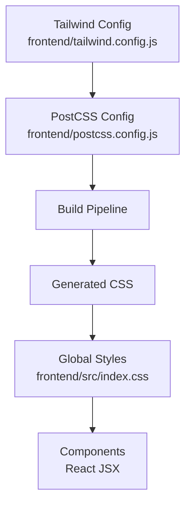
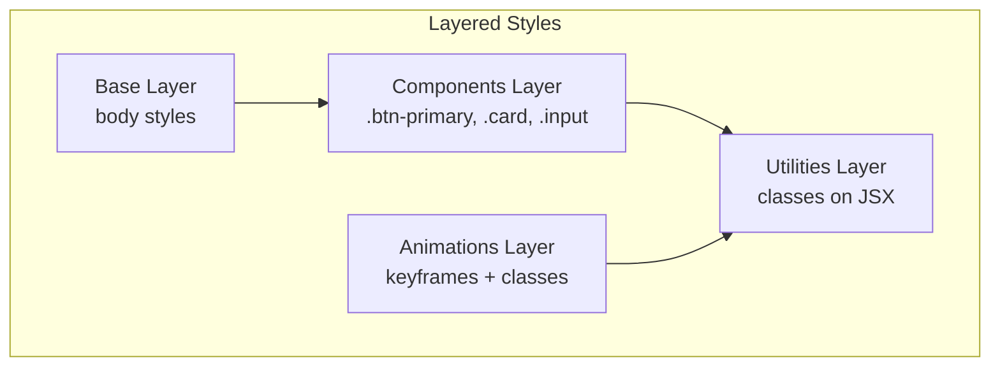
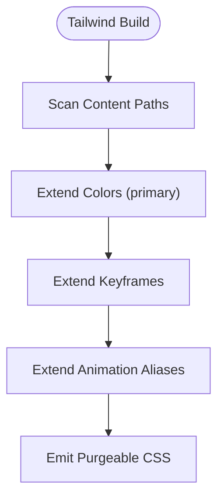
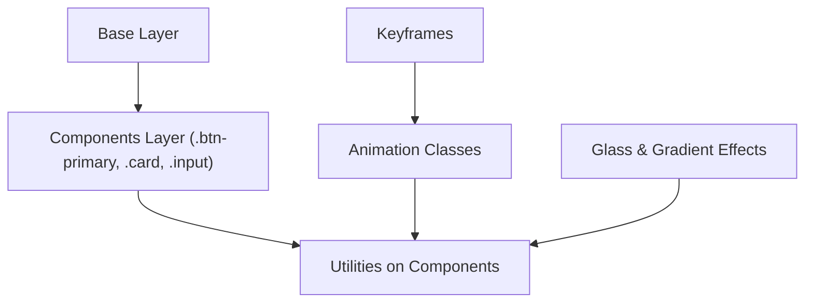
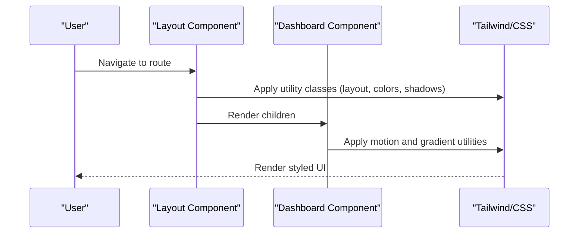
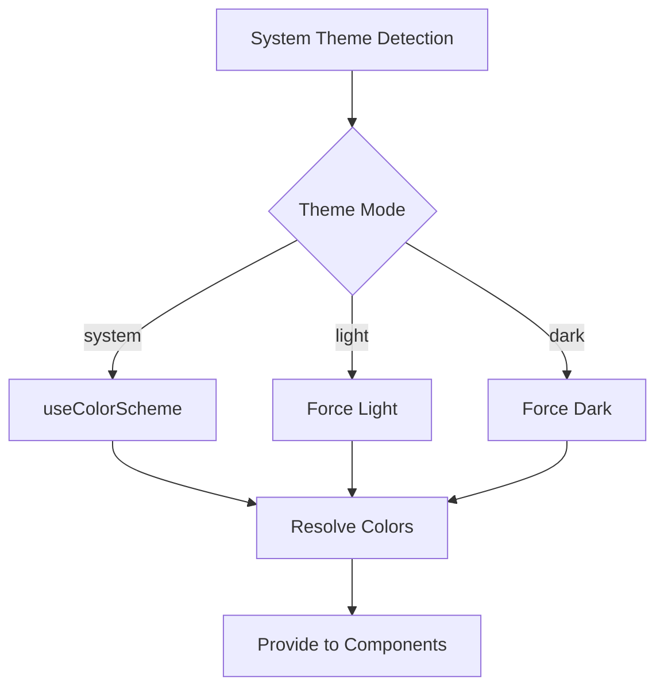
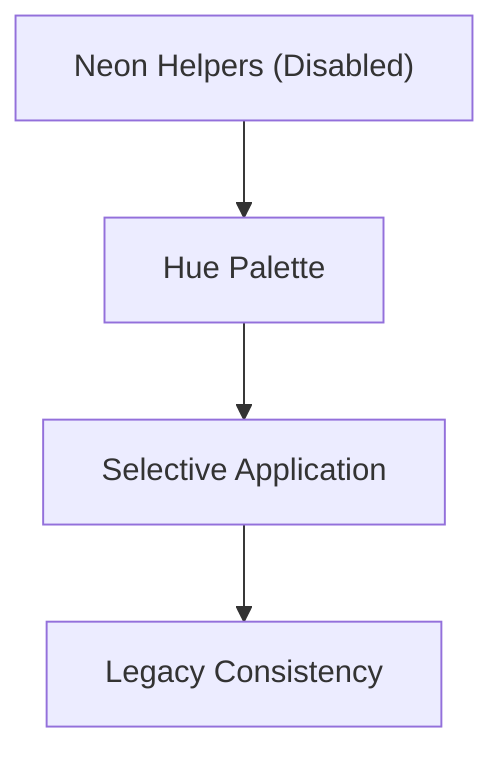
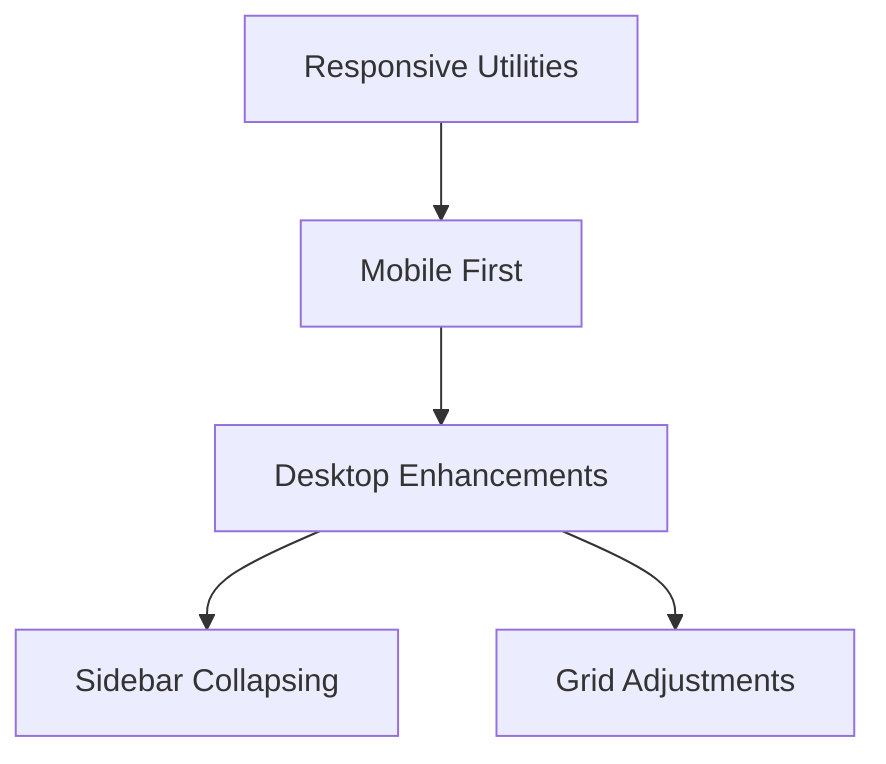
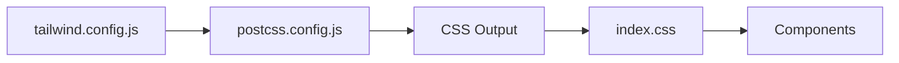

# Styling and Theming

<cite>
**Referenced Files in This Document**
- [tailwind.config.js](file://frontend/tailwind.config.js)
- [postcss.config.js](file://frontend/postcss.config.js)
- [index.css](file://frontend/src/index.css)
- [Layout.tsx](file://frontend/src/components/Layout.tsx)
- [Dashboard.tsx](file://frontend/src/pages/Dashboard.tsx)
- [colors.ts](file://mobile/src/constants/colors.ts)
- [neonStyles.ts](file://mobile/src/constants/neonStyles.ts)
- [ThemeContext.tsx](file://mobile/src/contexts/ThemeContext.tsx)
</cite>

## Table of Contents
1. [Introduction](#introduction)
2. [Project Structure](#project-structure)
3. [Core Components](#core-components)
4. [Architecture Overview](#architecture-overview)
5. [Detailed Component Analysis](#detailed-component-analysis)
6. [Dependency Analysis](#dependency-analysis)
7. [Performance Considerations](#performance-considerations)
8. [Troubleshooting Guide](#troubleshooting-guide)
9. [Conclusion](#conclusion)
10. [Appendices](#appendices)

## Introduction
This document describes the styling and theming system for the 4Ever React frontend. It explains the Tailwind CSS configuration, custom color palette, and design system implementation. It covers the utility-first approach, component-specific styling patterns, theme management, dark/light mode support, responsive design, animations, and accessibility considerations. It also provides guidance for extending the design system and optimizing CSS delivery.

## Project Structure
The frontend styling pipeline is built around Tailwind CSS with PostCSS autoprefixing. Global styles and custom animations are defined in a single CSS entry file. Components apply utility classes directly, while the design tokens and theme context live in the mobile codebase and inform the web’s color scheme and behavior.

**Diagram sources**
- [tailwind.config.js:1-37](file://frontend/tailwind.config.js#L1-L37)
- [postcss.config.js:1-7](file://frontend/postcss.config.js#L1-L7)
- [index.css:1-102](file://frontend/src/index.css#L1-L102)

**Section sources**
- [tailwind.config.js:1-37](file://frontend/tailwind.config.js#L1-L37)
- [postcss.config.js:1-7](file://frontend/postcss.config.js#L1-L7)
- [index.css:1-102](file://frontend/src/index.css#L1-L102)

## Core Components
- Tailwind configuration extends colors and animations, enabling a consistent design language across components.
- Global CSS defines base layer styles, reusable component classes, and custom keyframes and animations.
- Components use utility-first classes and global component classes for buttons, cards, inputs, and text areas.
- The mobile codebase provides a comprehensive color token system and theme context that can guide web theming.

Key highlights:
- Primary color palette is defined centrally and extended via Tailwind.
- Utility-first approach ensures predictable, composable styling.
- Global component classes encapsulate common UI patterns (buttons, cards, inputs).
- Animations and transitions are standardized for consistent motion design.

**Section sources**
- [tailwind.config.js:7-36](file://frontend/tailwind.config.js#L7-L36)
- [index.css:5-31](file://frontend/src/index.css#L5-L31)
- [index.css:33-101](file://frontend/src/index.css#L33-L101)

## Architecture Overview
The styling architecture follows a layered approach:
- Base layer sets global body styles.
- Components layer defines reusable UI primitives.
- Utilities layer applies Tailwind utilities per component.
- Animations layer centralizes motion primitives.

**Diagram sources**
- [index.css:5-31](file://frontend/src/index.css#L5-L31)
- [index.css:33-101](file://frontend/src/index.css#L33-L101)

**Section sources**
- [index.css:5-31](file://frontend/src/index.css#L5-L31)
- [index.css:33-101](file://frontend/src/index.css#L33-L101)

## Detailed Component Analysis

### Tailwind Configuration and Design Tokens
- Content scanning includes HTML and TS/JSX files for tree-shaking.
- Colors are extended under a primary namespace, aligning with the brand palette.
- Keyframes and animation aliases standardize motion across components.

**Diagram sources**
- [tailwind.config.js:3-6](file://frontend/tailwind.config.js#L3-L6)
- [tailwind.config.js:9-32](file://frontend/tailwind.config.js#L9-L32)

**Section sources**
- [tailwind.config.js:3-6](file://frontend/tailwind.config.js#L3-L6)
- [tailwind.config.js:9-32](file://frontend/tailwind.config.js#L9-L32)

### Global Styles and Motion Primitives
- Base layer sets default background and text colors.
- Components layer defines semantic classes for buttons, cards, inputs, and textareas.
- Animations layer defines keyframes and classes for fade-in, scale-in, slide-up, float, shimmer, and stagger delays.
- Glass and gradient-text utilities enable modern UI effects.

**Diagram sources**
- [index.css:5-31](file://frontend/src/index.css#L5-L31)
- [index.css:33-101](file://frontend/src/index.css#L33-L101)

**Section sources**
- [index.css:5-31](file://frontend/src/index.css#L5-L31)
- [index.css:33-101](file://frontend/src/index.css#L33-L101)

### Component-Specific Styling Patterns
- Layout component demonstrates:
  - Utility-first layout with responsive spacing and borders.
  - Active state highlighting using primary palette.
  - Hover/focus states with transitions.
  - Floating action button with motion and scaling.
- Dashboard component showcases:
  - Gradient backgrounds and blurred overlays.
  - Animated staggered entries using delay classes.
  - Status badges with contextual colors.
  - Interactive states with hover and focus utilities.

**Diagram sources**
- [Layout.tsx:157-286](file://frontend/src/components/Layout.tsx#L157-L286)
- [Dashboard.tsx:188-208](file://frontend/src/pages/Dashboard.tsx#L188-L208)
- [index.css:63-89](file://frontend/src/index.css#L63-L89)

**Section sources**
- [Layout.tsx:157-286](file://frontend/src/components/Layout.tsx#L157-L286)
- [Dashboard.tsx:188-208](file://frontend/src/pages/Dashboard.tsx#L188-L208)
- [index.css:63-89](file://frontend/src/index.css#L63-L89)

### Theme Management and Dark/Light Mode
- The mobile codebase provides a robust theme system with:
  - Color tokens for light and dark palettes.
  - Theme mode selection (system, light, dark).
  - Persistence via storage and dynamic color resolution.
- While the web currently relies on Tailwind’s default light palette, the mobile tokens serve as the canonical design system for theming.

**Diagram sources**
- [ThemeContext.tsx:24-55](file://mobile/src/contexts/ThemeContext.tsx#L24-L55)
- [colors.ts:4-61](file://mobile/src/constants/colors.ts#L4-L61)
- [colors.ts:63-109](file://mobile/src/constants/colors.ts#L63-L109)

**Section sources**
- [ThemeContext.tsx:24-55](file://mobile/src/contexts/ThemeContext.tsx#L24-L55)
- [colors.ts:4-61](file://mobile/src/constants/colors.ts#L4-L61)
- [colors.ts:63-109](file://mobile/src/constants/colors.ts#L63-L109)

### Neon Aesthetic and Design Tokens
- The neon styling helpers exist but are currently disabled globally in the mobile codebase.
- Neon hues are defined as hex values and intended for selective use in specific contexts.
- The web design favors a clean, modern aesthetic aligned with the primary palette and gradients.

**Diagram sources**
- [neonStyles.ts:1-38](file://mobile/src/constants/neonStyles.ts#L1-L38)
- [colors.ts:4-61](file://mobile/src/constants/colors.ts#L4-L61)

**Section sources**
- [neonStyles.ts:1-38](file://mobile/src/constants/neonStyles.ts#L1-L38)
- [colors.ts:4-61](file://mobile/src/constants/colors.ts#L4-L61)

### Responsive Design Implementation
- Components use responsive utilities (e.g., lg:, sm:) to adapt layouts across breakpoints.
- Layout adjusts sidebar behavior and spacing for mobile and desktop.
- Dashboard adapts grid layouts and typography scales for readability.

**Diagram sources**
- [Layout.tsx:292-321](file://frontend/src/components/Layout.tsx#L292-L321)
- [Dashboard.tsx:321-322](file://frontend/src/pages/Dashboard.tsx#L321-L322)

**Section sources**
- [Layout.tsx:292-321](file://frontend/src/components/Layout.tsx#L292-L321)
- [Dashboard.tsx:321-322](file://frontend/src/pages/Dashboard.tsx#L321-L322)

### Accessibility Considerations
- Ensure sufficient color contrast for text and interactive elements against backgrounds.
- Prefer semantic HTML and focus-visible outlines for keyboard navigation.
- Maintain readable font sizes and line heights; avoid relying solely on color to convey meaning.
- Test animations with reduced-motion preferences and ensure alternatives exist.

[No sources needed since this section provides general guidance]

## Dependency Analysis
The styling stack depends on Tailwind and PostCSS. Tailwind scans source files and generates purged CSS, which is then processed by PostCSS with autoprefixer. Global CSS augments Tailwind utilities with component classes and animations.

**Diagram sources**
- [tailwind.config.js:1-37](file://frontend/tailwind.config.js#L1-L37)
- [postcss.config.js:1-7](file://frontend/postcss.config.js#L1-L7)
- [index.css:1-3](file://frontend/src/index.css#L1-L3)

**Section sources**
- [tailwind.config.js:1-37](file://frontend/tailwind.config.js#L1-L37)
- [postcss.config.js:1-7](file://frontend/postcss.config.js#L1-L7)
- [index.css:1-3](file://frontend/src/index.css#L1-L3)

## Performance Considerations
- Tree shaking: Tailwind’s content scanning removes unused styles; keep selectors discoverable by Tailwind.
- CSS delivery: Ship minimal CSS; leverage autoprefixer for vendor prefixes automatically.
- Animations: Prefer transform and opacity for GPU-accelerated motion; limit heavy filters.
- Fonts and images: Optimize assets and defer non-critical resources.

[No sources needed since this section provides general guidance]

## Troubleshooting Guide
- Missing styles after build: Verify Tailwind content paths include all JSX/TSX files.
- Animation not playing: Ensure keyframes are defined and animation classes are applied.
- Contrast issues: Audit color pairs against backgrounds; adjust tokens or utilities accordingly.
- Theme inconsistencies: Align web color usage with mobile tokens; implement a theme provider if needed.

[No sources needed since this section provides general guidance]

## Conclusion
The 4Ever React frontend employs a utility-first, layered styling approach powered by Tailwind and PostCSS. The design system centers on a primary color palette, standardized animations, and reusable component classes. While the web currently defaults to light mode, the mobile color tokens and theme context provide a clear foundation for implementing robust dark/light mode. By adhering to accessibility guidelines and performance best practices, teams can extend the design system consistently and efficiently.

[No sources needed since this section summarizes without analyzing specific files]

## Appendices

### Design Token Reference
- Primary palette: Defined in Tailwind config and mirrored in mobile tokens.
- Semantic tokens: Background, card, border, text, and muted text are defined in mobile tokens.
- Spacing, font sizes, and border radius are standardized in mobile tokens.

**Section sources**
- [tailwind.config.js:9-22](file://frontend/tailwind.config.js#L9-L22)
- [colors.ts:4-61](file://mobile/src/constants/colors.ts#L4-L61)
- [colors.ts:114-142](file://mobile/src/constants/colors.ts#L114-L142)

### Animation and Motion Reference
- Fade-in, scale-in, slide-up, float, shimmer, and stagger delays are defined as keyframes and classes.
- Use stagger classes to sequence entrance animations.

**Section sources**
- [index.css:33-101](file://frontend/src/index.css#L33-L101)

### Theming Extension Guidelines
- Define new tokens in the mobile color system; mirror them in Tailwind for web parity.
- Add new animation keyframes and aliases in Tailwind config and global CSS.
- Encapsulate component-level styles in reusable classes to maintain consistency.

**Section sources**
- [colors.ts:4-61](file://mobile/src/constants/colors.ts#L4-L61)
- [tailwind.config.js:23-32](file://frontend/tailwind.config.js#L23-L32)
- [index.css:33-101](file://frontend/src/index.css#L33-L101)