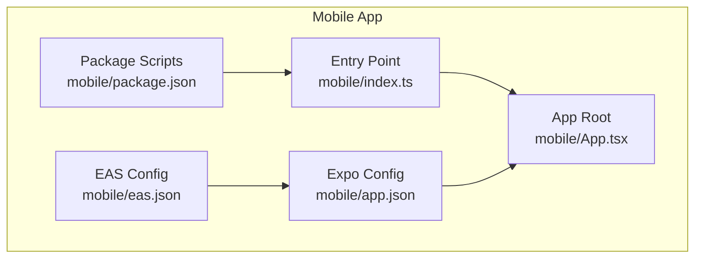
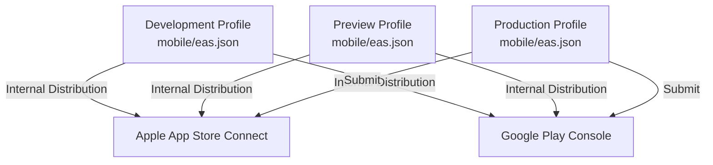
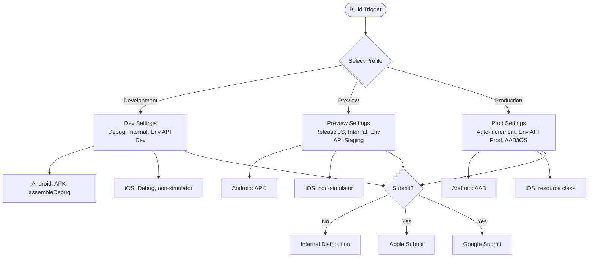
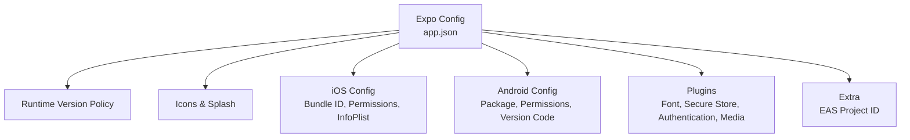
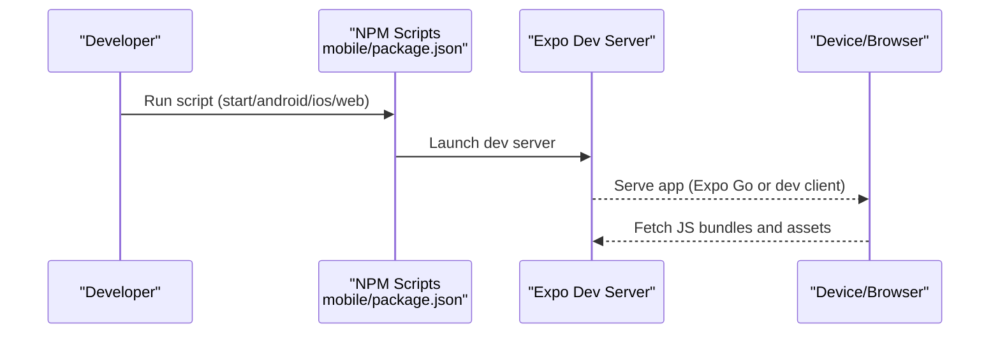
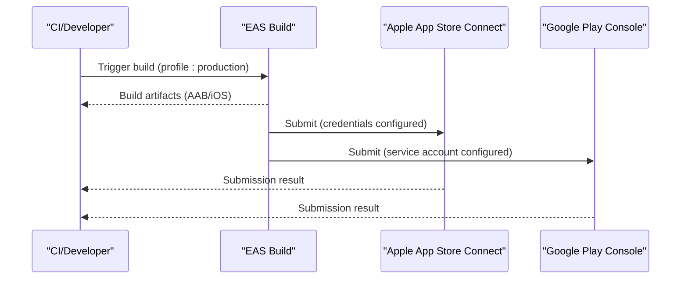
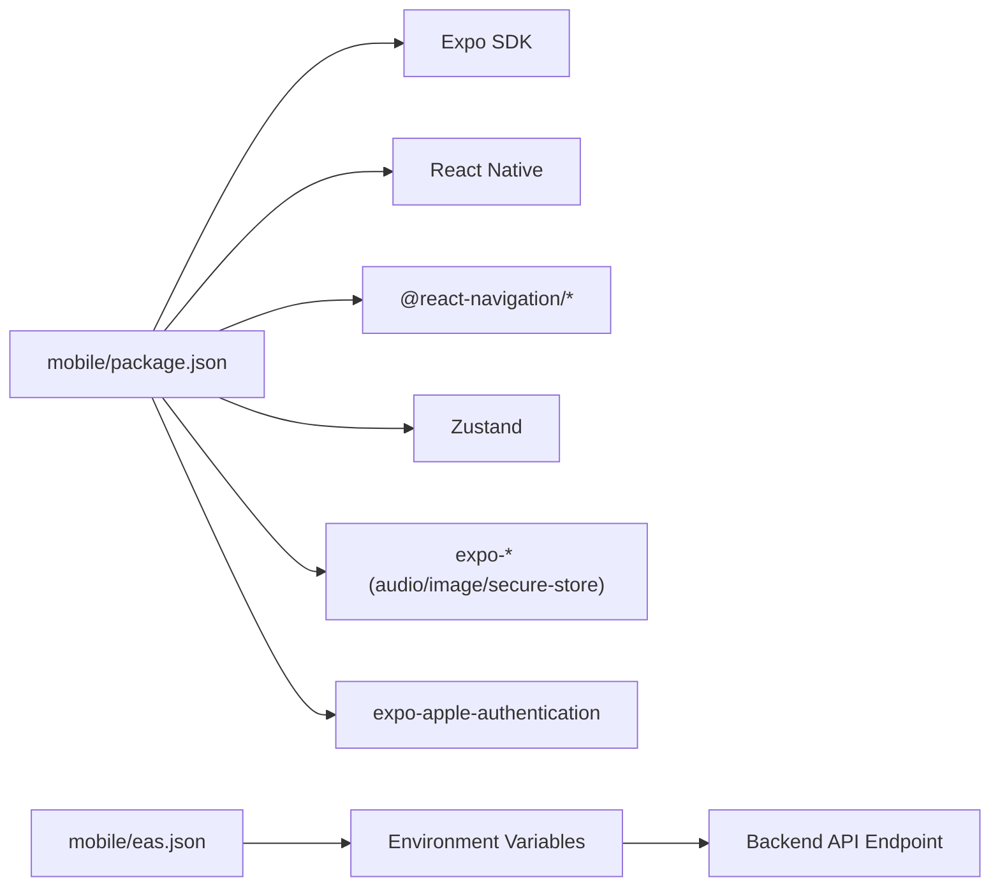

# Build & Deployment

<cite>
**Referenced Files in This Document**
- [eas.json](file://mobile/eas.json)
- [app.json](file://mobile/app.json)
- [package.json](file://mobile/package.json)
- [index.ts](file://mobile/index.ts)
- [App.tsx](file://mobile/App.tsx)
- [README.md](file://README.md)
</cite>

## Table of Contents
1. [Introduction](#introduction)
2. [Project Structure](#project-structure)
3. [Core Components](#core-components)
4. [Architecture Overview](#architecture-overview)
5. [Detailed Component Analysis](#detailed-component-analysis)
6. [Dependency Analysis](#dependency-analysis)
7. [Performance Considerations](#performance-considerations)
8. [Troubleshooting Guide](#troubleshooting-guide)
9. [Conclusion](#conclusion)
10. [Appendices](#appendices)

## Introduction
This document explains the mobile build and deployment process for the 4Ever app using EAS Build and EAS Submit. It covers EAS configuration, build profiles for development, preview (staging/QA), and production, environment variable management, platform-specific settings, and automated submission to Apple App Store and Google Play Console. It also provides guidance for local builds, CI-friendly patterns, and troubleshooting common build issues.

## Project Structure
The mobile application is organized under the mobile directory with the following key files:
- EAS configuration: defines build profiles, channels, environment variables, and submission targets
- Expo configuration: app metadata, runtime version policy, permissions, plugins, and platform identifiers
- Package scripts: local development and device startup commands
- Entry point: registers the root component for native runs

**Diagram sources**
- [eas.json](file://mobile/eas.json)
- [app.json](file://mobile/app.json)
- [package.json](file://mobile/package.json)
- [index.ts](file://mobile/index.ts)
- [App.tsx](file://mobile/App.tsx)

**Section sources**
- [eas.json](file://mobile/eas.json)
- [app.json](file://mobile/app.json)
- [package.json](file://mobile/package.json)
- [index.ts](file://mobile/index.ts)
- [App.tsx](file://mobile/App.tsx)

## Core Components
- EAS Build profiles
  - Development: on-device debug builds with the Expo dev menu, distributed internally
  - Preview: staging/QA builds with release-mode JavaScript, distributed internally
  - Production: store-ready artifacts with auto-incremented build numbers and remote versioning
- Environment variables
  - EXPO_PUBLIC_API_URL is configured per profile to point to appropriate backend environments
- Platform-specific settings
  - Android: build type selection (APK vs AAB), permissions, and versioning
  - iOS: bundle identifier, simulator flag, resource class sizing, and InfoPlist usage descriptions
- Submission configuration
  - Apple App Store: Apple ID, ASC App ID, Team ID
  - Google Play Console: service account key path, track, and release status

**Section sources**
- [eas.json](file://mobile/eas.json)
- [app.json](file://mobile/app.json)

## Architecture Overview
The build pipeline integrates EAS Build with platform stores. The configuration defines three build profiles that map to distinct channels and environment endpoints. Submission targets are configured for Apple and Google platforms.

**Diagram sources**
- [eas.json](file://mobile/eas.json)

## Detailed Component Analysis

### EAS Configuration (eas.json)
- CLI settings
  - Version requirement and commit requirement for reproducible builds
  - Remote app version source for consistent runtime versioning
- Build profiles
  - Development
    - Debug builds with development client and internal distribution
    - Channel set to development
    - Environment variable for API endpoint
    - Android: APK assembly with explicit gradle command
    - iOS: non-simulator builds with Debug configuration and medium resource class
  - Preview
    - Internal distribution with release-mode JS
    - Channel set to preview
    - Environment variable for staging API endpoint
    - Android: APK build type
    - iOS: non-simulator builds with medium resource class
  - Production
    - Auto-incremented build numbers for uniqueness
    - Channel set to production
    - Environment variable for production API endpoint
    - Android: AAB build type for store distribution
    - iOS: medium resource class for build resources
- Submit configuration
  - Apple: credentials and team identifiers
  - Android: service account key path, track, and release status

**Diagram sources**
- [eas.json](file://mobile/eas.json)

**Section sources**
- [eas.json](file://mobile/eas.json)

### Expo Configuration (app.json)
- App identity and runtime
  - Name, slug, scheme, version, and runtime version policy aligned with appVersion
- Assets and splash
  - Icons, adaptive icon, and splash image configuration
- iOS
  - Bundle identifier, build number, Apple Sign-In enabled, InfoPlist usage descriptions, and encryption settings
- Android
  - Package name, version code, adaptive icon, edge-to-edge, permissions, and blocked permissions
- Plugins and extra
  - Font, secure store, Apple authentication, image picker, contacts, and audio plugins
  - EAS project ID placeholder for project linkage

**Diagram sources**
- [app.json](file://mobile/app.json)

**Section sources**
- [app.json](file://mobile/app.json)

### Local Build and Development Commands
- Local development server and device targeting
  - Start Expo dev server and open on Android, iOS, or Web
- Entry point registration
  - Root component registration for native runs

**Diagram sources**
- [package.json](file://mobile/package.json)
- [index.ts](file://mobile/index.ts)

**Section sources**
- [package.json](file://mobile/package.json)
- [index.ts](file://mobile/index.ts)

### Automated Deployment Workflows
- Build profiles and channels
  - Development → internal distribution
  - Preview → internal distribution
  - Production → store submission
- Environment variable management
  - EXPO_PUBLIC_API_URL is set per profile to route traffic to the correct backend
- Platform-specific build settings
  - Android: APK for development, AAB for production
  - iOS: non-simulator builds with resource class sizing
- Submission automation
  - Apple: credentials and team identifiers configured for automated submission
  - Google Play: service account key path, track, and release status configured

**Diagram sources**
- [eas.json](file://mobile/eas.json)

**Section sources**
- [eas.json](file://mobile/eas.json)

## Dependency Analysis
- Mobile package dependencies
  - Expo SDK, React Native, navigation, state management, media, and authentication libraries
- Build-time dependencies
  - EAS CLI version requirement and commit requirement ensure reproducibility
- Runtime dependencies
  - Environment variables for API endpoints vary by profile

**Diagram sources**
- [package.json](file://mobile/package.json)
- [eas.json](file://mobile/eas.json)

**Section sources**
- [package.json](file://mobile/package.json)
- [eas.json](file://mobile/eas.json)

## Performance Considerations
- Use release-mode builds for preview and production to optimize runtime performance
- Prefer AAB for Android production to reduce app size and improve distribution efficiency
- Keep environment variables scoped to profiles to avoid unnecessary runtime branching
- Align runtime version policy with appVersion to prevent stale JS bundle caching

## Troubleshooting Guide
- Build fails due to missing EAS CLI version
  - Ensure the installed EAS CLI meets the minimum version requirement
- Commit requirement errors
  - Ensure your working tree is clean and commits are present before building
- Environment variable not applied
  - Verify EXPO_PUBLIC_API_URL is set in the correct profile and that the app reads it at runtime
- iOS simulator vs device builds
  - Development profile sets simulator off; ensure devices are provisioned if targeting physical devices
- Android build type mismatch
  - Development uses APK; production requires AAB for store distribution
- Apple submission failures
  - Confirm Apple ID, ASC App ID, and Team ID are correctly configured
- Google Play submission failures
  - Verify service account key path and permissions for the selected track

**Section sources**
- [eas.json](file://mobile/eas.json)
- [README.md](file://README.md)

## Conclusion
The 4Ever mobile app leverages EAS Build to produce reliable development, preview, and production artifacts tailored to internal distribution and store submission. The configuration separates concerns across profiles, manages environment variables per stage, and aligns platform-specific settings for optimal builds. By following the documented commands and CI patterns, teams can automate builds and submissions while maintaining consistency and reliability.

## Appendices
- Example commands
  - Local development: see scripts in the mobile package.json
  - EAS build commands: trigger builds for development, preview, or production using the EAS CLI
  - Submission: configure Apple and Google credentials and run submit jobs for production

**Section sources**
- [package.json](file://mobile/package.json)
- [eas.json](file://mobile/eas.json)
- [README.md](file://README.md)