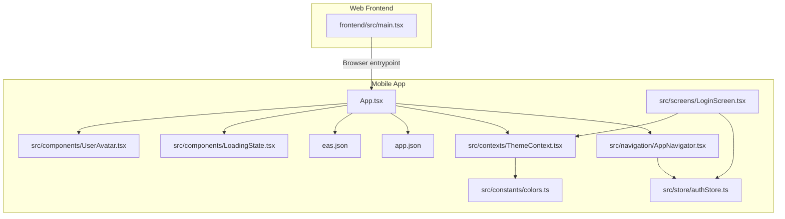
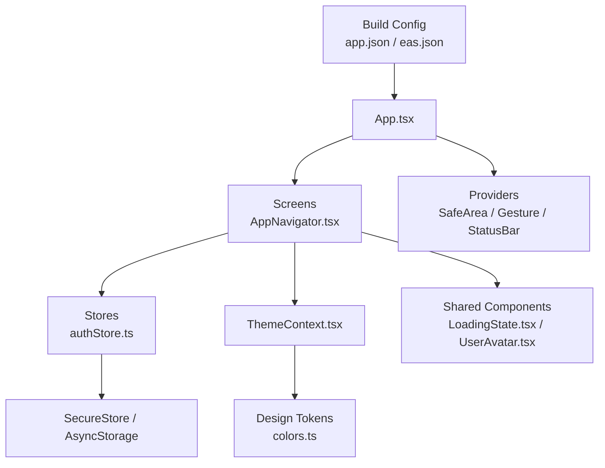
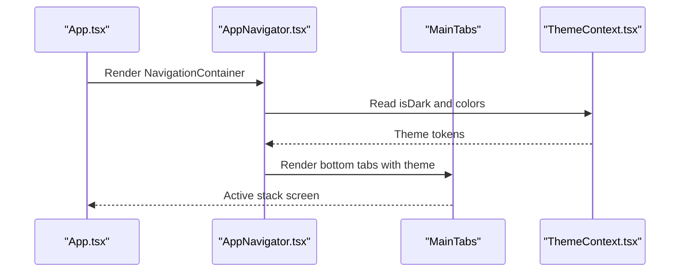
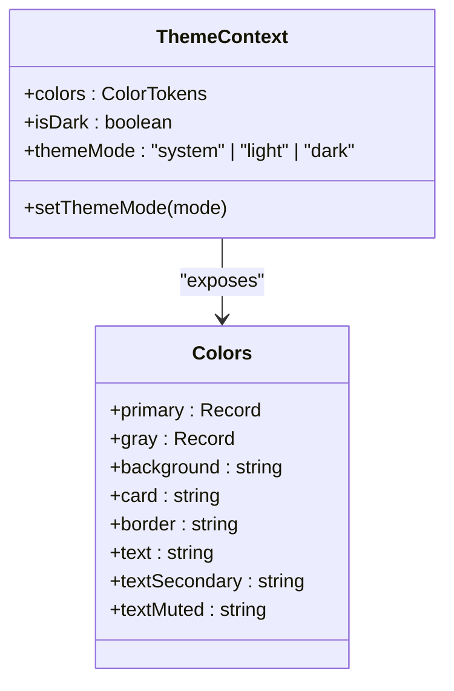
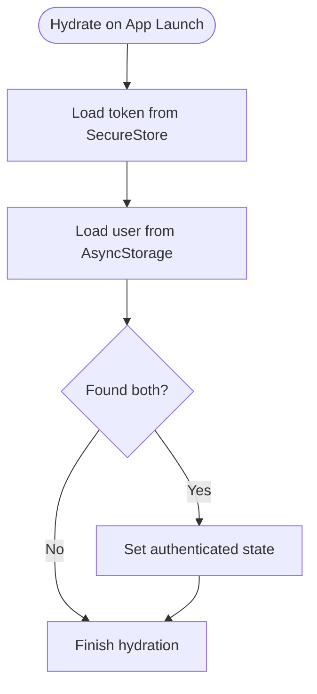
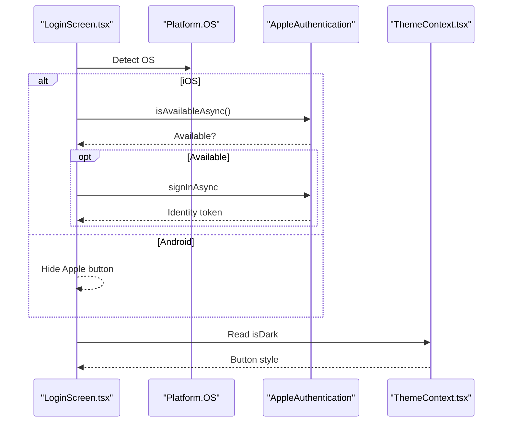
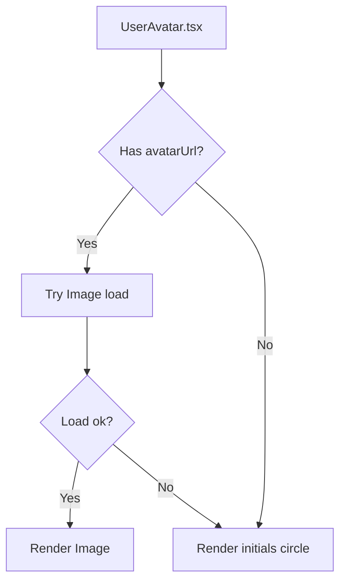
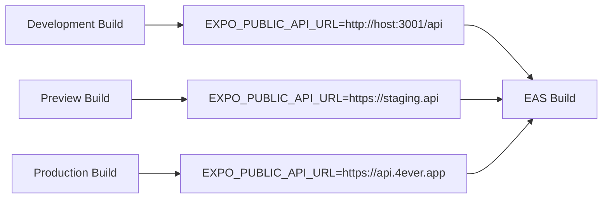
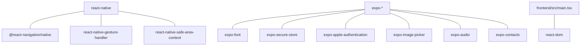

# Cross-Platform Development

<cite>
**Referenced Files in This Document**
- [App.tsx](file://mobile/App.tsx)
- [app.json](file://mobile/app.json)
- [eas.json](file://mobile/eas.json)
- [package.json](file://mobile/package.json)
- [AppNavigator.tsx](file://mobile/src/navigation/AppNavigator.tsx)
- [ThemeContext.tsx](file://mobile/src/contexts/ThemeContext.tsx)
- [colors.ts](file://mobile/src/constants/colors.ts)
- [dimensions.ts](file://mobile/src/constants/dimensions.ts)
- [LoadingState.tsx](file://mobile/src/components/LoadingState.tsx)
- [UserAvatar.tsx](file://mobile/src/components/UserAvatar.tsx)
- [neonStyles.ts](file://mobile/src/constants/neonStyles.ts)
- [authStore.ts](file://mobile/src/store/authStore.ts)
- [LoginScreen.tsx](file://mobile/src/screens/LoginScreen.tsx)
- [main.tsx](file://frontend/src/main.tsx)
</cite>

## Table of Contents
1. [Introduction](#introduction)
2. [Project Structure](#project-structure)
3. [Core Components](#core-components)
4. [Architecture Overview](#architecture-overview)
5. [Detailed Component Analysis](#detailed-component-analysis)
6. [Dependency Analysis](#dependency-analysis)
7. [Performance Considerations](#performance-considerations)
8. [Troubleshooting Guide](#troubleshooting-guide)
9. [Conclusion](#conclusion)
10. [Appendices](#appendices)

## Introduction
This document explains the cross-platform development architecture of the 4Ever mobile application built with React Native and Expo. It focuses on how the codebase maintains consistency across iOS and Android while leveraging platform-specific capabilities safely behind abstraction layers. Topics include navigation and routing, theming and design tokens, storage abstractions, platform-specific UI adaptations, build configuration via EAS, and development workflows for ensuring parity across platforms.

## Project Structure
The repository organizes the mobile app under the mobile directory, with a clear separation of concerns:
- Application bootstrap and providers in App.tsx
- Expo configuration in app.json and EAS configuration in eas.json
- Navigation hierarchy in AppNavigator.tsx
- Theming and design tokens in ThemeContext.tsx and colors.ts
- Shared components and stores in src/components and src/store
- Screens organized by feature areas under src/screens
- Web entrypoint for comparison under frontend/src/main.tsx

**Diagram sources**
- [App.tsx:1-38](file://mobile/App.tsx#L1-L38)
- [app.json:1-96](file://mobile/app.json#L1-L96)
- [eas.json:1-73](file://mobile/eas.json#L1-L73)
- [AppNavigator.tsx:1-282](file://mobile/src/navigation/AppNavigator.tsx#L1-L282)
- [ThemeContext.tsx:1-61](file://mobile/src/contexts/ThemeContext.tsx#L1-L61)
- [colors.ts:1-142](file://mobile/src/constants/colors.ts#L1-L142)
- [authStore.ts:1-75](file://mobile/src/store/authStore.ts#L1-L75)
- [LoginScreen.tsx:1-383](file://mobile/src/screens/LoginScreen.tsx#L1-L383)
- [LoadingState.tsx:1-37](file://mobile/src/components/LoadingState.tsx#L1-L37)
- [UserAvatar.tsx:1-82](file://mobile/src/components/UserAvatar.tsx#L1-L82)
- [main.tsx:1-14](file://frontend/src/main.tsx#L1-L14)

**Section sources**
- [App.tsx:1-38](file://mobile/App.tsx#L1-L38)
- [app.json:1-96](file://mobile/app.json#L1-L96)
- [eas.json:1-73](file://mobile/eas.json#L1-L73)
- [package.json:1-52](file://mobile/package.json#L1-L52)
- [main.tsx:1-14](file://frontend/src/main.tsx#L1-L14)

## Core Components
- Application shell and providers: SafeArea, Gesture handling, StatusBar, Theme provider, and toast provider are wired at the root level to ensure consistent layout and UX across platforms.
- Navigation: A nested navigator architecture with bottom tabs and multiple stacks encapsulates feature flows and respects theme-driven styling.
- Theming: A centralized ThemeContext manages system-aware light/dark modes and persists preferences, exposing design tokens consumed by components.
- Authentication store: A Zustand store with persistence via SecureStore and AsyncStorage handles tokens and user state, integrating with the API client.
- Platform-specific UI: Conditional rendering for platform capabilities (e.g., Apple Authentication) ensures compliance and optimal UX.

**Section sources**
- [App.tsx:1-38](file://mobile/App.tsx#L1-L38)
- [AppNavigator.tsx:1-282](file://mobile/src/navigation/AppNavigator.tsx#L1-L282)
- [ThemeContext.tsx:1-61](file://mobile/src/contexts/ThemeContext.tsx#L1-L61)
- [colors.ts:1-142](file://mobile/src/constants/colors.ts#L1-L142)
- [authStore.ts:1-75](file://mobile/src/store/authStore.ts#L1-L75)
- [LoginScreen.tsx:1-383](file://mobile/src/screens/LoginScreen.tsx#L1-L383)

## Architecture Overview
The mobile app follows a layered architecture:
- Presentation layer: Screens and navigators
- Domain layer: Stores (Zustand) for state management
- Infrastructure layer: API client integration and persistence
- Platform layer: Expo plugins and native modules for permissions and biometric/sign-in features

**Diagram sources**
- [App.tsx:1-38](file://mobile/App.tsx#L1-L38)
- [AppNavigator.tsx:1-282](file://mobile/src/navigation/AppNavigator.tsx#L1-L282)
- [ThemeContext.tsx:1-61](file://mobile/src/contexts/ThemeContext.tsx#L1-L61)
- [colors.ts:1-142](file://mobile/src/constants/colors.ts#L1-L142)
- [authStore.ts:1-75](file://mobile/src/store/authStore.ts#L1-L75)
- [LoadingState.tsx:1-37](file://mobile/src/components/LoadingState.tsx#L1-L37)
- [UserAvatar.tsx:1-82](file://mobile/src/components/UserAvatar.tsx#L1-L82)
- [app.json:1-96](file://mobile/app.json#L1-L96)
- [eas.json:1-73](file://mobile/eas.json#L1-L73)

## Detailed Component Analysis

### Navigation and Tabs
The navigation architecture uses React Navigation with a bottom tab bar and multiple native stacks. It dynamically applies theme colors to headers and tab styling, and integrates badge counts for notifications.

**Diagram sources**
- [App.tsx:1-38](file://mobile/App.tsx#L1-L38)
- [AppNavigator.tsx:175-253](file://mobile/src/navigation/AppNavigator.tsx#L175-L253)
- [ThemeContext.tsx:43-50](file://mobile/src/contexts/ThemeContext.tsx#L43-L50)

**Section sources**
- [AppNavigator.tsx:1-282](file://mobile/src/navigation/AppNavigator.tsx#L1-L282)
- [ThemeContext.tsx:1-61](file://mobile/src/contexts/ThemeContext.tsx#L1-L61)

### Theming and Design Tokens
The ThemeContext provides a system-aware theme mode with persisted preference and exposes a unified color palette. Components consume design tokens for consistent spacing, typography, and colors.

**Diagram sources**
- [ThemeContext.tsx:1-61](file://mobile/src/contexts/ThemeContext.tsx#L1-L61)
- [colors.ts:1-142](file://mobile/src/constants/colors.ts#L1-L142)

**Section sources**
- [ThemeContext.tsx:1-61](file://mobile/src/contexts/ThemeContext.tsx#L1-L61)
- [colors.ts:1-142](file://mobile/src/constants/colors.ts#L1-L142)
- [neonStyles.ts:1-38](file://mobile/src/constants/neonStyles.ts#L1-L38)

### Authentication Store and Persistence
The auth store centralizes authentication state and persists tokens securely. It integrates with the API client to propagate tokens and registers a logout handler for unauthorized responses.

**Diagram sources**
- [authStore.ts:56-71](file://mobile/src/store/authStore.ts#L56-L71)

**Section sources**
- [authStore.ts:1-75](file://mobile/src/store/authStore.ts#L1-L75)

### Platform-Specific UI Adaptations
The login flow demonstrates platform-aware UI:
- Apple Authentication is available only on iOS and hidden on Android.
- Behavior differences for keyboard avoidance and font families are handled conditionally.
- Platform-specific permission dialogs are configured via Expo plugins.

**Diagram sources**
- [LoginScreen.tsx:35-80](file://mobile/src/screens/LoginScreen.tsx#L35-L80)
- [ThemeContext.tsx:58-60](file://mobile/src/contexts/ThemeContext.tsx#L58-L60)

**Section sources**
- [LoginScreen.tsx:1-383](file://mobile/src/screens/LoginScreen.tsx#L1-L383)
- [app.json:20-59](file://mobile/app.json#L20-L59)

### Shared Components and Cross-Platform Patterns
- LoadingState provides a consistent loading and empty-state UI using theme-aware styles.
- UserAvatar renders either a remote image or a themed initials fallback, handling network failures gracefully.

**Diagram sources**
- [UserAvatar.tsx:41-76](file://mobile/src/components/UserAvatar.tsx#L41-L76)

**Section sources**
- [LoadingState.tsx:1-37](file://mobile/src/components/LoadingState.tsx#L1-L37)
- [UserAvatar.tsx:1-82](file://mobile/src/components/UserAvatar.tsx#L1-L82)

### Build Configuration and EAS
- app.json defines app metadata, runtime version policy, icons, splash, orientation, permissions, plugins, and platform-specific info.
- eas.json configures development, preview, and production builds, including environment variables, distribution channels, and platform-specific build types.

**Diagram sources**
- [eas.json:8-56](file://mobile/eas.json#L8-L56)
- [app.json:65-88](file://mobile/app.json#L65-L88)

**Section sources**
- [app.json:1-96](file://mobile/app.json#L1-L96)
- [eas.json:1-73](file://mobile/eas.json#L1-L73)
- [package.json:1-52](file://mobile/package.json#L1-L52)

## Dependency Analysis
The mobile app relies on React Native and Expo ecosystem packages for navigation, gestures, safe areas, fonts, secure storage, and platform integrations. The web entrypoint under frontend/src/main.tsx demonstrates a separate React DOM renderer for browser environments.

**Diagram sources**
- [package.json:11-44](file://mobile/package.json#L11-L44)
- [main.tsx:1-14](file://frontend/src/main.tsx#L1-L14)

**Section sources**
- [package.json:1-52](file://mobile/package.json#L1-L52)
- [main.tsx:1-14](file://frontend/src/main.tsx#L1-L14)

## Performance Considerations
- Prefer lightweight components and avoid unnecessary re-renders by consuming theme and store slices via hooks.
- Use memoization for derived values in ThemeContext to minimize recomputation.
- Defer heavy computations off the main thread and leverage platform-specific optimizations (e.g., Hermes engine).
- Keep asset sizes small and lazy-load non-critical resources.
- Use platform-specific UI adjustments sparingly to reduce branching overhead.

## Troubleshooting Guide
- Authentication hydration fails silently: Verify SecureStore and AsyncStorage keys and ensure the logout function is registered with the API client.
- Apple Sign-In unavailable on iOS: Confirm availability and that the app supports Apple Authentication in app.json.
- Theme not applying: Ensure ThemeProvider wraps the app root and that theme mode is persisted and loaded before rendering UI.
- Build issues: Validate EAS configuration for environment variables and platform-specific build types; confirm plugin permissions match app.json.

**Section sources**
- [authStore.ts:56-75](file://mobile/src/store/authStore.ts#L56-L75)
- [LoginScreen.tsx:35-80](file://mobile/src/screens/LoginScreen.tsx#L35-L80)
- [ThemeContext.tsx:24-55](file://mobile/src/contexts/ThemeContext.tsx#L24-L55)
- [eas.json:8-56](file://mobile/eas.json#L8-L56)
- [app.json:65-88](file://mobile/app.json#L65-L88)

## Conclusion
The 4Ever mobile application achieves cross-platform consistency by centralizing UI theming, navigation, and state management while gating platform-specific features behind conditional logic. Expo’s configuration and EAS streamline builds across iOS and Android, enabling rapid iteration and deployment. Following the patterns outlined here helps maintain code parity and performance across platforms.

## Appendices
- Development workflow tips:
  - Add new screens to the appropriate stack in AppNavigator and ensure theme-aware styling.
  - Introduce platform checks only where necessary and encapsulate them in reusable helpers.
  - Persist user preferences and authentication state using the existing auth store and secure storage.
  - Keep design tokens in colors.ts and dimensions.ts to enforce visual consistency.