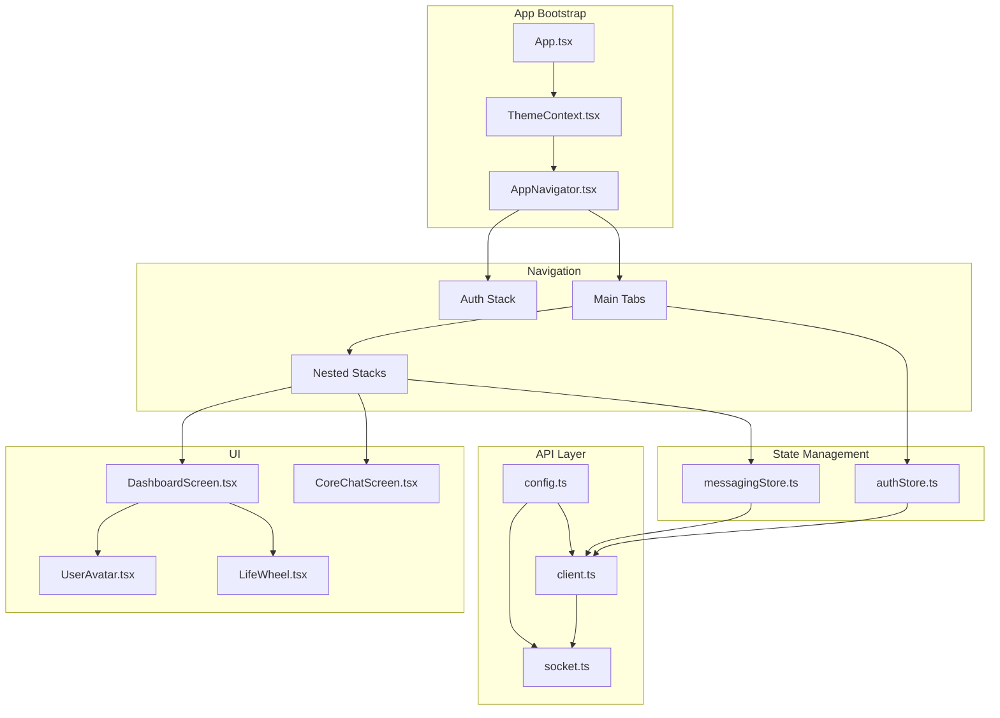
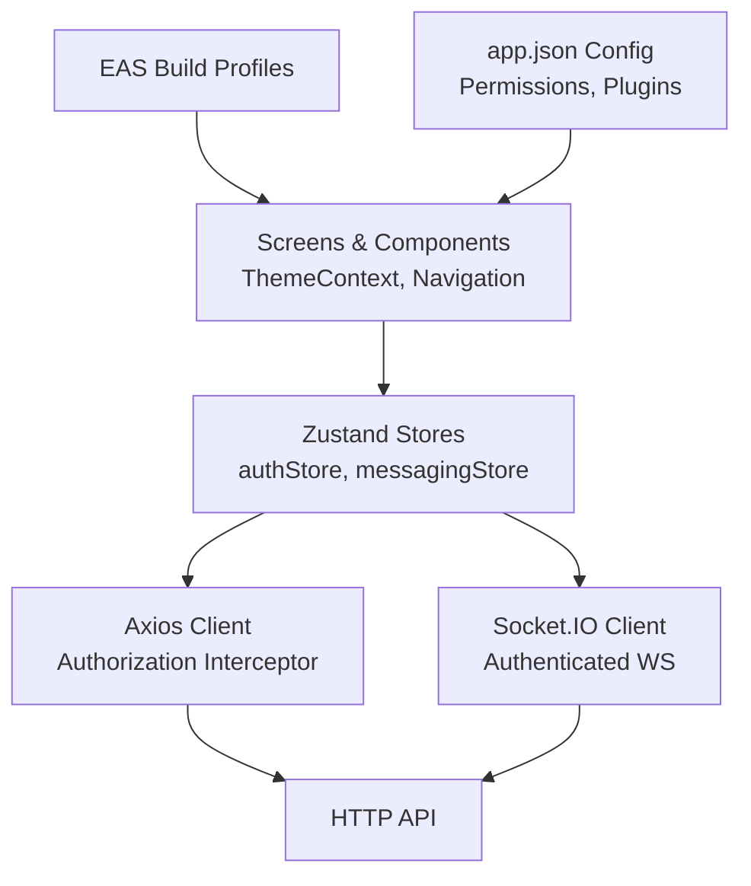
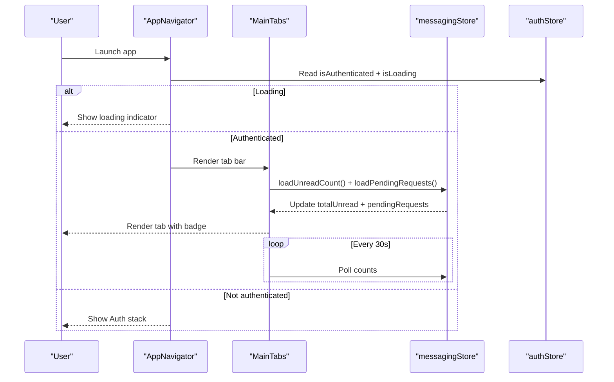
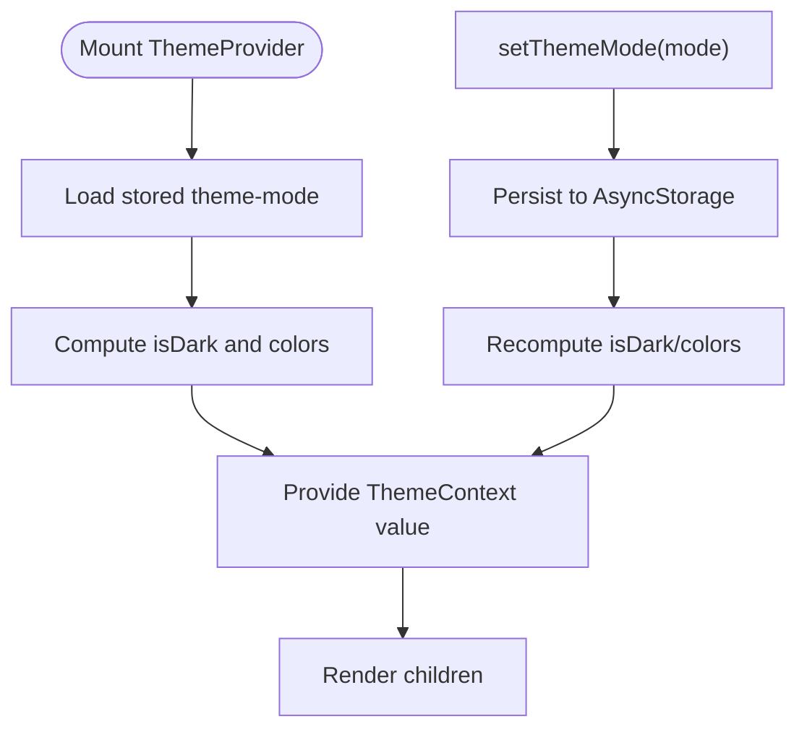
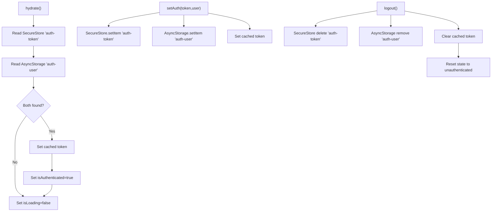
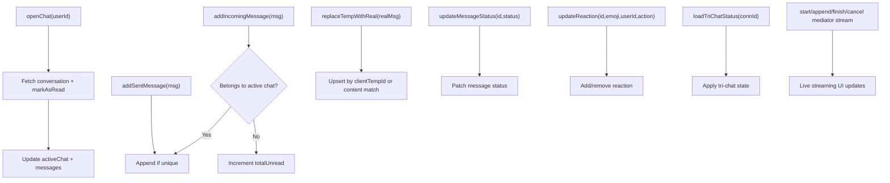
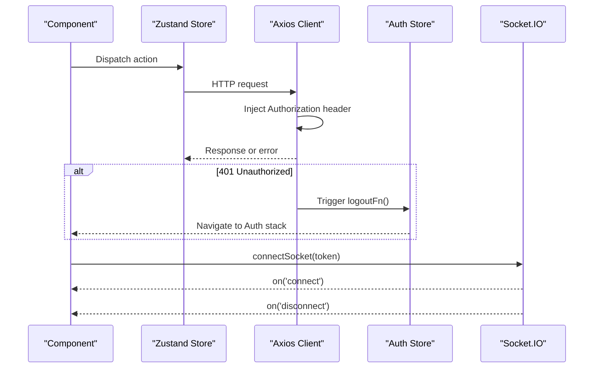
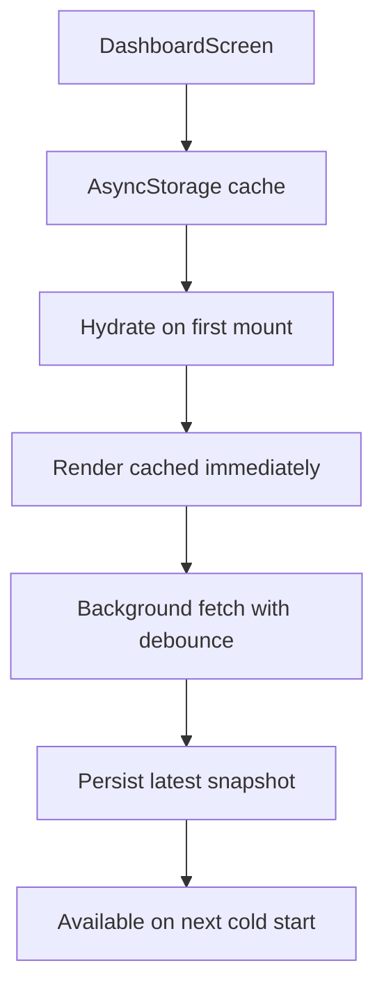
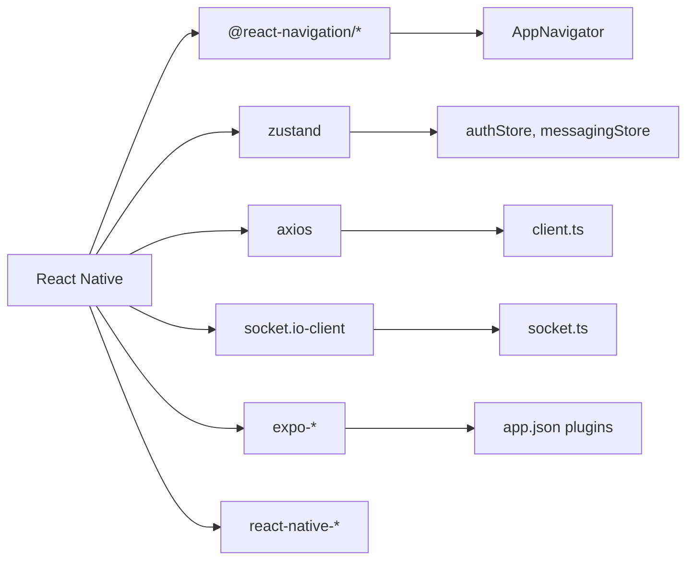

# Mobile Architecture

<cite>
**Referenced Files in This Document**
- [App.tsx](file://mobile/App.tsx)
- [AppNavigator.tsx](file://mobile/src/navigation/AppNavigator.tsx)
- [ThemeContext.tsx](file://mobile/src/contexts/ThemeContext.tsx)
- [colors.ts](file://mobile/src/constants/colors.ts)
- [eas.json](file://mobile/eas.json)
- [app.json](file://mobile/app.json)
- [authStore.ts](file://mobile/src/store/authStore.ts)
- [messagingStore.ts](file://mobile/src/store/messagingStore.ts)
- [client.ts](file://mobile/src/api/client.ts)
- [socket.ts](file://mobile/src/api/socket.ts)
- [config.ts](file://mobile/src/constants/config.ts)
- [UserAvatar.tsx](file://mobile/src/components/UserAvatar.tsx)
- [LifeWheel.tsx](file://mobile/src/components/LifeWheel.tsx)
- [DashboardScreen.tsx](file://mobile/src/screens/DashboardScreen.tsx)
- [CoreChatScreen.tsx](file://mobile/src/screens/CoreChatScreen.tsx)
- [package.json](file://mobile/package.json)
</cite>

## Table of Contents
1. [Introduction](#introduction)
2. [Project Structure](#project-structure)
3. [Core Components](#core-components)
4. [Architecture Overview](#architecture-overview)
5. [Detailed Component Analysis](#detailed-component-analysis)
6. [Dependency Analysis](#dependency-analysis)
7. [Performance Considerations](#performance-considerations)
8. [Troubleshooting Guide](#troubleshooting-guide)
9. [Conclusion](#conclusion)
10. [Appendices](#appendices)

## Introduction
This document describes the mobile architecture for the 4Ever React Native application built with Expo. It covers cross-platform component design, navigation patterns, theme management, state management with Zustand stores, build configuration with EAS Build, offline-aware caching strategies, mobile UI patterns, real-time messaging integration, and performance optimizations tailored for mobile devices.

## Project Structure
The mobile app is organized under the mobile directory with clear separation of concerns:
- App bootstrap and providers
- Navigation hierarchy (Auth stack, Main tabs, nested stacks)
- Theme system with persistent preferences
- Zustand stores for authentication, messaging, and related domains
- API client and WebSocket integration
- Screens implementing core features
- Shared components for UI primitives
- Build configuration for EAS and platform-specific settings

**Diagram sources**
- [App.tsx:1-38](file://mobile/App.tsx#L1-L38)
- [ThemeContext.tsx:1-61](file://mobile/src/contexts/ThemeContext.tsx#L1-L61)
- [AppNavigator.tsx:1-282](file://mobile/src/navigation/AppNavigator.tsx#L1-L282)
- [authStore.ts:1-75](file://mobile/src/store/authStore.ts#L1-L75)
- [messagingStore.ts:1-373](file://mobile/src/store/messagingStore.ts#L1-L373)
- [client.ts:1-57](file://mobile/src/api/client.ts#L1-L57)
- [socket.ts:1-37](file://mobile/src/api/socket.ts#L1-L37)
- [config.ts:1-85](file://mobile/src/constants/config.ts#L1-L85)
- [UserAvatar.tsx:1-82](file://mobile/src/components/UserAvatar.tsx#L1-L82)
- [LifeWheel.tsx:1-159](file://mobile/src/components/LifeWheel.tsx#L1-L159)
- [DashboardScreen.tsx:1-200](file://mobile/src/screens/DashboardScreen.tsx#L1-L200)
- [CoreChatScreen.tsx:1-200](file://mobile/src/screens/CoreChatScreen.tsx#L1-L200)

**Section sources**
- [App.tsx:1-38](file://mobile/App.tsx#L1-L38)
- [AppNavigator.tsx:1-282](file://mobile/src/navigation/AppNavigator.tsx#L1-L282)
- [ThemeContext.tsx:1-61](file://mobile/src/contexts/ThemeContext.tsx#L1-L61)
- [eas.json:1-73](file://mobile/eas.json#L1-L73)
- [app.json:1-96](file://mobile/app.json#L1-L96)

## Core Components
- App bootstrap orchestrates providers and initial hydration:
  - Gesture handler root, safe area provider, theme provider, status bar, toast provider, and navigator.
  - Initial hydration loads persisted auth state.
- Navigation:
  - Auth stack for login.
  - Bottom tab navigator with five groups: Home, Chat, Thought, Circle, More.
  - Nested native stack navigators per group with themed headers and badges.
- Theme:
  - ThemeContext manages light/dark/system modes with persistence and dynamic color selection.
- State management:
  - Zustand stores for auth and messaging with persistence and optimistic updates.
- API and connectivity:
  - Axios client with bearer token injection and centralized 401 handling.
  - Socket.IO client with auth and reconnect strategies.
- Build and runtime:
  - EAS Build profiles for development, preview, and production.
  - app.json defines runtime behavior, permissions, and platform-specific settings.

**Section sources**
- [App.tsx:10-37](file://mobile/App.tsx#L10-L37)
- [AppNavigator.tsx:255-282](file://mobile/src/navigation/AppNavigator.tsx#L255-L282)
- [ThemeContext.tsx:24-60](file://mobile/src/contexts/ThemeContext.tsx#L24-L60)
- [authStore.ts:26-75](file://mobile/src/store/authStore.ts#L26-L75)
- [messagingStore.ts:59-373](file://mobile/src/store/messagingStore.ts#L59-L373)
- [client.ts:12-42](file://mobile/src/api/client.ts#L12-L42)
- [socket.ts:6-37](file://mobile/src/api/socket.ts#L6-L37)
- [eas.json:7-57](file://mobile/eas.json#L7-L57)
- [app.json:20-96](file://mobile/app.json#L20-L96)

## Architecture Overview
The mobile architecture follows a layered pattern:
- Presentation layer: Screens and components using ThemeContext and navigation.
- State layer: Zustand stores for domain-specific state with persistence.
- API layer: Axios client and Socket.IO for HTTP/WebSocket.
- Infrastructure: EAS Build and app.json for platform configuration.

**Diagram sources**
- [AppNavigator.tsx:255-282](file://mobile/src/navigation/AppNavigator.tsx#L255-L282)
- [ThemeContext.tsx:24-60](file://mobile/src/contexts/ThemeContext.tsx#L24-L60)
- [authStore.ts:26-75](file://mobile/src/store/authStore.ts#L26-L75)
- [messagingStore.ts:59-373](file://mobile/src/store/messagingStore.ts#L59-L373)
- [client.ts:12-42](file://mobile/src/api/client.ts#L12-L42)
- [socket.ts:6-37](file://mobile/src/api/socket.ts#L6-L37)
- [eas.json:7-57](file://mobile/eas.json#L7-L57)
- [app.json:20-96](file://mobile/app.json#L20-L96)

## Detailed Component Analysis

### Navigation and Tab Badges
The navigation uses a bottom tab bar with five groups. The Circle tab displays a composite badge combining unread direct messages and pending connection requests. The navigator adapts to theme and shows a loading indicator while hydration completes.

**Diagram sources**
- [AppNavigator.tsx:175-253](file://mobile/src/navigation/AppNavigator.tsx#L175-L253)
- [AppNavigator.tsx:255-282](file://mobile/src/navigation/AppNavigator.tsx#L255-L282)
- [messagingStore.ts:77-105](file://mobile/src/store/messagingStore.ts#L77-L105)
- [authStore.ts:26-75](file://mobile/src/store/authStore.ts#L26-L75)

**Section sources**
- [AppNavigator.tsx:175-253](file://mobile/src/navigation/AppNavigator.tsx#L175-L253)
- [AppNavigator.tsx:255-282](file://mobile/src/navigation/AppNavigator.tsx#L255-L282)
- [messagingStore.ts:77-105](file://mobile/src/store/messagingStore.ts#L77-L105)
- [authStore.ts:26-75](file://mobile/src/store/authStore.ts#L26-L75)

### Theme Management
ThemeContext provides a theme mode (system/light/dark), persists the preference, computes derived colors, and renders only after loading the stored preference. The navigator theme mirrors the current color tokens.

**Diagram sources**
- [ThemeContext.tsx:24-60](file://mobile/src/contexts/ThemeContext.tsx#L24-L60)
- [AppNavigator.tsx:260-266](file://mobile/src/navigation/AppNavigator.tsx#L260-L266)
- [colors.ts:1-142](file://mobile/src/constants/colors.ts#L1-L142)

**Section sources**
- [ThemeContext.tsx:24-60](file://mobile/src/contexts/ThemeContext.tsx#L24-L60)
- [AppNavigator.tsx:260-266](file://mobile/src/navigation/AppNavigator.tsx#L260-L266)
- [colors.ts:1-142](file://mobile/src/constants/colors.ts#L1-L142)

### Authentication State with Persistence
The auth store persists tokens and user data using Secure Store and Async Storage, hydrates on launch, and integrates with the API client’s token cache and 401 handler.

**Diagram sources**
- [authStore.ts:56-75](file://mobile/src/store/authStore.ts#L56-L75)
- [client.ts:18-42](file://mobile/src/api/client.ts#L18-L42)

**Section sources**
- [authStore.ts:26-75](file://mobile/src/store/authStore.ts#L26-L75)
- [client.ts:18-42](file://mobile/src/api/client.ts#L18-L42)

### Messaging State and Real-Time Updates
The messaging store manages connections, conversations, active chats, and tri-chat mediator streams. It optimistically updates UI and synchronizes with server-provided state.

**Diagram sources**
- [messagingStore.ts:107-201](file://mobile/src/store/messagingStore.ts#L107-L201)
- [messagingStore.ts:135-158](file://mobile/src/store/messagingStore.ts#L135-L158)
- [messagingStore.ts:160-189](file://mobile/src/store/messagingStore.ts#L160-L189)
- [messagingStore.ts:250-372](file://mobile/src/store/messagingStore.ts#L250-L372)

**Section sources**
- [messagingStore.ts:59-373](file://mobile/src/store/messagingStore.ts#L59-L373)

### API Client and WebSocket
The API client injects Authorization headers and centralizes 401 handling by invoking the auth store’s logout. The WebSocket client connects with auth and supports reconnect.

**Diagram sources**
- [client.ts:18-42](file://mobile/src/api/client.ts#L18-L42)
- [authStore.ts:73-75](file://mobile/src/store/authStore.ts#L73-L75)
- [socket.ts:10-37](file://mobile/src/api/socket.ts#L10-L37)

**Section sources**
- [client.ts:18-42](file://mobile/src/api/client.ts#L18-L42)
- [socket.ts:10-37](file://mobile/src/api/socket.ts#L10-L37)
- [authStore.ts:73-75](file://mobile/src/store/authStore.ts#L73-L75)

### Mobile UI Patterns and Responsive Adaptations
- Touch-friendly interfaces:
  - Large tab bar labels and icons, safe area insets, gesture handler root.
  - Scroll-aware chat behavior and keyboard avoidance.
- Responsive design:
  - Dynamic styles based on theme tokens and dark mode.
  - SVG-based Life Wheel scales to container size with readable labels.
- Offline-aware caching:
  - Dashboard caches aggregated data in AsyncStorage with debounced refresh and pull-to-refresh bypass.

**Diagram sources**
- [DashboardScreen.tsx:87-115](file://mobile/src/screens/DashboardScreen.tsx#L87-L115)
- [DashboardScreen.tsx:117-162](file://mobile/src/screens/DashboardScreen.tsx#L117-L162)
- [DashboardScreen.tsx:170-179](file://mobile/src/screens/DashboardScreen.tsx#L170-L179)

**Section sources**
- [DashboardScreen.tsx:67-200](file://mobile/src/screens/DashboardScreen.tsx#L67-L200)
- [LifeWheel.tsx:29-151](file://mobile/src/components/LifeWheel.tsx#L29-L151)

### Example Components
- UserAvatar: Resolves avatar URLs, falls back to colored initials, handles image load errors.
- LifeWheel: Renders a six-dimensional radar chart with theme-aware colors and labels.

**Section sources**
- [UserAvatar.tsx:41-82](file://mobile/src/components/UserAvatar.tsx#L41-L82)
- [LifeWheel.tsx:29-151](file://mobile/src/components/LifeWheel.tsx#L29-L151)

## Dependency Analysis
External dependencies relevant to mobile architecture include navigation, state management, networking, and platform plugins.

**Diagram sources**
- [package.json:11-44](file://mobile/package.json#L11-L44)
- [authStore.ts:1-75](file://mobile/src/store/authStore.ts#L1-L75)
- [messagingStore.ts:1-373](file://mobile/src/store/messagingStore.ts#L1-L373)
- [client.ts:1-57](file://mobile/src/api/client.ts#L1-L57)
- [socket.ts:1-37](file://mobile/src/api/socket.ts#L1-L37)
- [app.json:65-88](file://mobile/app.json#L65-L88)

**Section sources**
- [package.json:11-44](file://mobile/package.json#L11-L44)
- [app.json:65-88](file://mobile/app.json#L65-L88)

## Performance Considerations
- Network efficiency:
  - Token caching avoids repeated Secure Store reads.
  - Debounced background refresh prevents thrashing on rapid navigation.
- Rendering:
  - SVG-based charts reduce layout thrash compared to heavy canvas libraries.
  - Animated pulsing indicators use native driver for smoothness.
- Memory:
  - Optimistic UI updates minimize perceived latency; server reconciliation keeps state consistent.
- Build and runtime:
  - Hermes engine and new architecture enable improved performance.
  - EAS Build auto-increments build numbers and uses remote versioning for reliable updates.

[No sources needed since this section provides general guidance]

## Troubleshooting Guide
- Authentication issues:
  - 401 responses trigger centralized logout; verify token storage and interceptor wiring.
- Network connectivity:
  - API URL resolution depends on environment variables; production builds require explicit configuration.
- WebSocket:
  - Ensure token availability before connecting; inspect connection/disconnect logs.
- Offline data:
  - Verify AsyncStorage keys and cache hydration logic; confirm debounce intervals align with UX expectations.

**Section sources**
- [client.ts:32-42](file://mobile/src/api/client.ts#L32-L42)
- [config.ts:36-64](file://mobile/src/constants/config.ts#L36-L64)
- [socket.ts:10-37](file://mobile/src/api/socket.ts#L10-L37)
- [DashboardScreen.tsx:87-115](file://mobile/src/screens/DashboardScreen.tsx#L87-L115)

## Conclusion
The 4Ever mobile app leverages React Native and Expo to deliver a cohesive, theme-aware, and responsive experience. Navigation is structured around a bottom tab layout with nested stacks, state is managed with lightweight Zustand stores, and connectivity is handled via an authenticated Axios client and Socket.IO. EAS Build and app.json streamline platform-specific configuration, while offline-aware caching and performance-conscious UI patterns enhance usability on mobile devices.

[No sources needed since this section summarizes without analyzing specific files]

## Appendices
- Build configuration highlights:
  - Development: on-device debug with internal distribution and local API override.
  - Preview: release-mode JS with staging API.
  - Production: store-ready artifacts with auto-incremented build numbers and remote versioning.
- Platform capabilities:
  - Permissions and plugin declarations for camera, microphone, contacts, and Apple authentication.
  - Edge-to-edge and predictive back gesture settings.

**Section sources**
- [eas.json:7-57](file://mobile/eas.json#L7-L57)
- [app.json:39-88](file://mobile/app.json#L39-L88)