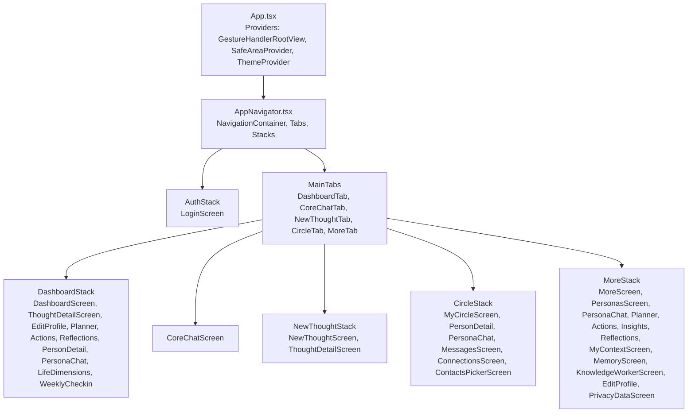
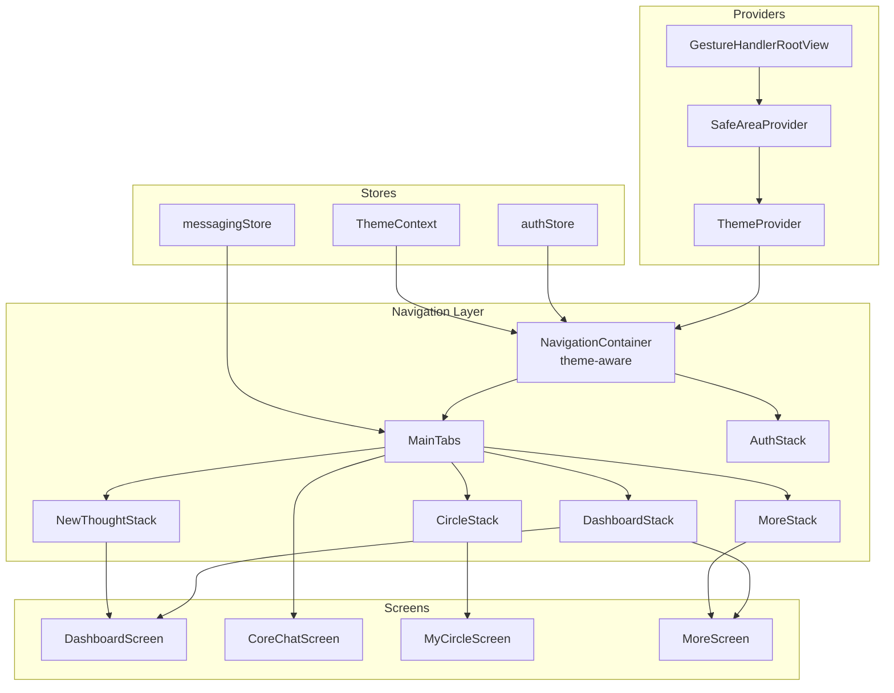
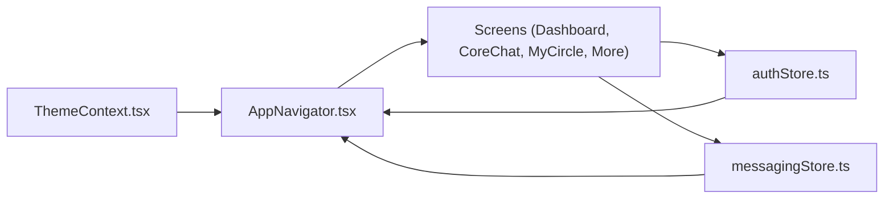
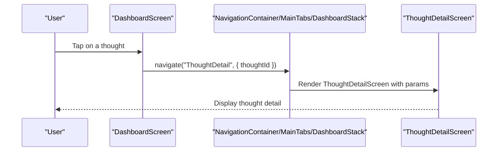
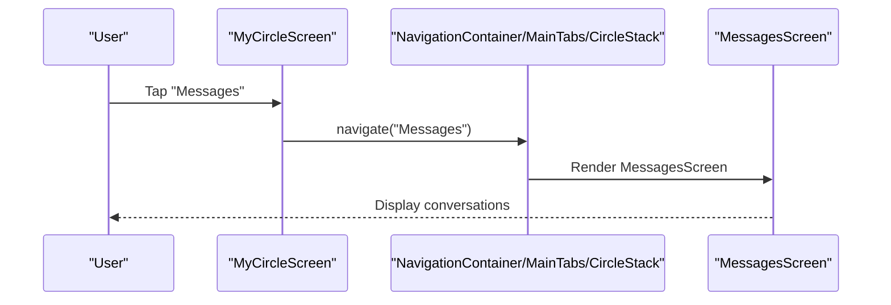
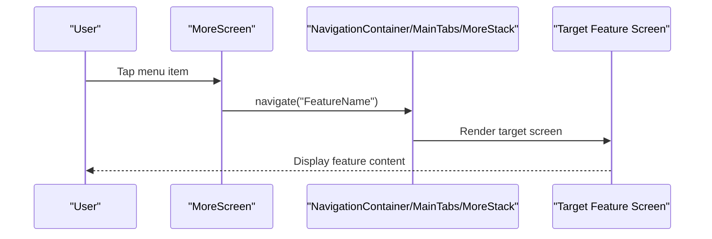

# Navigation System

<cite>
**Referenced Files in This Document**
- [AppNavigator.tsx](file://mobile/src/navigation/AppNavigator.tsx)
- [App.tsx](file://mobile/App.tsx)
- [DashboardScreen.tsx](file://mobile/src/screens/DashboardScreen.tsx)
- [CoreChatScreen.tsx](file://mobile/src/screens/CoreChatScreen.tsx)
- [MyCircleScreen.tsx](file://mobile/src/screens/MyCircleScreen.tsx)
- [MoreScreen.tsx](file://mobile/src/screens/MoreScreen.tsx)
- [ThemeContext.tsx](file://mobile/src/contexts/ThemeContext.tsx)
- [authStore.ts](file://mobile/src/store/authStore.ts)
- [messagingStore.ts](file://mobile/src/store/messagingStore.ts)
- [colors.ts](file://mobile/src/constants/colors.ts)
</cite>

## Table of Contents
1. [Introduction](#introduction)
2. [Project Structure](#project-structure)
3. [Core Components](#core-components)
4. [Architecture Overview](#architecture-overview)
5. [Detailed Component Analysis](#detailed-component-analysis)
6. [Dependency Analysis](#dependency-analysis)
7. [Performance Considerations](#performance-considerations)
8. [Troubleshooting Guide](#troubleshooting-guide)
9. [Conclusion](#conclusion)
10. [Appendices](#appendices)

## Introduction
This document describes the mobile navigation architecture built with React Navigation in the 4Ever mobile application. It focuses on the AppNavigator implementation, hierarchical navigation structure, tab-based navigation for main sections, nested stacks for detailed views, navigation state management, guards, route parameters handling, and integration with stores for authentication, theming, and messaging. It also covers programmatic navigation patterns, navigation state persistence, and accessibility considerations.

## Project Structure
The navigation system centers around a single entry point that wires the app shell with theme and authentication providers, and a navigator that orchestrates tabs and nested stacks.

**Diagram sources**
- [App.tsx:1-38](file://mobile/App.tsx#L1-L38)
- [AppNavigator.tsx:42-282](file://mobile/src/navigation/AppNavigator.tsx#L42-L282)

**Section sources**
- [App.tsx:1-38](file://mobile/App.tsx#L1-L38)
- [AppNavigator.tsx:42-282](file://mobile/src/navigation/AppNavigator.tsx#L42-L282)

## Core Components
- AppNavigator: Orchestrates authentication gating, theme-aware navigation container, and five-tab structure with nested stacks.
- ThemeContext: Provides theme mode selection and color tokens consumed by navigators and screens.
- authStore: Manages authentication state and hydration, controlling which navigator is shown.
- messagingStore: Supplies tab badges and maintains chat state for the Circle tab.
- Screens: Implement programmatic navigation and route parameters handling.

Key responsibilities:
- Authentication gating: Renders AuthStack when not authenticated; otherwise renders MainTabs.
- Theme-awareness: Applies light/dark theme to NavigationContainer and tab styles.
- Tab badges: Circle tab badge aggregates unread counts and pending requests.
- Nested stacks: Encapsulate related screens with consistent headers and transitions.

**Section sources**
- [AppNavigator.tsx:255-282](file://mobile/src/navigation/AppNavigator.tsx#L255-L282)
- [ThemeContext.tsx:24-56](file://mobile/src/contexts/ThemeContext.tsx#L24-L56)
- [authStore.ts:26-71](file://mobile/src/store/authStore.ts#L26-L71)
- [messagingStore.ts:59-105](file://mobile/src/store/messagingStore.ts#L59-L105)

## Architecture Overview
The navigation architecture follows a layered pattern:
- Providers: App wraps the app with gesture/safe area providers and theme provider.
- Navigation Container: Wraps the navigator with theme-aware colors.
- Tabs: Five main tabs with distinct responsibilities.
- Stacks: Each tab hosts a stack of related screens.
- Guards: Authentication guard determines which navigator to render.
- Stores: authStore and messagingStore feed state into navigation decisions.

**Diagram sources**
- [App.tsx:10-37](file://mobile/App.tsx#L10-L37)
- [AppNavigator.tsx:255-282](file://mobile/src/navigation/AppNavigator.tsx#L255-L282)
- [ThemeContext.tsx:24-56](file://mobile/src/contexts/ThemeContext.tsx#L24-L56)
- [authStore.ts:26-71](file://mobile/src/store/authStore.ts#L26-L71)
- [messagingStore.ts:59-105](file://mobile/src/store/messagingStore.ts#L59-L105)

## Detailed Component Analysis

### AppNavigator Implementation
AppNavigator composes:
- AuthStack: Single-screen login stack.
- MainTabs: Bottom tab navigator with five tabs.
- DashboardStack: Home-centric screens including thought detail and planner.
- NewThoughtStack: Thought capture and detail.
- CircleStack: Circle, messages, connections, contacts picker.
- MoreStack: Settings and auxiliary features.

Theme integration:
- Uses ThemeContext to compute dark/light colors and applies them to NavigationContainer and tab styles.

Authentication gating:
- Reads authentication state from authStore and conditionally renders AuthStack or MainTabs.

Tab badges:
- Circle tab badge displays aggregated unread and pending requests, refreshed periodically.

Programmatic navigation:
- Screens navigate using navigation prop (e.g., navigation.navigate('RouteName', params)).
- getParent() used to navigate across stacks (e.g., from Dashboard to NewThoughtTab).

Route parameters:
- Many screens accept route params (e.g., thoughtId, personId, personaName) and adjust titles dynamically.

**Section sources**
- [AppNavigator.tsx:42-282](file://mobile/src/navigation/AppNavigator.tsx#L42-L282)
- [ThemeContext.tsx:43-48](file://mobile/src/contexts/ThemeContext.tsx#L43-L48)
- [authStore.ts:26-71](file://mobile/src/store/authStore.ts#L26-L71)
- [messagingStore.ts:100-105](file://mobile/src/store/messagingStore.ts#L100-L105)

### Hierarchical Navigation Structure
- Root: AuthStack or MainTabs.
- Tabs: DashboardStack, CoreChatScreen, NewThoughtStack, CircleStack, MoreStack.
- Nested stacks encapsulate related flows with consistent headers and transitions.

Navigation patterns:
- Stack-level navigation for detailed views (e.g., ThoughtDetailScreen).
- Cross-stack navigation via getParent() to switch tabs.
- Deep links: Not configured in the provided code; deep linking would require linking configuration in app.json/eas.json and a linking handler.

**Section sources**
- [AppNavigator.tsx:42-282](file://mobile/src/navigation/AppNavigator.tsx#L42-L282)

### Tab-Based Navigation
- DashboardTab: Home dashboard and related detail screens.
- CoreChatTab: Persistent chat screen.
- NewThoughtTab: Capture and detail for thoughts.
- CircleTab: Circle, messages, connections, and contacts picker with badge.
- MoreTab: Settings and auxiliary features.

Badge logic:
- Aggregates unread count and pending requests; updates every 30 seconds while authenticated.

**Section sources**
- [AppNavigator.tsx:175-253](file://mobile/src/navigation/AppNavigator.tsx#L175-L253)
- [messagingStore.ts:85-90](file://mobile/src/store/messagingStore.ts#L85-L90)

### Programmatic Navigation Examples
- DashboardScreen navigates to EditProfile, Planner, Reflections, PersonDetail, PersonaChat, LifeDimensions, WeeklyCheckin using navigation.navigate.
- DashboardScreen uses navigation.getParent()?.navigate('NewThoughtTab') to switch tabs.
- MyCircleScreen navigates to PersonDetail and Messages after resolving chat availability.
- MoreScreen navigates to various features like Personas, Planner, Actions, Insights, Reflections, MyContext, Memory, KnowledgeWorker, PrivacyData.

Route parameters:
- ThoughtDetailScreen receives thoughtId.
- PersonDetailScreen receives personId.
- PersonaChatScreen derives title from route params personaName.

**Section sources**
- [DashboardScreen.tsx:244-486](file://mobile/src/screens/DashboardScreen.tsx#L244-L486)
- [DashboardScreen.tsx:484-486](file://mobile/src/screens/DashboardScreen.tsx#L484-L486)
- [MyCircleScreen.tsx:105-195](file://mobile/src/screens/MyCircleScreen.tsx#L105-L195)
- [MoreScreen.tsx:169-175](file://mobile/src/screens/MoreScreen.tsx#L169-L175)
- [AppNavigator.tsx:75-76](file://mobile/src/navigation/AppNavigator.tsx#L75-L76)
- [AppNavigator.tsx:112-113](file://mobile/src/navigation/AppNavigator.tsx#L112-L113)
- [AppNavigator.tsx:133-134](file://mobile/src/navigation/AppNavigator.tsx#L133-L134)

### Navigation Guards and State Management
- Authentication guard: AppNavigator reads isAuthenticated and isLoading from authStore to decide which navigator to render.
- Hydration: AppContent hydrates auth state on startup via useAuthStore.getState().hydrate().
- Theme guard: ThemeContext computes isDark and colors based on theme mode and system preference.

**Section sources**
- [AppNavigator.tsx:255-282](file://mobile/src/navigation/AppNavigator.tsx#L255-L282)
- [App.tsx:13-15](file://mobile/App.tsx#L13-L15)
- [authStore.ts:56-70](file://mobile/src/store/authStore.ts#L56-L70)
- [ThemeContext.tsx:43-48](file://mobile/src/contexts/ThemeContext.tsx#L43-L48)

### Navigation State Persistence
- Authentication persistence: authStore persists token and user data using SecureStore and AsyncStorage; hydrates on app start.
- Theme preference: ThemeContext persists theme mode in AsyncStorage and loads on startup.
- Screen-level caching: DashboardScreen caches dashboard snapshots in AsyncStorage for fast cold starts.

Note: React Navigation state persistence is not explicitly configured in the provided code.

**Section sources**
- [authStore.ts:32-52](file://mobile/src/store/authStore.ts#L32-L52)
- [authStore.ts:56-70](file://mobile/src/store/authStore.ts#L56-L70)
- [ThemeContext.tsx:29-41](file://mobile/src/contexts/ThemeContext.tsx#L29-L41)
- [DashboardScreen.tsx:94-162](file://mobile/src/screens/DashboardScreen.tsx#L94-L162)

### Accessibility Considerations
- Theme-aware contrast: ThemeContext provides light/dark palettes for text, backgrounds, and borders.
- Focus management: Screens use useFocusEffect to manage data loading lifecycle.
- Touch targets: Buttons and navigation items use adequate spacing and sizing as styled.

Recommendations:
- Ensure sufficient color contrast in custom themes.
- Provide semantic labels for navigation elements where applicable.
- Test with TalkBack/VoiceOver and dynamic font sizes.

**Section sources**
- [colors.ts:4-109](file://mobile/src/constants/colors.ts#L4-L109)
- [ThemeContext.tsx:43-48](file://mobile/src/contexts/ThemeContext.tsx#L43-L48)
- [DashboardScreen.tsx:164-168](file://mobile/src/screens/DashboardScreen.tsx#L164-L168)

## Dependency Analysis
The navigation layer depends on:
- ThemeContext for theme-aware rendering.
- authStore for authentication gating.
- messagingStore for tab badge computation.
- Screens for programmatic navigation and route parameters.

**Diagram sources**
- [AppNavigator.tsx:255-282](file://mobile/src/navigation/AppNavigator.tsx#L255-L282)
- [ThemeContext.tsx:24-56](file://mobile/src/contexts/ThemeContext.tsx#L24-L56)
- [authStore.ts:26-71](file://mobile/src/store/authStore.ts#L26-L71)
- [messagingStore.ts:59-105](file://mobile/src/store/messagingStore.ts#L59-L105)

**Section sources**
- [AppNavigator.tsx:255-282](file://mobile/src/navigation/AppNavigator.tsx#L255-L282)
- [authStore.ts:26-71](file://mobile/src/store/authStore.ts#L26-L71)
- [messagingStore.ts:59-105](file://mobile/src/store/messagingStore.ts#L59-L105)

## Performance Considerations
- Efficient tab switching: Using separate stacks avoids unnecessary re-mounts of unrelated screens.
- Debounced data fetching: DashboardScreen debounces reloads to reduce network churn.
- Background updates: Circle tab badge refreshes every 30 seconds; consider throttling or disabling when tab is inactive.
- Large lists: CoreChatScreen uses FlatList with virtualization; ensure similar patterns in other lists.

[No sources needed since this section provides general guidance]

## Troubleshooting Guide
Common issues and resolutions:
- Blank screen on launch: Ensure authStore.hydrate() completes before rendering AppNavigator.
- Incorrect theme colors: Verify ThemeContext computed colors and NavigationContainer theme application.
- Missing tab badge: Confirm messagingStore.loadUnreadCount and loadPendingRequests are invoked and polling interval is respected.
- Navigation failures: Verify route names match those declared in AppNavigator stacks and parameters are passed correctly.

**Section sources**
- [App.tsx:13-15](file://mobile/App.tsx#L13-L15)
- [authStore.ts:56-70](file://mobile/src/store/authStore.ts#L56-L70)
- [ThemeContext.tsx:43-48](file://mobile/src/contexts/ThemeContext.tsx#L43-L48)
- [messagingStore.ts:180-190](file://mobile/src/store/messagingStore.ts#L180-L190)

## Conclusion
The mobile navigation system leverages React Navigation to deliver a structured, theme-aware, and responsive interface. AppNavigator centralizes authentication gating, theme integration, and tab navigation, while nested stacks encapsulate related flows. Programmatic navigation and route parameters enable seamless transitions across screens. With authentication and theme persistence, the system provides a robust foundation for further enhancements such as deep linking and advanced navigation state persistence.

## Appendices

### Navigation Flow: Dashboard to Thought Detail

**Diagram sources**
- [DashboardScreen.tsx:488-512](file://mobile/src/screens/DashboardScreen.tsx#L488-L512)
- [AppNavigator.tsx:68-78](file://mobile/src/navigation/AppNavigator.tsx#L68-L78)

### Navigation Flow: Circle Tab to Messages

**Diagram sources**
- [MyCircleScreen.tsx:339-340](file://mobile/src/screens/MyCircleScreen.tsx#L339-L340)
- [AppNavigator.tsx:113-114](file://mobile/src/navigation/AppNavigator.tsx#L113-L114)

### Navigation Flow: More Menu to Feature

**Diagram sources**
- [MoreScreen.tsx:169-175](file://mobile/src/screens/MoreScreen.tsx#L169-L175)
- [AppNavigator.tsx:131-143](file://mobile/src/navigation/AppNavigator.tsx#L131-L143)