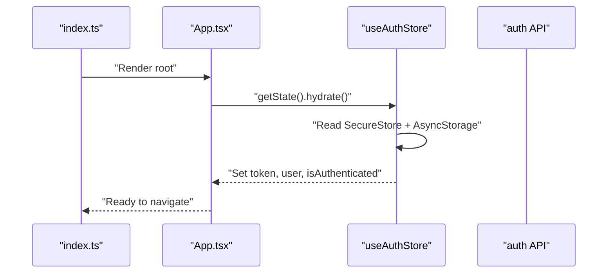
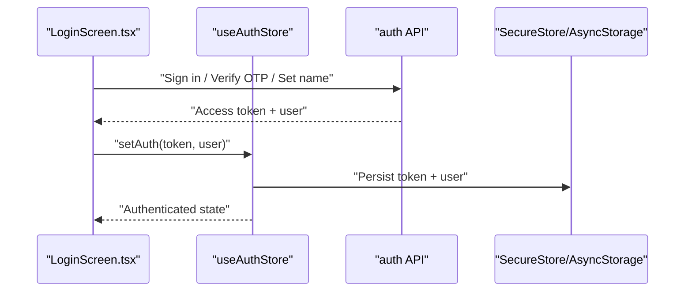
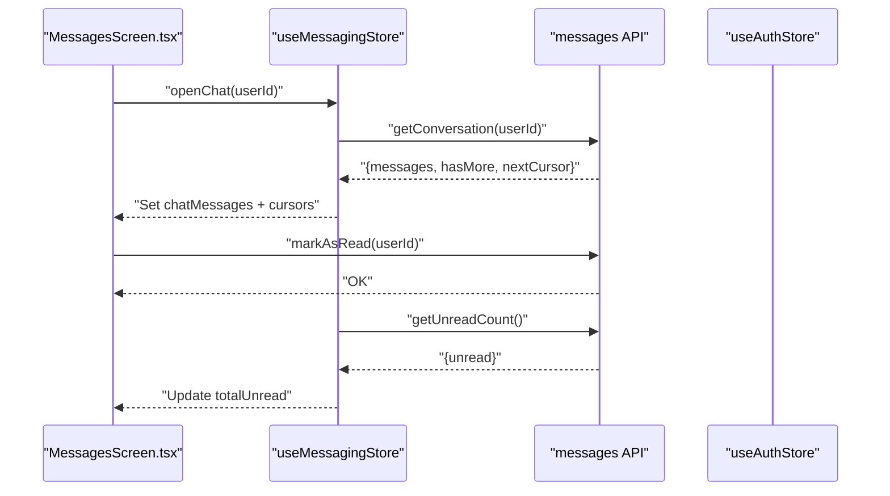
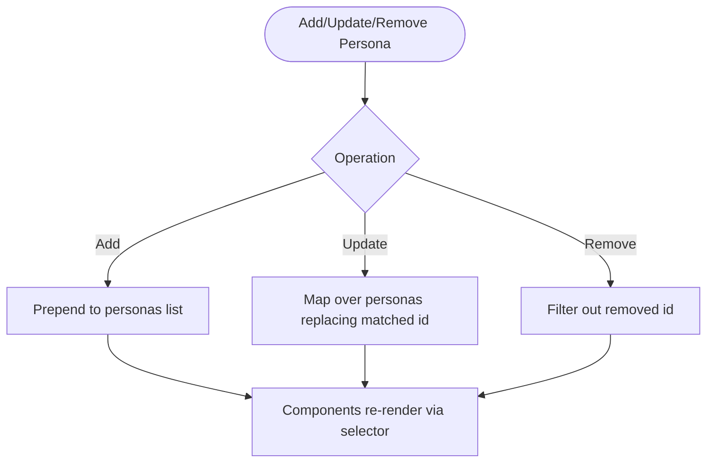
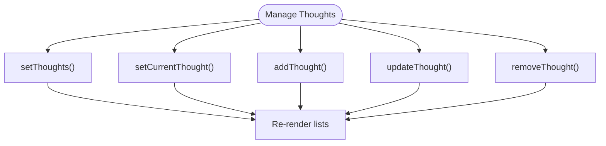
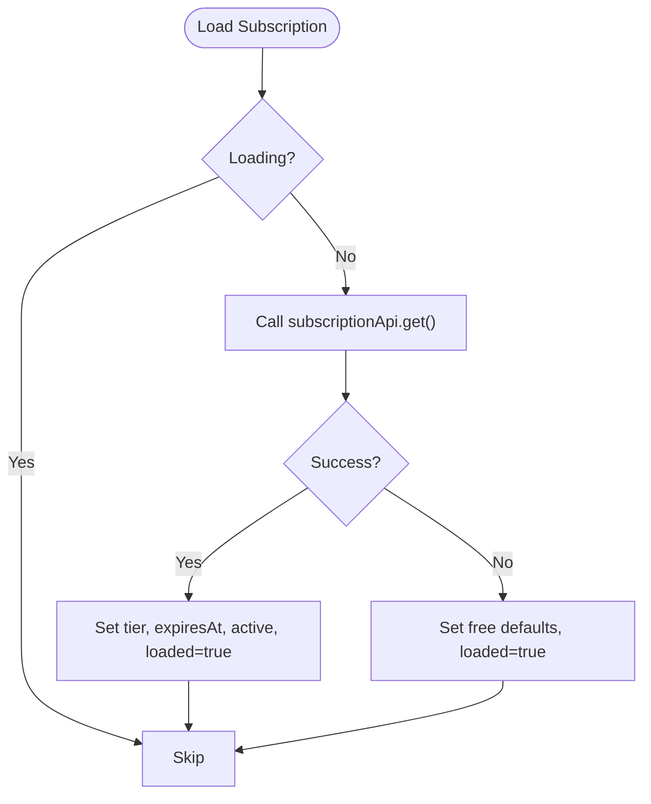
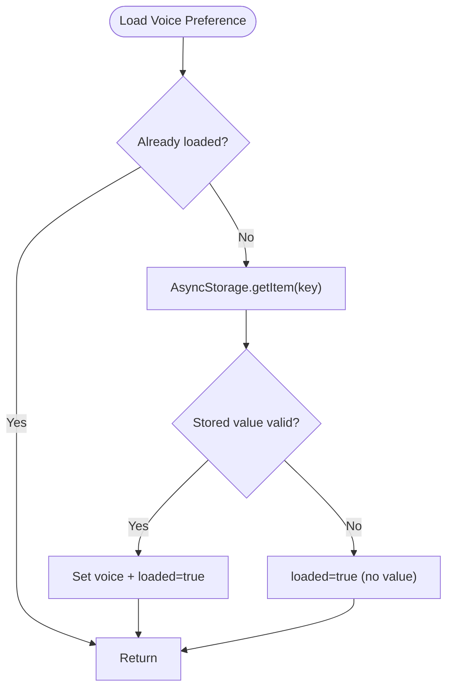
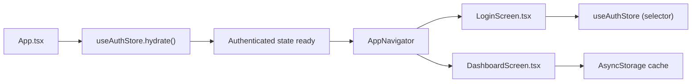
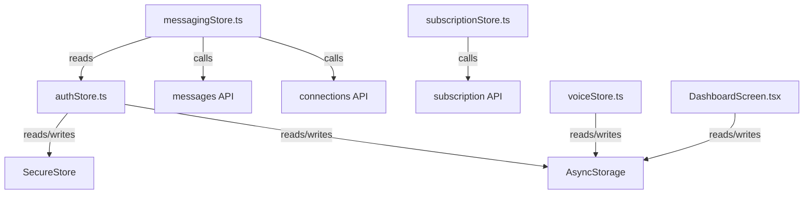

# State Management

<cite>
**Referenced Files in This Document**
- [App.tsx](file://mobile/App.tsx)
- [index.ts](file://mobile/index.ts)
- [authStore.ts](file://mobile/src/store/authStore.ts)
- [messagingStore.ts](file://mobile/src/store/messagingStore.ts)
- [personaStore.ts](file://mobile/src/store/personaStore.ts)
- [thoughtStore.ts](file://mobile/src/store/thoughtStore.ts)
- [subscriptionStore.ts](file://mobile/src/store/subscriptionStore.ts)
- [voiceStore.ts](file://mobile/src/store/voiceStore.ts)
- [LoginScreen.tsx](file://mobile/src/screens/LoginScreen.tsx)
- [DashboardScreen.tsx](file://mobile/src/screens/DashboardScreen.tsx)
</cite>

## Table of Contents
1. [Introduction](#introduction)
2. [Project Structure](#project-structure)
3. [Core Components](#core-components)
4. [Architecture Overview](#architecture-overview)
5. [Detailed Component Analysis](#detailed-component-analysis)
6. [Dependency Analysis](#dependency-analysis)
7. [Performance Considerations](#performance-considerations)
8. [Troubleshooting Guide](#troubleshooting-guide)
9. [Conclusion](#conclusion)

## Introduction
This document explains the mobile application’s state management built with Zustand stores. It covers the store architecture pattern, state hydration from AsyncStorage and SecureStore, cross-component state sharing, and synchronization with backend APIs. It documents the authentication store for sessions, the messaging store for real-time updates, the persona store for AI persona state, and the thought store for user-generated content. It also describes persistence strategies, initialization patterns, debugging techniques, and performance optimizations tailored for mobile environments.

## Project Structure
The mobile app initializes the Zustand stores at startup and hydrates authentication state before rendering the main navigator. Stores are organized by domain: authentication, messaging, personas, thoughts, subscriptions, and voice preferences. Screens consume stores via selector-based subscriptions to minimize re-renders.

```mermaid
graph TB
subgraph "Mobile App"
IDX["index.ts<br/>Registers root component"]
APP["App.tsx<br/>Initializes auth hydration"]
NAV["AppNavigator<br/>(Navigation)"]
end
subgraph "Zustand Stores"
AUTH["authStore.ts<br/>Auth state + hydration"]
MSG["messagingStore.ts<br/>Connections, chats, tri-chat"]
PER["personaStore.ts<br/>Personas list"]
THO["thoughtStore.ts<br/>Thoughts list + current"]
SUB["subscriptionStore.ts<br/>Subscription tier/expiry"]
VOC["voiceStore.ts<br/>Core voice preference"]
end
IDX --> APP
APP --> AUTH
APP --> NAV
NAV --> |"Consumes"| AUTH
NAV --> |"Consumes"| MSG
NAV --> |"Consumes"| PER
NAV --> |"Consumes"| THO
NAV --> |"Consumes"| SUB
NAV --> |"Consumes"| VOC
```

**Diagram sources**
- [index.ts:1-9](file://mobile/index.ts#L1-L9)
- [App.tsx:10-25](file://mobile/App.tsx#L10-L25)
- [authStore.ts:26-71](file://mobile/src/store/authStore.ts#L26-L71)
- [messagingStore.ts:59-372](file://mobile/src/store/messagingStore.ts#L59-L372)
- [personaStore.ts:12-22](file://mobile/src/store/personaStore.ts#L12-L22)
- [thoughtStore.ts:14-26](file://mobile/src/store/thoughtStore.ts#L14-L26)
- [subscriptionStore.ts:15-44](file://mobile/src/store/subscriptionStore.ts#L15-L44)
- [voiceStore.ts:47-69](file://mobile/src/store/voiceStore.ts#L47-L69)

**Section sources**
- [index.ts:1-9](file://mobile/index.ts#L1-L9)
- [App.tsx:10-25](file://mobile/App.tsx#L10-L25)

## Core Components
- Authentication store: Manages JWT token, user profile, authentication status, loading state, and hydration from SecureStore and AsyncStorage. Exposes setters for session updates and logout cleanup.
- Messaging store: Centralizes connections, conversations, active chat, unread counts, and real-time message updates. Includes tri-chat mediator state and streaming lifecycle.
- Persona store: CRUD operations for AI personas list.
- Thought store: CRUD operations for user thoughts and selection of the current thought.
- Subscription store: Loads and tracks subscription tier and expiry; supports reset and loading guards.
- Voice store: Persists and loads a core voice preference using AsyncStorage.

**Section sources**
- [authStore.ts:14-71](file://mobile/src/store/authStore.ts#L14-L71)
- [messagingStore.ts:6-57](file://mobile/src/store/messagingStore.ts#L6-L57)
- [personaStore.ts:4-22](file://mobile/src/store/personaStore.ts#L4-L22)
- [thoughtStore.ts:4-26](file://mobile/src/store/thoughtStore.ts#L4-L26)
- [subscriptionStore.ts:4-44](file://mobile/src/store/subscriptionStore.ts#L4-L44)
- [voiceStore.ts:40-69](file://mobile/src/store/voiceStore.ts#L40-L69)

## Architecture Overview
The app initializes the authentication store during startup and hydrates persisted tokens and user data. Screens subscribe to stores using narrow selectors to avoid unnecessary re-renders. Messaging updates are applied locally while syncing unread counts and read receipts with the backend. Backend APIs are consumed directly inside store actions to maintain centralized state transitions.

**Diagram sources**
- [index.ts:1-9](file://mobile/index.ts#L1-L9)
- [App.tsx:13-15](file://mobile/App.tsx#L13-L15)
- [authStore.ts:56-70](file://mobile/src/store/authStore.ts#L56-L70)

## Detailed Component Analysis

### Authentication Store
- Responsibilities:
  - Persist and retrieve token via SecureStore.
  - Persist user profile via AsyncStorage.
  - Set loading state and hydration guard.
  - Provide update and logout helpers.
- Hydration flow:
  - On app start, reads token and user from storage.
  - Sets cached token in the HTTP client and marks authentication ready.
- Logout flow:
  - Clears SecureStore and AsyncStorage entries.
  - Resets cached token and clears state.

**Diagram sources**
- [LoginScreen.tsx:67-133](file://mobile/src/screens/LoginScreen.tsx#L67-L133)
- [authStore.ts:32-52](file://mobile/src/store/authStore.ts#L32-L52)

**Section sources**
- [authStore.ts:14-71](file://mobile/src/store/authStore.ts#L14-L71)
- [LoginScreen.tsx:67-133](file://mobile/src/screens/LoginScreen.tsx#L67-L133)

### Messaging Store
- Responsibilities:
  - Load connections, pending requests, conversations, and unread totals.
  - Manage active chat, pagination cursors, and message lists.
  - Apply incoming/outgoing/sent message updates and reaction edits.
  - Track tri-chat status, mediator streaming, and session lifecycle.
- Cross-component sharing:
  - Components can observe active chat and messages via selectors.
  - Unread counters are kept in sync with backend read receipts.
- Real-time updates:
  - Incoming messages are appended conditionally based on active chat and sender.
  - Read receipts trigger local unread count and conversation badges updates.

**Diagram sources**
- [messagingStore.ts:107-120](file://mobile/src/store/messagingStore.ts#L107-L120)
- [messagingStore.ts:100-105](file://mobile/src/store/messagingStore.ts#L100-L105)
- [messagingStore.ts:135-158](file://mobile/src/store/messagingStore.ts#L135-L158)

**Section sources**
- [messagingStore.ts:6-57](file://mobile/src/store/messagingStore.ts#L6-L57)
- [messagingStore.ts:107-158](file://mobile/src/store/messagingStore.ts#L107-L158)

### Persona Store
- Responsibilities:
  - Maintain a list of personas.
  - Provide setters and updaters for add/update/remove operations.
- Usage pattern:
  - Screens subscribe to persona list via narrow selectors.
  - Updates are propagated immediately across components.

**Diagram sources**
- [personaStore.ts:12-22](file://mobile/src/store/personaStore.ts#L12-L22)

**Section sources**
- [personaStore.ts:4-22](file://mobile/src/store/personaStore.ts#L4-L22)

### Thought Store
- Responsibilities:
  - Maintain a list of thoughts and track the current thought.
  - Provide setters and updaters for add/update/remove operations.
- Usage pattern:
  - Screens subscribe to either the list or the current thought.
  - Updates propagate instantly to subscribed components.

**Diagram sources**
- [thoughtStore.ts:14-26](file://mobile/src/store/thoughtStore.ts#L14-L26)

**Section sources**
- [thoughtStore.ts:4-26](file://mobile/src/store/thoughtStore.ts#L4-L26)

### Subscription Store
- Responsibilities:
  - Load subscription tier and expiry from backend.
  - Guard against concurrent loads and normalize failures to defaults.
  - Reset store state when needed.
- Usage pattern:
  - Components can trigger load on focus or navigation.
  - Selector-based consumption avoids unnecessary renders.

**Diagram sources**
- [subscriptionStore.ts:22-37](file://mobile/src/store/subscriptionStore.ts#L22-L37)

**Section sources**
- [subscriptionStore.ts:4-44](file://mobile/src/store/subscriptionStore.ts#L4-L44)

### Voice Store
- Responsibilities:
  - Persist and load a core voice preference using AsyncStorage.
  - Guard against invalid stored values and initialize safely.
- Usage pattern:
  - Load is idempotent and only performed once.
  - Setting persists immediately and updates UI.

**Diagram sources**
- [voiceStore.ts:51-61](file://mobile/src/store/voiceStore.ts#L51-L61)

**Section sources**
- [voiceStore.ts:40-69](file://mobile/src/store/voiceStore.ts#L40-L69)

### Conceptual Overview
- Store initialization:
  - Root component triggers hydration of authentication state at startup.
  - Navigation proceeds after hydration completes.
- Cross-component state sharing:
  - Components subscribe to narrow slices of stores via selector functions.
  - Local updates are immediate; backend synchronization is handled in store actions.
- Persistence:
  - Authentication state uses SecureStore for tokens and AsyncStorage for user data.
  - Voice preference uses AsyncStorage.
  - Dashboard aggregates additional offline caching via AsyncStorage for dashboard snapshots.

**Diagram sources**
- [App.tsx:13-15](file://mobile/App.tsx#L13-L15)
- [authStore.ts:56-70](file://mobile/src/store/authStore.ts#L56-L70)
- [DashboardScreen.tsx:98-115](file://mobile/src/screens/DashboardScreen.tsx#L98-L115)

**Section sources**
- [App.tsx:10-25](file://mobile/App.tsx#L10-L25)
- [DashboardScreen.tsx:94-162](file://mobile/src/screens/DashboardScreen.tsx#L94-L162)

## Dependency Analysis
- Store-to-API dependencies:
  - Messaging store depends on messaging and connections APIs for fetching and updating conversations and read status.
  - Authentication store integrates with the HTTP client to set cached tokens.
  - Subscription store depends on subscription API for tier and expiry.
- Cross-store dependencies:
  - Messaging store reads the current user ID from the auth store to compute active chat ownership and read receipts.
- External storage:
  - Authentication store uses SecureStore and AsyncStorage.
  - Voice store uses AsyncStorage.
  - Dashboard uses AsyncStorage for offline cache.

**Diagram sources**
- [authStore.ts:32-52](file://mobile/src/store/authStore.ts#L32-L52)
- [messagingStore.ts:77-120](file://mobile/src/store/messagingStore.ts#L77-L120)
- [subscriptionStore.ts:22-37](file://mobile/src/store/subscriptionStore.ts#L22-L37)
- [voiceStore.ts:51-68](file://mobile/src/store/voiceStore.ts#L51-L68)
- [DashboardScreen.tsx:98-160](file://mobile/src/screens/DashboardScreen.tsx#L98-L160)

**Section sources**
- [messagingStore.ts:4-4](file://mobile/src/store/messagingStore.ts#L4-L4)
- [authStore.ts:5-5](file://mobile/src/store/authStore.ts#L5-L5)

## Performance Considerations
- Selector-based subscriptions:
  - Prefer narrow selectors to limit re-renders in components.
  - Example: Subscribe only to user or activeChat instead of entire store.
- Debounced background refresh:
  - Dashboard uses a 30-second debounce to avoid frequent network calls while still keeping UI responsive.
- Offline caching:
  - Dashboard caches aggregated data to disk for instant cold-start presentation.
- Avoid redundant writes:
  - Messaging store deduplicates incoming messages and only updates unread counters when appropriate.
- Concurrency guards:
  - Subscription store prevents concurrent loads by checking a loading flag.
- Memory hygiene:
  - Clear temporary state (e.g., tri-chat streaming id) after completion or cancellation.
  - Avoid retaining large message histories beyond what is visible; rely on cursors and pagination.

[No sources needed since this section provides general guidance]

## Troubleshooting Guide
- Authentication not persisting:
  - Verify SecureStore and AsyncStorage keys exist after login and are cleared on logout.
  - Ensure the HTTP client caches the token after successful auth.
- Hydration never resolves:
  - Check for exceptions during storage reads; the hydration path sets loading to false on failure.
- Messages not appearing in active chat:
  - Confirm the active chat user ID and sender/receiver checks align with the active chat.
  - Ensure read receipts are triggered after opening a chat.
- Unread counters incorrect:
  - Confirm that unread fetch and read receipt calls are invoked after opening a chat.
- Voice preference not sticking:
  - Validate that AsyncStorage writes succeed and the stored value is one of the supported voice IDs.
- Subscription state stuck loading:
  - Ensure the store’s loading guard prevents concurrent loads and that defaults are applied on failure.

**Section sources**
- [authStore.ts:56-70](file://mobile/src/store/authStore.ts#L56-L70)
- [messagingStore.ts:107-120](file://mobile/src/store/messagingStore.ts#L107-L120)
- [messagingStore.ts:135-158](file://mobile/src/store/messagingStore.ts#L135-L158)
- [voiceStore.ts:51-68](file://mobile/src/store/voiceStore.ts#L51-L68)
- [subscriptionStore.ts:22-37](file://mobile/src/store/subscriptionStore.ts#L22-L37)

## Conclusion
The mobile app employs a clear Zustand-based state management architecture with robust hydration, persistence, and cross-component sharing. Authentication, messaging, personas, thoughts, subscriptions, and voice preferences are encapsulated in dedicated stores with focused responsibilities. The design emphasizes selector-driven subscriptions, offline caching, and guarded concurrency to deliver a responsive and reliable user experience on mobile.