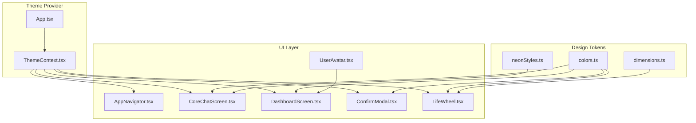
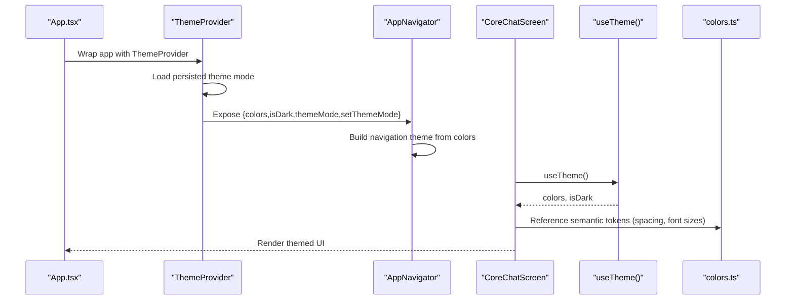
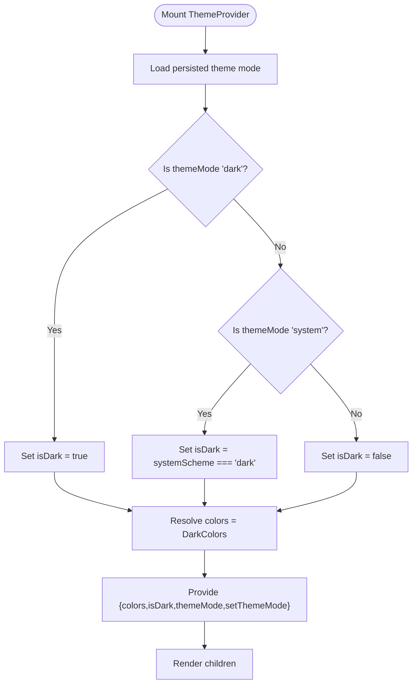
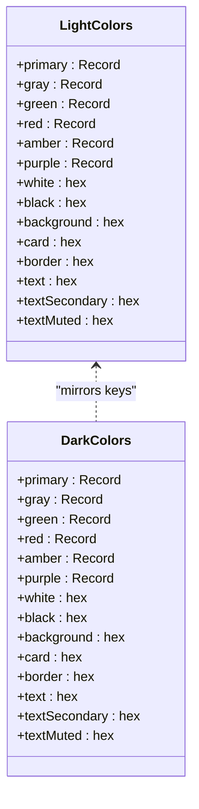
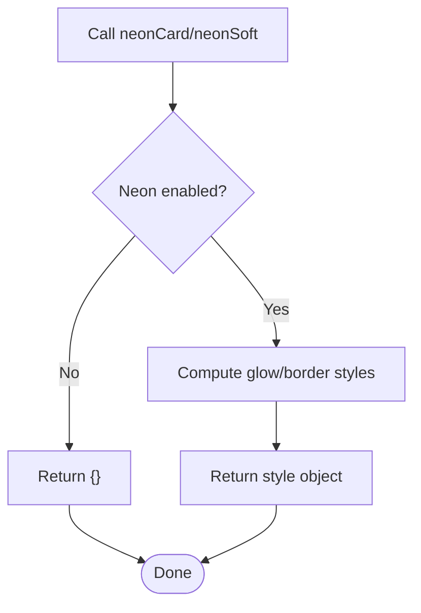
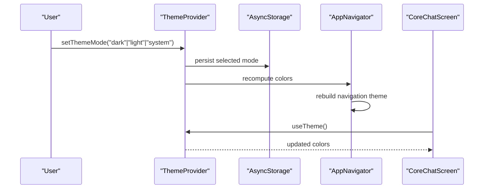
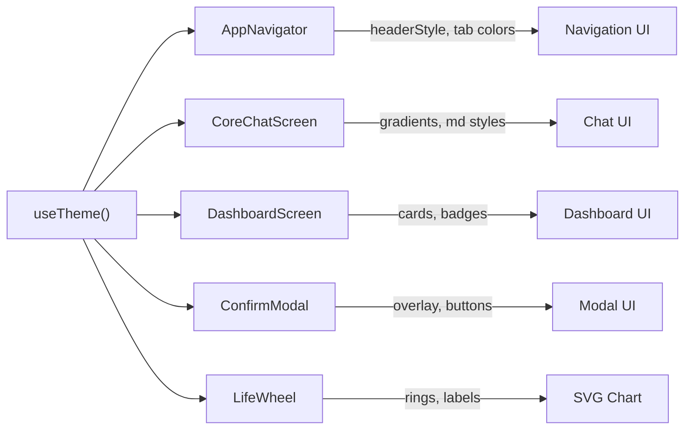
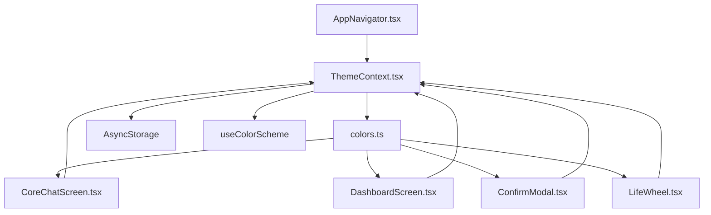

# Theme & Design System

<cite>
**Referenced Files in This Document**
- [ThemeContext.tsx](file://mobile/src/contexts/ThemeContext.tsx)
- [colors.ts](file://mobile/src/constants/colors.ts)
- [neonStyles.ts](file://mobile/src/constants/neonStyles.ts)
- [dimensions.ts](file://mobile/src/constants/dimensions.ts)
- [App.tsx](file://mobile/App.tsx)
- [AppNavigator.tsx](file://mobile/src/navigation/AppNavigator.tsx)
- [CoreChatScreen.tsx](file://mobile/src/screens/CoreChatScreen.tsx)
- [DashboardScreen.tsx](file://mobile/src/screens/DashboardScreen.tsx)
- [ConfirmModal.tsx](file://mobile/src/components/ConfirmModal.tsx)
- [LifeWheel.tsx](file://mobile/src/components/LifeWheel.tsx)
- [UserAvatar.tsx](file://mobile/src/components/UserAvatar.tsx)
</cite>

## Table of Contents
1. [Introduction](#introduction)
2. [Project Structure](#project-structure)
3. [Core Components](#core-components)
4. [Architecture Overview](#architecture-overview)
5. [Detailed Component Analysis](#detailed-component-analysis)
6. [Dependency Analysis](#dependency-analysis)
7. [Performance Considerations](#performance-considerations)
8. [Troubleshooting Guide](#troubleshooting-guide)
9. [Conclusion](#conclusion)
10. [Appendices](#appendices)

## Introduction
This document describes the mobile theme and design system used by the 4Ever application. It explains how the ThemeContext provider manages light/dark mode, how design tokens (colors, typography, spacing, border radii) are defined and consumed, and how theme-aware components are styled. It also documents the current state of neon-style effects, brand-aligned color palettes, and accessibility considerations.

## Project Structure
The theme and design system spans three main areas:
- Theme provider and hooks: ThemeContext
- Design tokens: colors, typography, spacing, border radii, and life-dimension metadata
- Theme-aware components and screens: navigation, chat, dashboards, modals, and charts

**Diagram sources**
- [ThemeContext.tsx:1-61](file://mobile/src/contexts/ThemeContext.tsx#L1-L61)
- [colors.ts:1-142](file://mobile/src/constants/colors.ts#L1-L142)
- [neonStyles.ts:1-38](file://mobile/src/constants/neonStyles.ts#L1-L38)
- [dimensions.ts:1-51](file://mobile/src/constants/dimensions.ts#L1-L51)
- [App.tsx:1-38](file://mobile/App.tsx#L1-L38)
- [AppNavigator.tsx:1-282](file://mobile/src/navigation/AppNavigator.tsx#L1-L282)
- [CoreChatScreen.tsx:1-1052](file://mobile/src/screens/CoreChatScreen.tsx#L1-L1052)
- [DashboardScreen.tsx:1-763](file://mobile/src/screens/DashboardScreen.tsx#L1-L763)
- [ConfirmModal.tsx:1-61](file://mobile/src/components/ConfirmModal.tsx#L1-L61)
- [LifeWheel.tsx:1-159](file://mobile/src/components/LifeWheel.tsx#L1-L159)
- [UserAvatar.tsx:1-82](file://mobile/src/components/UserAvatar.tsx#L1-L82)

**Section sources**
- [ThemeContext.tsx:1-61](file://mobile/src/contexts/ThemeContext.tsx#L1-L61)
- [colors.ts:1-142](file://mobile/src/constants/colors.ts#L1-L142)
- [neonStyles.ts:1-38](file://mobile/src/constants/neonStyles.ts#L1-L38)
- [dimensions.ts:1-51](file://mobile/src/constants/dimensions.ts#L1-L51)
- [App.tsx:1-38](file://mobile/App.tsx#L1-L38)
- [AppNavigator.tsx:1-282](file://mobile/src/navigation/AppNavigator.tsx#L1-L282)
- [CoreChatScreen.tsx:1-1052](file://mobile/src/screens/CoreChatScreen.tsx#L1-L1052)
- [DashboardScreen.tsx:1-763](file://mobile/src/screens/DashboardScreen.tsx#L1-L763)
- [ConfirmModal.tsx:1-61](file://mobile/src/components/ConfirmModal.tsx#L1-L61)
- [LifeWheel.tsx:1-159](file://mobile/src/components/LifeWheel.tsx#L1-L159)
- [UserAvatar.tsx:1-82](file://mobile/src/components/UserAvatar.tsx#L1-L82)

## Core Components
- ThemeContext provider: centralizes theme mode selection, persists preferences, computes derived colors, and exposes a hook for consumers.
- Design tokens: color palettes (light/dark), semantic tokens (background/card/border/text), typography scales, spacing scale, and border radii.
- Neon styling helpers: legacy helpers for “neon” borders and glows; currently disabled globally except in Core Chat.
- Life-dimension constants: taxonomy, labels, colors, and emojis for the Life Wheel visualization.
- Theme-aware components: navigation theme, chat screen visuals, dashboard cards, modals, and SVG-based charts.

**Section sources**
- [ThemeContext.tsx:1-61](file://mobile/src/contexts/ThemeContext.tsx#L1-L61)
- [colors.ts:1-142](file://mobile/src/constants/colors.ts#L1-L142)
- [neonStyles.ts:1-38](file://mobile/src/constants/neonStyles.ts#L1-L38)
- [dimensions.ts:1-51](file://mobile/src/constants/dimensions.ts#L1-L51)

## Architecture Overview
The theme system is a layered pattern:
- Provider layer: ThemeProvider reads system preference, loads persisted theme mode, and exposes colors and mode.
- Consumer layer: Components and screens consume useTheme() to style views, lists, gradients, and interactive elements.
- Navigation layer: AppNavigator adapts react-navigation themes to the current token palette.
- Token layer: colors.ts defines color families and semantic roles; dimensions.ts defines life-dimension semantics; neonStyles.ts defines optional neon treatments.

**Diagram sources**
- [App.tsx:1-38](file://mobile/App.tsx#L1-L38)
- [ThemeContext.tsx:1-61](file://mobile/src/contexts/ThemeContext.tsx#L1-L61)
- [AppNavigator.tsx:1-282](file://mobile/src/navigation/AppNavigator.tsx#L1-L282)
- [CoreChatScreen.tsx:1-1052](file://mobile/src/screens/CoreChatScreen.tsx#L1-L1052)
- [colors.ts:1-142](file://mobile/src/constants/colors.ts#L1-L142)

## Detailed Component Analysis

### ThemeContext Provider
- Responsibilities:
  - Reads system color scheme and persisted theme mode.
  - Persists user-selected theme mode to storage.
  - Computes derived isDark and colors from light/dark palettes.
  - Exposes useTheme() hook for consumers.
- Persistence: Uses async storage with a dedicated key to remember user preference.
- Mode resolution: Supports system, light, and dark modes; defaults to system.

**Diagram sources**
- [ThemeContext.tsx:24-56](file://mobile/src/contexts/ThemeContext.tsx#L24-L56)

**Section sources**
- [ThemeContext.tsx:1-61](file://mobile/src/contexts/ThemeContext.tsx#L1-L61)

### Color Palette Management
- Light and dark palettes share the same keys for consistency.
- Semantic tokens:
  - Primary family for accents and highlights.
  - Gray family for backgrounds, borders, and text variants.
  - Additional named hues (green, red, amber, purple) for status and emphasis.
  - Semantic roles: background, card, border, text, textSecondary, textMuted.
- Legacy export: a static Colors object remains for backward compatibility.

**Diagram sources**
- [colors.ts:4-109](file://mobile/src/constants/colors.ts#L4-L109)

**Section sources**
- [colors.ts:1-142](file://mobile/src/constants/colors.ts#L1-L142)

### Typography System and Spacing Conventions
- Typography scale: xs, sm, base, lg, xl, 2xl, 3xl.
- Spacing scale: xs, sm, md, lg, xl, 2xl, 3xl, 4xl.
- Border radii: sm, md, lg, xl, full.
- Consumers reference these tokens for consistent sizing and rhythm.

**Section sources**
- [colors.ts:114-141](file://mobile/src/constants/colors.ts#L114-L141)

### Neon-Style Design Elements
- Neon helpers: neonCard and neonSoft were designed to add borders and glows around components.
- Current state: Both helpers are no-ops and return empty style objects. They remain for compatibility; neon effects are only applied directly inside Core Chat.
- Neon palette: Hue-to-hex mapping is preserved for future use.

**Diagram sources**
- [neonStyles.ts:17-35](file://mobile/src/constants/neonStyles.ts#L17-L35)

**Section sources**
- [neonStyles.ts:1-38](file://mobile/src/constants/neonStyles.ts#L1-L38)
- [CoreChatScreen.tsx:10-13](file://mobile/src/screens/CoreChatScreen.tsx#L10-L13)

### Dark/Light Mode Switching
- Theme mode is persisted and restored on app launch.
- The provider recomputes isDark and colors whenever mode or system scheme changes.
- Navigation theme is adapted to match the current palette.

**Diagram sources**
- [ThemeContext.tsx:29-41](file://mobile/src/contexts/ThemeContext.tsx#L29-L41)
- [AppNavigator.tsx:255-281](file://mobile/src/navigation/AppNavigator.tsx#L255-L281)
- [CoreChatScreen.tsx:154-157](file://mobile/src/screens/CoreChatScreen.tsx#L154-L157)

**Section sources**
- [ThemeContext.tsx:22-48](file://mobile/src/contexts/ThemeContext.tsx#L22-L48)
- [AppNavigator.tsx:255-281](file://mobile/src/navigation/AppNavigator.tsx#L255-L281)

### Theme-Aware Component Styling
- Navigation: Header styles, tab bar colors, and badges adapt to current theme.
- Chat: Gradients, message bubbles, and markdown styles use theme tokens.
- Dashboard: Cards, suggestions, and thought-type badges adapt to light/dark.
- Modals: Overlay, background, and button colors adapt to theme.
- Charts: SVG-based Life Wheel renders rings, labels, and polygons using theme colors.

**Diagram sources**
- [AppNavigator.tsx:57-145](file://mobile/src/navigation/AppNavigator.tsx#L57-L145)
- [CoreChatScreen.tsx:154-157](file://mobile/src/screens/CoreChatScreen.tsx#L154-L157)
- [DashboardScreen.tsx:67-70](file://mobile/src/screens/DashboardScreen.tsx#L67-L70)
- [ConfirmModal.tsx:21-22](file://mobile/src/components/ConfirmModal.tsx#L21-L22)
- [LifeWheel.tsx:35](file://mobile/src/components/LifeWheel.tsx#L35)

**Section sources**
- [AppNavigator.tsx:57-145](file://mobile/src/navigation/AppNavigator.tsx#L57-L145)
- [CoreChatScreen.tsx:154-157](file://mobile/src/screens/CoreChatScreen.tsx#L154-L157)
- [DashboardScreen.tsx:67-70](file://mobile/src/screens/DashboardScreen.tsx#L67-L70)
- [ConfirmModal.tsx:21-22](file://mobile/src/components/ConfirmModal.tsx#L21-L22)
- [LifeWheel.tsx:35](file://mobile/src/components/LifeWheel.tsx#L35)

### Design Token Usage Examples
- Core Chat:
  - Uses theme colors for gradients, borders, and markdown styles.
  - References tokens for spacing and font sizes.
- Dashboard:
  - Adapts thought-type badges to light/dark with separate color maps.
  - Uses tokens for paddings and typography.
- Confirm Modal:
  - Applies card/background and text tokens to overlay and buttons.
- Life Wheel:
  - Renders rings, spokes, labels, and dots using theme colors.
- User Avatar:
  - Generates deterministic avatar colors based on identity; complements theme by avoiding jarring contrast.

**Section sources**
- [CoreChatScreen.tsx:10-13](file://mobile/src/screens/CoreChatScreen.tsx#L10-L13)
- [CoreChatScreen.tsx:126-146](file://mobile/src/screens/CoreChatScreen.tsx#L126-L146)
- [DashboardScreen.tsx:40-65](file://mobile/src/screens/DashboardScreen.tsx#L40-L65)
- [ConfirmModal.tsx:48-60](file://mobile/src/components/ConfirmModal.tsx#L48-L60)
- [LifeWheel.tsx:68-147](file://mobile/src/components/LifeWheel.tsx#L68-L147)
- [UserAvatar.tsx:5-16](file://mobile/src/components/UserAvatar.tsx#L5-L16)

### Responsive Design Patterns
- The design system relies on tokens for consistent spacing and typography across devices.
- There are no explicit density or breakpoint tokens in the current codebase; responsiveness is handled by:
  - Using tokens for paddings and gaps.
  - Leveraging platform-specific behaviors (e.g., keyboard avoidance) in screens.
  - SVG-based charts (Life Wheel) that scale with provided size props.

**Section sources**
- [colors.ts:114-141](file://mobile/src/constants/colors.ts#L114-L141)
- [LifeWheel.tsx:32](file://mobile/src/components/LifeWheel.tsx#L32)

### Brand Guideline Adherence
- Sky-blue primary palette aligns with the web app’s branding.
- Semantic tokens (background, card, border, text) maintain consistent hierarchy.
- Life-dimension colors and labels are standardized for the Life Wheel.

**Section sources**
- [colors.ts:4-61](file://mobile/src/constants/colors.ts#L4-L61)
- [dimensions.ts:16-50](file://mobile/src/constants/dimensions.ts#L16-L50)

### Accessibility Considerations
- Contrast: DarkColors invert text and background roles to ensure readability in dark mode.
- Semantic roles: text, textSecondary, and textMuted provide sufficient contrast ratios for secondary and muted content.
- Navigation: react-navigation themes are rebuilt to reflect current text and border colors.
- Status colors: red, amber, green are used for status and emphasis; ensure sufficient contrast against backgrounds.

**Section sources**
- [colors.ts:63-109](file://mobile/src/constants/colors.ts#L63-L109)
- [AppNavigator.tsx:260-266](file://mobile/src/navigation/AppNavigator.tsx#L260-L266)

## Dependency Analysis
ThemeContext is the central dependency for all theme-aware components. It depends on:
- System color scheme detection.
- Async storage for persistence.
- Token definitions for colors and semantic roles.

**Diagram sources**
- [ThemeContext.tsx:1-61](file://mobile/src/contexts/ThemeContext.tsx#L1-L61)
- [colors.ts:1-142](file://mobile/src/constants/colors.ts#L1-L142)
- [AppNavigator.tsx:1-282](file://mobile/src/navigation/AppNavigator.tsx#L1-L282)
- [CoreChatScreen.tsx:1-1052](file://mobile/src/screens/CoreChatScreen.tsx#L1-L1052)
- [DashboardScreen.tsx:1-763](file://mobile/src/screens/DashboardScreen.tsx#L1-L763)
- [ConfirmModal.tsx:1-61](file://mobile/src/components/ConfirmModal.tsx#L1-L61)
- [LifeWheel.tsx:1-159](file://mobile/src/components/LifeWheel.tsx#L1-L159)

**Section sources**
- [ThemeContext.tsx:1-61](file://mobile/src/contexts/ThemeContext.tsx#L1-L61)
- [colors.ts:1-142](file://mobile/src/constants/colors.ts#L1-L142)
- [AppNavigator.tsx:1-282](file://mobile/src/navigation/AppNavigator.tsx#L1-L282)
- [CoreChatScreen.tsx:1-1052](file://mobile/src/screens/CoreChatScreen.tsx#L1-L1052)
- [DashboardScreen.tsx:1-763](file://mobile/src/screens/DashboardScreen.tsx#L1-L763)
- [ConfirmModal.tsx:1-61](file://mobile/src/components/ConfirmModal.tsx#L1-L61)
- [LifeWheel.tsx:1-159](file://mobile/src/components/LifeWheel.tsx#L1-L159)

## Performance Considerations
- Memoization: ThemeContext memoizes computed values to avoid unnecessary re-renders.
- Persistence: Async storage reads/writes occur once on startup and on mode changes.
- Navigation theme: Rebuilds only when theme changes, minimizing layout thrash.
- SVG rendering: LifeWheel recalculates geometry on each render; keep size props stable to reduce work.

[No sources needed since this section provides general guidance]

## Troubleshooting Guide
- Theme does not persist across app restarts:
  - Verify AsyncStorage key and write permissions.
  - Ensure ThemeProvider is wrapping the app root.
- Theme switches unexpectedly on system change:
  - Confirm themeMode is set to “system”.
- Navigation colors not updating:
  - Ensure AppNavigator rebuilds its theme when colors change.
- Neon effects not visible:
  - Confirm neon helpers are not disabled globally; they are currently no-ops.

**Section sources**
- [ThemeContext.tsx:22-41](file://mobile/src/contexts/ThemeContext.tsx#L22-L41)
- [AppNavigator.tsx:255-281](file://mobile/src/navigation/AppNavigator.tsx#L255-L281)
- [neonStyles.ts:17-35](file://mobile/src/constants/neonStyles.ts#L17-L35)

## Conclusion
The mobile theme and design system centers on a robust ThemeContext provider and a cohesive set of design tokens. Light and dark palettes are aligned with brand guidelines, and components consistently consume theme tokens for colors, typography, spacing, and borders. While neon effects are currently disabled globally, the infrastructure remains for future enhancements. Navigation, chat, dashboards, and charts all benefit from a unified theme, ensuring design consistency and improved accessibility across modes.

[No sources needed since this section summarizes without analyzing specific files]

## Appendices

### Design Token Reference
- Color families: primary, gray, green, red, amber, purple
- Semantic roles: background, card, border, text, textSecondary, textMuted
- Typography scale: xs, sm, base, lg, xl, 2xl, 3xl
- Spacing scale: xs, sm, md, lg, xl, 2xl, 3xl, 4xl
- Border radii: sm, md, lg, xl, full
- Life dimensions: health, financial, career, intellectual, relationships, purpose

**Section sources**
- [colors.ts:4-141](file://mobile/src/constants/colors.ts#L4-L141)
- [dimensions.ts:5-50](file://mobile/src/constants/dimensions.ts#L5-L50)