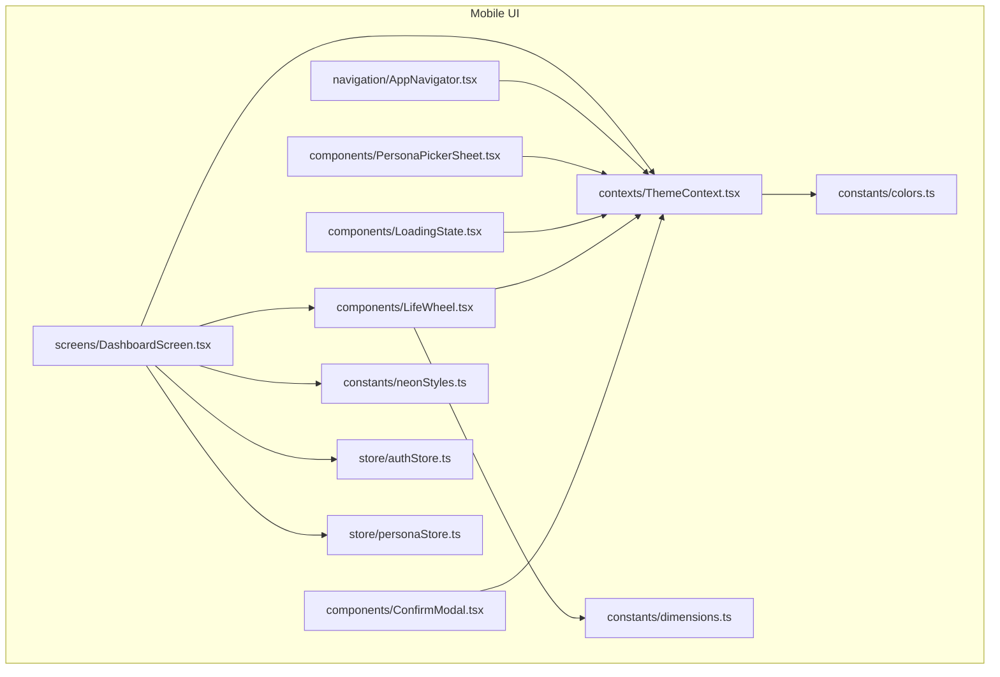
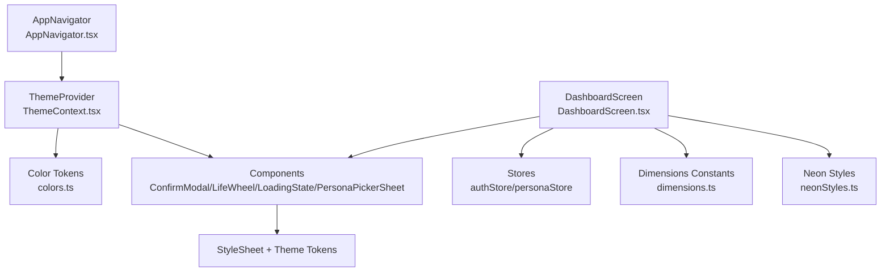
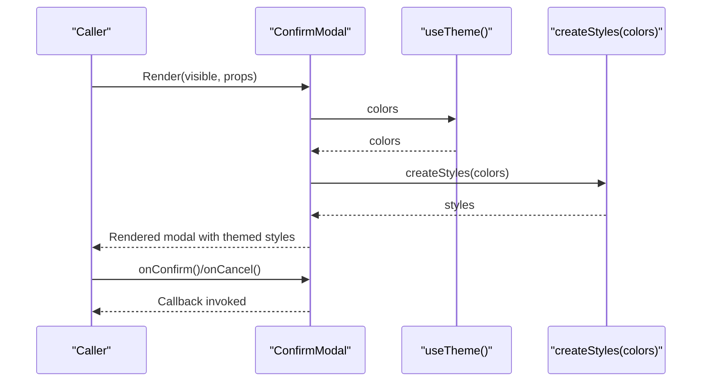
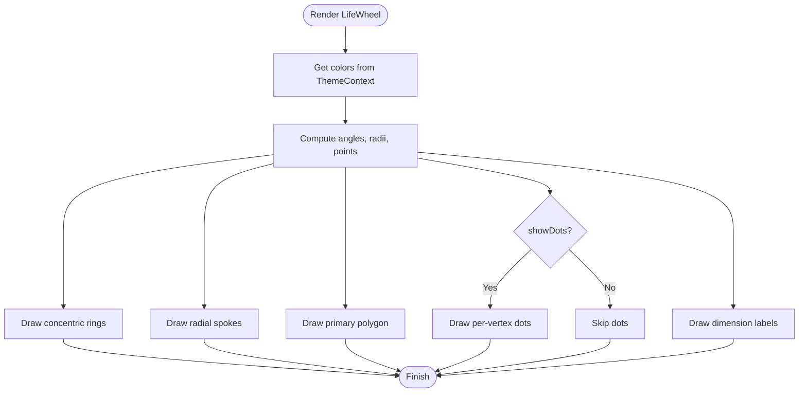
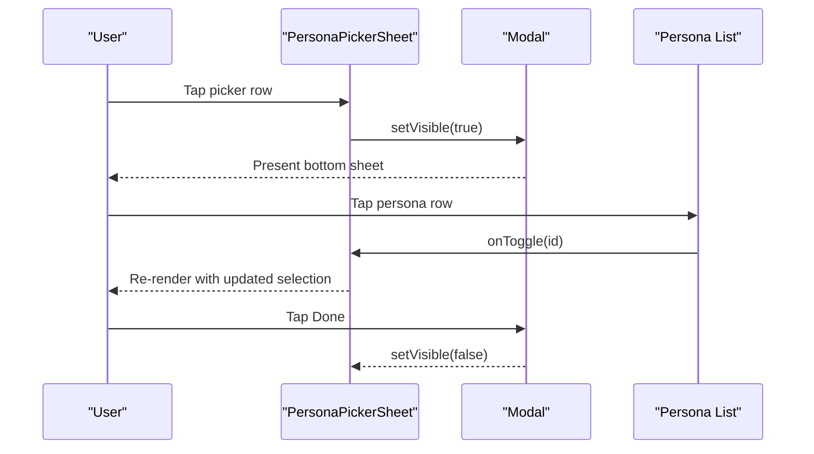
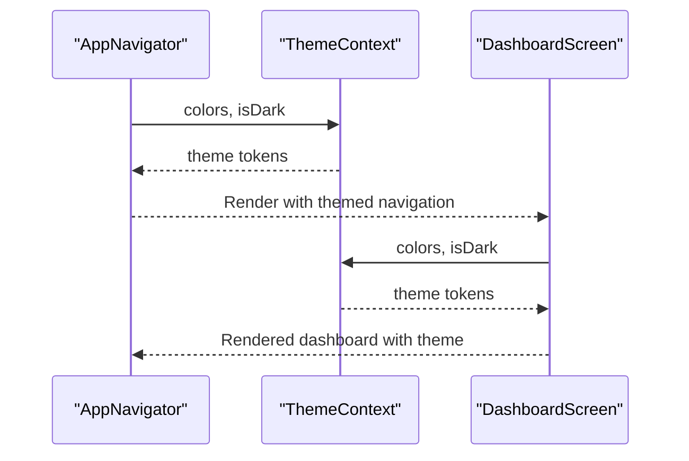
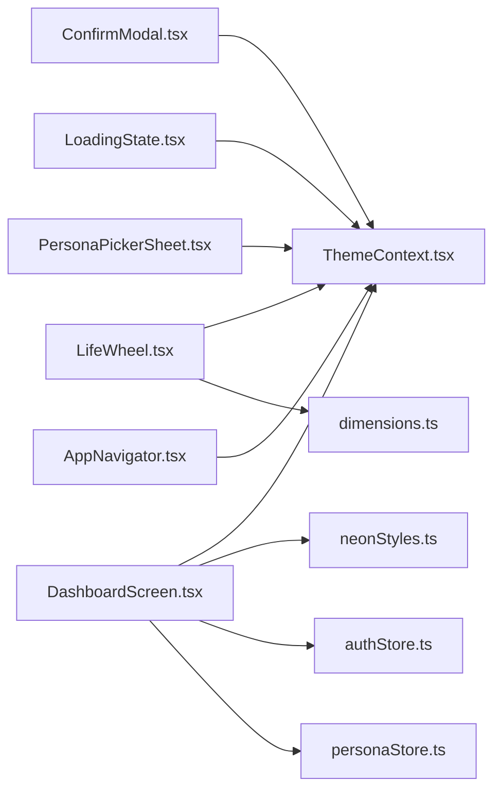

# UI Components

<cite>
**Referenced Files in This Document**
- [ConfirmModal.tsx](file://mobile/src/components/ConfirmModal.tsx)
- [LifeWheel.tsx](file://mobile/src/components/LifeWheel.tsx)
- [LoadingState.tsx](file://mobile/src/components/LoadingState.tsx)
- [PersonaPickerSheet.tsx](file://mobile/src/components/PersonaPickerSheet.tsx)
- [ThemeContext.tsx](file://mobile/src/contexts/ThemeContext.tsx)
- [colors.ts](file://mobile/src/constants/colors.ts)
- [dimensions.ts](file://mobile/src/constants/dimensions.ts)
- [neonStyles.ts](file://mobile/src/constants/neonStyles.ts)
- [AppNavigator.tsx](file://mobile/src/navigation/AppNavigator.tsx)
- [DashboardScreen.tsx](file://mobile/src/screens/DashboardScreen.tsx)
- [authStore.ts](file://mobile/src/store/authStore.ts)
- [personaStore.ts](file://mobile/src/store/personaStore.ts)
</cite>

## Table of Contents
1. [Introduction](#introduction)
2. [Project Structure](#project-structure)
3. [Core Components](#core-components)
4. [Architecture Overview](#architecture-overview)
5. [Detailed Component Analysis](#detailed-component-analysis)
6. [Dependency Analysis](#dependency-analysis)
7. [Performance Considerations](#performance-considerations)
8. [Troubleshooting Guide](#troubleshooting-guide)
9. [Conclusion](#conclusion)
10. [Appendices](#appendices)

## Introduction
This document describes the mobile UI components and design system used in the project’s mobile application. It focuses on reusable components such as ConfirmModal, LifeWheel, LoadingState, and PersonaPickerSheet, detailing their props, styling, composition patterns, and integration with the theme system. It also covers mobile-specific UI patterns (touch interactions, gestures, responsive layout), customization approaches, accessibility considerations, testing strategies, performance optimizations, and best practices for maintaining a scalable component library.

## Project Structure
The mobile UI lives under mobile/src and is organized by concerns:
- components: Reusable UI primitives and composite widgets
- constants: Design tokens (colors, spacing, typography)
- contexts: Global providers (theme, stores)
- navigation: Navigation containers and themes
- screens: Feature screens that compose components
- store: Zustand-backed state for auth and domain entities



**Diagram sources**
- [ConfirmModal.tsx:1-61](file://mobile/src/components/ConfirmModal.tsx#L1-L61)
- [LifeWheel.tsx:1-159](file://mobile/src/components/LifeWheel.tsx#L1-L159)
- [LoadingState.tsx:1-37](file://mobile/src/components/LoadingState.tsx#L1-L37)
- [PersonaPickerSheet.tsx:1-263](file://mobile/src/components/PersonaPickerSheet.tsx#L1-L263)
- [ThemeContext.tsx:1-61](file://mobile/src/contexts/ThemeContext.tsx#L1-L61)
- [colors.ts:1-142](file://mobile/src/constants/colors.ts#L1-L142)
- [dimensions.ts:1-51](file://mobile/src/constants/dimensions.ts#L1-L51)
- [neonStyles.ts:1-38](file://mobile/src/constants/neonStyles.ts#L1-L38)
- [AppNavigator.tsx:1-282](file://mobile/src/navigation/AppNavigator.tsx#L1-L282)
- [DashboardScreen.tsx:1-763](file://mobile/src/screens/DashboardScreen.tsx#L1-L763)
- [authStore.ts:1-75](file://mobile/src/store/authStore.ts#L1-L75)
- [personaStore.ts:1-23](file://mobile/src/store/personaStore.ts#L1-L23)

**Section sources**
- [ThemeContext.tsx:1-61](file://mobile/src/contexts/ThemeContext.tsx#L1-L61)
- [colors.ts:1-142](file://mobile/src/constants/colors.ts#L1-L142)
- [dimensions.ts:1-51](file://mobile/src/constants/dimensions.ts#L1-L51)
- [neonStyles.ts:1-38](file://mobile/src/constants/neonStyles.ts#L1-L38)
- [AppNavigator.tsx:1-282](file://mobile/src/navigation/AppNavigator.tsx#L1-L282)
- [DashboardScreen.tsx:1-763](file://mobile/src/screens/DashboardScreen.tsx#L1-L763)
- [authStore.ts:1-75](file://mobile/src/store/authStore.ts#L1-L75)
- [personaStore.ts:1-23](file://mobile/src/store/personaStore.ts#L1-L23)

## Core Components
This section documents the four primary components requested, including their props, styling, composition patterns, and theme integration.

- ConfirmModal
  - Purpose: Confirmation dialog with optional destructive action.
  - Props: visible, title, message, confirmText, cancelText, onConfirm, onCancel, destructive.
  - Styling: Uses theme colors for backgrounds, borders, and text; destructive variant alters button color.
  - Composition: Modal overlay with centered card and two buttons; styled via StyleSheet with theme-aware tokens.
  - Accessibility: Buttons are touch targets; consider adding accessibility labels and roles if extended.

- LifeWheel
  - Purpose: Six-dimension radar visualization for life insights.
  - Props: scores (required), secondaryScores (optional), size (default 260), showDots (default true).
  - Styling: SVG-based; draws concentric rings, radial spokes, filled polygons, and optional dots; theme colors for strokes/fills.
  - Composition: Computes geometry (angles, radii, points) and renders SVG primitives; integrates dimension metadata from constants.
  - Accessibility: Labels are rendered as SVG text; ensure sufficient contrast and consider screen reader announcements.

- LoadingState
  - Purpose: Loading and empty states for lists and views.
  - Variants:
    - LoadingScreen: Centered spinner with optional message.
    - EmptyState: Icon, title, and optional subtitle.
  - Styling: Uses theme background and text colors; consistent spacing and typography tokens.
  - Composition: Stateless functional components returning View/Text/ActivityIndicator; styled via StyleSheet.

- PersonaPickerSheet
  - Purpose: Bottom sheet selection for personas with avatar stacking and multi-select toggle.
  - Props: personas, selectedIds, onToggle, label.
  - Styling: Overlay, sheet, handle bar, item rows, avatars, checkboxes; responsive bottom sheet with scrollable list.
  - Composition: Modal with animated slide; avatar stack with overlap; selectable items with checkmarks; counts and hints.
  - Accessibility: Touch targets sized appropriately; consider keyboard navigation and screen reader support for list items.

**Section sources**
- [ConfirmModal.tsx:6-46](file://mobile/src/components/ConfirmModal.tsx#L6-L46)
- [LifeWheel.tsx:12-34](file://mobile/src/components/LifeWheel.tsx#L12-L34)
- [LoadingState.tsx:6-27](file://mobile/src/components/LoadingState.tsx#L6-L27)
- [PersonaPickerSheet.tsx:31-160](file://mobile/src/components/PersonaPickerSheet.tsx#L31-L160)

## Architecture Overview
The mobile UI relies on a theme provider that supplies color tokens and theme mode (light/dark/system). Components consume theme via a hook and apply design tokens for colors, spacing, and typography. Navigation adapts to theme colors, and screens compose multiple components while leveraging stores for data/state.



**Diagram sources**
- [ThemeContext.tsx:24-56](file://mobile/src/contexts/ThemeContext.tsx#L24-L56)
- [colors.ts:1-142](file://mobile/src/constants/colors.ts#L1-L142)
- [ConfirmModal.tsx:48-60](file://mobile/src/components/ConfirmModal.tsx#L48-L60)
- [LifeWheel.tsx:153-158](file://mobile/src/components/LifeWheel.tsx#L153-L158)
- [LoadingState.tsx:29-36](file://mobile/src/components/LoadingState.tsx#L29-L36)
- [PersonaPickerSheet.tsx:162-262](file://mobile/src/components/PersonaPickerSheet.tsx#L162-L262)
- [AppNavigator.tsx:255-281](file://mobile/src/navigation/AppNavigator.tsx#L255-L281)
- [DashboardScreen.tsx:67-84](file://mobile/src/screens/DashboardScreen.tsx#L67-L84)
- [authStore.ts:1-75](file://mobile/src/store/authStore.ts#L1-L75)
- [personaStore.ts:1-23](file://mobile/src/store/personaStore.ts#L1-L23)
- [dimensions.ts:1-51](file://mobile/src/constants/dimensions.ts#L1-L51)
- [neonStyles.ts:1-38](file://mobile/src/constants/neonStyles.ts#L1-L38)

## Detailed Component Analysis

### ConfirmModal
- Props interface and defaults:
  - visible: boolean
  - title: string
  - message: string
  - confirmText: string (default "Confirm")
  - cancelText: string (default "Cancel")
  - onConfirm: () => void
  - onCancel: () => void
  - destructive: boolean (default false)
- Styling and theme integration:
  - Uses theme colors for modal card, text, borders, and destructive button.
  - Responsive width with max-width constraint.
- Composition pattern:
  - Modal overlay with centered card and two horizontal buttons.
  - Conditional destructive styling via style arrays.
- Accessibility and UX:
  - Ensure labels for buttons; consider adding accessibilityRole and accessibilityLabel.
  - Provide sufficient touch target sizes.



**Diagram sources**
- [ConfirmModal.tsx:17-46](file://mobile/src/components/ConfirmModal.tsx#L17-L46)
- [ThemeContext.tsx:58-60](file://mobile/src/contexts/ThemeContext.tsx#L58-L60)
- [colors.ts:1-142](file://mobile/src/constants/colors.ts#L1-L142)

**Section sources**
- [ConfirmModal.tsx:6-46](file://mobile/src/components/ConfirmModal.tsx#L6-L46)

### LifeWheel
- Props and behavior:
  - scores: Partial<Record<LifeDimension, number>>
  - secondaryScores: Partial<Record<LifeDimension, number>> (optional)
  - size: number (default 260)
  - showDots: boolean (default true)
- Geometry and rendering:
  - Computes angles, points, and labels for six vertices.
  - Draws concentric rings and radial spokes; fills polygon with theme colors.
  - Optionally renders secondary dashed outline and dot markers.
- Integration:
  - Uses dimension constants for labels, colors, and taxonomy.
  - Consumes theme for strokes, fills, and text.
- Accessibility:
  - Labels are SVG text; ensure contrast and consider aria-labels for screen readers.



**Diagram sources**
- [LifeWheel.tsx:29-151](file://mobile/src/components/LifeWheel.tsx#L29-L151)
- [dimensions.ts:1-51](file://mobile/src/constants/dimensions.ts#L1-L51)
- [ThemeContext.tsx:58-60](file://mobile/src/contexts/ThemeContext.tsx#L58-L60)

**Section sources**
- [LifeWheel.tsx:12-151](file://mobile/src/components/LifeWheel.tsx#L12-L151)
- [dimensions.ts:1-51](file://mobile/src/constants/dimensions.ts#L1-L51)

### LoadingState
- LoadingScreen:
  - Props: message?: string
  - Behavior: Centered ActivityIndicator with theme color; optional message text.
- EmptyState:
  - Props: icon?: string, title: string, subtitle?: string
  - Behavior: Centered icon/title/subtitle with theme-aware colors and spacing.
- Styling:
  - Uses theme background and text colors; consistent spacing and font sizes.

```mermaid
classDiagram
class LoadingScreen {
+props : { message? : string }
+render() : JSX.Element
}
class EmptyState {
+props : { icon? : string; title : string; subtitle? : string }
+render() : JSX.Element
}
class ThemeContext {
+colors : ColorTokens
+isDark : boolean
}
LoadingScreen --> ThemeContext : "consumes"
EmptyState --> ThemeContext : "consumes"
```

**Diagram sources**
- [LoadingState.tsx:6-27](file://mobile/src/components/LoadingState.tsx#L6-L27)
- [ThemeContext.tsx:58-60](file://mobile/src/contexts/ThemeContext.tsx#L58-L60)

**Section sources**
- [LoadingState.tsx:6-36](file://mobile/src/components/LoadingState.tsx#L6-L36)

### PersonaPickerSheet
- Props and behavior:
  - personas: Persona[]
  - selectedIds: string[]
  - onToggle: (id: string) => void
  - label?: string (default "Analyze with Personas")
- UI composition:
  - Top row: label, avatar stack of selected personas, count, edit hint, edit button.
  - Bottom sheet: overlay, handle bar, header, selected count, scrollable list of personas with avatars, names, descriptions, and checkboxes.
- Styling:
  - Uses theme colors for backgrounds, borders, text, and accents.
  - Avatar stack with overlap and “+N” overflow indicator.
- Interaction model:
  - Tap row opens bottom sheet; tapping persona toggles selection; Done closes sheet.



**Diagram sources**
- [PersonaPickerSheet.tsx:38-160](file://mobile/src/components/PersonaPickerSheet.tsx#L38-L160)

**Section sources**
- [PersonaPickerSheet.tsx:31-160](file://mobile/src/components/PersonaPickerSheet.tsx#L31-L160)

### Theme System and Integration
- ThemeProvider:
  - Manages themeMode ("system" | "light" | "dark"), persists preference, computes isDark, and exposes colors.
  - Uses useColorScheme and AsyncStorage for persistence.
- ThemeContext:
  - Provides colors, isDark, themeMode, and setThemeMode via a hook.
- Color tokens:
  - LightColors and DarkColors define semantic tokens (background, card, border, text, primary, gray, etc.).
  - Spacing, FontSize, and BorderRadius tokens unify design scales.
- Neon styles:
  - Helpers exist but are currently no-ops; screens can spread them without visual effect.

```mermaid
classDiagram
class ThemeProvider {
+themeMode : ThemeMode
+isDark : boolean
+colors : ColorTokens
+setThemeMode(mode)
}
class ThemeContext {
+useTheme() : { colors, isDark, themeMode, setThemeMode }
}
class ColorTokens {
+background : string
+card : string
+border : string
+text : string
+primary : Record<number,string>
+gray : Record<number,string>
+...
}
ThemeProvider --> ThemeContext : "provides"
ThemeContext --> ColorTokens : "returns"
```

**Diagram sources**
- [ThemeContext.tsx:24-56](file://mobile/src/contexts/ThemeContext.tsx#L24-L56)
- [colors.ts:4-109](file://mobile/src/constants/colors.ts#L4-L109)

**Section sources**
- [ThemeContext.tsx:1-61](file://mobile/src/contexts/ThemeContext.tsx#L1-L61)
- [colors.ts:1-142](file://mobile/src/constants/colors.ts#L1-L142)
- [neonStyles.ts:1-38](file://mobile/src/constants/neonStyles.ts#L1-L38)

### Navigation and Screen Integration
- AppNavigator:
  - Applies theme colors to navigation container (background, card, text, border, primary).
  - Defines stacks and tabs; integrates with theme for header/tab styling.
- DashboardScreen:
  - Composes LifeWheel, UserAvatar, and other UI elements.
  - Uses theme for gradients, shadows, and neon effects (currently no-op).
  - Integrates stores for auth and persona data.



**Diagram sources**
- [AppNavigator.tsx:255-281](file://mobile/src/navigation/AppNavigator.tsx#L255-L281)
- [DashboardScreen.tsx:67-84](file://mobile/src/screens/DashboardScreen.tsx#L67-L84)
- [ThemeContext.tsx:58-60](file://mobile/src/contexts/ThemeContext.tsx#L58-L60)

**Section sources**
- [AppNavigator.tsx:1-282](file://mobile/src/navigation/AppNavigator.tsx#L1-L282)
- [DashboardScreen.tsx:1-763](file://mobile/src/screens/DashboardScreen.tsx#L1-L763)

## Dependency Analysis
- Component-to-theme coupling:
  - All components depend on ThemeContext for colors and theme mode.
- Component-to-constants coupling:
  - LifeWheel depends on dimension constants for labels, colors, and taxonomy.
- Component-to-stores coupling:
  - Screens depend on authStore and personaStore for data/state.
- Navigation-to-theme coupling:
  - AppNavigator applies theme colors to navigation surfaces.



**Diagram sources**
- [ConfirmModal.tsx:1-61](file://mobile/src/components/ConfirmModal.tsx#L1-L61)
- [LifeWheel.tsx:1-159](file://mobile/src/components/LifeWheel.tsx#L1-L159)
- [LoadingState.tsx:1-37](file://mobile/src/components/LoadingState.tsx#L1-L37)
- [PersonaPickerSheet.tsx:1-263](file://mobile/src/components/PersonaPickerSheet.tsx#L1-L263)
- [ThemeContext.tsx:1-61](file://mobile/src/contexts/ThemeContext.tsx#L1-L61)
- [dimensions.ts:1-51](file://mobile/src/constants/dimensions.ts#L1-L51)
- [neonStyles.ts:1-38](file://mobile/src/constants/neonStyles.ts#L1-L38)
- [DashboardScreen.tsx:1-763](file://mobile/src/screens/DashboardScreen.tsx#L1-L763)
- [authStore.ts:1-75](file://mobile/src/store/authStore.ts#L1-L75)
- [personaStore.ts:1-23](file://mobile/src/store/personaStore.ts#L1-L23)
- [AppNavigator.tsx:1-282](file://mobile/src/navigation/AppNavigator.tsx#L1-L282)

**Section sources**
- [ThemeContext.tsx:1-61](file://mobile/src/contexts/ThemeContext.tsx#L1-L61)
- [colors.ts:1-142](file://mobile/src/constants/colors.ts#L1-L142)
- [dimensions.ts:1-51](file://mobile/src/constants/dimensions.ts#L1-L51)
- [neonStyles.ts:1-38](file://mobile/src/constants/neonStyles.ts#L1-L38)
- [AppNavigator.tsx:1-282](file://mobile/src/navigation/AppNavigator.tsx#L1-L282)
- [DashboardScreen.tsx:1-763](file://mobile/src/screens/DashboardScreen.tsx#L1-L763)
- [authStore.ts:1-75](file://mobile/src/store/authStore.ts#L1-L75)
- [personaStore.ts:1-23](file://mobile/src/store/personaStore.ts#L1-L23)

## Performance Considerations
- Rendering optimizations:
  - Use memoization for computed geometry (e.g., LifeWheel points) to avoid recomputation on theme changes.
  - Prefer StyleSheet.create for component-level styles; avoid inline styles in hot paths.
  - Minimize re-renders by passing stable callbacks and avoiding unnecessary prop churn.
- Touch and gesture responsiveness:
  - Ensure adequate hit areas for buttons and list items; avoid overlapping pressables.
  - For bottom sheets, leverage native animation types and avoid heavy work on gesture events.
- Data fetching and caching:
  - Screens can leverage caching and debounced refresh to reduce network calls and UI thrash.
- Theme switching:
  - ThemeContext computes derived values; keep expensive computations inside useMemo/useCallback.
- Images and avatars:
  - Use optimized avatar fallbacks and handle image load failures gracefully to prevent layout shifts.

## Troubleshooting Guide
- Theme not applied:
  - Verify ThemeProvider wraps the app and theme tokens are accessible via useTheme().
- Colors appear inverted:
  - Check themeMode persistence and system scheme; ensure isDark resolves as expected.
- Bottom sheet not dismissing:
  - Confirm visibility state updates and onRequestClose handler are wired.
- LifeWheel labels clipped:
  - Adjust margins and sizing; ensure SVG viewBox accommodates long labels.
- Navigation colors incorrect:
  - Ensure AppNavigator merges theme colors into navigation theme.

**Section sources**
- [ThemeContext.tsx:24-56](file://mobile/src/contexts/ThemeContext.tsx#L24-L56)
- [PersonaPickerSheet.tsx:103-157](file://mobile/src/components/PersonaPickerSheet.tsx#L103-L157)
- [AppNavigator.tsx:255-281](file://mobile/src/navigation/AppNavigator.tsx#L255-L281)

## Conclusion
The mobile UI system centers around a robust theme provider and a set of composable components that consistently apply design tokens. ConfirmModal, LifeWheel, LoadingState, and PersonaPickerSheet demonstrate clear prop interfaces, theme-aware styling, and integration with navigation and stores. By following the outlined patterns—memoization, stable callbacks, and disciplined theme usage—the component library remains maintainable, performant, and accessible across platforms.

## Appendices

### Mobile UI Patterns and Best Practices
- Touch interactions:
  - Use appropriate hit areas and activeOpacity for feedback.
  - Avoid overlapping pressables; prefer grouped layouts with clear boundaries.
- Gestures:
  - For bottom sheets, rely on native slide animations; defer heavy work to after gesture completion.
- Responsive design:
  - Use percentage-based widths and constrained max-widths; test on various device sizes.
- Accessibility:
  - Add accessibilityRole/accessibilityLabel to interactive elements; ensure sufficient color contrast.
- Testing:
  - Unit-test component props and theme application with mocked ThemeContext.
  - Snapshot test UI compositions; verify dark/light variants.
  - Integration-test navigation and store interactions.

### Component Customization and Styling Variations
- Theming:
  - Extend ColorTokens for brand-specific palettes; swap tokens in ThemeProvider.
  - Use tokens for spacing, typography, and corner radii to maintain consistency.
- Variants:
  - Introduce optional props (e.g., size, variant) to adjust component appearance.
  - Keep variant logic centralized in style factories to avoid duplication.
- Composition:
  - Compose components to build higher-order UI blocks; pass theme tokens explicitly to child components.