# System Architecture

<cite>
**Referenced Files in This Document**
- [backend/src/main.ts](file://backend/src/main.ts)
- [backend/src/app.module.ts](file://backend/src/app.module.ts)
- [backend/src/auth/auth.module.ts](file://backend/src/auth/auth.module.ts)
- [backend/src/messaging/messaging.module.ts](file://backend/src/messaging/messaging.module.ts)
- [backend/src/health/health.module.ts](file://backend/src/health/health.module.ts)
- [backend/src/prisma/prisma.module.ts](file://backend/src/prisma/prisma.module.ts)
- [backend/src/sentry.ts](file://backend/src/sentry.ts)
- [backend/package.json](file://backend/package.json)
- [backend/prisma/schema.prisma](file://backend/prisma/schema.prisma)
- [docker-compose.yml](file://docker-compose.yml)
- [backend/Dockerfile](file://backend/Dockerfile)
- [frontend/Dockerfile](file://frontend/Dockerfile)
- [frontend/package.json](file://frontend/package.json)
- [mobile/package.json](file://mobile/package.json)
- [mobile/App.tsx](file://mobile/App.tsx)
</cite>

## Table of Contents
1. [Introduction](#introduction)
2. [Project Structure](#project-structure)
3. [Core Components](#core-components)
4. [Architecture Overview](#architecture-overview)
5. [Detailed Component Analysis](#detailed-component-analysis)
6. [Dependency Analysis](#dependency-analysis)
7. [Performance Considerations](#performance-considerations)
8. [Troubleshooting Guide](#troubleshooting-guide)
9. [Conclusion](#conclusion)
10. [Appendices](#appendices)

## Introduction
This document describes the system architecture of the 4Ever platform. It is a three-tier system:
- Frontend: React web application
- Mobile: React Native application
- Backend: NestJS monolith with microservice-like module separation

The backend exposes a REST API and real-time capabilities powered by Socket.IO. It integrates:
- Prisma ORM with PostgreSQL and pgvector extension for vector similarity search
- LangGraph for agent orchestration
- Sentry for error tracking and monitoring
- Comprehensive logging via Pino

Cross-cutting concerns include authentication/authorization, rate limiting, security hardening, structured logging, and observability.

## Project Structure
The repository is organized into three primary applications plus supporting infrastructure:
- backend: NestJS monolith with modular domain features
- frontend: React web app served statically behind nginx
- mobile: React Native Expo app
- docker-compose.yml: Local development and deployment topology
- backend/prisma/schema.prisma: Database schema with vector extension

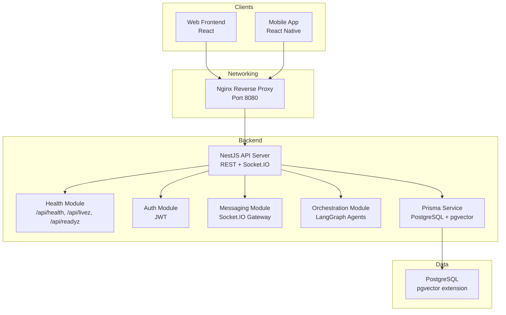

**Diagram sources**
- [docker-compose.yml](file://docker-compose.yml)
- [backend/src/app.module.ts](file://backend/src/app.module.ts)
- [backend/src/health/health.module.ts](file://backend/src/health/health.module.ts)
- [backend/src/auth/auth.module.ts](file://backend/src/auth/auth.module.ts)
- [backend/src/messaging/messaging.module.ts](file://backend/src/messaging/messaging.module.ts)
- [backend/src/prisma/prisma.module.ts](file://backend/src/prisma/prisma.module.ts)
- [backend/prisma/schema.prisma](file://backend/prisma/schema.prisma)

**Section sources**
- [docker-compose.yml](file://docker-compose.yml)
- [backend/src/app.module.ts](file://backend/src/app.module.ts)

## Core Components
- NestJS Application Bootstrap
  - Initializes Sentry, Pino logger, Helmet security headers, compression, body size limits, CORS, validation pipe, global filters, static uploads, health endpoints, and graceful shutdown hooks.
- AppModule
  - Aggregates all feature modules (Auth, Users, Thoughts, Personas, Orchestration, Insights, Planner, CheckIn, Actions, Reflections, KnowledgeBase, Relationships, Rituals, LifeEvents, Tensions, Dimensions, Messaging, KnowledgeWorker, Admin, Usage, Consent, Health, Support, AgentActions).
  - Provides structured logging (Pino), scheduling, throttling, and Prisma module.
- Authentication
  - JWT-based authentication with Passport, guarded by a JWT strategy and guard.
- Real-time Communication
  - Socket.IO integration via NestJS WebSockets for messaging and live updates.
- Data Persistence
  - Prisma ORM with PostgreSQL and pgvector for semantic search.
- Logging and Monitoring
  - Pino structured logging with redaction and correlation IDs; Sentry initialization and filtering.
- Containerization
  - Multi-stage Dockerfiles for backend and frontend; orchestrated by docker-compose.

**Section sources**
- [backend/src/main.ts](file://backend/src/main.ts)
- [backend/src/app.module.ts](file://backend/src/app.module.ts)
- [backend/src/auth/auth.module.ts](file://backend/src/auth/auth.module.ts)
- [backend/src/messaging/messaging.module.ts](file://backend/src/messaging/messaging.module.ts)
- [backend/src/prisma/prisma.module.ts](file://backend/src/prisma/prisma.module.ts)
- [backend/src/sentry.ts](file://backend/src/sentry.ts)
- [backend/package.json](file://backend/package.json)
- [backend/prisma/schema.prisma](file://backend/prisma/schema.prisma)
- [backend/Dockerfile](file://backend/Dockerfile)
- [frontend/Dockerfile](file://frontend/Dockerfile)

## Architecture Overview
The system follows a three-tier design:
- Presentation Tier: Web and Mobile clients communicate with the backend via REST and Socket.IO.
- Business Logic Tier: NestJS modules encapsulate domain features and orchestrate workflows.
- Data Access Tier: Prisma connects to PostgreSQL with pgvector for vector operations.

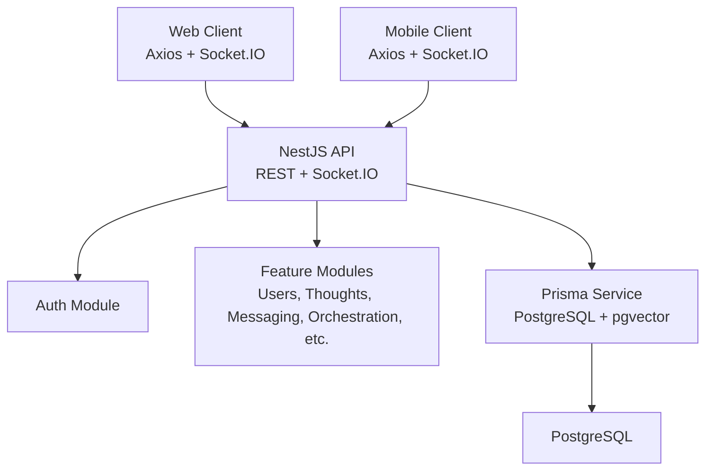

**Diagram sources**
- [backend/src/app.module.ts](file://backend/src/app.module.ts)
- [backend/src/auth/auth.module.ts](file://backend/src/auth/auth.module.ts)
- [backend/src/messaging/messaging.module.ts](file://backend/src/messaging/messaging.module.ts)
- [backend/src/prisma/prisma.module.ts](file://backend/src/prisma/prisma.module.ts)
- [backend/prisma/schema.prisma](file://backend/prisma/schema.prisma)

## Detailed Component Analysis

### Backend Bootstrap and Cross-Cutting Concerns
- Initialization order and middleware pipeline ensure security, performance, and observability from startup.
- Security headers, compression, CORS, validation, and graceful shutdown hooks are configured centrally.
- Logging uses Pino with redaction and correlation IDs; Sentry is initialized early and filters sensitive data.

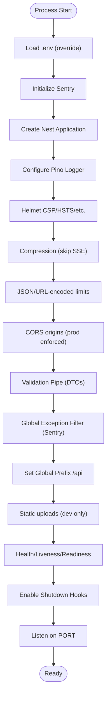

**Diagram sources**
- [backend/src/main.ts](file://backend/src/main.ts)
- [backend/src/sentry.ts](file://backend/src/sentry.ts)

**Section sources**
- [backend/src/main.ts](file://backend/src/main.ts)
- [backend/src/sentry.ts](file://backend/src/sentry.ts)

### Authentication and Authorization
- Auth module registers Passport with JWT strategy and controller endpoints for phone-based OTP and Apple sign-in.
- JWT secret is validated at startup to prevent weak defaults.
- Guards and strategies are provided globally via Nest’s dependency injection.

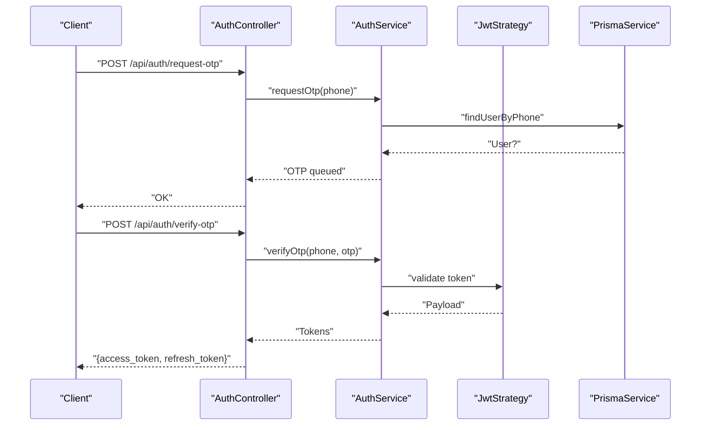

**Diagram sources**
- [backend/src/auth/auth.module.ts](file://backend/src/auth/auth.module.ts)

**Section sources**
- [backend/src/auth/auth.module.ts](file://backend/src/auth/auth.module.ts)

### Messaging and Real-Time Communication
- Messaging module integrates Prisma and Ontology, exposes REST endpoints for messages and connections, and provides a Socket.IO gateway for real-time updates.
- Clients (web and mobile) connect via Socket.IO to receive live updates.

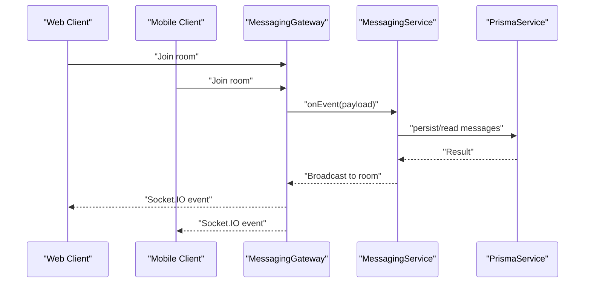

**Diagram sources**
- [backend/src/messaging/messaging.module.ts](file://backend/src/messaging/messaging.module.ts)

**Section sources**
- [backend/src/messaging/messaging.module.ts](file://backend/src/messaging/messaging.module.ts)
- [frontend/package.json](file://frontend/package.json)
- [mobile/package.json](file://mobile/package.json)

### Orchestration and Agent Workflows
- Orchestration module coordinates persona-driven conversations, memory consolidation, and synthesis using LangGraph agents.
- Tools and nodes implement prompts, memory retrieval, persona execution, and saving outputs.

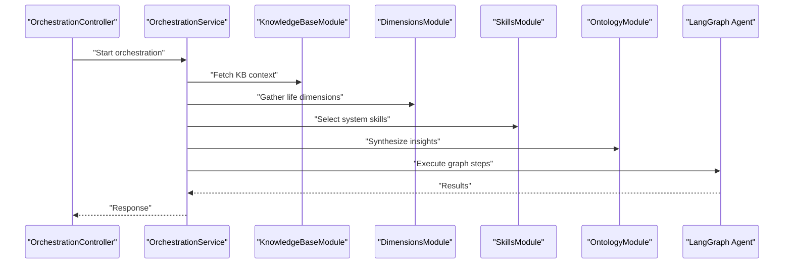

**Diagram sources**
- [backend/src/health/health.module.ts](file://backend/src/health/health.module.ts)

**Section sources**
- [backend/src/health/health.module.ts](file://backend/src/health/health.module.ts)

### Data Layer and Semantic Search
- Prisma module provides a global service for database operations.
- PostgreSQL schema defines entities and uses pgvector for embeddings to support semantic search and memory consolidation.

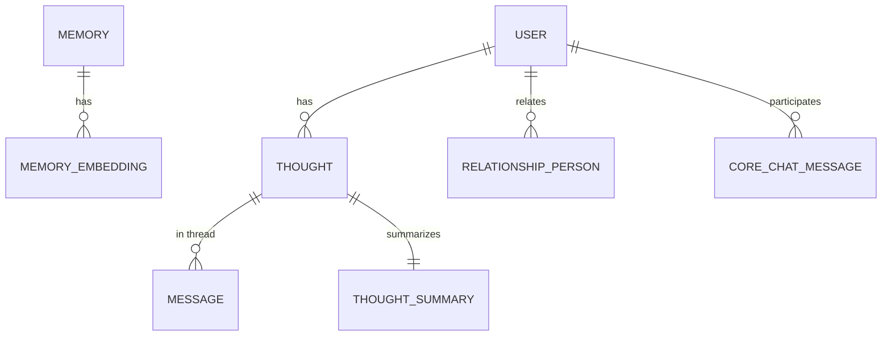

**Diagram sources**
- [backend/prisma/schema.prisma](file://backend/prisma/schema.prisma)

**Section sources**
- [backend/src/prisma/prisma.module.ts](file://backend/src/prisma/prisma.module.ts)
- [backend/prisma/schema.prisma](file://backend/prisma/schema.prisma)

### Infrastructure and Deployment Topology
- docker-compose defines:
  - postgres with pgvector, health checks, and persistent volume
  - backend service with environment variables, health checks, and upload volume
  - frontend service with nginx reverse proxy and API passthrough
- Backend Dockerfile:
  - Multi-stage build with Prisma generation and production runtime
  - Non-root user, dumb-init, health checks, and exposed port
- Frontend Dockerfile:
  - Nginx-unprivileged serving static SPA with reverse proxy to backend API

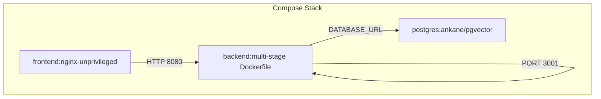

**Diagram sources**
- [docker-compose.yml](file://docker-compose.yml)
- [backend/Dockerfile](file://backend/Dockerfile)
- [frontend/Dockerfile](file://frontend/Dockerfile)

**Section sources**
- [docker-compose.yml](file://docker-compose.yml)
- [backend/Dockerfile](file://backend/Dockerfile)
- [frontend/Dockerfile](file://frontend/Dockerfile)

## Dependency Analysis
- Module Coupling
  - AppModule aggregates all feature modules, promoting cohesion within domains while enabling loose coupling between modules.
- External Dependencies
  - Backend depends on Prisma, PostgreSQL with pgvector, Sentry, LangGraph, Socket.IO, Helmet, Compression, and Pino.
- Client Integrations
  - Web and Mobile clients use Axios for REST and Socket.IO for real-time features.

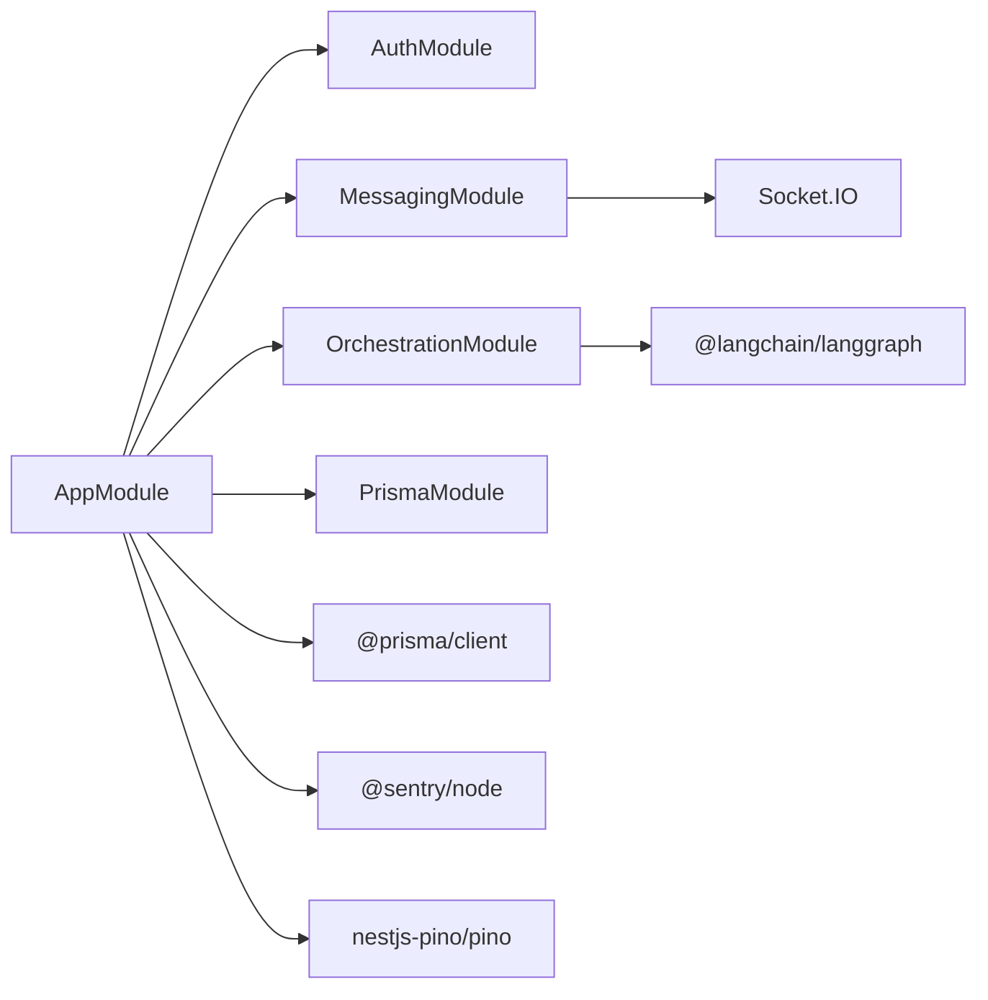

**Diagram sources**
- [backend/src/app.module.ts](file://backend/src/app.module.ts)
- [backend/src/auth/auth.module.ts](file://backend/src/auth/auth.module.ts)
- [backend/src/messaging/messaging.module.ts](file://backend/src/messaging/messaging.module.ts)
- [backend/src/health/health.module.ts](file://backend/src/health/health.module.ts)
- [backend/src/prisma/prisma.module.ts](file://backend/src/prisma/prisma.module.ts)
- [backend/package.json](file://backend/package.json)

**Section sources**
- [backend/src/app.module.ts](file://backend/src/app.module.ts)
- [backend/package.json](file://backend/package.json)

## Performance Considerations
- Streaming and Compression
  - Compression is selectively disabled for Server-Sent Events to preserve real-time token-by-token streaming.
- Request Size Limits
  - JSON and URL-encoded payloads are limited to mitigate abuse.
- Health Checks and Graceful Shutdown
  - Health endpoints (/api/livez, /api/readyz) and shutdown hooks enable safe rolling updates and autoscaling.
- Database Indexes and Vector Operations
  - Schema includes indexes and vector embeddings to optimize semantic search and memory retrieval.

**Section sources**
- [backend/src/main.ts](file://backend/src/main.ts)
- [backend/prisma/schema.prisma](file://backend/prisma/schema.prisma)

## Troubleshooting Guide
- Sentry Initialization
  - Sentry is initialized early and only activates when DSN is present; otherwise it acts as a no-op.
- Log Redaction
  - Pino redacts sensitive fields (tokens, OTPs, phone numbers) and strips cookies/headers to protect privacy.
- CORS Misconfiguration
  - Production requires explicit CORS_ORIGINS; missing it triggers a startup error to prevent wildcard exposure.
- JWT Secret Validation
  - Startup validates JWT_SECRET strength; weak or missing secrets cause immediate failure.
- Health Probe Noise
  - Auto-logging excludes health endpoints to reduce noise in logs.

**Section sources**
- [backend/src/sentry.ts](file://backend/src/sentry.ts)
- [backend/src/app.module.ts](file://backend/src/app.module.ts)
- [backend/src/main.ts](file://backend/src/main.ts)

## Conclusion
The 4Ever system employs a robust three-tier architecture with a NestJS backend that cleanly separates concerns into cohesive modules. It leverages modern technologies for real-time communication, agent orchestration, and semantic search, while maintaining strong security, observability, and operational hygiene through containerization and standardized middleware.

## Appendices

### Technology Stack Integration Patterns
- Socket.IO
  - Used for real-time messaging and live updates in both web and mobile clients.
- LangGraph
  - Integrated for agent orchestration in the Orchestration module to manage persona-driven workflows and synthesis.
- Prisma ORM
  - Provides type-safe database access with PostgreSQL and pgvector for vector operations.

**Section sources**
- [backend/src/messaging/messaging.module.ts](file://backend/src/messaging/messaging.module.ts)
- [backend/src/health/health.module.ts](file://backend/src/health/health.module.ts)
- [backend/src/prisma/prisma.module.ts](file://backend/src/prisma/prisma.module.ts)
- [backend/package.json](file://backend/package.json)

### Client Context Diagrams
- Web Client Context
  - The web client communicates with the backend via REST and Socket.IO. Nginx proxies /api to the backend and serves the SPA with a fallback route.

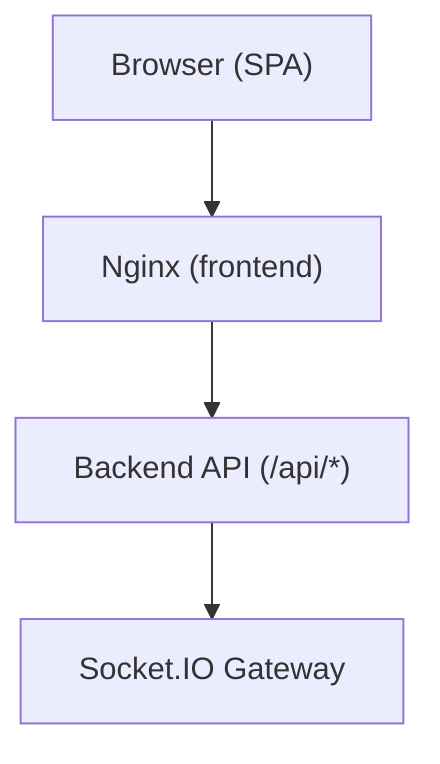

**Diagram sources**
- [frontend/Dockerfile](file://frontend/Dockerfile)
- [docker-compose.yml](file://docker-compose.yml)

- Mobile Client Context
  - The mobile app communicates with the backend via REST and Socket.IO. The app initializes stores and navigators at startup.

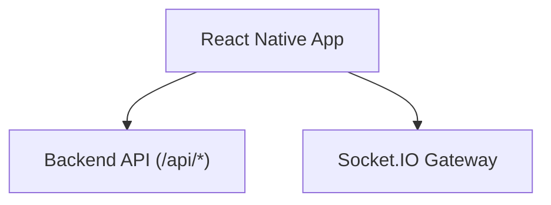

**Diagram sources**
- [mobile/App.tsx](file://mobile/App.tsx)
- [mobile/package.json](file://mobile/package.json)
- [docker-compose.yml](file://docker-compose.yml)